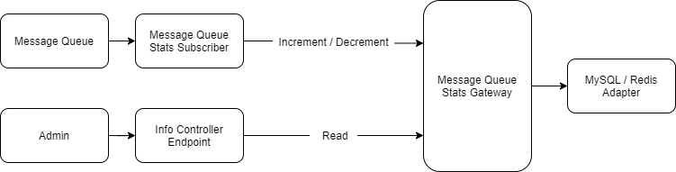

## 2021-09-20 - Message queue stats abstraction

## Context
The current `message_queue_stats` table records which messages are in the message queue and how often. This
is done by a subscriber, which then writes a record to the database via the mysql connection. If this record already exists,
a duplicate key is triggered and the `count` value of the record will be updated. 
Systems with many write operations generate a lot of traffic on the message queue. This in turn
generates a lot of traffic on the `message_queue_stats` table, resulting in bottlenecks and/or deadlocks.

## Decision
We create a possibility to control the access to the `message_queue_stats` table via Redis or another storage, which is optimized for such scenarios. 
To do this, however, we need to prevent / extend access via the DAL.

So we implement a new gateway with the following methods:
* `increment(string name, int $count = 1): void`
* `decrement(string name, int $count = 1): void`
* `get(): array`
* `getDecorated(): self`

This then enables the following functional flow:

Furthermore, it should also be possible to completely disable the message queue stats via config file
By default, we ship a Redis and MySQL adapter for the gateway. It should be possible to easily switch the adapter via config.

## Consequences
* We deprecate the `message_queue_stats` DAL classes
* We deprecate the current `message_queue_stats` endpoint in the api
* We deprecate the `message_queue_stats` services
* We implement a new endpoint for the new gateway
* We implement a new node for `message_queue_stats` configuration
* We use the new gateway in the admin for the notifications
* With the next major we remove all deprecations to the `message_queue_stats`.
