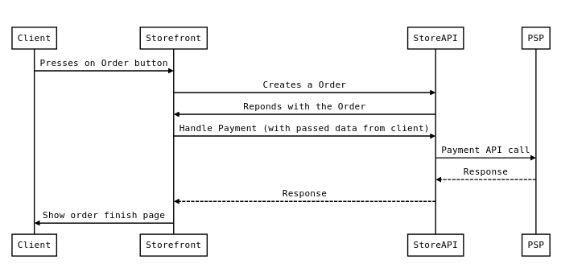
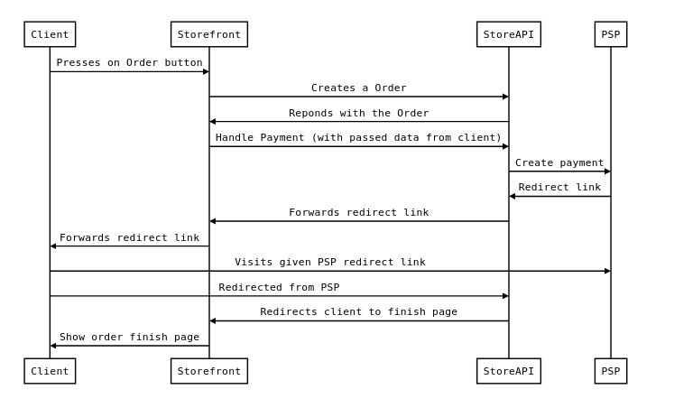
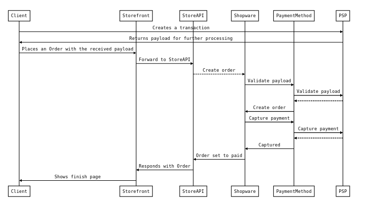
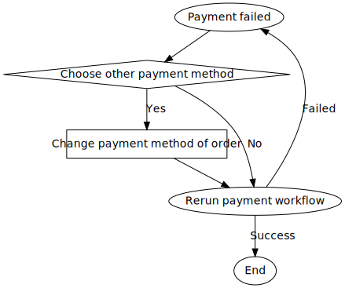

# 2021-10-01 - Payment Flow

## Context

We have to provide a standardized way for Shopware extensions to implement custom payments.

## Decision

We implement two possible handlers **Synchronous Payment** and **Asynchronous Payment**. Both handlers can optionally implement [Accepting-pre-created-payments](#accepting-pre-created-payments). If a [payment transaction fails](#after-order-payment-error-case), the user can choose an alternative payment method and trigger the flow again.

## Handler

### Synchronous Payment

The synchronous payment is intended to execute a payment immediately after the order has been created, **without a user interaction**. The client can pass additional data to the handler to process the payment of the order. The handler can throw an `SyncPaymentProcessException` if an error occurs.

The following diagram shows a happy case sequence of a synchronous payment handling. The error handling is described [here](#after-order-payment-error-case) 

### Asynchronous Payment

An asynchronous payment handler has to be implemented, when the client (user) has to be redirected to the payment gateway website. The client will be redirected to the actual payment site and the payment site will later redirect the client back to the success or error page of the shop. The handler is executed when the link is prepared and validates (referred to as "finalize") the redirect back from payment service.

The following diagram shows a happy case sequence of an asynchronous payment handling. The error handling is described [here](#after-order-payment-error-case) 

### App payments

The app payment flow is similar to the synchronous or asynchronous flow. The app implements one of the flows and can define an external HTTP API endpoint used as a callback. This endpoint will be called instead of executing regular PHP code (custom handlers). The response will define the further payment flow like in the examples above.

## Accepting pre-created payments

To improve the payment workflow on headless systems or reduce orders without payment, payment handlers can implement an additional interface to support pre-created payments. The client (e.g. a single page application) can prepare the payment directly with the payment service (not through Shopware) and pass a transaction reference (token) to Shopware to complete the payment.

The payment handler **has to verify the given payload with the payment service**, because Shopware cannot ensure that the transaction created by the frontend is valid for the current cart. After successful verification the order will be created and the payment handler will be called again to **charge the payment**.

When the charge was successful the payment will be set to paid and the user will be forwarded to the finish page, but on [failure the after order payment process will be active](#after-order-payment-error-case). It is highly recommended implementing this optional feature, when the creation and the capturing of the payment can be seperated.

## After order payment (Error case)

Both possible options can produce failed payments. In failure case the after order payment process begins. The client can choose a new payment method and retry the payment and the entire payment loop of a synchronous / asynchronous payment starts again.

