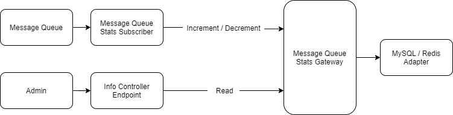

## Context
The current `message_queue_stats` table records which messages are in the message queue and how often. This
is done by a subscriber, which then writes a record to the database via the mysql connection. If this record already exists,
a duplicate key is triggered and the `count` value of the record will be updated. 
Systems with many write operations generate a lot of traffic on the message queue. This in turn
generates a lot of traffic on the `message_queue_stats` table, resulting in bottlenecks and/or deadlocks.

On another issue, we also provide a feature called `Frequently Used modules` to increase the count everytime an admin module is visited which faces a similar issue.

## Decision
We introduce a new table `increment` to store these countable information and deprecated `message_queue_stats` table.
We create a possibility to control the access to the `increment` table via Redis or another storage, which is optimized for such scenarios.
To do this, however, we need to prevent / extend access via the DAL.

So we implement a new gateway with the following methods:
* `increment(string $cluster, string $key): void`
* `decrement(string $cluster, string $key): void`
* `list(string $cluster, int $limit = 5, int $offset = 0): array`
* `reset(string $cluster, ?string $key = null): array`
* `getPool(): string`
* `getConfig(): array`
* `getDecorated(): self`

This then enables the following functional flow:



Furthermore, it should also be possible to completely disable the message queue stats or any pool via config file.

You can easily tweak or define new increment pools in config file with your own pool's configuration. For e.g:

```yaml
shopware:
    increment:
        user_activity:
            type: 'mysql'

        message_queue:
            type: 'redis'
            config:
                url: 'redis://localhost'
        
        custom_pool:
          type: 'array'
```

By default, we ship a Redis, MySQL and array adapter for the gateway. It should be possible to easily switch the adapter via config.
If you want to override the default mysql or redis adapter, you need to register your own incrementer gateway in DI container with the id `shopware.increment.<custom_pool>.gateway.<adapter>`

## Consequences
* We deprecate the `message_queue_stats` DAL classes
* We deprecate the current `message_queue_stats` endpoint in the api
* We deprecate the `message_queue_stats` services
* We deprecate the `message_queue_stats` table
* We create a new `increment` table
* We implement a new endpoints to work with the new gateway
* We implement a new node for `increment` configuration
* We use the new gateway in the admin for the notifications
* With the next major we remove all deprecations to the `message_queue_stats`.
