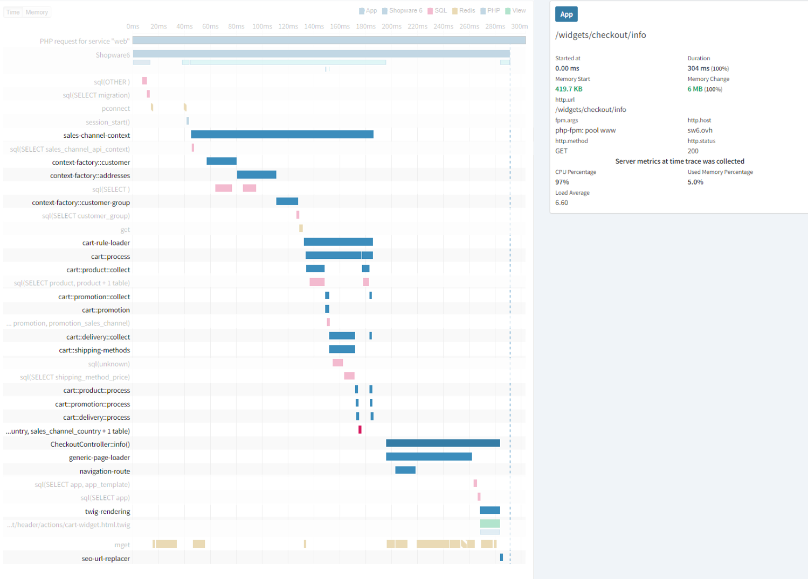

## Context
During the last performance benchmarks we have intensively dealt with profiling tools like Blackfire, Tideways and datadog. We often encountered the difficulty of getting detailed trace information when the server is under high load.

Tideways gave us very good monitoring tools, but in contrast to Blackfire it was difficult to detect bottlenecks by interpreting the timeline. We used Blackfire for single traces, but it turned out to be difficult to catch a "bad trace".

Therefore, we created a profiler integration, where we provide tools like Tideways or datadog with additional information, directly from our application. This will be triggered via a static method call, which can be used within the application. This profiler signals the integrations to create a span for the code that will be executed within a given closure:

```php
<?php declare(strict_types=1);

namespace Shopware\Core\Profiling;

use Shopware\Core\Profiling\Integration\ProfilerInterface;

/**
 * @internal experimental atm
 */
class Profiler
{
    /**
     * Profilers will be activated over the shopware.yaml file
     *
     * All enabled profilers will be added here
     *
     * @var ProfilerInterface[]
     */
    private static array $profilers = [];

    /**
     * Tags will be added to each trace
     *
     * @var string[]
     */
    private static array $tags = [];

    /**
     * @param string[] $activeProfilers
     */
    public function __construct(\Traversable $profilers, array $activeProfilers)
    {
        $profilers = iterator_to_array($profilers);
        self::$profilers = array_intersect_key($profilers, array_flip($activeProfilers));
        self::$tags = [];
    }

    /**
     * @return mixed
     */
    public static function trace(string $name, \Closure $closure, string $category = 'shopware', array $tags = [])
    {
        $pointer = static function () use ($closure) {
            return $closure();
        };

        $tags = array_merge(self::$tags, $tags);
        
        // we have to chain the profilers here: `return Stopwatch::trace(Tideways::trace(...));`
        foreach (self::$profilers as $profiler) {
            $pointer = static function () use ($profiler, $name, $pointer, $category, $tags) {
                return $profiler->trace($name, $pointer, $category, $tags);
            };
        }

        return $pointer();
    }

}
```

The corresponding calls of this profiler can be found everywhere in the application and can also be used in plugins:
```php
<?php declare(strict_types=1);

namespace Shopware\Core\Checkout\Cart;

use Shopware\Core\Profiling\Profiler;
use Shopware\Core\System\SalesChannel\SalesChannelContext;

class CartCalculator
{
    /**
     * @var CartRuleLoader
     */
    private $cartRuleLoader;

    public function __construct(CartRuleLoader $cartRuleLoader)
    {
        $this->cartRuleLoader = $cartRuleLoader;
    }

    public function calculate(Cart $cart, SalesChannelContext $context): Cart
    {
        return Profiler::trace('cart-calculation', function () use ($cart, $context) {
            // validate cart against the context rules
            return $this->cartRuleLoader
                ->loadByCart($context, $cart, new CartBehavior($context->getPermissions()))
                ->getCart();
        });
    }
}
```

These spans are then displayed in the timeline of the corresponding profilers:


Which profiler should be used in the system can be configured via `config/packages/*.yaml`:
```yaml
shopware:
    profiler:
        integrations: ['Symfony', 'Tideways', 'Datadog']
```
