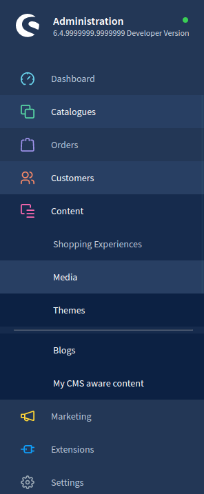
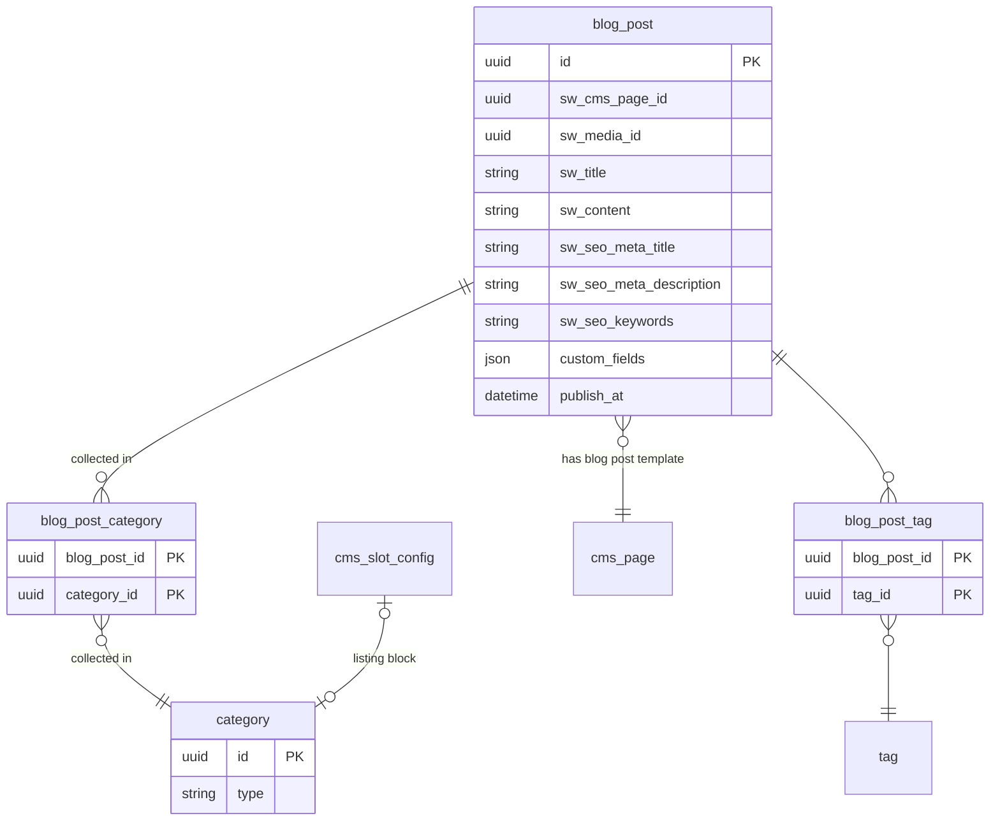

---
title: Concept for blogs using Shopping Experiences
date: 2022-07-18
area: content
tags: [content, cms, blog, custom-entities]
--- 

## Context
A highly requested feature & expected for the CMS of Shopware 6 is the blog. In addition, this is an ideal use case and example for the use of [Custom Entities](../adr/2021-09-14-technical-concept-custom-entities.md).

## Decision
We want to implement blogs as part of the CMS. Since Custom Entities offers a good chance to implement such a feature, the blog is supposed to show the community how to handle Custom Entities in the Shopping Experiences.
Therefore, we decided on the following:

### Blog posts & Content types
Multiple types of content should be available in the future for our CMS and be directly accessible in the Content section of the administration. Using `admin-ui` as a flag in its specific xml file, Shopware will create a listing and a detail page into the Content section automatically for types of content (Custom Entities).
In addition, the `cms-aware` flag also will bring some pre-defined fields, used as defaults in the CMS elements, to our entity. Those are always prefixed with `sw_` to avoid duplicates by the user:

* `sw_title`
* `sw_content`
* `sw_media_id`
* `sw_cms_page_id`
* `sw_cms_page_version_id`
* `sw_seo_meta_title`
* `sw_seo_meta_description`
* `sw_seo_keywords`

To keep everything tidy, we decided to implement using two different files `admin-ui.xml` and `cms-aware.xml` and keep a distinct separation of schema and UI. 
This flag will also result in new component types, so that for example the `cms-aware` property's `sw_cms_page_id` can be rendered as a CMS page selection, like known from the categories.



#### Example `admin-ui.xml`
```xml
<admin-ui>
    <entity name="custom_entity_example"
            navigation-parent="sw-content"
            position="50"
            icon="regular-tools-alt"
            color="#f00">
        <listing>
            <columns>
                <column ref="name"/>
                <column ref="my_description"/>
                <column ref="position" hidden="true" />
                <column ref="rating"/>
            </columns>
        </listing>
        <detail>
            <tabs>
                <tab name="main">
                    <card name="general">
                        <field ref="name"/>
                        <field ref="position"/>
                        <field ref="rating"/>
                    </card>
                    <card name="cardClone">
                        <field ref="name"/>
                        <field ref="my_description"/>
                    </card>
                </tab>
                <tab name="tabClone">
                    <card name="generalSecond">
                        <field ref="name"/>
                        <field ref="position"/>
                        <field ref="rating"/>
                    </card>
                    <card name="cardClone">
                        <field ref="name"/>
                        <field ref="my_description"/>
                    </card>
                </tab>
                <!-- cms-aware tabs will always be rendered last, if defined -->
            </tabs>
        </detail>
    </entity>
    <entity name="custom_entity_example_second"
            navigation-parent="sw-content"
            position="50"
            icon="regular-tools-alt"
            color="#f00">
        <!-- Like above -->
    </entity>
</admin-ui>
```

#### Example `cms-aware.xml`
```xml
<?xml version="1.0" encoding="utf-8" ?>
<cms-aware xmlns:xsi="http://www.w3.org/2001/XMLSchema-instance"
           xsi:noNamespaceSchemaLocation="../../../../../../../../src/Core/System/CustomEntity/Xml/Config/CmsAware/cms-aware-1.0.xsd">
    <entity name="custom_entity_example"/>
    <entity name="custom_entity_example_second"/>
</cms-aware>
```

### Category type as blogs
A blog is defined as a collection of blog posts, some additional metadata, SEO data and an associated CMS page. With this
in mind, we decided upon using categories and create a new type `blog` for those, since the category itself has everything
we need for a blog feature, even in terms of UI. The only change would be to replace assigned products with assigned posts, or custom entity entries when speaking generally.
The CMS page template assigned to the category will contain a post listing.

With content types in mind, this will be an additional step to be auto generated via the `cms-aware` flag of Custom Entities.

### Basic blog structure


### Snippet structure
Modules generated via `admin-ui.xml` are automatically referring to the following snippet structure:
```json
{
   "custom_entity_bundle": {
       "moduleTitle": "Blog posts",
       "moduleDescription": "Blog is colorful and has pics",
       "tabs": {
           "main": "Main settings",
           "tabClone": "Optional stuff"
       },
       "cards": {
           "general": "General stuff",
           "cardClone": "Just a clone",
           "generalSecond": "More general stuff"
       },
       "fields": {
           "swTitle": "Title",
           "swContent": "Product description",
           "swContentHelpText": "Help text!",
           "swContentPlaceholder": "Enter description...",
           "position": "Positioning"
       }
   }
}
```
