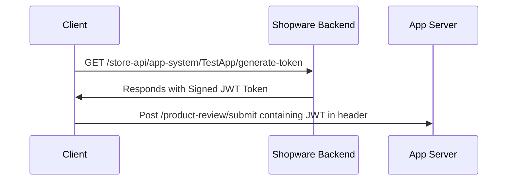

## Context

Right now only Shopware Backend is able to communicate with the App Server in a secure way.
This is because the App Server is able to verify the origin of the request by checking request signature, 
and this signature is generated by the Shopware 6 backend application with a shop to app server secret.

When an app wants to communicate directly with the App Server,
the App Server is not able to verify the origin of the request and has to trust the client.
This works fine for public available data, but not when you reliably need the logged-in customer and other information.

## Decision

We provide a new endpoint `/store-api/app-system/{appName}/generate-token` (`/app-system/{appName}/generate-token` in Storefront) which generates a JWT token for the given app.
This endpoint requires that the customer is logged-in and the app is installed and active. 

The JWT token contains claims like:
- `iat` - issued at
- `exp` - expiration time
- `shopId` - the shop id of the current shop
- `salesChannelId` - the sales channel id of the current sales channel
- `customerId` - the customer id of the logged-in customer
- `cartToken` - the cart token of the current cart

The additional claims are bound to app permissions when an app does not have permissions to read a customer,
it does not get the `customerId` claim.

The JWT token is signed with the shop to app server secret key which we use already for the signature.
So the App Server needs to be able to verify the JWT key and use the claims in a secure way.
The request body of the client is still untrusted and has to be properly validated by the app server.

The request cycle would look like this:

The JWT token is valid for 15 minutes and can be used multiple times until expired.
The client should save it in the [session storage](https://developer.mozilla.org/en-US/docs/Web/API/Window/sessionStorage)
and request it only on expiry again.
Additionally, the API route should be rate limited to not generate too often an expensive JWT key.

## Consequences

- We add a helper for the Storefront to obtain the token and do the expiry and regenerating 
- We add support for JWT token verification in our PHP App SDK to make this process simple as possible
