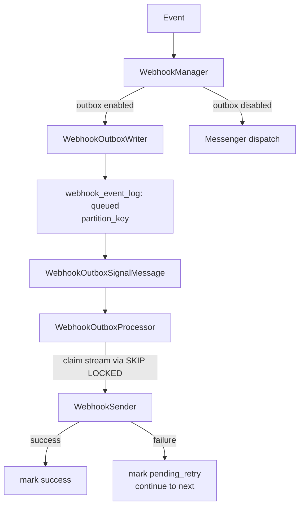
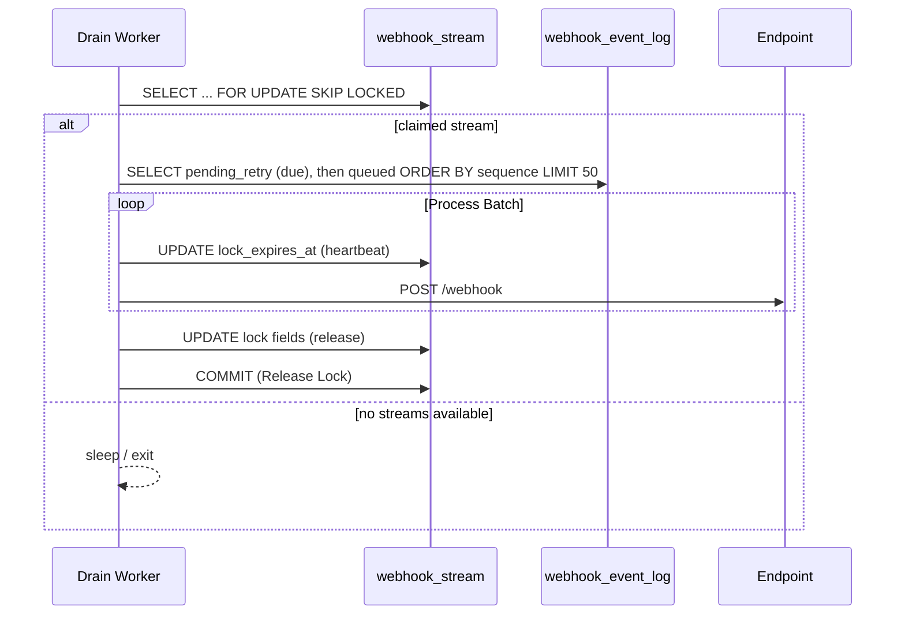
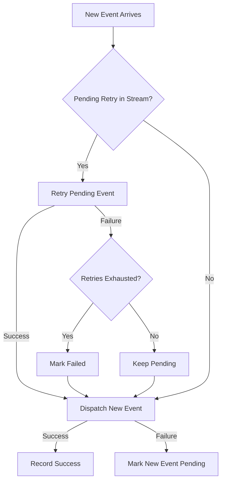

## Technical Summary
We are implementing a **Partition-Leased Outbox** system to guarantee observability and best-effort ordering for webhooks.
-   **Mechanism:** events are persisted to `webhook_event_log` (MySQL) before delivery.
-   **Partitioning:** `webhook_stream` leases groups of events by `xxhash(app_name:partition_key)` to allow parallel processing while preserving order per entity.
-   **Ordering:** `sequence_id` is added to payloads, and the Outbox worker optimizes for sequential delivery per partition in a best-effort fashion (retrying failures inline).
-   **Outcome:** provides reasonable ordering guarantees and removes race conditions being the norm in webhook delivery.

## Context
Webhook delivery currently relies on Messenger retry behavior and concurrent workers and has some special use cases around lifecycle events. This introduces several critical gaps:

- Sync path visibility (Lifecycle Events): synchronous webhooks are not logged, so there is no audit trail or retry option.
- Ordering: parallel processing provides no FIFO guarantees, so events can arrive out of sequence.
- Partition-based Ordering: currently there is no way to safely order messages based on logical partitions (e.g. `order.placed` then `order.paid`) without relying on advanced transport features (like consistent hashing) which are not available in all environments.
- Messenger retry ordering: retry behavior depends on the transport implementation, introducing inconsistent sequencing on retry.
- Failure handling: the system disables webhooks after 10 consecutive errors, requiring manual recovery.
- Durability: delivery depends on transport configuration, which can lose messages.

We also need a consistent way to record retries, schedule backoff, and reuse the same request-building logic for both synchronous and asynchronous delivery.

## Decision
We will introduce an outbox-driven webhook delivery flow that uses the existing `webhook_event_log` table as the source of truth for processing:

- Persist each webhook event as a queued outbox entry with a serialized message, and add ordering + retry metadata (`sequence`, `execution_count`, `next_retry_at`, and the `pending_retry` status).
- **Target Architecture (Partition Leasing):** Implement a "Leasing" pattern using a sidecar table `webhook_stream` to coordinate work.
    - **Partition Key:** Derived from `PartitionAwareHookable::getPartitionKey()` and always scoped by `app_name` (hashed via xxhash). Defaults to `${app_name}:${webhook_id}`. This enables best-effort ordered delivery per logical entity per destination while preventing cross-app interference.
    - **Status-Based Dispatch:** Workers claim a stream via `SKIP LOCKED` on the `webhook_stream` table and process events by `delivery_status` in sequence order, relying on an index like (`partition_key`, `delivery_status`, `sequence`) for efficient scans.
    - **Lease & Heartbeat:** Streams are leased via `locked_by` and `lock_expires_at` and refreshed while processing (before each request). The lease TTL should exceed the HTTP timeout. Expired leases are reclaimable, removing the need for the global `webhook_outbox_worker` lock table.
    - **Best-Effort Ordering:** Failed events are retried inline when new events arrive; if retries are exhausted, the event is skipped to prevent head-of-line blocking.
- Trigger draining through a lightweight `WebhookOutboxSignalMessage` and a periodic `webhook_outbox.drain` scheduled task.
- Gate the outbox flow behind the `SHOPWARE_WEBHOOK_OUTBOX` env flag to allow gradual rollout; the existing Messenger-based path remains available when the flag is disabled.

### Flow overview






### High-level integration points
```php
if ($outboxEnabled) {
    $outboxWriter->write($webhook, $message);
    if ($requiresImmediateDrain) {
        // flushes specific webhook IDs for immediate processing.
        $processor->flush($webhookIds);
    }

    $bus->dispatch(new WebhookOutboxSignalMessage());
} else {
    $bus->dispatch($message);
}
```

```php
// Claim a healthy, unlocked or expired stream
$stream = $connection->fetchAssociative('
    SELECT * FROM webhook_stream
    WHERE (locked_by IS NULL OR lock_expires_at <= NOW())
    AND (status = "HEALTHY" OR next_retry_at <= NOW())
    LIMIT 1 FOR UPDATE SKIP LOCKED
');

// Process pending retries first
$pending = $connection->fetchAllAssociative('
    SELECT * FROM webhook_event_log
    WHERE partition_key = :partition
    AND delivery_status = "pending_retry"
    AND (next_retry_at IS NULL OR next_retry_at <= NOW())
    ORDER BY sequence ASC
    LIMIT :batchSize
');

// Then process queued events in sequence order
$events = $connection->fetchAllAssociative('
    SELECT * FROM webhook_event_log
    WHERE partition_key = :partition
    AND delivery_status = "queued"
    ORDER BY sequence ASC
    LIMIT :batchSize
');
```

Indexing note: add a composite index on (`partition_key`, `delivery_status`, `sequence`) to keep status-based scans efficient.

### How this addresses the critical gaps
- Sync path visibility: all webhook events are stored as outbox entries before delivery.
- Ordering: Best-Effort FIFO per `partition_key` is attempted; events are retried inline when new events arrive.
- Failure Isolation: A failure in one partition does not block other partitions. Failed events are skipped after retry exhaustion.
- Scalability: index-backed status scans keep processing stable.
- Concurrency: Multiple workers can process different partitions in parallel using `SKIP LOCKED`.

## Partition Key Interface
To support custom ordering semantics, events can implement the `PartitionAwareHookable` interface to define their own partition key.

```php
interface PartitionAwareHookable extends Hookable
{
    /**
     * Returns the partition key for this event.
     * Events with the same partition key are delivered in best-effort order
     * within the same app (app_name is always prefixed internally).
     * Failures can cause skips and out-of-order delivery.
     *
     * @return string|null Partition key, or null to use the default (app_name + webhook_id).
     */
    public function getPartitionKey(): ?string;
}
```

**Default Behavior:**
- If the event does **not** implement `PartitionAwareHookable`, the partition key defaults to `${app_name}:${webhook_id}`.
- If the event implements the interface and returns `null`, it also defaults to `${app_name}:${webhook_id}`.

**Example (Entity Events):**
```php
class OrderWrittenEvent implements PartitionAwareHookable
{
    public function getPartitionKey(): ?string
    {
        // All events for the same Order will be processed in sequence per app.
        return 'order_' . $this->orderId;
    }
}
```

**Example (Domain Events - No Ordering):**
```php
class UserPasswordResetRequestedEvent implements PartitionAwareHookable
{
    public function getPartitionKey(): ?string
    {
        // Each event gets its own partition within the app for maximum parallelism.
        return Uuid::randomHex();
    }
}
```

**Partition Key Calculation:**
The final `partition_key` stored in the database is calculated as:
```php
$appName = $webhook->appName;

$eventPartitionKey = $event instanceof PartitionAwareHookable
    ? $event->getPartitionKey()
    : null;

if ($eventPartitionKey !== null) {
    // Use the event's partition key scoped by app_name.
    // This allows cross-webhook ordering for dependent events within the same app.
    // e.g., order.placed and order.paid for the same Order share a stream per app.
    $finalKey = xxhash($appName . ':' . $eventPartitionKey);
} else {
    // Default: partition by app_name + webhook_id (one stream per webhook type per app).
    $finalKey = xxhash($appName . ':' . $webhook->id);
}
```

**Cross-Webhook Ordering:**
By using the `partitionKey` directly (scoped by `app_name`), logically dependent events across *different* webhook types share the same stream within one app:
- `order.placed` for `order_123` in `app_a` → Stream `xxhash(app_a:order_123)`
- `order.paid` for `order_123` in `app_a` → Stream `xxhash(app_a:order_123)` (SAME!)
- `order.paid` is expected to be delivered AFTER `order.placed` (best-effort; failures or delays can invert order).
- `order.placed` for `order_123` in `app_b` → Stream `xxhash(app_b:order_123)` (DIFFERENT app, different stream)

**Concurrency & Ordering Strategy:**
- **Full Parallelism:** Each unique `finalKey` corresponds to a distinct stream. Workers process different streams concurrently using `SKIP LOCKED`.
- **Best-Effort Ordering:** Events with the same `finalKey` are processed sequentially when available. Failures or delays can cause skips or out-of-order delivery, so consumers must be idempotent.
- **Dynamic Growth:** The `webhook_stream` table creates streams on demand. Stale streams are automatically cleaned up (see Stream Cleanup).

## Trade-offs & Alternatives Considered

This section documents why we chose the full Outbox pattern.
> **Note:** These alternatives are **not mutually exclusive**. Our final solution **integrates** both Partition Keys and Sequence IDs. The comparison below highlights the trade-off to help us assess if adding the outbox is worth it.

Since Shopware always requires a backing database, the Outbox pattern doesn't introduce new infrastructure. It replaces an *implicit*, opaque database queue with an *explicit*, controllable, and observable one.

### Fixing logging and lifecycle events visibility
The most minimal fix to address the "Sync path visibility" for lifecycle events gap would be to add a single log call inside `WebhookManager::callWebhooksSynchronous()`. This is a 5-line change.

| Concern                  | Minimal Fix (Log Only) | Outbox ADR     |
|:-------------------------|:-----------------------|:---------------|
| **Effort**               | Very Low               | High           |
| **Solves Logging Gap**   | Yes                    | Yes            |
| **Solves Ordering Gap**  | No                     | Best-Effort    |
| **Solves Isolation Gap** | No                     | Yes            |


### Adding sequence numbers to enable consumer-side ordering
We could add a simple `sequence_id` to the webhook payload and let the transport deliver as fast as possible.

| Concern                 | Sequence Numbers Only                                                                                    | Outbox ADR                                                                                                                        |
|:------------------------|:---------------------------------------------------------------------------------------------------------|:----------------------------------------------------------------------------------------------------------------------------------|
| **Effort**              | Low                                                                                                      | High                                                                                                                              |
| **Consumer Complexity** | **High:** Consumer must always detect gaps, buffer out-of-order events, and implement re-ordering logic. | **Medium:** consumer still needs to be smart, but having an available consumer implementing last-write wins is mostly sufficient. |
| **Delivery Behavior**   | **Luck based:** Race conditions are the norm not a fluke.                                                | **Controlled**: sequential delivery per partition. Consectuive errors on consumers can cause out-of-order                         |

This Outbox also **include** adding a `sequence_id` to the payload, but relying on it *exclusively* for ordering is insufficient. Effective ordering 'takes two':
1.  A **Smart Consumer** capable of buffering and re-ordering events.
2.  A **Responsible Producer** that attempts to deliver in order.

By pre-ordering delivery via the Outbox, we support the majority of "simple/stateless" consumers, while still providing sequence IDs for the "smart" consumers who want to verify data integrity. Relying solely on sequence IDs would force every app developer to implement complex buffering logic, which is a poor Developer Experience (DX).

### Why Not Just Add Partition Key & Trust Transport?

Another minimal approach would be to simply calculate the `partitionKey` and attach it to the message stamp, hoping the underlying transport (e.g., RabbitMQ, SQS) handles ordering.

| Transport             | Supports Partition Key? | Notes                                                                                         |
|:----------------------|:------------------------|:----------------------------------------------------------------------------------------------|
| **Redis** (Messenger) | No                      | Not supported on standard Messenger configuration                                             |
| **Doctrine** (DBAL)   | No                      | Standard DBAL transport selects any available message. No concept of partitioned consumption. |
| **RabbitMQ**          | Yes                     | Requires `x-consistent-hash` configuration or similar.                                        |
| **Kafka**             | Yes                     | Native support via topic partitions and consumer groups.                                      |

Relying on "Transport Partitioning" fails for the default Shopware stack (MySQL). It only works if the shop uses (RabbitMQ/Kafka). The Outbox pattern provides this capability on standard infrastructure.


### The "Best-Effort Ordering" Trade-off

The ADR provides "Best-Effort FIFO" ordering. This is weaker than strict FIFO.

| Approach                   | Ordering Guarantee | Availability | Trade-off |
|:---------------------------|:-------------------|:-------------|:-----------|
| **Strict FIFO**            | Guaranteed         | Head-of-line blocking | A single failing event blocks all subsequent events. |
| **Best-Effort (This ADR)** | Preserved when possible | Always progresses | Failing events may be skipped; consumers may receive events out of order. |
| **No Ordering**            | None               | Maximum      | No guarantees whatsoever. |

> [!WARNING]
> **Consumers MUST be designed to handle out-of-order delivery and idempotency.** The ordering guarantee is sender-side only. Network delays, consumer processing time, and retries on the receiver's side can still break ordering.

For webhook delivery, availability typically outweighs strict ordering. Blocking all events for a single app because one event failed is worse than allowing progress with potential out-of-order delivery.

### Summary Table

| Feature               | Current (Default of Messenger DBAL)     | Proposed (Outbox)                                                       | External Broker                                         |
|:----------------------|:----------------------------------------|:------------------------------------------------------------------------|:--------------------------------------------------------|
| **Infrastructure**    | MySQL                                   | MySQL (same)                                                            | External brokers: Redis/RabbitMQ/Kafka (not guaranteed) |
| **Ordering**          | None                                    | Best-Effort per partition                                               | Broker-dependent                                        |
| **Visibility**        | Shared `messenger_messages` table       | Specialized `webhook_event_log` table. Can add metrics and dashboards   | Requires external tooling                               |
| **Failure Isolation** | Highly available, per webhook isolation | Per-partition isolation                                                 | Per-queue isolation                                     |
| **Retry Logic**       | Transport-specific retry stamps         | Explicit `execution_count`, `next_retry_at`                             | Broker-managed                                          |
| **Control**           | Delegated to transport                  | Shopware owns the logic                                                 | Delegated to broker                                     |

## Comparison to Current Shopware Architecture
| Feature               | Current (Messenger)                                 | Proposed (Stream Leasing)                                  |
|:----------------------|:----------------------------------------------------|:-----------------------------------------------------------|
| **Ordering**          | Race conditions are the norm with parallel workers  | Best-Effort FIFO per partition key                         |
| **Retry Ordering**    | Retries pushed to back of queue (DBAL, and Redis)   | Inline retry before new events                             |
| **Failure Isolation** | Webhook fails and retries independently             | Per-Partition (Failing event skipped after retries)        |
| **Scalability**       | Depends on Broker                                   | Index-backed status scan, MySQL only (limited by disk I/O) |
| **Audit Trail**       | No logging for sync webhooks (fairly easy to solve) | All events logged in `webhook_event_log`                   |

## Detailed Transport Comparison: The "Why"

### 1. The Race Condition Reality
In any standard Messenger setup with multiple workers (or even single workers with retries), race conditions are **the norm, not the exception**.
- **Competing Consumers:** If `OrderCreated` and `OrderPaid` are dispatched milliseconds apart, two different workers can pick them up simultaneously.
- **Latency Luck:** If Worker A (processing `OrderCreated`) hits a network snag, Worker B (processing `OrderPaid`) will finish first. The webhook consumer sees the wrong order.


### 2. Transport-Specific Behaviors vs. Outbox

The largest benefit of the Outbox pattern is that it **standardizes** the delivery semantics across all environments. Different transports have wildly different behaviors that impact ordering, retries, and visibility.

| Feature                  | Doctrine Transport                                                                        | Redis Transport                                                                                      | HA Brokers (RabbitMQ/Kafka)                                                                    | Proposed Outbox                                                                   |
|:-------------------------|:------------------------------------------------------------------------------------------|:-----------------------------------------------------------------------------------------------------|:-----------------------------------------------------------------------------------------------|:----------------------------------------------------------------------------------|
| **Visibility Mechanism** | **Database Lock:** Uses `SELECT ... FOR UPDATE` to hide rows.                             | **In-Memory Visibility:** Removes from Stream; hidden in ZSET (Delayed Set).                         | **Index/Offset:** Messages exist in log/queue until acknowledged/expired.                      | **Partition Lock:** Uses `SELECT ... FOR UPDATE SKIP LOCKED` on a *lease* table.  |
| **Partition Ordering**   | **None:** Global queue.                                                                   | **None:** Standard Messenger Redis transport is not partition-aware.                                 | **Native:** Supports consistent hashing / partitions. (could require extra config)             | **Application Layer:** Partition key hash in `webhook_stream`.                    |
| **Retry Behavior**       | **Updates Row:** Fails → Transaction Rollback → Updates `available_at`. Sequence is lost. | **Re-Queues:** Fails → Ack (Remove) → Add to ZSET → Worker resurrection. Sequence is lost.           | **Re-Queues:** Typically moves to DLQ or retry topic (losing sequence) unless strict blocking. | **Inline Retry:** Fails → Stays locked → Retried immediately. Sequence preserved. |
| **Concurrency Risk**     | **High Contention:** Locks on the message table can degrade general DB performance.       | **High Race Probability:** Extreme speed increases chances of parallel execution on the same entity. | **Low:** Designed for massive concurrency.                                                     | **Isolated:** Locking `webhook_stream` partitions isolates contention.            |

---

## Details expanded.

## Retry Mechanism: Best-Effort Ordered Delivery

This architecture employs a **Best-Effort Ordered Delivery** pattern, balancing ordering guarantees with availability:

### Delivery Semantics

1. **Events are dispatched in sequence order within a partition, when available.**
2. **If Event A fails:**
    - When Event B arrives, we **retry A first** (inline retry).
    - If A succeeds → dispatch B.
    - If A fails again → increment A's retry count:
        - **Retries exhausted** → mark A as `FAILED`, dispatch B.
        - **Retries remaining** → dispatch B anyway (A stays `pending_retry` for next event or scheduled retry).
3. **Scheduled `retry_at` is a fallback** when no new events arrive for a stream.

### Why Best-Effort?

| Approach                   | Ordering                | Availability        | Trade-off               |
|----------------------------|-------------------------|---------------------|-------------------------|
| **Strict FIFO**            | Guaranteed              | Blocked by failures | Head-of-line blocking   |
| **Best-Effort (this ADR)** | Preserved when possible | Always progresses   | May skip failing events |
| **No Ordering**            | None                    | Maximum             | No guarantees           |

### Behavior Example

```
Stream: order_123
──────────────────────────────────────────────────────
t1: Event A arrives    → dispatch A    → FAILS (attempt 1)
                       → mark A as pending_retry (next_retry_at = t1 + 5s)

t2: Event B arrives    → retry A       → FAILS (attempt 2)
                       → dispatch B    → SUCCESS
                       → A stays pending_retry (next_retry_at = t2 + 10s)

t3: Event C arrives    → retry A       → FAILS (attempt 3, exhausted)
                       → mark A as FAILED
                       → dispatch C    → SUCCESS

Result: A=FAILED, B=SUCCESS, C=SUCCESS
        Consumer received: B, C (A skipped after exhausting retries)
```

### Retry Configuration

| Constant             | Value | Description                                     |
|----------------------|-------|-------------------------------------------------|
| `MAX_RETRIES`        | 5     | Maximum delivery attempts before marking FAILED |
| `BASE_DELAY_SECONDS` | 5     | Initial backoff delay                           |
| `DELAY_MULTIPLIER`   | 2     | Exponential backoff multiplier                  |

### Flow Diagram



### Implications for Consumers

Webhook consumers should be designed to handle:
- **Idempotency:** Same event may be delivered multiple times (retries).
- **Out-of-order delivery:** If event A fails permanently, B and C are delivered first.
- **Missing events:** Failed events are not retried indefinitely; consumers should handle gaps.

## Stream Cleanup
When event logs are cleaned up, orphaned `webhook_stream` entries must be removed.

**Cleanup Strategy:**
The existing `WebhookCleanup` service (scheduled task) is extended to:
1.  **Delete empty streams:** Remove `webhook_stream` rows that have no matching events in `webhook_event_log`.

```sql
-- Cleanup empty streams (no events remaining)
DELETE s FROM webhook_stream s
WHERE s.created_at < DATE_SUB(NOW(), INTERVAL 1 DAY)
  AND NOT EXISTS (
      SELECT 1 FROM webhook_event_log l
      WHERE l.partition_key = s.partition_key
  );
```
