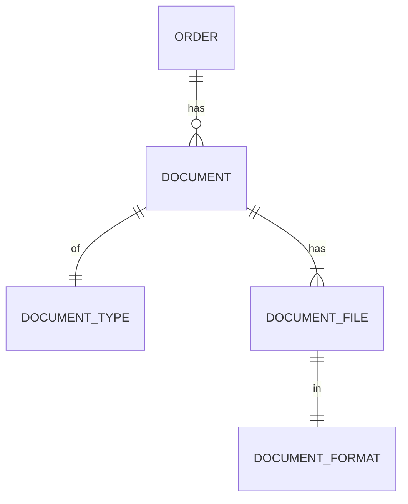
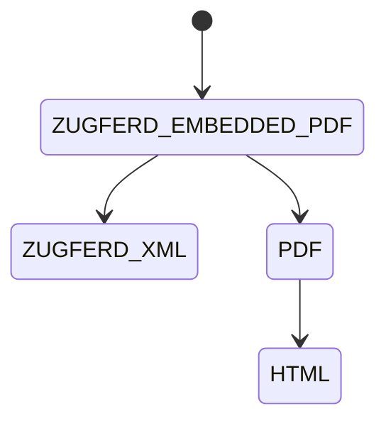

## Disclaimer

This document focuses on the higher level architecture and design decisions
of the new (refactored) document generation.
It does not cover every little detail of the implementation, which
will be figured out during the implementation.
Instead, it tries to reduce uncertainty and set a clear direction that everyone agrees on,
so that the implementation doesn't end up being done twice.

If you haven't, you should read
[2026-03-17-refactor-of-document-generation.md](https://github.com/shopware/shopware/blob/trunk/adr/2026-03-17-refactor-of-document-generation.md)
first, to understand the reasoning for and goals of the new document generation.

## Glossary

Document format:
A specific representation of a document, e.g. PDF, HTML, Zugferd-XML, Zugferd-Embedded-PDF.

Document type:
A certain type of document, e.g. invoice, delivery note, credit note, cancellation invoice.

Document file:
A document file of a certain document type represented in a certain format (e.g. invoice in PDF).

Document:
A document with a single document number and represented by one or more files in specific formats
(e.g. invoice number 1001, available in PDF and HTML).
All associated document files are based on the same order (version) data and document number.

## Fundamental concepts

### Entity relations



- An order has zero or more `document`'s
- Each `document` is of a single `document_type`
- Each `document` has one or more `document_file`'s
- Each `document_file` is in a single `document_format`

### Generation dependencies

We learned from the current implementation that there are often dependencies between document formats.
This diagram shows the dependencies between document formats when generating an invoice in Zugferd-Embbedded-PDF format:



Where the generation process could look like this:

1. Generate HTML from a twig template and order data
2. Generate Zugferd XML from the order data
3. Generate PDF from the HTML using DomPDF
4. Generate Zugferd Embedded PDF by combining the Zugferd XML and the PDF into a single file
5. Only step 4 is persisted as an artifact (document file) of the document generation, as requested by the user

But potentially multiple formats can be artifacts of the same generation process,
for example, if the user wants to generate an invoice in PDF, HTML and ZugferdXML format.

### PHP caller API

Documents can be generated by using the `Shopware\Core\Checkout\DocumentV2\DocumentGenerator` service.

It has one public method with a signature like this:
```php
/**
 * @param list<string> $formats
 * @return string the generated document uuid
 */
public function generate(
    string $orderId,
    string $orderVersionId,
    string $docType,
    array $formats,
    Context $context,
    string $documentNumber = null
): DocumentEntity
```

The caller is responsible for:
- creating an order version to persist the order data in its current state
  - or pass in an existing order version where additional documents should be generated for
  - passing in the LIVE_VERSION is not allowed and will throw an exception
- passing in a single document type
  - it's passed a string by design (for extensibility), but you can use the `DocumentType` enum values
- passing in a list of formats to generate the document for
  - again a string by design, but you can use the `DocumentFormat` enum values
- passing in a shopware context with the necessary permissions to generate the document
- optionally passing in a document number to use for the document, otherwise a new one will be generated

On success, it returns the document entity, which was already persisted with all its document files in the DB.
You can use it to access the media URL of the generated document files as well as other metadata.

There will be also a symfony controller and admin API HTTP endpoint calling this method, to make
it possible to generate documents from the admin frontend as well.

### PHP internal design

Based on symfony tagged services, which makes it easy for us and for third party plugins
to add new document renderers.

Everything revolves around the concept of a document renderer, where every renderer is:

- a symfony service
- tagged with `shopware.documentV2.renderer`
- responsible for rendering a single format
  - of one or more document types
  - but only one document type at a time / per generation call
- extends from the abstract `AbstractDocumentRenderer` class to follow a certain interface
- is automatically called by the `DocumentGenerator` service at the right time and at most once per generation call

A rough draft of the `AbstractDocumentRenderer` interface looks like this
(note this might change slightly during implementation)
```php
abstract class AbstractDocumentRenderer
{
    /**
     * All document types this renderer supports.
     *
     * @see DocumentType
     *
     * @return list<string> document types passed as strings
     */
    abstract public function getDocumentTypes(): array;

    /**
     * The format this renderer produces.
     *
     * @see DocumentFormat
     */
    abstract public function getFormat(): string;

    /**
     * Formats, see @DocumentFormat, this renderer has a dependency on.
     * e.g. ['html'] for PDF renderer that converts HTML → PDF.
     *
     * @return list<string> formats passed as strings
     */
    public function getDependencies(): array
    {
        return [];
    }

    /**
     * Enrich order criteria with additional associations
     */
    public function enrichOrderCriteria(string $docType, Criteria $criteria): void
    {
        // nothing by default
    }

    /**
     * Render for a single specific document type + format and return the document as a string.
     * (registered) Dependencies can be retrieved from the @see RenderState
     */
    abstract public function renderToString(DocumentGenerationContext $generationContext, RenderState $renderState): RenderResult;

    /**
     * Persist the rendered document to a file, returning its shopware media id.
     */
    abstract public function persistToFile(DocumentGenerationContext $generationContext, RenderResult $renderResult): string;
}
```

Some further remarks on the renderers:

- They can register dependencies on other renderers (document formats) via `getDependencies()`
- They can enrich the order criteria with additional associations via `enrichOrderCriteria()`
- They can access their dependencies (output of other renderers) via the `RenderState`
- They get access to the `DocumentGenerationContext` which contains
  - the order data
  - the document type
  - the document number
  - configuration data for this document type and format (e.g., company data, file prefix / suffix, or other `extensions` data)

The `DocumentGenerator` makes sure to call the renderers in the right order, respecting any dependencies.
Internally, it builds a dependency graph using [Kahn's algorithm](https://www.geeksforgeeks.org/dsa/topological-sorting-indegree-based-solution/)
and will throw an exception if there are circular dependencies.

Extension points of this new architecture are described in a separate ADR:
[2026-03-19-new-document-generation-extension-points.md](https://github.com/shopware/shopware/blob/trunk/adr/2026-03-19-new-document-generation-extension-points.md)
