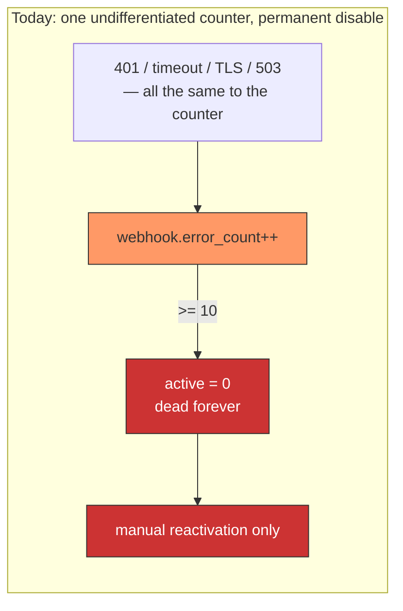
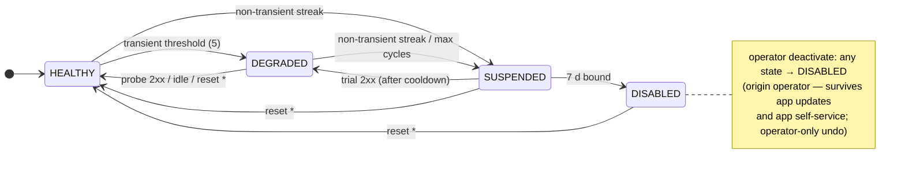
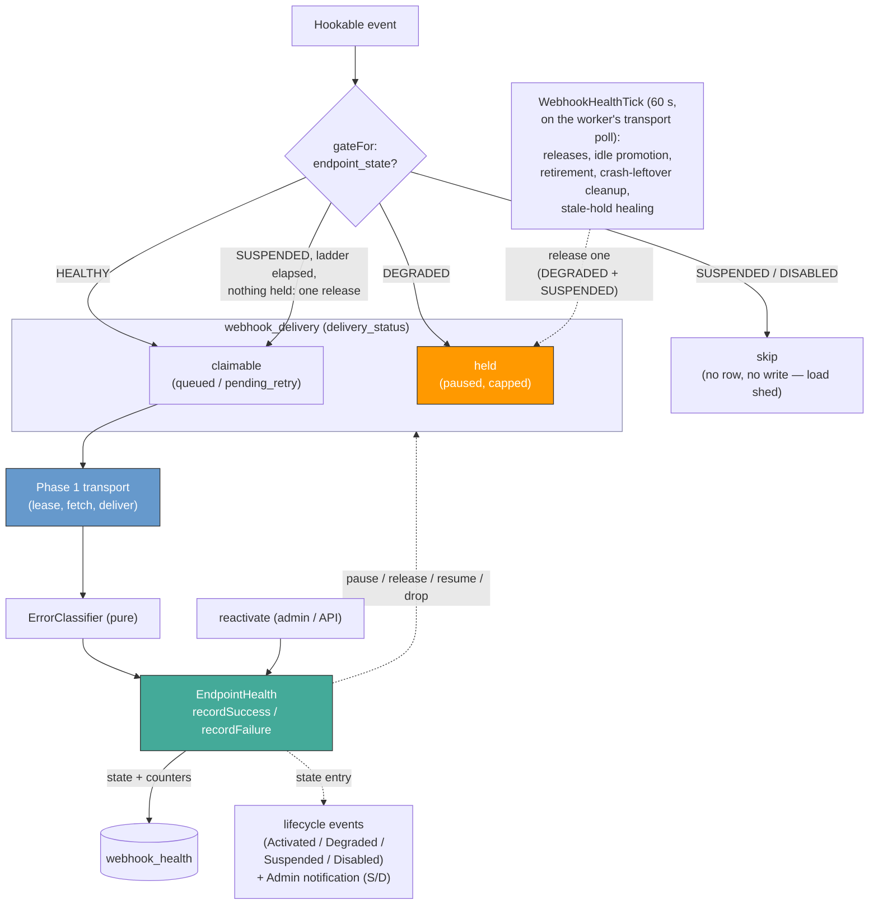
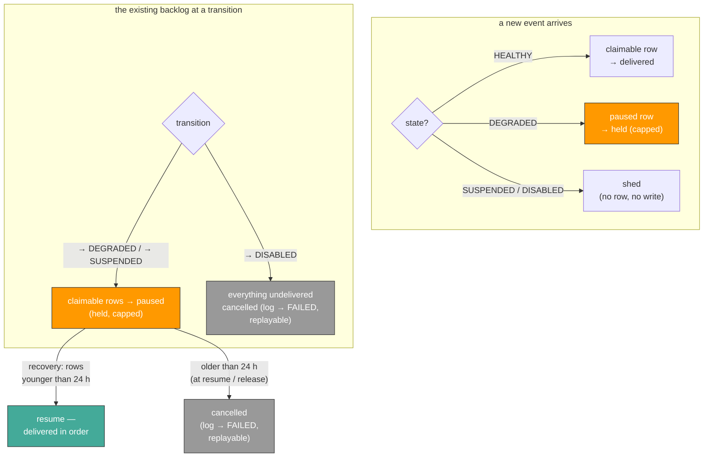
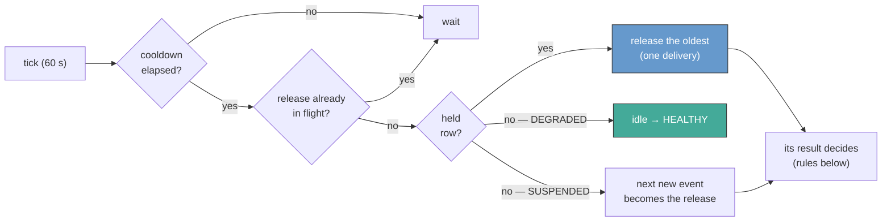
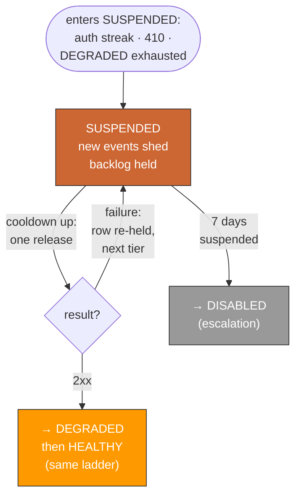

# Webhook endpoint health remodel

> Per-webhook health, automatic recovery, and a suspension that always ends in a decision — replacing the shared `error_count` and its permanent-disable mechanism with a four-state circuit breaker behind the Phase 1 `WEBHOOKS_REWORK` flag. Health decides *whether* a delivery may go out; it never changes *how* Phase 1 sends it.

Tracking: [shopware/shopware#16565](https://github.com/shopware/shopware/issues/16565) (follow-up to [#16560](https://github.com/shopware/shopware/issues/16560)).
Foundation: [`adr/2026-04-14-webhook-outbox-transport.md`](2026-04-14-webhook-outbox-transport.md).

---

## Reading guide

Phase 1 writes each business event to an *outbox* before a worker `POST`s it to the app; synchronous delivery uses the same bookkeeping. This ADR adds per-webhook health that classifies each result and gates later deliveries. The parties are the **operator** (merchant), **app vendor** (endpoint owner), and **Shopware** (delivery runtime).

| Term | Meaning |
|:---|:---|
| Circuit breaker / half-open | Stop sending to a failing service; after a wait, exactly one *half-open* trial request tests whether it recovered. |
| Outbox / transport | The Phase 1 delivery queue (`webhook_event_log` + `webhook_delivery`) and the machinery that delivers it (receiver, lease, fetch). |
| Claimable | A row workers may pick up and deliver (`queued` / `pending_retry`). |
| Held / `paused` | A row in the new `paused` status; workers never touch it, health releases it later. |
| The gate | The health check (`gateFor`) run for each new event: deliver, hold, or skip. |
| Release / trial | Health lets exactly one delivery out — a released held row, or one natural event admitted by the gate; its result judges recovery. |
| Ladder / tier / cooldown | The growing wait schedule between trials (5 m → 4 h). Each failed trial climbs one tier; the current tier's wait is the cooldown. |
| Lease | Phase 1's per-app lock: one worker at a time delivers an app's events (first attempts in insertion order; retries may arrive later). |
| Transient vs non-transient | Transient: probably temporary (server error, timeout) — worth retrying. Non-transient: the endpoint itself rejects us (bad credentials, gone) — retrying won't change the answer. |
| Hold / shed / cancel | Hold: keep the row, deliver later. Shed: write no row at all. Cancel: delete the delivery, keep the log row as FAILED — payload retained, so a later API can re-send it (*replayable*). |
| DAL | Shopware's Data Abstraction Layer; DAL entities expose their columns on the public CRUD API — exactly why health data stays out of it. |

---

## Why

Phase 1 replaced the delivery machinery; failure handling is still the legacy stopgap running on top of it:

1. Every failed delivery makes `RetryWebhookMessageFailedSubscriber` increment `webhook.error_count`.
2. At `error_count >= 10` the webhook flips `active = 0` and stays dead until manually reactivated.

A single counter cannot distinguish a transient 503 from a permanent 401, so the only outcome it can
reach is permanent death — there is no recovery path short of an operator.

The Phase 1 outbox cannot fix three problems on its own:

| Problem | Impact |
|:---|:---|
| **Cross-webhook blast radius** — `error_count` is shared across webhooks with the same event + URL | One broken endpoint disables unrelated webhooks; conversely, a success on one resets its siblings' counters. |
| **No error semantics** — one counter for every failure kind | A `401` (bad credentials) is indistinguishable from a `503` (server briefly down); both escalate at the same rate. |
| **No automatic recovery** — `active = 0` is a kill switch | A 10-minute outage still needs a human to reactivate the webhook, often hours later. |

---

## Decision

Per-webhook **four-state health** behind the existing `WEBHOOKS_REWORK` flag (flag off = legacy behaviour unchanged). The states:

- **HEALTHY** — deliveries flow normally.
- **DEGRADED** — transient failures; new work is held, one trial at a time tests recovery.
- **SUSPENDED** — non-transient rejection (or DEGRADED ran out of budget); the backlog waits, new events are skipped.
- **DISABLED** — after 7 days suspended or an operator kill; nothing is delivered, held work is cancelled (payloads stay replayable).

The rules:

- **A pure error classifier.** Each outcome is transient, non-transient, or payload-specific ([Error classification](#error-classification)). Suspension needs 3 non-transient failures in a row with no `2xx` in between — one spurious `401`/`403` from a firewall or CDN challenge can't trip the breaker. `404` is transient (deploy windows heal); `410 Gone` stays immediate.
- **Automatic recovery through one half-open ladder**, shared by DEGRADED and SUSPENDED. When the cooldown elapses, the oldest held row is released as a trial (SUSPENDED with nothing held: the gate admits the next natural event instead). Each `2xx` climbs exactly **one state** toward HEALTHY. An app install/update additionally resets health to a clean slate.
- **Staged backlog handling.** Already-queued rows survive a suspension as held rows. At resume, rows older than a bounded grace age are cancelled (replayable) instead of redelivered stale. Only DISABLED drops everything held.
- **Lifecycle events + trip notification.** Every state entry emits a best-effort business event (`WebhookActivatedEvent` / `WebhookDegradedEvent` / `WebhookSuspendedEvent` / `WebhookDisabledEvent`); entering SUSPENDED or DISABLED also writes an Admin notification.
- **Disable provenance.** `disabled_origin` records *who* disabled: `operator` or `escalation`. Automation never undoes a human's deliberate kill — an operator-disabled webhook is excluded from every automatic recovery path; only admin `PATCH active = true` reverses it.
- **Bounded escalation.** SUSPENDED → DISABLED after a configurable day count (default 7).

| Label | Meaning | Details |
|:---|:---|:---|
| non-transient streak | 3 `401`/`403` in a row, no `2xx` in between (`410` immediate; `404` transient) | [Error classification](#error-classification) |
| reset \* | clean slate via app install/update (DISABLED: escalation-origin only), the app reactivate API (refused on operator-disabled), or manual reactivation | [Clean-slate reset](#clean-slate-reset-on-app-installupdate) |
| 7 d bound | `suspended_since + max_suspended_days`; survives re-suspension, pauses while the app is deactivated | [SUSPENDED](#suspended--what-differs-from-degraded) |

Per state:

| State | New events | Delivery | Recovery |
|:---|:---|:---|:---|
| **HEALTHY** | claimable row | yes | — |
| **DEGRADED** | held (`paused`) rows | paused; one cooldown-gated trial at a time | trial `2xx`, or idle promotion (nothing held, nothing in flight) → HEALTHY |
| **SUSPENDED** | **skipped — no row, no write** | no; the pre-suspension backlog stays held, age-filtered at redelivery ([backlog rules](#new-events-versus-the-queued-backlog)) | after each cooldown one delivery is tried — the oldest held event, else the next new one; each `2xx` climbs one state. Also: app install/update → HEALTHY; 7 days → DISABLED |
| **DISABLED** | no | no — everything undelivered is cancelled | escalation-origin: app install/update or manual; operator-origin: **operator-only** undo |

The model is per-webhook: an app with five subscriptions has five independent health states — a `401` on `/customers` does not pause `/orders`. One timing caveat: an app's webhooks share one Phase-1 partition lease until `PartitionAwareHookable` (Phase 3), so a failing sibling can *delay* the app's other webhooks — never degrade or disable them. Health blame is individual; delivery speed is shared per app.

### Core building blocks

1. **`EndpointHealth`** — owns `webhook_health` and every state transition.
2. **`ErrorClassifier`** — a pure function `status → enum`: same input, same answer — no database, no clock. Status `0` means no response. Stateful logic stays in the service.
3. **Dispatch gate** — per new event, `WebhookManager` asks `gateFor`: deliver, hold, or skip. The transport writes exactly that decision — a claimable row (HEALTHY), a `paused` row (DEGRADED), or nothing at all (SUSPENDED/DISABLED) — and no later component re-decides. A decision can be momentarily stale (the state may change in the same instant); both cases heal: a claimable row escaping onto a just-suspended webhook delivers once and its result counts as ordinary evidence, and a `paused` row on a just-recovered webhook is resumed by the health tick within a minute.
4. **`paused` delivery status** — the held state. The transport ignores it; health gates delivery purely by pausing and releasing rows. The Phase 1 receiver/lease/fetch code is unchanged.
5. **`WEBHOOKS_REWORK` flag** — the Phase 1 flag; off keeps the legacy failure-handling path.

The planes meet only at `delivery_status`: health writes pause/release/resume/drop decisions, and the transport delivers claimable rows. Neither reads the other's columns.

### New events versus the queued backlog

The gate decides only *new* events. At the moment a webhook changes state it usually still has queued rows the workers haven't delivered — left claimable, they would keep hitting an endpoint just judged bad. The rules for that backlog:

- **DEGRADED holds.** Claimable rows flip to `paused`; they resume on recovery.
- **SUSPENDED holds too — with an age limit on redelivery.** Held rows wait until recovery or DISABLED, but nothing older than **24 h** (fixed, measured from the row's creation) is ever redelivered. The check runs wherever held rows would go out again — bulk resume and single-row release alike; too-old rows are cancelled there. The replay surface is their escape hatch.
- **Cancelling kills only the delivery.** The `webhook_event_log` row stays — FAILED, `failure_reason = endpoint_suspended`, payload retained, replayable. A spurious suspension costs latency, never queued work younger than a day.
- **Every arrival at HEALTHY resumes the held rows** (age-filtered) — ladder, manual, API, or app reset. No held row outlives recovery.
- **New events while SUSPENDED are shed: no row, no write.** DEGRADED keeps new work, SUSPENDED sheds it — that asymmetry *is* the difference between the states, and shedding costs zero I/O. Apps bound the shed window via `suspended_since` on `GET /state`.
- **Order is never broken; a gap can exist.** Held rows resume ahead of newer traffic (FIFO — first in, first out — by row id). After recovery the receiver sees pre-suspension events, a gap (the shed window), then live traffic. Shed events consumed no sequence numbers, so the gap shows only on `/state`; the Admin notification marks trip and recovery.
- **The transport doesn't change.** `paused` is simply not claimable; held rows re-enter only via a single-row release or the bulk resume — one transaction per flip. The transport persists what the gate decided; there is no second decision.
- **Two timing races heal themselves.** A row landing claimable on a just-suspended webhook delivers once, its result counting like any other. A row landing `paused` on a just-recovered webhook is resumed by the health tick within a minute.

A delivery already in flight (`running`) when the state changes:

| Situation | What happens |
|:---|:---|
| Worker mid-delivery during a transition | The HTTP call just finishes; its result is recorded like any other — or ignored if its row is already gone. |
| Crash leftover re-queued on a now-SUSPENDED webhook | Must not simply deliver — crash recovery cancels it before it can be claimed, and the health tick cancels any surplus claimable row; only the one deliberately released row may be in flight. |
| Webhook goes DISABLED | Everything undelivered — queued, held, mid-flight — is cancelled; an operator's kill also stops a still-deliverable backlog. A worker finishing late writes into a deleted row and changes nothing. |

**Cost — why the flip is expensive, and why it is bounded.** The flip is a bulk write holding row locks until commit; while locked, every other query touching those rows waits, so the lock-hold time directly stalls the webhook pipeline. It writes *two* tables, because `delivery_status` lives on both `webhook_delivery` and the wide `webhook_event_log` (`fetchDue` reads `el.delivery_status`). `webhook_event_log` also stores the request/response payloads (~3 KB/row), so once it outgrows MySQL's buffer pool (the memory for hot pages) its write dominates. Measured (pause flip, MySQL 8.4, 128 MB buffer pool):

| rows touched | lock-hold (delivery + event_log) |
|---:|---:|
| 1 k | ~55 ms |
| 10 k | ~370 ms |
| 100 k | ~8.7 s |
| 1 M | ~184 s |

The deferred drop (`DELETE webhook_delivery` + `webhook_event_log` → FAILED — the same operation as the DISABLED escalator drain) has the same shape and size. The large counts need two faults at once — dead workers building a big backlog, *then* a transition — so the 100 k+ figures are an artificial dead-shop bound, not a live-shop profile. And they are bounded by design, not luck: **`max_paused_backlog`** (default `10_000`, ~0.4 s per flip) ships **in the same release** (a Phase 3 co-ship) and caps every held set — the DEGRADED hold and the SUSPENDED grace hold alike; the full cap contract is in [Consequences](#consequences).

---

## Error classification

Three failure families: **transient** (probably temporary — retry), **non-transient** (the endpoint rejects us — retrying won't help), **payload-specific** (this one message is the problem — the endpoint's health must not suffer for it).

`ErrorClassifier::classify(int $status)` returns one enum value — no other inputs, no state. Status `0` represents transport failures without a response. The classifier says what *kind* of failure; *when* to retry is a separate job in `WebhookDeliveryService`, which computes `next_retry_at` from the `RetryDelayCalculator` schedule (`[5 s, 30 s, 5 m, 30 m, 4 h]`, capped at 4 h) and merges a `429`'s `Retry-After` at the failure call site.

| Response | Delivery | Health |
|:---|:---|:---|
| `2xx` | success | reset both failure counters; clear the cooldown; DEGRADED → HEALTHY |
| `404`, `408`, `5xx`, network, DNS, timeout, TLS handshake | retry with backoff, bounded `[5 s, 4 h]` | `consecutive_transient_failures++`; threshold-crossing → DEGRADED (from HEALTHY only) |
| `429` (rate-limited) | retry honouring `Retry-After`, bounded `[1 s, 4 h]` | `consecutive_transient_failures++`; counts toward the DEGRADED threshold (from HEALTHY only) |
| `400`, every other unlisted `4xx` | fail immediately | **no health update** — this message/payload is the problem, not the endpoint |
| unfollowed `3xx` (a redirect we don't follow) | fail immediately | `consecutive_transient_failures++` — a persistent redirect is endpoint configuration, not message content; it escalates through DEGRADED instead of failing invisibly forever |
| `401`, `403` (auth rejected) | fail immediately | `consecutive_non_transient_failures++`; streak ≥ `non_transient_threshold` (default 3) → SUSPENDED. Counted once per delivery; reset by any `2xx`; transient failures neither advance nor reset it |
| `410` (gone for good) | fail immediately | → SUSPENDED immediately — `Gone` is the endpoint's explicit retirement signal |

*"From HEALTHY only"*: the transient threshold trips only HEALTHY → DEGRADED. Once DEGRADED or SUSPENDED, transient failures feed the [recovery ladder](#half-open-recovery--one-ladder-for-degraded-and-suspended) instead.

Why the lines are drawn here:

- **`400`/unlisted `4xx` never escalate health** — one malformed event must not block thousands of good ones. The default branch has no health impact, so no status class is unmapped.
- **One `401`/`403` is a blip, not a verdict.** WAFs, CDN challenges, and OAuth gateways emit isolated auth errors against healthy endpoints; suspension needs a run (`non_transient_threshold`, default 3, no `2xx` in between). Waiting costs a couple of failed deliveries; not waiting halted a dispatch lane on one spurious response. No mainstream platform trips on a single response.
- **`404` is transient** — usually a deploy or config change in flight; a *persistent* `404` still escalates through the DEGRADED budget. `410 Gone` is the explicit retirement signal and suspends immediately.
- **TLS handshake errors are transient** — cert renewals, CDN restarts, and DNS jitter produce single TLS errors; persistent misconfiguration still escalates through the threshold. Some reachability gates treat DNS/TLS as fatal; we deliberately diverge ([Considered alternatives](#considered-alternatives)).
- **`Retry-After` is bounded `[1 s, 4 h]`**; out-of-range falls back to the schedule.

---

## Half-open recovery — one ladder for DEGRADED and SUSPENDED

A half-open breaker admits one request after a wait and judges its result. Both non-HEALTHY states use the same mechanism:

- **One ladder** — `cooldown_schedule_seconds` (5 m → 4 h), per webhook. Tier 0 must exceed the 20-second delivery timeout so pre-trip in-flight results settle before the ladder opens; configuration enforces at least 21 seconds.
- **One delivery at a time** — when the cooldown elapses, one row is released as the trial.
- **One success rule** — a `2xx` climbs exactly one state toward HEALTHY.
- **One clock** — `WebhookHealthTick` (60 s) carries every time-based duty as cheap indexed per-webhook checks: releases; idle promotion (below); the 7-day retirement (skipping deactivated apps); crash-leftover cleanup (cancel re-queued crash rows on SUSPENDED webhooks); stale-hold healing (resume rows left `paused` by a race). Short transactions, no HTTP calls, no held locks; released rows ride the normal receiver path. The tick is pulsed by the delivery worker's transport polling — not a scheduled task, whose host-controlled cadence (cron or admin-worker, commonly ~10 minutes) cannot honour 60 s. Every worker poll passes an in-memory debounce (one tick per interval per worker); there is deliberately no cross-worker election — every duty is a guarded single statement or a per-webhook `FOR UPDATE` transaction, so overlapping runners are absorbed as a few redundant indexed scans, never a wrong transition. After a completed tick the worker writes the heartbeat (an `app_config` key), which the health-status endpoint reports. The worker that delivers is, by definition, alive exactly when health has decisions to make; if no worker polls the webhook transport, nothing delivers either, so there is nothing for the clock to judge.

On `HEALTHY → DEGRADED` the claimable backlog bulk-flips to `paused`; new events while DEGRADED are written `paused` directly. Each tick, per DEGRADED/SUSPENDED webhook with an elapsed `cooldown_until`:

- **Previous release still in flight** (a claimable or `running` row exists) → no-op this tick.
- **`paused` row, nothing in flight** → release the oldest (→ `pending_retry`, due now). Releasing itself never counts a cycle.
- **Nothing held, nothing in flight** → DEGRADED: idle promotion (below). SUSPENDED: the **gate** admits the next natural event as the trial — a guarded `UPDATE` re-arms the lease first, and it succeeds for only one caller, so a burst can't produce several trials. SUSPENDED never idle-promotes.

The released row's result drives the transition — one state per `2xx`:

1. **`2xx`** — SUSPENDED → DEGRADED with cycle counter and ladder at 0 (one success after a deep failure isn't proof of health; HEALTHY is earned through the same ladder). From DEGRADED → HEALTHY: all `paused` rows resume (age-filtered, drained in partition order).
2. **Transient** — re-hold the row and climb one tier (capped at 4 h). This applies to a natural-traffic trial too: its row joins the held set, which thus gains at most this one row while SUSPENDED. While DEGRADED the same index is the cycle counter: reaching the schedule's end → SUSPENDED.
3. **Non-transient** — row FAILED, auth streak++ (→ SUSPENDED at the threshold); counts as a failed trial.
4. **Payload-class (`400`-family)** — fails *that row only*, does **not** consume the trial; the next-oldest held row is released at once. Only transport-level outcomes decide the breaker — one malformed payload at the head of the held set must not wedge recovery. (One rule for both states; the earlier two-mechanism split left this unspecified for the probe.)

One rule per released row, no matter how it was released.

**Ladder accounting — only released rows move the ladder.**

| Row | Moves the ladder on failure? | Counted when |
|:---|:---|:---|
| Tick-released trial (the oldest held row) | yes — exactly once | when its result comes back, and only if the cooldown was already over when that result landed |
| Gate-admitted trial (natural traffic while SUSPENDED) | yes — exactly once | at admission; its result does not count a second time |
| A delivery already in flight when the breaker tripped | no | — (the row is just re-held) |
| A row brought back by crash recovery | no | — (the row is just re-held) |

Only one release can be out at a time: the tick checks for in-flight rows before releasing; the gate claims its admission through the lease.

**One ladder index.** The position is a single field, `degraded_cycle_count`, in both states. It resets to 0 when a `2xx` moves the webhook into DEGRADED, and on every direct (non-transient) trip. In DEGRADED the same number is also the cycle counter — there is deliberately no `max_degraded_cycles` setting: the budget *is* the schedule's length; edit the schedule to change it.

**Worked example** — an endpoint starts answering `503` at 12:00; every trial fails with a transient error until 22:15 (times idealized — the 60 s tick can add up to a minute per step):

| Time | What happens |
|:---|:---|
| 12:00 | 5th transient failure → **DEGRADED** (index 0); backlog flips to `paused` |
| 12:05 – 14:15 | trials after 5 m / 10 m / 20 m / 40 m / 1 h all fail — index climbs 1 → 5 |
| 18:15 | trial after 4 h fails — schedule exhausted → **SUSPENDED**, ladder stays at the top tier |
| 22:15 | trial after 4 h returns `2xx` → **DEGRADED**, index 0 |
| 22:20 | trial after 5 m returns `2xx` → **HEALTHY**; held rows younger than 24 h resume |

**Idle promotion** (DEGRADED only: nothing held, nothing in flight → HEALTHY). It resets the index and cooldown but **keeps the transient streak**: nothing was delivered, so nothing proved health — the first transient failure after traffic resumes re-degrades immediately; a real `2xx` clears it. HEALTHY is the right resting state (a "stay DEGRADED" rule would wedge a traffic-less webhook forever); promotion never fires while a released row is still pending.

---

## SUSPENDED — what differs from DEGRADED

SUSPENDED is not the end. The paused pre-suspension backlog is still held (age-filtered at resume); new events are shed (no row, no write); recovery rides the shared ladder. Only three rules are SUSPENDED-specific:

- **Ladder entry.** A direct trip (auth streak / `410`) starts at tier 0 — first trial after 5 m, so a blip recovers in minutes. Arrival from exhausted DEGRADED cycles continues at the top tier: an endpoint that burned ~6 h of trials gets no fast retries. Each failed trial climbs one tier, capped at 4 h.
- **Natural-traffic trials.** With nothing held, the gate admits the next real delivery as the trial; it is treated like any released row — a transient failure re-holds it, so the held set gains at most this one row while SUSPENDED.
- **No idle promotion.** Without a `2xx`, SUSPENDED ends only via a reset (below) or the wall-clock bound.

The trial is a real delivery, so recovery works no matter what caused the trip — and cannot recover falsely: broken credentials keep returning `401` and never recover this way (they heal via the clean-slate reset below, or manually); a `404`/`410` recovers only if it was a genuine blip.

The only give-up is the **7-day wall clock** (real elapsed time, independent of traffic):

- `suspended_since` is written when the webhook **first** enters SUSPENDED and never overwritten until full recovery (writers set the field only when it is empty). A SUSPENDED → DEGRADED → SUSPENDED loop does **not** restart the clock; the field is cleared only on reaching HEALTHY.
- After `max_suspended_days` (default **7**) the health tick retires the webhook to DISABLED (`disabled_origin = escalation`) — time-based, not traffic-based, so a dead, traffic-less endpoint still retires.
- **The clock pauses while the app is deactivated.** A deactivated app's events are filtered out before the gate, so its webhooks get no trials — counting that time would be unfair. So the retirement sweep skips webhooks of deactivated apps, *and* on reactivation `suspended_since` is moved forward by exactly the deactivated interval: suspended 2 days, app deactivated 3, reactivated — the clock reads 2 days, not 5. Merely skipping the sweep would retire the webhook at the first tick after reactivation.
- No suspension-cycle counter: the cooldown is already time-triggered; a counter would only restate elapsed time.

### Clean-slate reset on app install/update

An app install or update (`AppInstalledEvent`/`AppUpdatedEvent`) is a deliberate operator action that replaces exactly what usually broke the endpoint — configuration and credentials — so it is a clean slate:

- `reactivateForApp` resets every non-HEALTHY webhook of the app (DEGRADED/SUSPENDED/DISABLED) to HEALTHY — except an operator-disabled one (`disabled_origin = operator`): a merchant's explicit kill survives a routine app update; only the operator reverses it (admin `PATCH active = true`).
- For escalation-DISABLED webhooks this is the **only** automatic way back.
- It resets health state, not the gate: future events flow because the state allows it — nothing bypasses the gate.
- Known gap: rotating the app secret via bare CLI/API fires no install/update event — recover those via manual reactivation.

### Lifecycle events & trip notification

State changes are pushed as lifecycle events; SUSPENDED and DISABLED also notify the operator.

| State entered | Business event | Admin notification |
|:---|:---|:---|
| HEALTHY (any path) | `WebhookActivatedEvent` — carries the trigger: trial `2xx` / idle promotion / manual / app reset / app reactivate API. Replaces the earlier `WebhookReactivatedEvent`. | a short recovery notice, when a suspended webhook recovers |
| DEGRADED | `WebhookDegradedEvent` | none — routine self-healing; events yes, human alarm no |
| SUSPENDED | `WebhookSuspendedEvent` | yes — **one per suspension**, keyed on the unchanged `suspended_since`: a webhook that re-trips before ever reaching HEALTHY does not notify again |
| DISABLED | `WebhookDisabledEvent` | yes — always |

- **Best-effort:** emitted post-commit; a listener failure never affects the transition — the events are advisory, the `webhook_health` row is the truth. Events plus structured logs are also the provenance record; there is no separate audit table.
- **Payload contract:** ids, names, coarse state/cause enums, and timestamps — never the endpoint URL, headers, delivery payloads, exception messages, or counts. Concretely, every event carries `webhookId`, `webhookName` (the vendor's key into `GET /state` and `POST /reactivate` — both are name-keyed), `eventName` (the affected webhook's subscription — what makes an operator's Flow rule readable), `fromState`, and `occurredAt` (the transition's own time; the envelope timestamp is per delivery *attempt*, so a held event delivered late would otherwise carry no transition time). `WebhookSuspendedEvent` adds `suspendedSince` (the episode anchor) and `cause` (`auth_streak` | `gone` | `schedule_exhausted`) — the remedy differs per cause (rotate credentials / fix a retired URL / wait out recovery), and a machine-readable enum is in-contract where remedy *text* is not. The "no counts, no remedy instructions" rule continues to bind the Admin-notice wording.
- **App-less observers see everything — deliberately.** A webhook without an owning app passes dispatch eligibility unconditionally, so an operator-created webhook subscribed to `webhook.health.*` receives all apps' health events, names included. That is an operator-trust channel with the same trust level as the Admin; app-owned webhooks stay strictly scoped to their own app's events.
- **One notification per suspension** because repeated alarms from a flapping endpoint would teach operators to ignore the channel.
- **The recovery notice** closes the loop — deliberately without counts or remedy instructions: the merchant and the app vendor are different parties, and acting on the gap is the vendor's job. The vendor's record is `GET /state` (`suspended_since` → recovery bounds the window) plus the replayable FAILED rows; replayed deliveries are ordinary subscribed events — recovery never introduces a new event type an app must learn.

---

## Time-budget defaults

| Default | Value | Why |
|:---|:---|:---|
| `degraded_threshold` | 5 transient failures | One short outage produces 4–5 retries; the 5th flips DEGRADED, so a single spike doesn't pause delivery. |
| `non_transient_threshold` | 3 in a row | WAFs, CDN challenges, and OAuth gateways emit isolated `401`/`403`s against healthy endpoints; three failing *deliveries* with no `2xx` in between is endpoint-level evidence a blip can't fake. `410` bypasses the threshold (explicit `Gone`); `404` is transient. Reset by any `2xx`. |
| Backlog grace age | 24 h — **a fixed constant, not a setting** | Applied wherever held rows would redeliver (resume and release): younger redelivers, older is cancelled (FAILED, replayable). Staleness tolerance doesn't vary by deployment; the replay surface is the configurable escape hatch. Held sets are bounded by `max_paused_backlog`. |
| `cooldown_schedule_seconds` | `[300, 600, 1200, 2400, 3600, 14400]` | 5 m → 10 m → 20 m → 40 m → 1 h → 4 h; doubling for five tiers; the final 1 h → 4 h jump matches Phase 1's worst-case per-delivery retry budget. |
| DEGRADED budget | derived: the schedule's length — 5+10+20+40+60+240 min = 375 min ≈ 6 h 15 m | Not a setting: the cycle bound *is* the schedule's length; tune it by editing the schedule. An endpoint that can't recover in six hours is structurally broken; SUSPENDED is the honest label. |
| SUSPENDED ladder entry | tier 0 on a direct trip (5 m); top tier from exhausted cycles | The shared ladder, no new setting: a blip-tripped endpoint recovers in minutes; one that already burned ~6 h of trials keeps backing off at 4 h. |
| `max_suspended_days` | 7 | A week before retiring to DISABLED — in line with common per-endpoint norms (a few days), short enough that abandoned apps leave the dispatch path; configurable up to 14. Recovery (ladder / install-update / manual) stays available throughout. |
| Health tick | 60 s — a constant on `WebhookHealthTick`, not in health config | One clock, every time-based duty, cheap indexed checks; pulsed by the delivery worker's transport poll, debounced per worker, overlapping runners absorbed by the duty guards; the smallest cooldown is 300 s, so a due trial is never late by more than a fifth of its cooldown (5× headroom). |

The settings — `degraded_threshold`, `non_transient_threshold`, `cooldown_schedule_seconds`, `max_suspended_days` (and the co-shipping `max_paused_backlog`) — live under `shopware.webhook.health.*`; everything else above is a constant or derived.

---

## Schema and APIs

Health state lives in a dedicated **internal `webhook_health` table** — a plain SQL table, not a DAL entity (DAL validation would force all eight operational columns onto the public, BC-frozen `/api/webhook` surface; see [Considered alternatives](#considered-alternatives)). It follows the Phase 1 raw-operational-table pattern: 1:1 with `webhook`, PK/FK `ON DELETE CASCADE` (deleting a webhook deletes its health row). Eight fields: state; the three counters (transient streak, non-transient streak, ladder index); cooldown / suspended-since / disabled-since timestamps; `disabled_origin` (`operator` | `escalation`).

- **Additive elsewhere:** the `paused` delivery status and `webhook_event_log.failure_reason` — plus one `app_config` key (`webhook.health.tick.completed_at`, the tick heartbeat; absent until the first completed tick). No new table for the clock and no audit table — provenance rides the lifecycle events and structured logs.
- **BC mirror (backwards compatibility):** legacy `webhook.active` / `error_count` keep being written, derived from health on each transition — generic `/api/webhook` reads *and* filters keep working.
- **Backfill:** `INSERT … SELECT` from `webhook`; `active = 0` → DISABLED with `disabled_origin = escalation`. Named trade-off: a pre-migration operator disable is indistinguishable from an auto-disable, so an app update can revive it — not new exposure, since the pre-rework persister already re-activated manifest webhooks on every app update; the same rescue path is kept.

Three new app-system endpoints and one Admin observability endpoint:

| Endpoint | Auth | Purpose |
|:---|:---|:---|
| `GET /api/app-system/webhook/state` | App credentials | Per-webhook health for the calling installation; includes the current `url`, `suspended_since` / `disabled_since`, and `disabled_origin`. |
| `POST /api/app-system/webhook/reactivate` | App credentials | Reactivate one or more webhooks; rate-limited 10/min per integration; capped at 50 ids per call. **Refuses operator-disabled webhooks** — that recovery is the operator's. |
| `GET /api/_action/webhook/health-status` | Admin | Tick heartbeat (the `webhook.health.tick.completed_at` `app_config` key — the last completed tick, plus a `stale` flag) for self-hosted observability. |
| `POST /api/_action/webhook/{id}/deactivate` | Admin | The operator kill-switch: → DISABLED, `disabled_origin = operator`, usable in **any** state. Exists because `PATCH active = false` cannot express intent on a SUSPENDED/DISABLED webhook, whose mirrored value is already `false` (write rules below). |

The replay surface over FAILED `webhook_event_log` rows — the cancelled backlog and exhausted retries — ships in the same release (specified in the Phase 3 ADR). Shed events have no rows by design; their window is reconciled by time via the DAL API.

**Admin API backwards-compat.**

- **Reads:** `active`/`error_count` are derived from the new state (mapping below) and emitted alongside `endpoint_state` on the health API. The generic `/api/webhook` surface carries only the mirrored columns — by design, the health fields are not DAL surface; real-time status lives on the health API.
- **Writes** — the danger first: without a guard, the Admin UI saving a suspended webhook back unchanged (a full-entity round-trip writing `active = false` again) would register as a deliberate operator kill. So intent is read only from writes that actually *change* the value:

| Write | Does it flip the mirrored value? | Effect |
|:---|:---|:---|
| `PATCH active = true` | yes — it was `false` | reactivate — the operator gesture; works regardless of `disabled_origin` |
| `PATCH active = false` | yes — it was `true` | operator kill-switch → DISABLED, `disabled_origin = operator` — the flip carries the intent |
| `PATCH active` with the value it already has | no — a mere echo (e.g. a full-entity round-trip while suspended) | **no-op** (the echo guard): no intent can be read from an echo; the unambiguous gesture is the dedicated action below |
| `POST /api/_action/webhook/{id}/deactivate` | — | operator kill-switch → DISABLED, `disabled_origin = operator` — carries intent in any state |

  Value flips and the dedicated action are the only intent signals, so the mirror can never feed back into the state machine. Automation using the legacy off/on toggle inherits the kill-switch semantics (named in the v6.8.0 release notes).
- **Semantic shift:** from v6.8.0, `active = true` means dispatch is *eligible* — a DEGRADED webhook reports `active = true` while delivery is briefly paused. Documented in the v6.8.0 release notes.

The mirror — legacy consumers must never see a "broken" webhook with `error_count = 0` (an auth-suspended endpoint's transient counter may never have moved), so `error_count` mirrors the dominant streak:

| `endpoint_state` | `active` | `error_count` | Admin label |
|:---:|:---:|:---:|:---|
| `healthy`   | `true`  | `0` | Active |
| `degraded`  | `true`  | dominant failure streak — `GREATEST(transient, non-transient)` | Degraded — retrying |
| `suspended` | `false` | dominant failure streak | Suspended — dispatch paused |
| `disabled`  | `false` | dominant failure streak | Disabled — requires action |

---

## Considered alternatives

Only the genuinely contested decisions are listed.

### Where health state lives

| Option | Why not |
|:---|:---|
| Columns on the `webhook` DAL config entity | DAL schema validation requires every column to be a declared (public) field — the eight operational columns would become public, BC-frozen `/api/webhook` surface — and raw guarded writes to a DAL entity bypass its event and write-protection pipeline. Operational hot-state does not belong on a public config entity. |
| Cache (Redis / in-memory) as the *source of truth* | The textbook circuit-breaker store, but a cache flush would lose the suspension clock, the Admin UI data, and `GET /state` — health must survive restarts. Only the residency is ruled out: a read-through cache *over* the durable table is a fine later optimization for the hot `gateFor` read — writes still land in `webhook_health`, and a stale read fails open (delivers rather than blocks) and self-corrects. |
| **Internal `webhook_health` table (chosen)** | Matches Phase 1's raw operational-table pattern (`webhook_delivery`, `webhook_stream`); keeps health internal and off the public entity; a raw guarded `UPDATE` is the table's only writer. The `active`/`error_count` BC mirror covers the generic API until v6.8.0. |

### DEGRADED gating mechanism

| Option | Why not |
|:---|:---|
| `JOIN webhook` in the receiver fetch + an `active_probe_delivery_id` pin | Entangles health with the transport's lease/fetch path, adds JOIN and lock cost to the hot claim query, and spawned a cluster of concurrency edge cases (snapshot visibility, ABA pin-clearing, empty-lease spinning). |
| Reuse `next_retry_at` only (no new status; hold rows with a far-future timestamp) | Overloads `pending_retry` to also mean "held by health": held rows become indistinguishable from real retries (the skip/backlog gauges can't query them), and the retry scheduler writes the same field. Making that safe means teaching the transport's crash recovery about health — re-entangling the very thing this design decouples. More code than a new status, with worse layering. |
| **`paused` delivery status, transport-agnostic (chosen)** | The transport already ignores statuses it can't claim. Health owns the `paused` ↔ claimable flip in its own state space — no field shared with the retry scheduler. One claimable row among paused siblings = exactly one trial. No transport change; the held state is directly queryable. |

### The clock for the time-based duties

| Option | Why not |
|:---|:---|
| Scheduled task, 60 s interval (this document's first revision — amended) | The task *declares* 60 s, but the scheduler's cadence is the host's: cron setups commonly run `scheduled-task:run` every few minutes to tens of minutes, and admin-worker installations tick only while an Admin session is open. A due trial could wait out most of its cooldown again just for the clock — the ladder's timings become fiction. |
| Fleet-wide election — a one-row CAS table or a distributed lock (this document's second revision — simplified away) | The only thing an election deduplicates is work that is already safe and cheap to repeat: every duty is a guarded single statement or a per-webhook `FOR UPDATE` transaction, and a duty scan on an idle system is a handful of indexed near-empty SELECTs. Paying a dedicated table (or an `app_config` CAS slot) for that dedup is state without a customer. A `LockFactory` lock cannot even promise the dedup: the default store is flock — per node, not distributed. |
| **The delivery worker's transport poll, debounced per worker, no election (chosen)** | Messenger polls `get()` roughly every second whether or not traffic flows — a free, always-there pulse exactly on the process that must be alive for health to matter at all. An in-memory debounce bounds the cost to one tick per interval per worker; overlapping workers are absorbed by the duty guards. After a completed tick the worker writes the heartbeat `app_config` key. The transport wrapper carries a time pulse only — the receiver, lease, and fetch stay health-agnostic, and a tick failure is caught and logged, never thrown into the worker loop. |

### SUSPENDED recovery

| Option | Why not |
|:---|:---|
| Opt-in `app.system_heartbeat` ping | Non-subscribers never auto-recover; the heartbeat is weekly and opt-in; and a heartbeat `2xx` can prove a *different* endpoint is up than the broken one. |
| Active reachability probe (a scheduled `HEAD` of the webhook URL or a `baseAppUrl` health URL) | Rarely used in the industry. A `HEAD` proves the server answers — not that the real `POST` with auth succeeds. Adds a new scheduled-egress/SSRF surface; not every webhook has a `baseAppUrl`. |
| Blind reopen — unconditionally return to HEALTHY once the cooldown elapses | Recovers a still-broken endpoint with no evidence it is fixed; an auth-broken endpoint would re-fail on the next event and oscillate. We admit a real delivery as the trial instead, so only a genuine `2xx` clears it. |
| **The shared half-open ladder: oldest held row, else natural traffic (chosen)** | When the cooldown elapses (entry tier 5 m on a direct trip), exactly one delivery goes out — the oldest held row (released by the health tick, preserving order), else the next natural delivery admitted by the gate. A `2xx` de-escalates one state (SUSPENDED → DEGRADED); HEALTHY is then earned through the same ladder. The canonical circuit-breaker half-open, and one mechanism instead of two. Cannot recover falsely: an auth-broken endpoint never returns `2xx`; it heals via the clean-slate reset. Releasing held work first means recovery never sacrifices a *new* business event while accepted work is waiting. |

### TLS failure handling

| Option | Why not |
|:---|:---|
| Treat DNS/TLS as immediately non-transient | Right where over-blocking is cheap (e.g. gating a registration form); wrong for webhook delivery, where a false suspension on a certificate-renewal blip drops business events. |
| **Classify TLS as `TransientNetwork` (chosen)** | Persistent TLS misconfiguration still escalates through the normal DEGRADED threshold. |

### Events during SUSPENDED

| Option | Why not |
|:---|:---|
| Queue new events for delivery on recovery | Accumulates rows for the whole suspension window; bloats the hot queue; on recovery, everything arrives at once (a thundering herd). |
| Hold the backlog `paused` indefinitely and redeliver all of it on recovery | After a multi-day suspension this redelivers days-stale events interleaved with fresh ones — a large wall-clock skip for the consumer. The *bounded* grace window keeps the hold without the staleness. |
| Drop the backlog at the suspension instant (this document's first revision — amended after review) | A single spurious non-transient response — a WAF rule, a CDN challenge, a deploy-window `404` — would have cancelled every queued delivery the moment it tripped the breaker. No mainstream delivery platform sheds accepted work on a single response. The consecutive-streak trigger softens the trip; the grace window removes the haste. |
| **Hold; age-filter wherever rows redeliver; shed new events (chosen)** | On suspension the backlog is paused (the same flip as DEGRADED, capped by `max_paused_backlog`) and stays held until recovery or DISABLED — no background sweep. Wherever held rows would redeliver (resume and release), rows older than the 24 h grace age are cancelled — **the delivery only**: `webhook_delivery` deleted, `webhook_event_log` rows FAILED with payloads retained, the replay surface's input. Younger rows redeliver. New events are skipped outright — **no row, no write** — so the log grows only while a webhook is deliverable (the deliberate contrast with DEGRADED's hold) and shedding costs zero I/O. Consumers reconcile the shed window by time (`suspended_since` on `GET /state`); nothing older than the grace age is ever redelivered. |

### Rejected simplifications

A dedicated simplification pass proposed six cuts. Two shipped (the shared half-open ladder; the resume-time age filter that replaced a separate grace sweep). Four were rejected, each by a concrete break:

| Proposed cut | Why it stays |
|:---|:---|
| Replace `degraded_cycle_count` with a wall clock + a "≥ 1 trial result seen" check | The break: a trial is released at +5 m; its result arrives 6 h later because workers lagged. Clock elapsed? Yes. One result seen? Yes — the webhook would suspend on a single result. The counter reads 1 of 6 and protects against exactly this; advancing on evidence *is* what it does. |
| Restart `suspended_since` on app reactivation (instead of rebasing it forward) | `suspended_since` is the anchor apps use to reconcile the shed window on `GET /state`, and the notification dedup key — restarting it makes apps under-estimate the missed window. |
| Delete idle promotion | The first event after an idle period would wait out the *remainder* of the current cooldown tier (up to 4 h), and a traffic-less webhook would sit at the DEGRADED label forever — the exact wedge idle promotion prevents. A real cost for sparse-traffic shops. |
| `410` joins the non-transient streak | A retired low-volume endpoint would stay "healthy" until three real business events burn against it. `Gone` is the endpoint's own retirement signal; the fast path is one line. |

---

## Before / After

| Concern | Before | After |
|:---|:---|:---|
| **Failure attribution** | Shared `error_count` across event+URL siblings | Per-webhook `consecutive_transient_failures` |
| **Disable trigger** | 10 errors of any kind → permanent disable | Threshold for transient → DEGRADED; 3 non-transient in a row (`410` immediate) → SUSPENDED |
| **Recovery** | Manual reactivation only | One half-open ladder — each `2xx` climbs one state (SUSPENDED → DEGRADED → HEALTHY); app install/update clean-slate reset; 7-day bound → DISABLED; manual / API reactivation |
| **Error semantics** | All errors equal | 7 classification outcomes ([Error classification](#error-classification)): transient vs non-transient vs payload-specific |
| **Transport coupling** | n/a | Health gates delivery via the `paused` status; the Phase 1 receiver/lease/fetch is untouched |
| **SUSPENDED events** | N/A | Backlog held, age-filtered at redelivery (cancelled rows stay FAILED, replayable); new events shed (no row; window reconciled via `/state`); trip notification |

---

## Consequences

**Positive**
- Per-webhook isolation: one broken endpoint no longer disables unrelated webhooks, and a success no longer resets siblings — the blast-radius bug, fixed.
- Structured automatic recovery at every tier short of DISABLED — one half-open ladder, one state per `2xx`. Recovery needs a real success, so a still-broken endpoint never recovers falsely.
- Failure-appropriate handling: auth/gone errors retire fast (never on a single spurious response), transient errors retry slowly, payload errors never touch endpoint health — fewer false disables, faster shedding of dead endpoints.
- Lifecycle visibility: every state entry emits a best-effort event; SUSPENDED/DISABLED add an Admin notification (one per suspension) — failure is pushed to the operator, not discovered by polling.
- Operator intent is durable: `disabled_origin` keeps an explicit kill from being reverted by an app update, an app's self-service call, or a mirrored-value echo.
- Backwards-compatible API: `active`/`error_count` keep working until their v6.8.0 removal (deprecation layer and removal runbook ship with this chain).

**Negative / trade-offs**
- Deliveries can still be lost during SUSPENDED/DISABLED:
  - Held backlog past the grace window: the delivery is cancelled; its `webhook_event_log` rows stay FAILED and replayable.
  - New events are shed with **no row at all** — deliberate: the log must not grow while a webhook is undeliverable, or SUSPENDED would just be DEGRADED with worse semantics. Shed events can never be listed individually; the loss is bounded by the window (`suspended_since` → recovery, both exposed) and reconciled by time via the DAL API.
  - Recovery adds no new outbound surface: the trial is a normal delivery.
- `active` semantics shift: a DEGRADED webhook reports `active = true` while delivery is briefly paused — read `endpoint_state` for real-time status (v6.8.0 release notes).

**Co-shipping (Phase 3, same release — load-bearing for this design).** Not optional extras: the lock-cost numbers are only safe because the cap exists, and the replay API is the recovery path for everything this design cancels.
- **Held-backlog cap** (`max_paused_backlog`, default `10_000`, configurable) — a FIFO ring buffer over the `paused` set: when a held set is full, each new row evicts the oldest (its delivery cancelled, its log entry FAILED — the same contract as the deferred drop). Covers both holds (DEGRADED and the SUSPENDED grace hold). Never touches a HEALTHY webhook's `queued`/`pending_retry` backlog — a backlog there means *Shopware's own workers* are behind or down, not that the endpoint is bad, and those events must all deliver once workers resume. The cap bounds every pause/resume/drop flip (~0.4 s at 10 k; see [the flip cost](#new-events-versus-the-queued-backlog)); raising it trades a longer lock-hold for more held history — the documented risk of a high cap.
- **Replay/redelivery API** over FAILED `webhook_event_log` rows — the cancelled backlog and exhausted retries: the answer to "redeliver what was cancelled".

**Deferred (later)**
- Failure-window reset of `consecutive_transient_failures` (decay a stale failure count).
- Custom partition keys via `PartitionAwareHookable` (worker-lease-level isolation — closes the per-app latency coupling named under [Decision](#decision)).
- JSON payload format, same-destination batching, external FIFO broker adapters.

---

## Implications for app developers

While an endpoint fails, Shopware holds accepted events, sheds new events during SUSPENDED, and keeps cancelled held payloads replayable.

- **The consumer contract is unchanged** — same headers, same idempotency rules as Phase 1 (receiving the same event twice must be safe; deduplicate by `X-Shopware-Event-Id`).
- **Recovery from SUSPENDED needs one `2xx`.** After a backoff cooldown, one trial goes out — your oldest held event, else the next event you trigger. A `2xx` de-escalates the endpoint to DEGRADED (no registration needed), and recovery redelivers held events younger than a day. An **auth**-suspended endpoint won't recover this way: fix the credentials, then **install/update** the app (a clean slate) or call the reactivate API — otherwise DISABLED follows after the bound (default 7 days).
- **Don't poll for outages — subscribe.** Every state entry fires a lifecycle event (`WebhookActivatedEvent` / `WebhookDegradedEvent` / `WebhookSuspendedEvent` / `WebhookDisabledEvent`, Flow-Builder-consumable); SUSPENDED/DISABLED also write an Admin notification (one per suspension). The events ride the same app event surface — if your only endpoint is the broken one, polling `GET /state` is the backstop; it exposes `suspended_since`, so the missed window is precisely computable.
- **Reconciling missed events** — three cases:

  | What was missed | How to recover it |
  |:---|:---|
  | Cancelled deliveries (the dropped backlog, exhausted retries) | Their `webhook_event_log` rows remain, FAILED — enumerable and replayable via the replay surface shipping in the same release; `*.deleted` events included (the payload survived). |
  | Events shed during a suspension | No rows exist. Reconcile that window by time — `suspended_since` until recovery — via the DAL API. |
  | A `*.deleted` event (e.g. `product.deleted`) shed during a suspension | The one genuinely unrecoverable class: the entity is gone and nothing was recorded. Polling `GET /state` is what keeps this window short. |

- **Read `endpoint_state`, not `active`**, for real-time delivery status (the semantic shift is in the v6.8.0 release notes).
- **`GET /api/app-system/webhook/state`** returns per-webhook health; **`POST /api/app-system/webhook/reactivate`** (rate-limited 10/min per integration; max 50 ids) is the programmatic recovery path — it cannot clear an operator-disabled webhook (that recovery belongs to the merchant).

---

## Rollout

Behind `WEBHOOKS_REWORK`, default off.
