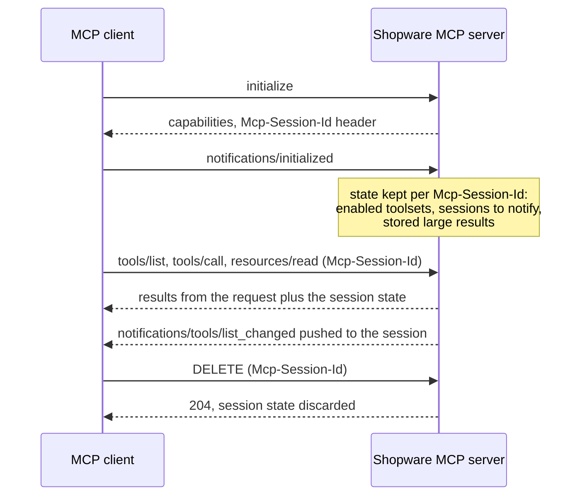
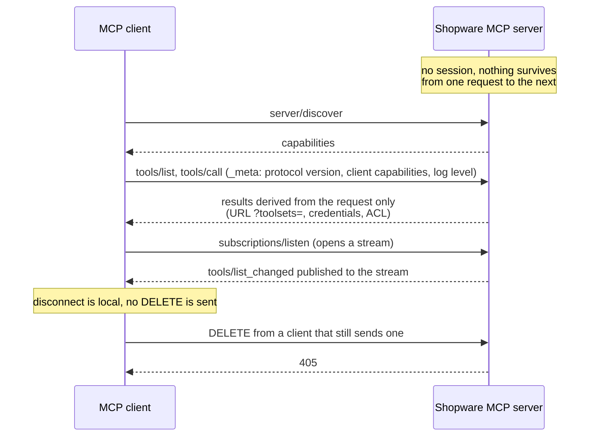

## Context

### Two protocol eras

The MCP specification changed fundamentally with its 2026-07-28 revision. Clients and SDKs call the revisions before and after that change "protocol eras". This ADR names the two eras by how they behave:

**Handshake era** (revisions up to 2025-11-25). This is what Shopware serves today.

1. The client opens a connection by sending `initialize`.
2. The server answers and returns a session id in the `Mcp-Session-Id` response header.
3. The client confirms with a `notifications/initialized` message.
4. Every following request carries the session id, so the server can keep state per connection. Examples are which toolsets the client has enabled and which clients to notify about changes.
5. When the client is done, it sends an HTTP `DELETE` and the server throws the session state away.

```mermaid
sequenceDiagram
    participant C as MCP client
    participant S as Shopware MCP server
    C->>S: initialize
    S-->>C: capabilities, Mcp-Session-Id header
    C->>S: notifications/initialized
    Note over S: state kept per Mcp-Session-Id:<br/>enabled toolsets, sessions to notify,<br/>stored large results
    C->>S: tools/list, tools/call, resources/read (Mcp-Session-Id)
    S-->>C: results from the request plus the session state
    S-->>C: notifications/tools/list_changed pushed to the session
    C->>S: DELETE (Mcp-Session-Id)
    S-->>C: 204, session state discarded
```

**Stateless era** (revision 2026-07-28 and later).

- There is no `initialize` and no session id. A client that wants to know what the server supports calls `server/discover`.
- Instead, every request carries everything the server needs to know about the client in its `_meta` field: the protocol version, the client capabilities and, for example, the log level the client wants for this request.
- The client never sends `DELETE`. Disconnecting is purely local on the client side. A server that still receives a `DELETE` answers `405`.
- Every request can be handled by a fresh server instance. Nothing a request writes into per-connection memory is visible to the next request.
- Notifications that the server wants to push (for example "the tool list changed") no longer go to a session. The client opens a stream with `subscriptions/listen` and the server publishes to it.

```mermaid
sequenceDiagram
    participant C as MCP client
    participant S as Shopware MCP server
    Note over S: no session, nothing survives<br/>from one request to the next
    C->>S: server/discover
    S-->>C: capabilities
    C->>S: tools/list, tools/call (_meta: protocol version, client capabilities, log level)
    S-->>C: results derived from the request only<br/>(URL ?toolsets=, credentials, ACL)
    C->>S: subscriptions/listen (opens a stream)
    S-->>C: tools/list_changed published to the stream
    Note over C: disconnect is local, no DELETE is sent
    C->>S: DELETE from a client that still sends one
    S-->>C: 405
```

The `mcp/sdk` 0.8 used by Shopware serves both eras from the same URL. The client decides which one it speaks, and the server answers in the same era. Shopware currently switches the stateless era off for both endpoints (`/api/_mcp` and `/store-api/_mcp`) with `Builder::withoutModernEra()` in `McpServerBuilderCompilerPass` (the SDK and the MCP Inspector call the stateless era "modern"). As soon as that switch is removed, every client on the stateless era gets the stateless behaviour described above.

### What in Shopware depends on the session

Three features, plus cleanup and validation code, rely on the handshake-era session id:

| Feature | How it works today | What happens on the stateless era |
|---|---|---|
| Enabling a toolset during a conversation | `shopware-toolset-enable` stores the enabled toolsets in `mcp_toolset_session`, keyed by session id. The following `tools/list` reads them back. | The request has no session id, so the tool returns an error that names the missing session (since 6.7.14.0). The error doesn't point to `?toolsets=` and isn't sent as `isError`. |
| "Tool list changed" notifications | An app change increments a version per list in the database. After each request, `McpListChangedNotifier` compares it with the versions stored in the session and queues `list_changed` into the session's outgoing queue ([#21295](https://github.com/shopware/shopware/pull/21295), which replaced a registry of session ids). | There is no session to store the seen versions in or to queue into, so no client is notified. |
| Large tool results | Results above 100 KB are stored in `mcp_tool_result_cache` under the session id. The response only contains a pointer (`shopware://tool-result/<id>`). The model reads the full result with `resources/read`, and `ToolResultResource` only serves it to the same session. | Without a session id, `McpToolResponse` falls back to returning the complete result inline, which can be several megabytes. Even a stored result couldn't be read, because the next request belongs to a different "session". |
| Cleanup on `DELETE` | `McpSessionCleanupSubscriber` removes the session's cached results and toolset rows. | The client never sends `DELETE`, so nothing is cleaned up. |
| Session id validation | `McpSessionIdValidator` rejects malformed `Mcp-Session-Id` headers. | Not relevant, since there is no header. |

None of these fail loudly. The client looks connected and gets answers, but it sees the wrong tools, misses updates, or receives huge inline payloads. On top of that, the Admin and Store endpoints could each solve this differently, which would give extension developers and client authors two mental models for one product.

## Decision

### One rule for both eras and both endpoints

What a request can see and do is derived from the request itself: the URL (for example `?toolsets=order,media`), the credentials, and the ACL and allowlist of the authenticated principal. It is never derived from state that the server keeps between requests.

The rule applies to the Admin endpoint and the Store endpoint in the same way. A feature that needs state across requests either finds a stateless design or is explicitly limited to the handshake era.

### Per feature

**Choosing tools.** The supported way to pick toolsets is the URL: `/api/_mcp?toolsets=order,media` or `?toolsets=all`. It already works on both eras and with every client, because the client only has to call the URL it was configured with. `shopware-toolset-enable` keeps working for handshake clients. On the stateless era it already returns an error, because the request has no session. That error changes: it tells the client to reconnect with `?toolsets=` and is sent as `isError`. Alternatively the tool is not offered on the stateless era at all.

**Change notifications.** Notifications are a convenience, not something correctness depends on, because `?toolsets=` doesn't need them. The version per list in the database stays the single source for both eras. Handshake clients keep the comparison against their session. Clients on the stateless era get the notifications through the SDK's `subscriptions/listen` stream, which compares the same versions with the ones it started with. Whether that is an SDK notification bus implemented on top of the versions or the SDK's cache-backed bus fed when a version changes is decided with [#19970](https://github.com/shopware/shopware/issues/19970). We don't build our own session store just to keep notifications alive, and there is no list of sessions to push to.

**Large tool results.** The pointer to a stored result no longer depends on the session. Instead it contains a short-lived, signed token that identifies the stored result and the principal that produced it: the integration and user on the Admin endpoint, the sales channel and the `sw-context-token` on the Store endpoint. The public `sw-access-key` alone is not a principal, because every client of the sales channel knows it. Any later request by the same principal can read the result, on both eras. We deliberately don't use the OAuth token id (`jti`) for this. The pointer ends up in model context and logs, so if it leaks it must be limited in time and verifiable on its own, not equal to an identifier of the caller's credentials. The pointer is returned as an MCP `resource_link` content block, the native way to reference a resource, not as a Shopware-specific `_meta.resourceUri` field. What a client gets depends on the negotiated protocol revision, not only on the era: `resource_link` and `structuredContent` only exist since 2025-06-18, so clients on 2024-11-05 or 2025-03-26 get the pointer in the text, as `_meta.resourceUri` is sent today. Stored results are removed by age through a scheduled task, not by `DELETE`.

Today only the Admin server can read stored results. Store tools already store large results, but the Store server has no resource to read them back. The Store endpoint therefore gets its own tool-result resource, authorized by the same signed token, as part of this change.

**Cleanup and validation.** `DELETE` cleanup and `Mcp-Session-Id` validation stay as they are for handshake clients. Nothing on the stateless era may depend on them.

**Multi-step requests.** On the stateless era a tool can ask the client for more input and continue in a follow-up request. The SDK keeps the intermediate state in a signed `request_state` value, which needs a secret shared by all workers. That secret must be configured before we offer any feature built on it (for example URL-based confirmation for destructive tools). Those features add to the existing `dryRun` default, they don't replace it.

### Rollout

Both endpoints will serve both eras from the same URL. We don't switch to stateless-only, because most clients in the field still speak the handshake era. The stateless era is switched on only once the points above are implemented and covered by tests that run the same scenarios against both eras.

## Consequences

**For MCP clients and users.** Handshake clients keep working exactly as today. `?toolsets=` becomes the recommended setup for everyone, because it works on both eras. Clients on the stateless era never get a toolset enable that silently does nothing.

**For extension developers.** Tools, prompts and resources don't need to know which era a request uses. The model is the same for the Admin and the Store endpoint. Extensions must not keep their own state keyed by `Mcp-Session-Id`, because it disappears on the stateless era. State that must survive between requests has to be keyed by the principal or passed in the request.

**For stored large results.** A result is readable by its principal, not only by its session. Two agents that use the same integration can read each other's stored results. That is wider than the session scope of [#19966](https://github.com/shopware/shopware/issues/19966), and acceptable because both have the same permissions. On the Store endpoint the principal includes the context token, so a result is no longer readable after login or logout, or by a client that sends no `sw-context-token`.

**For operators.** Stored large results are cleaned up by age, whether or not a client ends its session. Shared state for multi-step requests needs a secret that all workers share, and the notification stream may need a cache pool shared by all workers, for example Redis in multi-server setups. Each open `subscriptions/listen` stream occupies a PHP worker for its whole lifetime: in `mcp/sdk` 0.8.1 the stream polls every 250 ms and ends after 30 seconds, after which the client reconnects. Every subscribed client therefore holds an FPM worker almost continuously, which has to be accounted for in `pm.max_children`. `Builder::setSubscriptionLifetime()` controls the lifetime.

**For Shopware development.** The result cache is re-keyed from the session to the signed token, the Store endpoint gets a result resource, and `shopware-toolset-enable` is hidden or returns an error on the stateless era. Tests have to run the same scenarios against both eras and check the behaviour described here, not whatever the code happens to do. When the implementation lands, `src/Core/Framework/Mcp/AGENTS.md` and `src/Core/Framework/Mcp/docs/spec-coverage.md` are updated. A future removal of the handshake era is out of scope here.

Related issues: epic [#19965](https://github.com/shopware/shopware/issues/19965), [#20512](https://github.com/shopware/shopware/issues/20512) (this decision), [#19966](https://github.com/shopware/shopware/issues/19966) (result pointer), [#20511](https://github.com/shopware/shopware/issues/20511) (cleanup by age), [#19969](https://github.com/shopware/shopware/issues/19969) (serving the stateless era).
