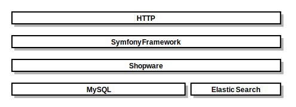

In order to be able to support all the new features and improvements described in these documents, the Shopware core will need to undergo a lot of structural changes - including refactorings, rewrites and other technical modifications. 

We are currently in the process of evaluating the new technical basis of the system and have decided on some of the most fundamental technologies already. As announced, the Zend framework will be removed and make place to a more tightly integrated, full-stack Symfony 4 based approach. The technology stack will be based on PHP 7.1. Additionally, the requirement for the MySQL database will be 5.7 and will contain a complete restructure with foreign key constraints.

Shopware 5 already uses seperate **Symfony** components to create a solid foundation. NEXT is using Symfony for the stack only. This allows mature Symfony application developers to extend Shopware with their existing knowledge in a short period of time. Second, **Twig** is a modern template engine for PHP that is really fast, secure and flexible. Twig is being used by Symfony.

## Update from 2017-10-26

After our offical #meetnext event, we've updated this document with our latest information and feedback regarding the architecture of Shopware Next.

## Update from 2017-09-27

We've restored out testing environment to make sure that ported components still work in the new environment.

And talking about environment, we've ditched the configurtion via `config.php` and created a `.env.dist` file which now provides all credentials and configurations for the kernel. One of the best advantages when using environment variables is, that you can set them in your apache2, nginx and other webserver's config. That makes deployment a lot easier.

To follow our own new concepts, we've added deptrac and other code quality tools. This prevents developers from using services in layers where they are not meant to be, like using the database connection in the controller.

<div class="toc-list" data-depth="2"></div>

## Database

As already mentioned, the minimum required version is MySQL 5.7 and we still don't support other databases like PostgreSQL, MSSQL, ...

### Conventions

We've added simple conventions to keep everything straight from the beginning.

- The `s_` prefix is gone
- Every table must be singular for problems like `s_articles_details`
- Every table and column must be lower-snake-case
- Every foreign key should be the foreign table name + reference column
- Cascades should be used where useful
- Every table should contain the datetime columns `created_at` and `updated_at`

### UUIDs

With Shopware Next we are removing auto incrementing integer identifiers for every table. This avoids sorting by `id` which are mostly unuseful but brings a lot more possibilities to the whole system.

Using simple `varchar` columns with a unique index provides possibilities which are escpecially useful for eCommerce projects:

- Easy integration with other systems like material managements
- Pre-defined identifiers sent from the client to build unique relations even before they have been persisted

By default, we are still generating UUIDs in version 4, if non has been provided.

## Architecture

Shopware NEXT aims for easy extendability while still providing high performance and high scalability.



### Overview Core

The core is the heart of Shopware NEXT and is responsible for handling everything behind the scenes. It comes with a solid REST API which talks multiple output formats like json or xml.

There are two main bundles for maintaining the environment and the api: 

- **Framework**, stack specific classes like routing, plugin system, extension interfaces, ...
- **API**, handles communication using HTTP, applies envelopes, ...

In addition, every domain like Product, Customer or Category is placed in it's own internal bundle to keep everything clean and easy to understand if there are troubles. But, since they have dependencies on each other, they cannot exist without each other. Therefore we call this package the **core** of Shopware NEXT.

### Overview Domains

A domain bundle contains the abstraction of the domain itself, data layers, api endpoints and extension points.


**Dataflow**

- **Controller**, bridges HTTP to the respositories.
- **Repository**, this is your main entrypoint when working with data in Shopware Next. It is the **Single Source of Truth** for all data operations.
- **Reader**, knows how to load a single entity with it's relations. It utilizes other reader to complete the entity class.
- **Searcher**, knows the relations between entities and adds support for the new **SwagQL** (Shopware Query Language).
- **Writer**, is able to map the HTTP request data to the database and does simple validation.

### Data representation

Doctrine ORM has been removed entirely as it does not fit in our concept for a highly performance optimized eCommerce project. That means, that we don't have objects with database mappings and relations anymore. But, we still use objects and objects as simple value objects and provide typed collections as PHP lacks of generics.

- **Struct**, a value object which contains the database fields including the relations. It is separated into two different definitions:
    - **BasicStruct**, database data + 1:1 relations + n:1 relations
    - **DetailStruct**, based on the BasicStruct + 1:n relations + n:m relations and other complex data
- **Collection**, an object containing a typed list of structs (TaxBasicStruct => TaxBasicStructCollection)

## Searching

The search utilizes our own built search syntax and is called **SwagQL** (Shopware Query Language).

In contrast to Shopware 5, we remove the concept of search conditions and made it dynamic by defining the search criteria in an more abstract way.

### Basic usage

**Search for a product named "Towel"**

```php
$criteria = new Criteria();
$criteria->addFilter(new TermQuery('product.name', 'Towel'));
```

Easy, isn't it? Let's go a little bit further:

**Search for a product named "Towel" from manufacturer "Towel Factory"**

```php
$criteria = new Criteria();
$criteria->addFilter(new TermQuery('product.name', 'Towel'));
$criteria->addFilter(new TermQuery('product.manufacturer.name', 'Towel Factory'));
```

As we can see, we can even filter related objects like the manufacturer. Another one:

**Search for products in categories "Towels" and "Bathroom" from manufacturer containing "Factory" within 50 EUR**

```php
$criteria = new Criteria();
$criteria->addFilter(new TermsQuery('product.categories.name', ['Towel', 'Bathroom']));
$criteria->addFilter(new MatchQuery('product.manufacturer.name', 'Factory'));
$criteria->addFilter(new RangeQuery('product.contextPrices.price', [RangeQuery::LT => 50]));
```

### Query types

Here is a list of the default MySQL mappings of the queries:

- TermQuery: `field = value`
- TermsQuery: `field IN (value1, value2, ...)`
- MatchQuery: `field LIKE %value%`
- RangeQuery:
    - `field > value` (or `field >= value`)
    - `field < value` (or `field <= value`)
- NestedQuery: `(WHERE1 AND WHERE2 AND ...)`
- NotQuery: `!(WHERE1 AND WHERE2 AND ...)`

## Writing


Instead of having a dedicated writer class for each domain, we have a generic writer that works with resources. A resource contains a list of typed fields that maps to the database and the order of dependend resources to insert or update the data without running into foreign key constraint errors.

### Mapping


When someone wants to write data to the database, the input gets mapped into a resource. For every resource that needs to be written, an insert or update query is created and put into a query queue (top right). If the structure of the data is invalid, like trying to write a string into a boolean field, there will be a detailed error in the error stack (bottom right).

After everything has been pre-validated, the query queue gets written to the database and the appropiate written events will be dispatched.

### Changesets

Changesets will be supported in Shopware Next. That means, that if you just want to update the stock of your products, you don't have to send the whole entity via API and risk manipulation of data that you don't want to update.

**Example: Update the stock of a variant**

```
{
    'uuid' => 'ABC-DEF-GHI-JKL-MNO',
    'title' => 'Title',
    'details' => [
        [
            'uuid' => 'ONM-LKJ-IHG-FEG-CBA',
            'stock' => 55,
        ]
    ]
}
```

This would update the title of the product and the stock of the variant with the given UUID.

You can even update related entities, e.g. the products of a manufacturer.

**Example: Update the stock of a variant of a manufacturer**

```
{
    'uuid' => 'MANU-FACT-RER-123',
    'products' => [
        [
            'uuid' => 'ABC-DEF-GHI-JKL-MNO',
            'title' => 'Title',
            'details' => [
                [
                    'uuid' => 'ONM-LKJ-IHG-FEG-CBA',
                    'stock' => 55,
                ]
            ]
        ]
    ]
}
```

## Extending

We guarantee, that the core data structure never changes by don't allowing changes to the core structs. In case you want to append data to the struct, we've tried to make it simple for developers by providing an abstract extension class for each domain.

### Implementation

**Example: Shopware\Product\Extension\ProductExtension**

```php
class MyProductExtension extends \Shopware\Product\Extension\ProductExtension
{
    public function productBasicLoaded(...): void;
    public function productDetailLoaded(...): void;
    public function productWritten(...): void;

    public function getDetailFields(): array;
    public function getBasicFields(): array;
    public function joinDependencies(...): void;

    public function hydrate(...): void;
}
```

The goal of this class is, to implement one extension class to make changes in one place. This class can extend the search, read and write operations by implementing these methods.

- `productBasicLoaded` and `productDetailLoaded` are event callback methods that are executed once a set of products are loaded
- `productWritten` is called after the data has been persisted to the database, so you can save your own data too.
- `getDetailFields`, `getBasicFields` and `joinDependencies` are search related as you can extend the search query with your own tables. Just declare the fields you want to select in the getFields method and join your table on the query with the `joinDependencies` method
- Afterwards you should implement the `hydate` method to add your data to the struct by calling `$product->addAttribute('your_plugin_name', $yourData);`

You don't have to implement every method, just the ones you need.

### Registration

As we use the dependency injection container for managing classes, it's not enough to just create your extension class. You have to declare them in the container and tag it with `shopware.extension`.

**Example: Extension for product**

```xml
<service id="swag_discount.product_extension" class="SwagProductDiscount\ProductExtension">
    <tag name="shopware.extension" bundle="product" />
</service>
```

**Example: Extension for tax**

```xml
<service id="swag_discount.tax_extension" class="SwagProductDiscount\TaxExtension">
    <tag name="shopware.extension" bundle="tax" />
</service>
```

The key is to tag your class as `shopware.extension` and provide the bundle you want to extend. Keep in mind that not every bundle, like framework or api, does support extensions.
