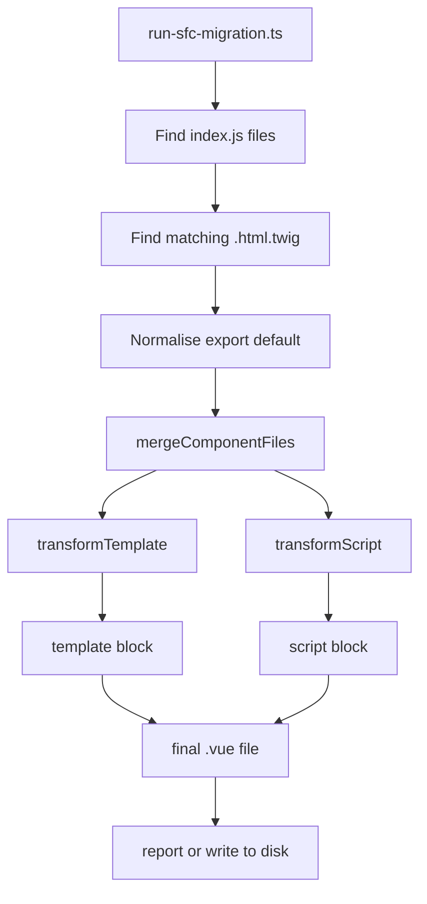
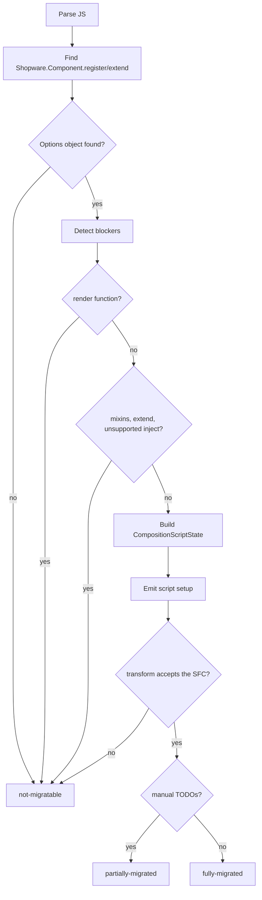

# SFC Migration Codemod: Technical README

This codemod migrates old Shopware Administration components from separate
`index.js` and `.html.twig` files to Vue Single File Components.

Input:

```text
my-component/
|-- index.js
`-- my-component.html.twig
```

Output:

```text
my-component/
|-- index.js
|-- my-component.html.twig
`-- my-component.vue
```

With `--delete-originals`, the codemod also replaces `index.js` with a small
entry point and removes the Twig file.

The important technical part is that the codemod does more than copy files into
an SFC. When possible, it converts Options API component code to native Vue 3
`<script setup>` and declares the migrated state as the public override API with
`swDefinePublic({ … })` so Shopware component overrides still work. No wrapper
function is generated: the build-time transform in `build/vue-setup-transform`
lowers the marker into the extension runtime. The authoring contract is
[Native Setup Authoring](../../../technical-docs/03-extensibility/07-native-setup-authoring.md),
which this codemod must not contradict.

## High-Level Flow



The code is split into three layers:

| Layer | Main files | Responsibility |
| --- | --- | --- |
| Runner | `run-sfc-migration.ts` | CLI parsing, scanning, file selection, writing, reporting. |
| Merger | `generate-sfc.ts` | Combines one Twig file and one JS file into one SFC string. |
| Transformers | `transform-template.ts`, `script-transformer/*` | Convert template syntax and Options API code. |

## Migration Outcomes

| Status | Meaning | Output |
| --- | --- | --- |
| `fully-migrated` | Template and script were converted automatically. | Writes a `.vue` file. |
| `partially-migrated` | A native setup `.vue` file was generated, but it carries `TODO` comments. | Writes a `.vue` file. |
| `not-migratable` | A blocker was found, or the generated SFC was rejected by the transform. | Writes nothing. |

Every `.vue` file is a native setup component, so anything that cannot become a
`<script setup>` component is `not-migratable` rather than a partial write: a
plain `<script>` SFC fails the build. Such a component produces no script at all —
its blockers are the result.

Examples:

| Case | Status |
| --- | --- |
| Normal Options API component | `fully-migrated` |
| Component with an unsupported `watch` path | `partially-migrated`, `TODO` comment emitted |
| Component with `mixins` | `not-migratable` |
| Component using `Shopware.Component.extend()` | `not-migratable` |
| Component with `render()` | `not-migratable` |
| Template with `` | `not-migratable` |

## Runner Layer

Main file: `run-sfc-migration.ts`

This file handles everything around the transformation:

1. Parses CLI flags.
2. Validates that the target path exists and is a directory.
3. Finds `**/index.js` files with `globSync`.
4. Finds the matching `.html.twig` file for each component.
5. Converts `export default { ... }` files into a temporary `Shopware.Component.register(...)` shape.
6. Calls `mergeComponentFiles(...)`.
7. Writes the `.vue` file or prints a dry-run report.
8. Optionally deletes/replaces original files.

### Twig File Selection

For every `index.js`, the runner looks in the same directory:

1. Prefer `<component-directory-name>.html.twig`.
2. If there is exactly one `.html.twig`, use that.
3. If there are multiple non-matching Twig files, skip the component as ambiguous.
4. If there is no Twig file, skip the component.

### `export default` Normalisation

Some Administration components look like this:

```js
export default {
    data() {
        return { count: 0 };
    },
};
```

`normaliseJsContent()` rewrites that in memory to:

```js
Shopware.Component.register('component-name', {
    data() {
        return { count: 0 };
    },
});
```

This uses `ts-morph`, not plain string replacement, so nested objects and
additional module-level code stay intact.

### Writing And Deleting

| Option | Behavior |
| --- | --- |
| default / `--dry-run` | Does not write files. Reports what would happen. |
| `--write` | Writes `<component-name>.vue`. |
| `--force` | Overwrites existing `.vue` files. |
| `--delete-originals` | After writing, replaces `index.js` and deletes `.html.twig`. |

`not-migratable` components are never written and never have originals deleted.

When originals are deleted, the replacement `index.js` either registers the new
SFC:

```js
import component from './sw-example.vue';

Shopware.Component.register('sw-example', component);
```

The entry point is only replaced for fully-migrated components whose registered
name matches their directory, because the generated import path is derived from
the directory name.

## SFC Merge Layer

Main file: `generate-sfc.ts`

`mergeComponentFiles(twigContent, jsContent)` is the central function for one
component.

It does this:

1. Runs `transformTemplate(twigContent)`.
2. If template transformation fails with `TemplateTransformError`, returns
   `not-migratable`.
3. Runs `transformScript(...)`.
4. If script transformation is `not-migratable`, returns an empty SFC.
5. Wraps the generated script in `<script setup>`.
6. Validates the assembled SFC by running it through the real build-time
   transform from `build/vue-setup-transform`, so success is only reported for
   output that transform accepts.
7. Returns the final SFC with `<template>` first and script second.

The returned SFC is valid but unformatted. Emitters produce correct code and never
manage layout, so there is no indentation logic in the script transformer at all —
`run-sfc-migration.ts` formats every file it writes with the workspace prettier
config. Formatting lives in the CLI because prettier and
`prettier-plugin-multiline-arrays` load parts of themselves through dynamic
`import()`, which Jest's CommonJS environment rejects; keeping it there leaves the
whole transformation layer synchronous and unit-testable.

Generated `<sw-block>` elements carry only their `name`. The data binding and the
default slot scope of `<sw-block>` are owned by the base transform, which adds
`:data="$dataScope"` itself and rejects an authored one — so neither the template
transformer nor the script transformer produces anything `$dataScope`-related.

## Template Transformer

Main file: `transform-template.ts`

The template transformer is intentionally small. It supports only the Twig
syntax used for Shopware block inheritance and comments.

| Input | Output |
| --- | --- |
| `` | `<sw-block name="sw_foo">` |
| `` | `</sw-block>` |
| `{{ parent() }}` / `` | `<sw-block-parent/>` |
| `{# comment #}` | `<!-- comment -->` |

Plain HTML and Vue template expressions stay unchanged.

Unsupported:

| Input | Result |
| --- | --- |
| `` | `not-migratable`, blocker `twig extends` |
| Twig block syntax inside a Twig comment | `not-migratable`, blocker `twig syntax inside comment` |

The transformer also removes old Twig-block eslint comments when they are next
to a line that was migrated.

## Script Transformer

Entry file: `transform-script.ts`

The script transformer uses `ts-morph` to parse the component JavaScript as an
AST. The main decision tree is:



### Registration Detection

`script-transformer/ast.ts` finds the first component registration:

```js
Shopware.Component.register(...)
Shopware.Component.extend(...)
```

It extracts:

| Extracted value | Used for |
| --- | --- |
| `componentName` | The `.vue` filename — and with it the override target, since native setup infers the component name from the filename. Also used for reports, generated entry points, and the mismatch check against the directory name. |
| `isExtend` | Detecting `.extend()` as a blocker. |
| `parentComponentName` | Reporting which parent component must be inlined manually. |
| `optionsObject` | The Options API object that gets converted. |

The same file also preserves module-level code before the registration call,
except `import template from ...`, which is removed because the template is now
inside the SFC.

### Blockers

| Feature | Handling |
| --- | --- |
| `render()` | Blocker. No SFC is generated. |
| `mixins` | Blocker. Part of the component lives in another file. |
| `Shopware.Component.extend()` | Blocker. The parent's options live in another file. |
| Unsupported `inject` shape | Blocker. `this.<injectName>` stays unresolvable. |

Every blocker is reported the same way: `transformScript()` returns
`not-migratable` with an empty script. There is no partial Options API output —
a `.vue` file without `<script setup>` is rejected by the build, so there is
nothing useful to write.

## Composition API Conversion

The full script conversion has two phases:

1. `composition-script-state.ts` extracts and classifies all Options API parts.
2. `emit-composition-api-script.ts` prints the new `<script setup>` code, including
   the setup body and its `swDefinePublic({ … })` marker.

This keeps "understand the old component" separate from "print the new code".

### Extractor Files

| File | Converts or detects |
| --- | --- |
| `extract-component-options.ts` | `props`, `emits`, `inheritAttrs`, `name`, blockers, prop names. |
| `extract-inject.ts` | `inject` array/object syntax, aliases, defaults, factory defaults. |
| `extract-provide.ts` | `provide` object and method form with static keys. |
| `extract-expose.ts` | `expose` as an array of string literals. |
| `extract-data.ts` | `data()` return values into future `ref(...)` declarations. |
| `extract-computed.ts` | Computed getters and getter/setter objects. |
| `extract-methods.ts` | Methods and property-assignment methods like debounce wrappers. |
| `extract-watch.ts` | Watchers, string handlers, object handlers, `deep`, `immediate`. |
| `extract-lifecycle.ts` | Lifecycle hooks and their Composition API equivalents. |
| `rewrite-this.ts` | Rewrites known `this.*` accesses. |

### Generated Script Shape

`emit-composition-api-script.ts` writes code in this order:

1. TODO comments for manual follow-up.
2. Preserved module-level imports/constants.
3. Vue compiler macros: `defineOptions`, `defineProps`, `defineEmits`.
4. Imports required by the converted code.
5. Composable declarations such as `const router = useRouter()`.
6. Template refs generated from `this.$refs`.
7. The migrated setup body: `inject`, `data`, `computed`, methods, watchers,
   `provide` calls, `created`, other lifecycle hooks.
8. The `swDefinePublic({ … })` marker.
9. `defineExpose({ … })`, when the component declared `expose`.

The `provide()` calls sit between the watchers and `created` on purpose: that is
where Vue's `applyOptions` evaluates the `provide` option — after the watch
options, before the `created` hook — so an `immediate` watcher has already run
when a provided value is read. The slot is also past every `const` a provided
value can reference, so nothing is read inside its temporal dead zone.

`defineOptions` is only emitted for an `inheritAttrs: false` option or a `name`
option that differs from the registered name — native setup infers the name from
the `.vue` filename, so a `name` repeating it would say nothing. `defineProps` is
emitted only when the component really declares props — an empty
`defineProps({})` would just add an unused `props` binding.

The generated setup state looks like this:

```js
defineOptions({ inheritAttrs: false });

const props = defineProps({ /* … */ });
const emit = defineEmits(['save']);

import { ref } from 'vue';

const title = ref('Example');

const onSave = () => {
    emit('save', title.value);
};

swDefinePublic({
    title,
    onSave,
});
```

Everything is top-level `<script setup>` code, so the macros stay where Vue
expects them and the state is ordinary component and template state.

## Why `swDefinePublic()` Is Emitted

Shopware plugins can override Administration components. After moving a
component to Composition API, those overrides still need a stable public state
to hook into.

Base components are auto-private: every top-level binding is normal component
and template state, but only the names listed in `swDefinePublic({ … })` form the
public override API. The codemod therefore lists exactly the converted `inject`,
`data`, `computed`, and `methods` names — the surface the earlier wrapper-based
output exposed as public state — so overrides written against the Options API
component keep working after migration. Everything else (props, emits, template
refs, composable locals) stays reachable for overrides through the `_private`
group of the previous-state payload.

The marker is mandatory, so a component with none of those options gets
`swDefinePublic({})`. It needs no import: `swDefinePublic` is an ambient global
declared in `build/vue-setup-transform/shopware-setup-macros.d.ts`. The component
name is not passed to it either — the override target comes from the `.vue`
filename (`sw-foo.vue` or `sw-foo/index.vue` → `sw-foo`).

Templates with migrated Twig blocks need no such marker: the codemod emits plain
`<sw-block name="…">` elements and the base transform adds the `:data="$dataScope"`
binding that block overrides read.

## `this.` Rewriting

Main file: `script-transformer/rewrite-this.ts`

The old Options API code uses `this`. The generated Composition API code uses
plain variables, refs, props, and composables.

Common rewrites:

| Old code | New code |
| --- | --- |
| `this.myProp` | `props.myProp` |
| `this.myData` | `myData.value` |
| `this.myComputed` | `myComputed.value` |
| `this.myMethod()` | `myMethod()` |
| `this.myInjection` | `myInjection` |
| `this.$emit(...)` | `emit(...)` |
| `this.$router` | `router` from `useRouter()` |
| `this.$route` | `route` from `useRoute()` |
| `this.$nextTick` | `nextTick` |
| `this.$slots` | `slots` from `useSlots()` |
| `this.$attrs` | `attrs` from `useAttrs()` |
| `this.$t(...)` / `this.$tc(...)` | `t(...)` from `useI18n()` |
| `this.$te(...)` | `te(...)` from `useI18n()` |
| `this.$refs.name` | `name.value` and `const name = ref(null)` |

Risky cases get TODO output instead of pretending the migration is complete:

| Old code | Generated handling |
| --- | --- |
| `this.$el` | `/* TODO: $el */ getCurrentInstance()?.proxy?.$el` |
| `this.$store` | Throwing TODO expression, so it cannot ship unnoticed. |
| `this.$parent`, `this.$root`, `$options`, `$forceUpdate` | TODO placeholders. |

`$t`, `$tc`, and `$te` all come from one `useI18n()` call: the composer exposes
`t` and `te` with the same key/locale signatures the legacy instance properties
had, so both are destructured from a single `const { t, te } = useI18n();` — each
with an alias when the component already declares that name.

The rewrite only changes AST property-access nodes. It does not rewrite text in
strings or comments.

A `this.<name>` the rewrite cannot resolve drops the member containing it and
reports why. Two reasons are distinguished, because they need different fixes:

| Reason | Meaning |
| --- | --- |
| `dropped member '<name>'` | The component declares `<name>`, but the codemod dropped it earlier. Migrate that member first. |
| `unknown this property '<name>'` | The codemod saw no declaration of `<name>` it could parse: a mixin, a plugin, a global helper, or an option entry whose shape an extractor rejected (e.g. a `...mapPropertyErrors(…)` computed spread, which never becomes a declared member name). |
| `rewrite target '<name>' is shadowed by a local binding` | The rewrite would emit a bare `<name>` (or `props`) at a place where a parameter or local of that name is in scope, so the generated code would read the local instead of the setup binding. Rename the local, then migrate again. |

`this.<name>` becomes a bare identifier, and a bare identifier resolves in the
scope it is written in — not in the setup scope the generated binding lives in.
`async runAction(action) { this.action = … }` is the shape that makes this
concrete: the rewrite would assign to the parameter. `collectLocalBindingScopes`
in `ast.ts` therefore models the snippet's own scopes — parameters, `let`/`const`
per block, `var` per function, function and class declarations, catch variables —
and the member is dropped when a binding of the rewritten name covers the access.
Scopes are modelled rather than approximated, so a same-named local in a sibling
function costs nothing. A member's own parameter list is not part of its body
text, so extractors pass it alongside the snippet and it is written into the
parse wrapper.

The bindings `resolve-identifiers.ts` names (`emit`, `router`, `route`, `slots`,
`attrs`, `t`, `te`) are exempt: they are picked around every binding the module
declares, parameters included, so nothing in the component can shadow them.

Drops cascade: `composition-script-state.ts` filters inject, data, computed, and
methods to a fixpoint, so a member referencing one that was dropped in an earlier
round is dropped in the next one. The rewrite context carries every declared
member name, including the dropped ones, which is what lets each round tell a
cascade apart from a genuinely unknown property.

## Generated Name Collisions

The generated block declares more than the component's own members: the imports
the setup needs, the compiler macro results, the composable locals, the template
refs, and the module-level code copied in front of all of them. Two of those
groups can be renamed on collision, the rest cannot.

`resolve-identifiers.ts` owns the renamable half — `emit`, `router`, `route`,
`slots`, `attrs`, `t`, `te` each pick the first free name from their candidate
list. Import names cannot be renamed the same way, so collisions with them are
resolved by dropping or by not importing:

| Collision | Handling |
| --- | --- |
| A member named like an importable name (`data: { ref }`, `methods: { onMounted }`) | The member is dropped with `<kind>: <name> collides with the generated '<module>' import of the same name`, and the drop cascades like any other. |
| The module already imports that name from `vue` (`import { computed } from 'vue'`) | The generated specifier is omitted: it is the very same binding, so importing it again would only declare it twice. |
| The module imports it from `vue` under an alias (`ref as vueRef`) | Nothing to do — the name is still free, so the generated import is emitted. |

The reserved list is static: every name the emitter can import is reserved,
whether or not this component's output ends up importing it. Whether an import is
needed depends on which members survive, and dropping a member can remove an
import's last user, so a set derived per component would chase its own tail. The
static list only ever drops more than strictly necessary, and measured over the
whole Administration it drops nothing extra — the only members it hits are the
ones that were already broken. `LIFECYCLE_COMPOSITION_NAMES` is exported from
`extract-lifecycle.ts` so the hook names cannot drift out of the list.

Three collision shapes are still not detected up front:

| Shape | Example in the Administration |
| --- | --- |
| A member named like an existing module-level import | `sw-hidden-iframes`: a computed `MAIN_HIDDEN` next to `import { MAIN_HIDDEN } from '@shopware-ag/meteor-admin-sdk/es/location'`. |
| A member and a template ref of the same name | `sw-settings-listing-default-sales-channel`: `data: { visibilityConfig }` and `this.$refs.visibilityConfig`. |
| A needed `vue` import name bound at module level from another module | Not deduped on purpose — skipping the import would bind the generated code to something else. |

None of them can write a broken file: `generate-sfc.ts` validates every generated
SFC against the real build-time transform before returning it, so these come back
as `not-migratable` with a `native setup transform: …` blocker and nothing is
written to disk. Only the reason is poor — it points at the generated duplicate
instead of at the member that needs the manual rename.

## Props And Emits: Global Alias Expansion

`defineProps`/`defineEmits` are compiler macros: Vue hoists them above the rest
of the setup block, so a definition that reads a module-level local would run
inside that local's temporal dead zone. `analyzeObjectOrArrayOption` therefore
backs the whole component off to the Options API when the definition references
one.

Most Administration components only alias a global there
(`const { Criteria } = Shopware.Data;`), and the global path is readable
wherever the alias was. `collectGlobalAliasPaths` in `ast.ts` walks the
module-level `const` declarations before the registration, in source order, and
maps each binding to the path its initializer resolves to:

| Declaration | Mapping |
| --- | --- |
| `const Criteria = Shopware.Data.Criteria;` | `Criteria → Shopware.Data.Criteria` |
| `const { Criteria } = Shopware.Data;` | `Criteria → Shopware.Data.Criteria` |
| `const { Criteria: Crit } = Shopware.Data;` | `Crit → Shopware.Data.Criteria` |
| `const utils = Shopware.Utils;` then `const { types } = utils;` | `types → Shopware.Utils.types` |

Roots are `Shopware`, `window`, and `document` — objects that exist before any
module code runs. `expandGlobalAliases` then rewrites every mapped name in a
value position of the definition, and `referencesModuleLocal` stops counting
those names as blockers. Both use the same predicate, so they cannot disagree
about a name.

What is deliberately not mapped:

| Shape | Why |
| --- | --- |
| `let` / `var` | Reassignable between declaration and read, so the path is not what the macro would see. |
| Array destructuring, a destructuring default, a rest element | Reading by index, or falling back to a default, is not a property path. |
| An initializer that is not global-rooted | There is no path to write; the backoff is correct. |
| `a?.b` in the initializer | Cannot be re-emitted as `a.b`. |
| A shorthand entry (`{ Criteria }`) | `{ Shopware.Data.Criteria }` is not valid syntax, so the entry keeps the backoff. |
| A name a binding inside the definition shadows | Not a reference to the alias — neither expanded nor blocking. |

The alias declarations stay in the copied module-level code; only the hoisted
macros are made independent of them.

## Provide Conversion

`provide` becomes `provide(key, value)` calls, but only while the provided keys
are static:

| Input | Result |
| --- | --- |
| `provide() { return { … }; }`, also as a `function` value | One `provide(key, value)` call per entry. |
| `provide: { … }` | Same. |
| `provide: () => ({ … })` | TODO comment for the whole option. |
| `async provide()` / `*provide()` | TODO comment for the whole option. |
| Computed keys, shorthand or spread entries, accessors | TODO comment for the whole option. |
| Statements before the `return` | TODO comment for the whole option. |
| A value whose `this` usage cannot be rewritten | TODO comment for the whole option. |

Arrow values are rejected because Vue applies the option with
`provideOptions.call(publicThis)`; an arrow ignores the receiver, so its `this`
is not the component instance and rewriting it would change what is provided. An
async or generator `provide()` is rejected because the Options API provides the
own keys of the returned promise or generator object, which are not the listed
keys.

The fallback is deliberately all-or-nothing: a `provide` migrated in part would
silently change what descendants inject. The TODO carries the reason, including
the key that could not be translated. Provided keys are not added to
`swDefinePublic({ … })` either — they are an injection contract, not the public
override API.

## Expose Conversion

`expose` becomes one `defineExpose({ … })` call, but only from a static list:

| Input | Result |
| --- | --- |
| `expose: ['focus', 'isOpen']` | `defineExpose({ focus, isOpen });` |
| `expose: ['focus', 'focus']` | `defineExpose({ focus });` — a duplicate key would be a lint error. |
| `expose: []` | Nothing — no call, no TODO. |
| An entry that is not a migrated member | TODO comment for the whole option, naming the entry. |
| A computed list, or an entry that is not a string literal | TODO comment for the whole option. |

The fallback is all-or-nothing for the same reason `provide` is: Vue reads
`expose` once per instance, so a list built from the entries that happen to have
survived would declare a smaller public surface than the component did.

`expose: []` is the one shape that is dropped silently. In the Options API it
closes the instance completely, and a `<script setup>` component is closed
already, so emitting anything would only add noise.

The call is emitted last, after `swDefinePublic({ … })`. Both markers declare a
public surface — the override API and the API a parent reaches through a template
ref — so they belong together, and the end of the block is the only slot that is
always past the bindings the object reads. The two lists are independent: a
member is listed in `swDefinePublic` because it was migrated, and in
`defineExpose` because the component asked for it.

One nuance of the base lowering limits what `defineExpose` can promise: the
transform renames every author binding to `__swSetupAuthor_<name>` and
re-declares the original names from the override wrapper in a generated footer.
The macro argument keeps pointing at the author alias — see
`build/vue-setup-transform/index.spec/base-macro-constraints.spec.ts` — while the
template reads the override-resolved binding. So the object a parent reaches
through its template ref carries the **base** implementation of every exposed
member, and a plugin that overrides one of them is not visible there. That is a
property of the lowering, not something the codemod can fix; the Options API
surface is therefore reproduced by name, not by override behavior.

## Watch And Lifecycle Conversion

Watchers are generated only when the source is clear:

| Watch target | Generated source |
| --- | --- |
| Prop | `() => props.name` |
| Data/computed | `() => name.value` |
| Inject | `() => unref(name)` |
| `$route` | A route snapshot getter based on `route`, `params`, and `query`. |
| Path (`'item.price.net'`) | `() => props.item?.price?.net` — the root resolves as above, every step below it is optional. |

A watch key containing a dot is a property path in the Options API, never a
member of that literal name: Vue applies it with `createPathGetter`, whose loop
condition is `i < segments.length && cur`, so the walk stops on any **falsy**
intermediate value and yields it. The optional chaining below the root stops on a
nullish one, which covers the case that actually occurs, but the two diverge for
a falsy non-nullish intermediate (`0`, `''`, `false`): Vue yields that value, the
generated getter reads a property off it. Reaching a property off a number or an
empty string is not a shape real components watch, and matching it exactly would
cost a repeated `a && a.b && a.b.c` chain in every generated getter.

A `$route` path is the one root that does not reuse the snapshot getter. The
snapshot exists because the route object keeps its identity across navigations,
so watching it directly would never trigger; a path watcher reads a value out of
the current route, which changes on its own, and `() => route?.name` is both
equivalent and readable.

Unsupported watcher shapes become TODO comments and make the result
`partially-migrated`. Examples are paths whose root is not a declared member
(`'settings.count'` without a `settings` member), paths with a segment that
cannot be written as a property access (`'items[0].label'`, spaces, reserved
words), undeclared targets, missing string-handler methods, and non-literal
`deep` or `immediate` options.

Lifecycle hooks are mapped like this:

| Options API | Composition API |
| --- | --- |
| `created()` | Runs directly in the `<script setup>` body. |
| `mounted()` | `onMounted(...)` |
| `beforeMount()` | `onBeforeMount(...)` |
| `beforeUnmount()` / `beforeDestroy()` | `onBeforeUnmount(...)` |
| `unmounted()` / `destroyed()` | `onUnmounted(...)` |
| `updated()` | `onUpdated(...)` |
| `beforeUpdate()` | `onBeforeUpdate(...)` |
| `activated()` | `onActivated(...)` |
| `deactivated()` | `onDeactivated(...)` |

`beforeCreate()` is not converted automatically. It gets a TODO because its
timing does not map cleanly to generated setup code.

## File Map

| File | Purpose |
| --- | --- |
| `README.md` | User-facing usage guide. |
| `TECHNICAL_README.md` | Technical explanation of the implementation. |
| `run-sfc-migration.ts` | CLI, scanning, writing, reporting. |
| `generate-sfc.ts` | Merges template and script transformation results, then validates the SFC against the real build-time transform. |
| `transform-template.ts` | Converts supported Twig syntax. |
| `transform-script.ts` | Script transformation decision tree. |
| `types.ts` | Shared status types. |
| `string-literals.ts` | Safe JS string quoting helper. |
| `script-transformer/ast.ts` | AST helpers and component registration detection. |
| `script-transformer/composition-script-state.ts` | Collects all data needed to print setup code. |
| `script-transformer/emit-composition-api-script.ts` | Emits the generated `<script setup>`: macros, imports, composables, template refs, the migrated setup body, and the `swDefinePublic({ … })` marker. |
| `script-transformer/rewrite-this.ts` | Rewrites known `this.*` references. |
| `script-transformer/resolve-identifiers.ts` | Picks the names of the generated bindings (`emit`, `slots`, `t`, …) so they never collide with the component's own. |
| `script-transformer/extract-*.ts` | Focused extractors for Options API sections. |
| `__fixtures__/` | Input examples used by tests. |
| `__snapshots__/` | Expected generated output snapshots. |
| `*.spec.ts` | Tests for runner behavior, template conversion, script conversion, and final SFC output. |

## How To Extend The Codemod

Use this rule of thumb:

1. Parse or classify new Options API shapes in an `extract-*.ts` file.
2. Add the extracted data to `CompositionScriptState`.
3. Emit the new Composition API code in `emit-composition-api-script.ts`.
4. Add fixtures and tests for the new shape.

Keep the responsibilities separate: the runner handles files, the merger handles
one component pair, extractors understand old code, and the emitter prints new
code.
