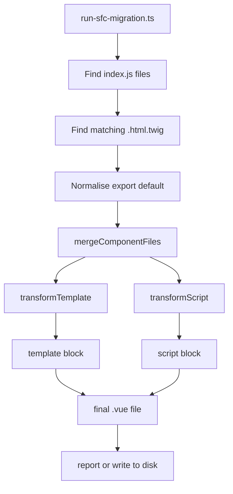
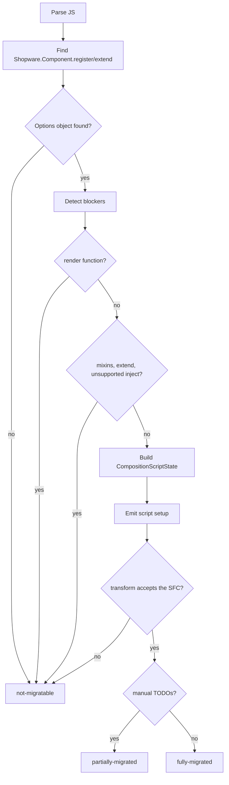

# SFC Migration Codemod: Technical README

This codemod migrates old Shopware Administration components from separate
`index.js` and `.html.twig` files to Vue Single File Components.

Input:

```text
my-component/
|-- index.js
`-- my-component.html.twig
```

Output:

```text
my-component/
|-- index.js
|-- my-component.html.twig
`-- my-component.vue
```

With `--delete-originals`, the codemod also replaces `index.js` with a small
entry point and removes the Twig file.

The important technical part is that the codemod does more than copy files into
an SFC. When possible, it converts Options API component code to native Vue 3
`<script setup>` and declares the migrated state as the public override API with
`swDefinePublic({ … })` so Shopware component overrides still work. No wrapper
function is generated: the build-time transform in `build/vue-setup-transform`
lowers the marker into the extension runtime. The authoring contract is
[Native Setup Authoring](../../../technical-docs/03-extensibility/07-native-setup-authoring.md),
which this codemod must not contradict.

## High-Level Flow



The code is split into three layers:

| Layer | Main files | Responsibility |
| --- | --- | --- |
| Runner | `run-sfc-migration.ts` | CLI parsing, scanning, file selection, writing, reporting. |
| Merger | `generate-sfc.ts` | Combines one Twig file and one JS file into one SFC string. |
| Transformers | `transform-template.ts`, `script-transformer/*` | Convert template syntax and Options API code. |

## Migration Outcomes

| Status | Meaning | Output |
| --- | --- | --- |
| `fully-migrated` | Template and script were converted automatically. | Writes a `.vue` file. |
| `partially-migrated` | A native setup `.vue` file was generated, but it carries `TODO` comments. | Writes a `.vue` file. |
| `not-migratable` | A blocker was found, or the generated SFC was rejected by the transform. | Writes nothing. |

Every `.vue` file is a native setup component, so anything that cannot become a
`<script setup>` component is `not-migratable` rather than a partial write: a
plain `<script>` SFC fails the build. Such a component produces no script at all —
its blockers are the result.

Examples:

| Case | Status |
| --- | --- |
| Normal Options API component | `fully-migrated` |
| Component with an unsupported `watch` path | `partially-migrated`, `TODO` comment emitted |
| Component with `mixins` | `not-migratable` |
| Component using `Shopware.Component.extend()` | `not-migratable` |
| Component with `render()` | `not-migratable` |
| Template with `` | `not-migratable` |

## Runner Layer

Main file: `run-sfc-migration.ts`

This file handles everything around the transformation:

1. Parses CLI flags.
2. Validates that the target path exists and is a directory.
3. Finds `**/index.js` files with `globSync`.
4. Finds the matching `.html.twig` file for each component.
5. Converts `export default { ... }` files into a temporary `Shopware.Component.register(...)` shape.
6. Calls `mergeComponentFiles(...)`.
7. Writes the `.vue` file or prints a dry-run report.
8. Optionally deletes/replaces original files.

### Twig File Selection

For every `index.js`, the runner looks in the same directory:

1. Prefer `<component-directory-name>.html.twig`.
2. If there is exactly one `.html.twig`, use that.
3. If there are multiple non-matching Twig files, skip the component as ambiguous.
4. If there is no Twig file, skip the component.

### `export default` Normalisation

Some Administration components look like this:

```js
export default {
    data() {
        return { count: 0 };
    },
};
```

`normaliseJsContent()` rewrites that in memory to:

```js
Shopware.Component.register('component-name', {
    data() {
        return { count: 0 };
    },
});
```

This uses `ts-morph`, not plain string replacement, so nested objects and
additional module-level code stay intact.

### Writing And Deleting

| Option | Behavior |
| --- | --- |
| default / `--dry-run` | Does not write files. Reports what would happen. |
| `--write` | Writes `<component-name>.vue`. |
| `--force` | Overwrites existing `.vue` files. |
| `--delete-originals` | After writing, replaces `index.js` and deletes `.html.twig`. |

`not-migratable` components are never written and never have originals deleted.

When originals are deleted, the replacement `index.js` either registers the new
SFC:

```js
import component from './sw-example.vue';

Shopware.Component.register('sw-example', component);
```

The entry point is only replaced for fully-migrated components whose registered
name matches their directory, because the generated import path is derived from
the directory name.

## SFC Merge Layer

Main file: `generate-sfc.ts`

`mergeComponentFiles(twigContent, jsContent)` is the central function for one
component.

It does this:

1. Runs `transformTemplate(twigContent)`.
2. If template transformation fails with `TemplateTransformError`, returns
   `not-migratable`.
3. Runs `transformScript(...)`.
4. If script transformation is `not-migratable`, returns an empty SFC.
5. Wraps the generated script in `<script setup>`.
6. Validates the assembled SFC by running it through the real build-time
   transform from `build/vue-setup-transform`, so success is only reported for
   output that transform accepts.
7. Returns the final SFC with `<template>` first and script second.

The returned SFC is valid but unformatted. Emitters produce correct code and never
manage layout, so there is no indentation logic in the script transformer at all —
`run-sfc-migration.ts` formats every file it writes with the workspace prettier
config. Formatting lives in the CLI because prettier and
`prettier-plugin-multiline-arrays` load parts of themselves through dynamic
`import()`, which Jest's CommonJS environment rejects; keeping it there leaves the
whole transformation layer synchronous and unit-testable.

Generated `<sw-block>` elements carry only their `name`. The data binding and the
default slot scope of `<sw-block>` are owned by the base transform, which adds
`:data="$dataScope"` itself and rejects an authored one — so neither the template
transformer nor the script transformer produces anything `$dataScope`-related.

## Template Transformer

Main file: `transform-template.ts`

The template transformer is intentionally small. It supports only the Twig
syntax used for Shopware block inheritance and comments.

| Input | Output |
| --- | --- |
| `` | `<sw-block name="sw_foo">` |
| `` | `</sw-block>` |
| `{{ parent() }}` / `` | `<sw-block-parent/>` |
| `{# comment #}` | `<!-- comment -->` |

Plain HTML and Vue template expressions stay unchanged.

Unsupported:

| Input | Result |
| --- | --- |
| `` | `not-migratable`, blocker `twig extends` |
| Twig block syntax inside a Twig comment | `not-migratable`, blocker `twig syntax inside comment` |

The transformer also removes old Twig-block eslint comments when they are next
to a line that was migrated.

## Script Transformer

Entry file: `transform-script.ts`

The script transformer uses `ts-morph` to parse the component JavaScript as an
AST. The main decision tree is:



### Registration Detection

`script-transformer/ast.ts` finds the first component registration:

```js
Shopware.Component.register(...)
Shopware.Component.extend(...)
```

It extracts:

| Extracted value | Used for |
| --- | --- |
| `componentName` | The `.vue` filename — and with it the override target, since native setup infers the component name from the filename. Also used for reports, generated entry points, and the mismatch check against the directory name. |
| `isExtend` | Detecting `.extend()` as a blocker. |
| `parentComponentName` | Reporting which parent component must be inlined manually. |
| `optionsObject` | The Options API object that gets converted. |

The same file also preserves module-level code before the registration call,
except `import template from ...`, which is removed because the template is now
inside the SFC.

### Blockers

| Feature | Handling |
| --- | --- |
| `render()` | Blocker. No SFC is generated. |
| `mixins` | Blocker. Part of the component lives in another file. |
| `Shopware.Component.extend()` | Blocker. The parent's options live in another file. |
| Unsupported `inject` shape | Blocker. `this.<injectName>` stays unresolvable. |

Every blocker is reported the same way: `transformScript()` returns
`not-migratable` with an empty script. There is no partial Options API output —
a `.vue` file without `<script setup>` is rejected by the build, so there is
nothing useful to write.

## Composition API Conversion

The full script conversion has two phases:

1. `composition-script-state.ts` extracts and classifies all Options API parts.
2. `emit-composition-api-script.ts` prints the new `<script setup>` code, including
   the setup body and its `swDefinePublic({ … })` marker.

This keeps "understand the old component" separate from "print the new code".

### Extractor Files

| File | Converts or detects |
| --- | --- |
| `extract-component-options.ts` | `props`, `emits`, `inheritAttrs`, `name`, blockers, prop names. |
| `extract-inject.ts` | `inject` array/object syntax, aliases, defaults, factory defaults. |
| `extract-data.ts` | `data()` return values into future `ref(...)` declarations. |
| `extract-computed.ts` | Computed getters and getter/setter objects. |
| `extract-methods.ts` | Methods and property-assignment methods like debounce wrappers. |
| `extract-watch.ts` | Watchers, string handlers, object handlers, `deep`, `immediate`. |
| `extract-lifecycle.ts` | Lifecycle hooks and their Composition API equivalents. |
| `rewrite-this.ts` | Rewrites known `this.*` accesses. |

### Generated Script Shape

`emit-composition-api-script.ts` writes code in this order:

1. TODO comments for manual follow-up.
2. Preserved module-level imports/constants.
3. Vue compiler macros: `defineOptions`, `defineProps`, `defineEmits`.
4. Imports required by the converted code.
5. Composable declarations such as `const router = useRouter()`.
6. Template refs generated from `this.$refs`.
7. The migrated setup body: `inject`, `data`, `computed`, methods, watchers,
   `created`, other lifecycle hooks.
8. The `swDefinePublic({ … })` marker.

`defineOptions` is only emitted for an `inheritAttrs: false` option or a `name`
option that differs from the registered name — native setup infers the name from
the `.vue` filename, so a `name` repeating it would say nothing. `defineProps` is
emitted only when the component really declares props — an empty
`defineProps({})` would just add an unused `props` binding.

The generated setup state looks like this:

```js
defineOptions({ inheritAttrs: false });

const props = defineProps({ /* … */ });
const emit = defineEmits(['save']);

import { ref } from 'vue';

const title = ref('Example');

const onSave = () => {
    emit('save', title.value);
};

swDefinePublic({
    title,
    onSave,
});
```

Everything is top-level `<script setup>` code, so the macros stay where Vue
expects them and the state is ordinary component and template state.

## Why `swDefinePublic()` Is Emitted

Shopware plugins can override Administration components. After moving a
component to Composition API, those overrides still need a stable public state
to hook into.

Base components are auto-private: every top-level binding is normal component
and template state, but only the names listed in `swDefinePublic({ … })` form the
public override API. The codemod therefore lists exactly the converted `inject`,
`data`, `computed`, and `methods` names — the surface the earlier wrapper-based
output exposed as public state — so overrides written against the Options API
component keep working after migration. Everything else (props, emits, template
refs, composable locals) stays reachable for overrides through the `_private`
group of the previous-state payload.

The marker is mandatory, so a component with none of those options gets
`swDefinePublic({})`. It needs no import: `swDefinePublic` is an ambient global
declared in `build/vue-setup-transform/shopware-setup-macros.d.ts`. The component
name is not passed to it either — the override target comes from the `.vue`
filename (`sw-foo.vue` or `sw-foo/index.vue` → `sw-foo`).

Templates with migrated Twig blocks need no such marker: the codemod emits plain
`<sw-block name="…">` elements and the base transform adds the `:data="$dataScope"`
binding that block overrides read.

## `this.` Rewriting

Main file: `script-transformer/rewrite-this.ts`

The old Options API code uses `this`. The generated Composition API code uses
plain variables, refs, props, and composables.

Common rewrites:

| Old code | New code |
| --- | --- |
| `this.myProp` | `props.myProp` |
| `this.myData` | `myData.value` |
| `this.myComputed` | `myComputed.value` |
| `this.myMethod()` | `myMethod()` |
| `this.myInjection` | `myInjection` |
| `this.$emit(...)` | `emit(...)` |
| `this.$router` | `router` from `useRouter()` |
| `this.$route` | `route` from `useRoute()` |
| `this.$nextTick` | `nextTick` |
| `this.$slots` | `slots` from `useSlots()` |
| `this.$attrs` | `attrs` from `useAttrs()` |
| `this.$t(...)` / `this.$tc(...)` | `t(...)` from `useI18n()` |
| `this.$refs.name` | `name.value` and `const name = ref(null)` |

Risky cases get TODO output instead of pretending the migration is complete:

| Old code | Generated handling |
| --- | --- |
| `this.$el` | `/* TODO: $el */ getCurrentInstance()?.proxy?.$el` |
| `this.$store` | Throwing TODO expression, so it cannot ship unnoticed. |
| `this.$parent`, `this.$root`, `$options`, `$forceUpdate` | TODO placeholders. |

The rewrite only changes AST property-access nodes. It does not rewrite text in
strings or comments.

## Watch And Lifecycle Conversion

Watchers are generated only when the source is clear:

| Watch target | Generated source |
| --- | --- |
| Prop | `() => props.name` |
| Data/computed | `() => name.value` |
| Inject | `() => unref(name)` |
| `$route` | A route snapshot getter based on `route`, `params`, and `query`. |

Unsupported watcher shapes become TODO comments and make the result
`partially-migrated`. Examples are nested paths like `'settings.count'`,
undeclared targets, missing string-handler methods, and non-literal `deep` or
`immediate` options.

Lifecycle hooks are mapped like this:

| Options API | Composition API |
| --- | --- |
| `created()` | Runs directly in the `<script setup>` body. |
| `mounted()` | `onMounted(...)` |
| `beforeMount()` | `onBeforeMount(...)` |
| `beforeUnmount()` / `beforeDestroy()` | `onBeforeUnmount(...)` |
| `unmounted()` / `destroyed()` | `onUnmounted(...)` |
| `updated()` | `onUpdated(...)` |
| `beforeUpdate()` | `onBeforeUpdate(...)` |
| `activated()` | `onActivated(...)` |
| `deactivated()` | `onDeactivated(...)` |

`beforeCreate()` is not converted automatically. It gets a TODO because its
timing does not map cleanly to generated setup code.

## File Map

| File | Purpose |
| --- | --- |
| `README.md` | User-facing usage guide. |
| `TECHNICAL_README.md` | Technical explanation of the implementation. |
| `run-sfc-migration.ts` | CLI, scanning, writing, reporting. |
| `generate-sfc.ts` | Merges template and script transformation results, then validates the SFC against the real build-time transform. |
| `transform-template.ts` | Converts supported Twig syntax. |
| `transform-script.ts` | Script transformation decision tree. |
| `types.ts` | Shared status types. |
| `string-literals.ts` | Safe JS string quoting helper. |
| `script-transformer/ast.ts` | AST helpers and component registration detection. |
| `script-transformer/composition-script-state.ts` | Collects all data needed to print setup code. |
| `script-transformer/emit-composition-api-script.ts` | Emits the generated `<script setup>`: macros, imports, composables, template refs, the migrated setup body, and the `swDefinePublic({ … })` marker. |
| `script-transformer/rewrite-this.ts` | Rewrites known `this.*` references. |
| `script-transformer/resolve-identifiers.ts` | Picks the names of the generated bindings (`emit`, `slots`, `t`, …) so they never collide with the component's own. |
| `script-transformer/extract-*.ts` | Focused extractors for Options API sections. |
| `__fixtures__/` | Input examples used by tests. |
| `__snapshots__/` | Expected generated output snapshots. |
| `*.spec.ts` | Tests for runner behavior, template conversion, script conversion, and final SFC output. |

## How To Extend The Codemod

Use this rule of thumb:

1. Parse or classify new Options API shapes in an `extract-*.ts` file.
2. Add the extracted data to `CompositionScriptState`.
3. Emit the new Composition API code in `emit-composition-api-script.ts`.
4. Add fixtures and tests for the new shape.

Keep the responsibilities separate: the runner handles files, the merger handles
one component pair, extractors understand old code, and the emitter prints new
code.
