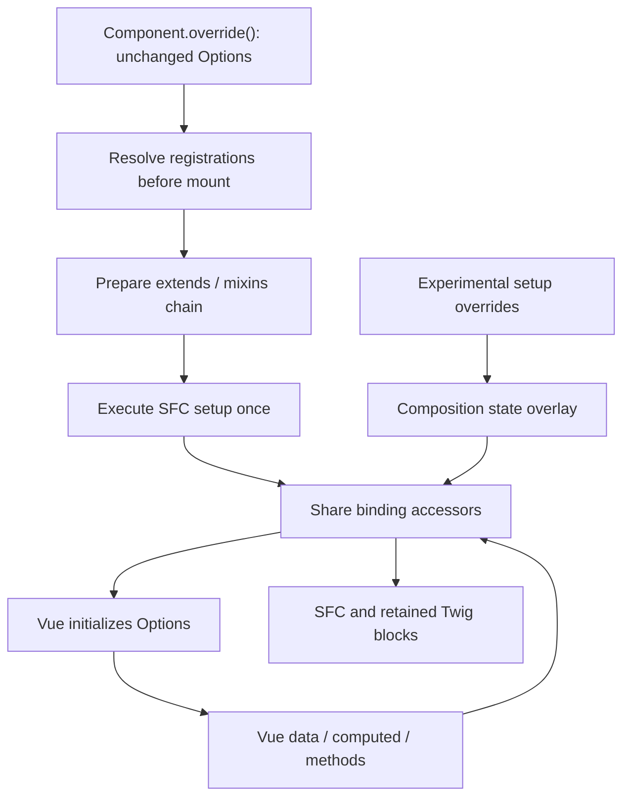

# Composition API Extension System

> **Status:** Experimental — `@experimental stableVersion:v6.8.0 feature:ADMIN_COMPOSITION_API_EXTENSION_SYSTEM`
> **Package:** `@sw-package framework`

The Composition API Extension System is the next-generation mechanism for extending Vue components in the Shopware 6 Administration. It replaces the legacy Component Factory override system with a type-safe, reactive, non-invasive approach based on Vue 3 Composition API.

**Source files:**
- `src/app/adapter/composition-extension-system/index.ts` — `createExtendableSetup`, `overrideComponentSetup`, `_overridesMap`
- `src/app/adapter/options-composition-shim/component-definition.ts` — backward-compatibility layer for Options API overrides

---

## Architecture Overview



### Key data structures

| Symbol | Type | Description |
|---|---|---|
| `_overridesMap` | `reactive({ [name]: Array<OverrideFn> })` | Central reactive registry mapping each component name to its ordered list of override functions |
| `ComponentPublicApiMapping` | Global TypeScript interface | Maps component names to their typed public API shapes; extended by component authors |

---

## `createExtendableSetup`

**Location:** `composition-extension-system/index.ts`

Wraps a component's setup function to make it extendable at runtime. Components must call this instead of returning their setup result directly.

### Signature

```typescript
function createExtendableSetup<
    PROPS,
    CONTEXT,
    COMPONENT_NAME extends keyof ComponentPublicApiMapping,
    SETUP_RESULT extends ComponentPublicApiMapping[COMPONENT_NAME],
    PRIVATE_SETUP_RESULT extends object,
>(
    options: {
        name: COMPONENT_NAME;
        props: PROPS;
        context?: CONTEXT;
    },
    originalSetup: (props: PROPS, context: CONTEXT) => {
        public?: SETUP_RESULT;
        private?: PRIVATE_SETUP_RESULT;
    },
): ToRefs<Reactive<SETUP_RESULT & PRIVATE_SETUP_RESULT>>
```

### Parameters

| Parameter | Description |
|---|---|
| `options.name` | Component name key — must match a key in `ComponentPublicApiMapping` |
| `options.props` | The props object passed into the Vue `setup()` function |
| `options.context` | Optional; automatically resolved from `getCurrentInstance()` if omitted |
| `originalSetup` | The component's own setup logic; must return `{ public?, private? }` |

### Return value

`ToRefs` of the merged public + private state. This is returned directly from the Vue `setup()` function, exposing all keys as refs for use in the template.

### `public` / `private` API split

The `originalSetup` callback splits its return value into two buckets:

- **`public`** — keys in this object form the component's extension API. Override functions receive them via `previousState`. The shape must match `ComponentPublicApiMapping[name]` exactly.
- **`private`** — internal state that is not part of the public extension API. Accessible in overrides under `previousState._private`.

```typescript
return createExtendableSetup(
    { name: 'sw-my-component', props },
    (props) => {
        const title = ref('Hello');
        const internalId = ref<string | null>(null);

        return {
            public: { title },      // accessible as previousState.title
            private: { internalId }, // accessible as previousState._private.internalId
        };
    },
);
```

### Error conditions

| Condition | Logged as |
|---|---|
| `originalSetup` returns neither `public` nor `private` | `console.error` — returns `{}` |
| `originalSetup` returns a key other than `public` or `private` | `console.error` |
| `originalSetup` includes a prop key in its return value | `console.error` — that key is deleted from the result |

### Registering the TypeScript type

Every component that uses `createExtendableSetup` should extend `ComponentPublicApiMapping` globally so overrides are fully typed:

```typescript
declare global {
    interface ComponentPublicApiMapping {
        'sw-my-component': {
            title: Ref<string>;
            save: () => Promise<void>;
        };
    }
}
```

Components not registered in this interface fall back to `{ [key: string]: any }`.

### Override application lifecycle

1. The factory resolves legacy registrations before it prepares the Vue definition. Direct SFC imports use the same preparation through an async component.
2. The base setup runs. Its compiler-generated footer attaches the override state.
3. Each instance applies resolved legacy registrations in order, followed by native setup overrides. Conversion is cached per registration; state and effects belong to each instance.
4. Synchronous overrides run before the first render. Pending configurations resolve in registration order, regardless of network completion order.
5. New registrations notify mounted instances. Future lifecycle hooks and watchers use the retained owner and effect scope.
6. The data scope exposes added bindings lazily, so creating it does not evaluate every computed getter.

Register extensions during application bootstrap. Props, emits, local assets, and custom rendering must be known before Vue initializes the component. Late state and template updates cannot repeat initialization that has already happened.

---

## `overrideComponentSetup`

**Location:** `composition-extension-system/index.ts`

Plugin authors use this function to register a Composition API override for a specific component. It is exposed on `Shopware.Component`.

### Signature

```typescript
function overrideComponentSetup(): (
    componentName: keyof ComponentPublicApiMapping,
    override: OverrideFn,
) => void
```

### Usage

```javascript
Shopware.Component.overrideComponentSetup()('sw-my-component', (previousState, props, context) => {
    // ... return overrides
});
```

### Override function arguments

| Argument | Type | Description |
|---|---|---|
| `previousState` | `ComponentPublicApiMapping[name] & { _private }` | Shallow copy of the component's current state after all previous overrides have been applied. Public keys are at the top level; private keys are under `_private`. Refs are **not** unwrapped — access `.value` directly. |
| `props` | Component props (readonly) | The current prop values. Cannot be returned in the override result. |
| `context` | `SetupContext` | Vue setup context: `attrs`, `slots`, `emit`, `expose`. |

### Override return types

The override function returns a plain object. Each key in the result is merged back into the component state according to the following rules:

| Return value type | Merge behavior |
|---|---|
| Plain `ref` (non-computed, non-readonly) | 2-way sync (`syncRef`) with the existing state ref. Both the override ref and the original ref stay in sync. |
| Readonly `computed` ref | Replaces the existing property in `reactiveWrappedState` directly. |
| Writable `computed` ref (has `.effect`) | Wrapped in a new `computed({ get, set })` and assigned to `reactiveWrappedState`. |
| `reactive` object | Merged via `Object.assign` into the existing reactive value. The new object must contain **all keys** of the original (recursive check). |
| `function` | Replaces the existing function directly. |

Returning a key that matches a component **prop** name logs `console.error` and is ignored.

### Multiple overrides

Multiple overrides are applied in registration order. Each receives a shallow copy of the state as modified by all previous overrides, so later overrides always see the latest state.

---

## Options API Shim

Existing `Shopware.Component.override()` registrations remain Options definitions when their base becomes an SFC.
Vue initializes those definitions. The adapter does not convert data, watchers, injections, or lifecycle hooks into composables.

### Responsibilities

| Module | Responsibility |
| --- | --- |
| `options-composition-shim/component-definition.ts` | Resolves the definition before mount and retains its Options inheritance chain. |
| `options-composition-shim/native-options-state.ts` | Connects SFC bindings to Vue's data and context without reading setup accessors recursively. |
| `options-composition-shim/native-options-chain.ts` | Resolves named mixins and adapts Shopware's `$super` calls. |
| `options-composition-shim/legacy-assets.ts` | Shares local component and directive registrations with Twig. |
| `composition-extension-system/setup-dispatch.ts` | Keeps internal SFC calls and captured callbacks connected to effective bindings. |

### Initialization and inheritance

The factory and direct-import wrapper resolve registrations before Vue normalizes props and emits.
The SFC setup runs once. Vue then applies the unchanged `extends` and `mixins` chain.
Named mixins resolve through `Shopware.Mixin.getByName()`.

Vue controls injection, methods, data, computed values, watchers, providers, and lifecycle hooks.
Immediate legacy watchers see the initialized Options state. They run before `created`.
Vue also owns custom option merge strategies, hook deduplication, error handling, and effect disposal.
`Component.extend()` retains the base setup and override lineage without changing the base definition.

### State and instance access

Shared binding accessors read Vue's data and context directly. They avoid `setupState`, which contains those same accessors.
Vue development builds add context accessors after setup; the bridge replaces those before Options initialization.

Legacy methods use the real Vue instance through a receiver that supplies their preceding `$super` layer.
Other reads and writes forward to that instance. The receiver remains valid across `await`.
Computed parents support `$super('field')`, `$super('field.get')`, and `$super('field.set', value)`.

`$data`, `$options`, `$watch`, `$emit`, `$attrs`, `$slots`, `$refs`, injections, and lifecycle cleanup use Vue's native implementation.
The migration emits `legacyOptionsMembers` to retain base data, computed, and method categories.
Legacy `data()` replacements follow Vue's normal rules, including replacement objects with different keys.

### Definition options and plugins

Props, emits, local assets, `inheritAttrs`, custom options, and custom render functions remain Options declarations.
A custom legacy render can replace the base's inline render without executing setup twice.
Route guards are also exposed on the definition because Vue Router reads them before an instance exists.
The title plugin reads merged `$options.metaInfo`; shortcuts continue to read `$options.shortcuts`.

### Migration eligibility

Compatibility migrations only use composable mappings audited for the complete legacy member surface and override behavior.
All mapped members are retained, including members unused by the base component.
The runtime consumes the generated member metadata; it does not run the original mixin again or duplicate composable effects.

Mappings with missing members, closed-over overridable calls, or scaffold-only behavior leave the base on Options API.
The first verified mapping is `placeholder`. Other mappings require their own audit before opting in.
Base `created()` and watcher declarations are also deferred: moving them into setup would change their order relative to legacy overrides.

A renamed binding can retain its original instance name with `legacyOptionsBindings`:

```vue
<script setup>
defineOptions({ legacyOptionsBindings: { oldValue: 'internalValue' } });
function internalValue() { return 'base'; }
function value() { return internalValue(); }
swDefinePublic({ value });
</script>
```

### Boundaries

Register definition overrides during application bootstrap, before the component is initialized.
This bridge does not replay newly registered Options declarations on an existing instance.

A migration must retain public blocks, props, events, members, routes, and behavior.
Incomplete mappings remain unmigrated; a major-release migration must handle intentional contract changes separately.
SFC setup runs before Options. Eager setup side effects cannot observe Options that Vue has not initialized yet.
Captured callbacks and later binding reads use the bridge.

Register retained Twig blocks through `Shopware.Component.override()`.
See the [Twig adapter](./06-twig-native-block-adapter.md) for template behavior.
The experimental native setup override API remains separate from the legacy Options contract.

---

## TypeScript Integration

### Declaring a component's public API

```typescript
// In the component file or a dedicated types file:
declare global {
    interface ComponentPublicApiMapping {
        'sw-my-component': {
            title: Ref<string>;
            count: ComputedRef<number>;
            save: () => Promise<void>;
        };
    }
}
```

This gives overrides full type inference for `previousState`:

```typescript
Shopware.Component.overrideComponentSetup()('sw-my-component', (previousState) => {
    // previousState.title is Ref<string>
    // previousState.count is ComputedRef<number>
    // previousState.save is () => Promise<void>
    // previousState._private is the private state object
});
```

---

## ADR References

- **[Native Extension System with Vue](../../../../../adr/2023-02-27-native-extension-system-with-vue.md)** (2023-02-27) — introduces `overrideComponentSetup` and `createExtendableSetup` as the next-generation extension mechanism
- **[Native Block System](../../../../../adr/2024-09-26-native-block-system.md)** (2024-09-26) — related block-level extensibility, part of the same experimental system
- **[Disable Vue Compat Mode](../../../../../adr/2024-03-11-disable-vue-compat-mode-per-component-level.md)** (2024-03-11) — component-level Vue 3 migration context that motivates the shim

---

## See Also

- [Extensibility Overview](./01-overview.md)
- [Plugins](./02-plugins.md) — includes migration guide and usage examples
