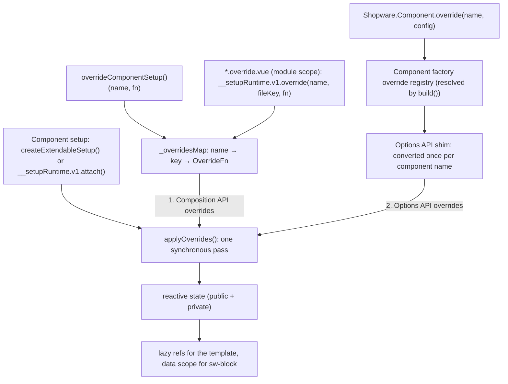

# Composition API Extension System

> **Status:** Experimental — feature flag `ADMIN_COMPOSITION_API_EXTENSION_SYSTEM`, stable in v6.8.0
> **Package:** `@sw-package framework`
> **Visibility:** `createExtendableSetup()`, `overrideComponentSetup()` and `__setupRuntime` are `@private`. This page documents the runtime that native setup SFCs compile to. Authors write `.vue` / `.override.vue` files instead, see [07-native-setup-authoring.md](./07-native-setup-authoring.md).

The Composition API Extension System is the next-generation mechanism for extending Vue components in the Shopware 6 Administration. It replaces the legacy Component Factory override system with a type-safe, reactive, non-invasive approach based on Vue 3 Composition API.

Most components use it through native setup SFCs, whose generated code calls the runtime described here; see [07-native-setup-authoring.md](./07-native-setup-authoring.md) for the authoring side. Hand-written Composition API components use `createExtendableSetup` and `overrideComponentSetup` directly.

**Source files:**
- `src/app/adapter/composition-extension-system/index.ts` — `createExtendableSetup`, `overrideComponentSetup`, the override application pass, and the `__setupRuntime.v1` interface for generated code
- `src/app/adapter/composition-extension-system/data-scope-helper.ts` — the per-instance data scope read by `<sw-block>` and the lazy refs returned to Vue
- `src/app/adapter/options-composition-shim.ts` — backward-compatibility layer for Options API overrides

---

## Architecture Overview



Overrides are static after boot. Every override registered for a component is applied **once, synchronously, while that component instance is set up**, before anything reads its state. There is no watcher and no asynchronous step: an override registered after an instance was set up applies to instances set up afterwards, never to existing ones.

### Key data structures

| Symbol | Type | Description |
|---|---|---|
| `_overridesMap` | `Map<name, Map<PropertyKey, OverrideFn>>` | Composition API overrides per component name, in registration order. The key identifies the registration: a fresh `Symbol` per `overrideComponentSetup()` call, the file key for a native override SFC. Re-registering a key replaces the entry in place (HMR). |
| `ComponentPublicApiMapping` | Global TypeScript interface | Maps component names to their typed public API shapes; extended by component authors |

---

## `createExtendableSetup`

Wraps a component's setup function to make it extendable. Components call this from `setup()` and return its result.

### Signature

```typescript
function createExtendableSetup<
    TProps extends Record<string, unknown>,
    TContext,
    TComponentName extends keyof ComponentPublicApiMapping,
    TSetupResult extends ComponentPublicApiMapping[TComponentName],
    TPrivateSetupResult extends object,
>(
    options: {
        name: TComponentName;
        props: TProps;
        context?: TContext;
    },
    originalSetup: (props: TProps, context: TContext) => {
        public?: TSetupResult;
        private?: TPrivateSetupResult;
    },
): ExtendableSetupState<TSetupResult & TPrivateSetupResult>
```

### Parameters

| Parameter | Description |
|---|---|
| `options.name` | Component name key — must match a key in `ComponentPublicApiMapping` |
| `options.props` | The props object passed into the Vue `setup()` function |
| `options.context` | Optional. Defaults to the setup context Vue created for the instance. Vue creates one only when `setup()` declares a second parameter, so pass `context` explicitly from a one-parameter `setup(props)`, otherwise `originalSetup` and the overrides receive `undefined`. |
| `originalSetup` | The component's own setup logic; must return `{ public?, private? }` |

### Return value

One ref per key of the merged public + private state, returned directly from Vue's `setup()`. The refs read the state lazily, so no computed is evaluated during `setup()`.

### `public` / `private` API split

The `originalSetup` callback splits its return value into two buckets:

- **`public`** — keys in this object form the component's extension API. Override functions receive them at the top level of `previousState`. The shape must match `ComponentPublicApiMapping[name]` exactly.
- **`private`** — internal state that is not part of the public extension API. Accessible in overrides under `previousState._private`.

```typescript
return createExtendableSetup(
    { name: 'sw-my-component', props, context },
    (props) => {
        const title = ref('Hello');
        const internalId = ref<string | null>(null);

        return {
            public: { title },      // accessible as previousState.title
            private: { internalId }, // accessible as previousState._private.internalId
        };
    },
);
```

### Error conditions

| Condition | Result |
|---|---|
| `originalSetup` returns neither `public` nor `private` | Throws an `Error` |
| `originalSetup` returns a key other than `public` or `private` | `console.error`; the key is ignored |
| A setup binding shares its name with a prop | Throws an `Error` in development, naming the bindings |
| An override throws | Reported through Vue's error handler (`app.config.errorHandler`); the remaining overrides still apply. Outside a component instance the error is rethrown. |

### Registering the TypeScript type

Every component that uses `createExtendableSetup` should extend `ComponentPublicApiMapping` globally so overrides are fully typed:

```typescript
declare global {
    interface ComponentPublicApiMapping {
        'sw-my-component': {
            title: Ref<string>;
            save: () => Promise<void>;
        };
    }
}
```

Components not registered in this interface fall back to `{ [key: string]: any }`.

---

## `overrideComponentSetup`

Plugin authors use this function to register a Composition API override for a specific component. It is exposed on `Shopware.Component`. Register overrides before the application mounts, as plugins do from their entry file.

### Signature

```typescript
function overrideComponentSetup<TOriginalComponent>(): <TComponentName extends keyof ComponentPublicApiMapping>(
    componentName: TComponentName,
    override: (
        previousState: ComponentPublicApiMapping[TComponentName],
        props: ExtractedProps<TOriginalComponent>,
        context: SetupContext,
    ) => Record<string, unknown>,
) => void
```

The curried form lets you pass the original component as a type argument while the name is inferred: `overrideComponentSetup<typeof SwFoo>()('sw-foo', …)`.

### Usage

```javascript
Shopware.Component.overrideComponentSetup()('sw-my-component', (previousState, props, context) => {
    // ... return overrides
});
```

### Override function arguments

| Argument | Type | Description |
|---|---|---|
| `previousState` | `ComponentPublicApiMapping[name] & { _private }` | The component's state after all earlier overrides. Public keys are at the top level; private keys are under `_private`. Refs are **not** unwrapped — access `.value` directly. |
| `props` | Component props (readonly) | The current prop values. Cannot be returned in the override result. |
| `context` | `SetupContext` | Vue setup context: `attrs`, `slots`, `emit`, `expose`. |

The override runs inside the component's `setup()`, so composables, `inject()`, watchers and lifecycle hooks work as in any setup function.

### Override return values

The override returns a plain object. Each key is merged into the component state:

| Existing binding | Returned value | Result |
|---|---|---|
| Writable ref (`ref`, `shallowRef`, writable `computed`) | Plain `ref` / `shallowRef` | Two-way synced with the existing ref, which stays in the state. The returned ref's value is written into the existing one immediately. |
| Writable ref | Any non-ref value, including primitives | Assigned to the existing ref's `.value` |
| Anything else, or a writable ref replaced by a `computed`, readonly or custom ref | Any value | Replaces the binding |
| `reactive` object | `reactive` object | Replaces the binding (no merge). In development, a warning names the first nested key the replacement lacks. |

- A key that matches a component **prop** logs `console.error` and is ignored.
- A key the component does not provide is added, with a development warning. Converted Options API overrides may add keys without a warning.
- The reserved `__swOverride` key carries the override-local bindings of a native override SFC; it is merged into the component's override-local state instead.

### Order

1. Composition API overrides (`overrideComponentSetup()` and native `.override.vue` files), in registration order.
2. Options API overrides (`Shopware.Component.override()`), converted by the shim, in the component factory's override index order.

Each override receives the state as modified by all earlier ones.

---

## Generated-code runtime: `__setupRuntime.v1`

Compiled native setup SFCs read one frozen, versioned object: `globalThis.Shopware.Component.__setupRuntime.v1`. A built extension bundle therefore keeps working when the runtime changes: `v1` members keep their signatures, and an incompatible change goes into a new version. The object is `@private`; it is not meant to be called by hand.

| Member | Used by | Purpose |
|---|---|---|
| `attach({ name, public, private, late? })` | base SFC footer | Applies the overrides (same pass as `createExtendableSetup`), registers the instance's data scope, binds `late`, and returns one lazy ref per binding |
| `expose()` | base SFC footer | One read-only ref per current prop, spread into the generated `defineExpose()` |
| `late(fallbacks)` | base SFC header | One getter per binding: the component's own binding until `attach()` binds it, the override-aware binding afterwards (see [late binding](./07-native-setup-authoring.md#late-binding)) |
| `override(name, fileKey, fn)` | override SFC, module scope | Registers an override callback; re-registering a `fileKey` replaces it in place |
| `registerComponent(component)` / `getComponents()` | extension entry / `sw-admin` | The override components `sw-admin` mounts once, hidden, so their `<sw-block extends>` content registers |

The earlier names `Shopware.Component.attachOverrides`, `getExposedProps`, `registerOverrideComponent` and `getOverrideComponents` remain as aliases for bundles built before `__setupRuntime.v1`. The entry code the extension build generates still registers override components through `registerOverrideComponent`.

---

## Options API Shim

**Location:** `options-composition-shim.ts`

The shim lets existing plugins that use `Shopware.Component.override()` keep working when the target component uses the extension system (`createExtendableSetup` or a native setup SFC). Plugin authors never call it directly.

### Activation

The runtime asks the shim for a component's Options API overrides during every setup of that component. `shouldActivateShim(overrideConfig)` returns `true` when the override config contains any of:

- `data`
- `methods`
- `computed`
- `watch`
- `mixins` (non-empty array)
- `inject`
- `extends`
- Any lifecycle hook key (`beforeCreate`, `created`, `beforeMount`, `mounted`, `beforeUpdate`, `updated`, `beforeUnmount`, `unmounted`, `activated`, `deactivated`, `errorCaptured`)

The overrides are **converted once per component name**, from the configs the component factory has already resolved, and cached. They are reconverted only when the factory's override list for that component changes. A deprecation warning is logged per conversion, directing developers to migrate to `overrideComponentSetup`.

An override whose config has not been resolved yet — normally `Shopware.Component.build()` resolves all of them before the component is set up — is skipped with a development warning, and picked up by the next setup once it has resolved.

For a native setup component, `build()` does not also merge the Options API overrides through `extends`: the component renders itself and applies them through the shim.

### Conversion pipeline

`convertOptionsApiOverrideToCompositionApi(componentName, optionsConfig)` merges mixins once and returns a Composition API override function. That function runs inside the component's `setup()`, with a real component instance, for every instance:

1. **Merge mixins** — flattens the mixin tree depth-first (deepest ancestor first, matching Vue's own strategy), then merges `data`, `methods`, `computed`, `watch`, `inject`, and lifecycle hooks. Component-level keys win over mixin keys on conflict.
2. **Convert `data`** — calls `data()` and wraps each key in a `ref`.
3. **Resolve `inject`** — calls Vue's `inject()` for each key.
4. **Create `this` proxy** — see below.
5. **Convert `computed`** — wraps each definition in `computed()`.
6. **Convert `methods`** — binds each function to the `this` proxy.
7. **Set up watchers** — registers each watch entry via `watch()`.
8. **Set up lifecycle hooks** — registers each hook via its Composition API equivalent.
9. Returns the data refs, computed refs and methods as the override result.

### `this` proxy

The `this` proxy makes Options API code work inside the Composition API setup. Property reads resolve in this order:

1. **`$super`** — calls the method, or reads the ref's value, from `previousState`
2. **`$`-prefixed properties** (`$emit`, `$t`, `$tc`, `$route`, `$router`, `$refs`, `$nextTick`, …) — read from the instance being set up
3. **Local state** — `data` refs, `computed` refs, and `methods` from the override itself (refs auto-unwrapped)
4. **Injected values** — resolved via `inject`
5. **Props** — current prop values
6. **`previousState`** — the component's Composition API state (refs auto-unwrapped)
7. If not found, a `console.warn` is logged.

Property **writes** resolve in this order:

1. Local state — sets `.value` if it is a ref, otherwise assigns directly
2. `previousState` — sets `.value` if it is a ref; logs `console.error` otherwise
3. Props — always logs `console.error` (props are read-only)
4. Unknown key — logs `console.error`

### `inject` support

All three Vue Options API inject forms are supported:

```javascript
// Array form
inject: ['myService']

// Object with provider key alias
inject: { localName: 'provideKey' }

// Object with default value
inject: { localName: { from: 'provideKey', default: null } }
```

When merging mixins, existing (component-level) inject entries win over mixin inject entries on key conflict.

### Lifecycle hook mapping

| Options API hook | Composition API equivalent | Notes |
|---|---|---|
| `beforeCreate` | — (called immediately) | Runs synchronously during `setup()` |
| `created` | — (called immediately) | Runs synchronously during `setup()` |
| `beforeMount` | `onBeforeMount` | |
| `mounted` | `onMounted` | |
| `beforeUpdate` | `onBeforeUpdate` | |
| `updated` | `onUpdated` | |
| `beforeUnmount` | `onBeforeUnmount` | |
| `unmounted` | `onUnmounted` | |
| `activated` | `onActivated` | |
| `deactivated` | `onDeactivated` | |
| `errorCaptured` | `onErrorCaptured` | |

**Mixin hooks** are registered before component-level hooks, matching Vue's native merge strategy.

### Supported features summary

| Feature | Supported | Notes |
|---|---|---|
| `data` | Yes | Keys become refs |
| `methods` | Yes | Bound to `this` proxy |
| `computed` (getter) | Yes | |
| `computed` (getter + setter) | Yes | |
| `watch` (function handler) | Yes | |
| `watch` (object with options) | Yes | `immediate`, `deep`, `flush` respected |
| `watch` (string method name) | Yes | Method resolved from `this` proxy |
| `watch` (dot-notation path) | No | Warning logged, watcher skipped |
| `inject` (array) | Yes | |
| `inject` (object) | Yes | |
| `mixins` | Yes | Depth-first merge |
| All lifecycle hooks | Yes | See mapping table above |
| `$super` (methods) | Yes | |
| `$super` (computed) | Yes | Returns `.value` of the ref |
| Instance properties (`$emit`, `$t`, …) | Yes | Read from the instance being set up |

### Unsupported options

| Option | Level | Behavior |
|---|---|---|
| `components` | `console.warn` | Ignored |
| `directives` | `console.warn` | Ignored |
| `provide` | `console.warn` | Ignored |
| `template` | `console.warn` | Ignored |
| `extends` | `console.warn` | Ignored |
| `inheritAttrs` | `console.warn` | Ignored |
| `emits` | `console.warn` | Ignored |
| `render` (custom render function) | `console.error` | Component will not work correctly |

---

## Known Limitations

1. **Overrides are not applied to existing instances** — an override registered after a component instance was set up only affects instances set up later.
2. **Dot-notation watch paths** — `watch: { 'a.b.c': handler }` is not supported by the shim. The watcher is skipped with a console warning. Migrate to a computed + simple watch.
3. **Custom `render()` functions** — not supported. The shim logs an error.
4. **`provide`** — not forwarded from overrides. Components that need `provide` must be fully migrated.
5. **`components` / `directives`** — local component or directive registrations in an override are ignored.
6. **`emits` declaration** — ignored; Vue's runtime emits validation will not see override-declared emits.
7. **Reactive object replacement** — a returned reactive object replaces the existing one; keys it lacks are gone. Development builds warn about the first missing nested key.

---

## TypeScript Integration

### Declaring a component's public API

```typescript
// In the component file or a dedicated types file:
declare global {
    interface ComponentPublicApiMapping {
        'sw-my-component': {
            title: Ref<string>;
            count: ComputedRef<number>;
            save: () => Promise<void>;
        };
    }
}
```

This gives overrides full type inference for `previousState`, both in `overrideComponentSetup()` and in native override SFCs through `useSwPreviousState<'sw-my-component'>()`:

```typescript
Shopware.Component.overrideComponentSetup()('sw-my-component', (previousState) => {
    // previousState.title is Ref<string>
    // previousState.count is ComputedRef<number>
    // previousState.save is () => Promise<void>
});
```

---

## ADR References

- **[Native Extension System with Vue](../../../../../adr/2023-02-27-native-extension-system-with-vue.md)** (2023-02-27) — introduces `overrideComponentSetup` and `createExtendableSetup` as the next-generation extension mechanism
- **[Native Block System](../../../../../adr/2024-09-26-native-block-system.md)** (2024-09-26) — related block-level extensibility, part of the same experimental system
- **[Disable Vue Compat Mode](../../../../../adr/2024-03-11-disable-vue-compat-mode-per-component-level.md)** (2024-03-11) — component-level Vue 3 migration context that motivates the shim

---

## See Also

- [Extensibility Overview](./01-overview.md)
- [Plugins](./02-plugins.md) — includes migration guide and usage examples
- [Native Setup Authoring](./07-native-setup-authoring.md) — `.vue` / `.override.vue` authoring rules and the generated code
