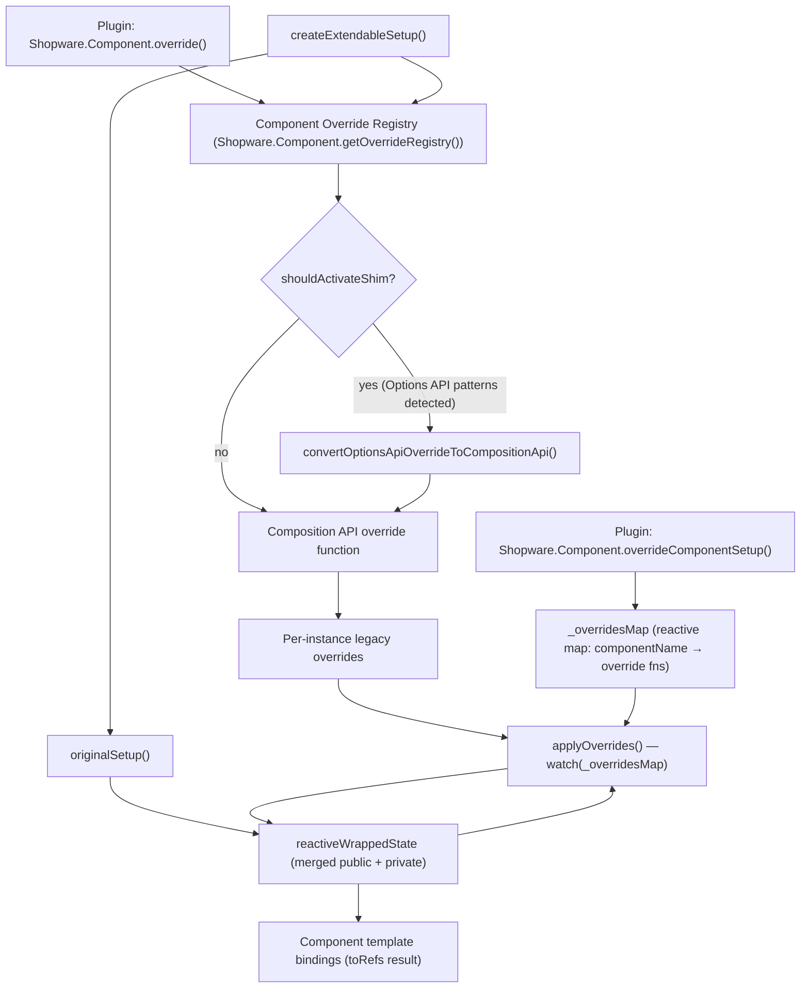

# Composition API Extension System

> **Status:** Experimental — `@experimental stableVersion:v6.8.0 feature:ADMIN_COMPOSITION_API_EXTENSION_SYSTEM`
> **Package:** `@sw-package framework`

The Composition API Extension System is the next-generation mechanism for extending Vue components in the Shopware 6 Administration. It replaces the legacy Component Factory override system with a type-safe, reactive, non-invasive approach based on Vue 3 Composition API.

**Source files:**
- `src/app/adapter/composition-extension-system/index.ts` — `createExtendableSetup`, `overrideComponentSetup`, `_overridesMap`
- `src/app/adapter/options-composition-shim.ts` — backward-compatibility layer for Options API overrides

---

## Architecture Overview



### Key data structures

| Symbol | Type | Description |
|---|---|---|
| `_overridesMap` | `reactive({ [name]: Array<OverrideFn> })` | Central reactive registry mapping each component name to its ordered list of override functions |
| `ComponentPublicApiMapping` | Global TypeScript interface | Maps component names to their typed public API shapes; extended by component authors |

---

## `createExtendableSetup`

**Location:** `composition-extension-system/index.ts`

Wraps a component's setup function to make it extendable at runtime. Components must call this instead of returning their setup result directly.

### Signature

```typescript
function createExtendableSetup<
    PROPS,
    CONTEXT,
    COMPONENT_NAME extends keyof ComponentPublicApiMapping,
    SETUP_RESULT extends ComponentPublicApiMapping[COMPONENT_NAME],
    PRIVATE_SETUP_RESULT extends object,
>(
    options: {
        name: COMPONENT_NAME;
        props: PROPS;
        context?: CONTEXT;
    },
    originalSetup: (props: PROPS, context: CONTEXT) => {
        public?: SETUP_RESULT;
        private?: PRIVATE_SETUP_RESULT;
    },
): ToRefs<Reactive<SETUP_RESULT & PRIVATE_SETUP_RESULT>>
```

### Parameters

| Parameter | Description |
|---|---|
| `options.name` | Component name key — must match a key in `ComponentPublicApiMapping` |
| `options.props` | The props object passed into the Vue `setup()` function |
| `options.context` | Optional; automatically resolved from `getCurrentInstance()` if omitted |
| `originalSetup` | The component's own setup logic; must return `{ public?, private? }` |

### Return value

`ToRefs` of the merged public + private state. This is returned directly from the Vue `setup()` function, exposing all keys as refs for use in the template.

### `public` / `private` API split

The `originalSetup` callback splits its return value into two buckets:

- **`public`** — keys in this object form the component's extension API. Override functions receive them via `previousState`. The shape must match `ComponentPublicApiMapping[name]` exactly.
- **`private`** — internal state that is not part of the public extension API. Accessible in overrides under `previousState._private`.

```typescript
return createExtendableSetup(
    { name: 'sw-my-component', props },
    (props) => {
        const title = ref('Hello');
        const internalId = ref<string | null>(null);

        return {
            public: { title },      // accessible as previousState.title
            private: { internalId }, // accessible as previousState._private.internalId
        };
    },
);
```

### Error conditions

| Condition | Logged as |
|---|---|
| `originalSetup` returns neither `public` nor `private` | `console.error` — returns `{}` |
| `originalSetup` returns a key other than `public` or `private` | `console.error` |
| `originalSetup` includes a prop key in its return value | `console.error` — that key is deleted from the result |

### Registering the TypeScript type

Every component that uses `createExtendableSetup` should extend `ComponentPublicApiMapping` globally so overrides are fully typed:

```typescript
declare global {
    interface ComponentPublicApiMapping {
        'sw-my-component': {
            title: Ref<string>;
            save: () => Promise<void>;
        };
    }
}
```

Components not registered in this interface fall back to `{ [key: string]: any }`.

### Override application lifecycle

1. The factory resolves legacy registrations before it prepares the Vue definition. Direct SFC imports use the same preparation through an async component.
2. The base setup runs. Its compiler-generated footer attaches the override state.
3. Each instance applies resolved legacy registrations in order, followed by native setup overrides. Conversion is cached per registration; state and effects belong to each instance.
4. Synchronous overrides run before the first render. Pending configurations resolve in registration order, regardless of network completion order.
5. New registrations notify mounted instances. Future lifecycle hooks and watchers use the retained owner and effect scope.
6. The data scope exposes added bindings lazily, so creating it does not evaluate every computed getter.

Register extensions during application bootstrap. Props, emits, local assets, and custom rendering must be known before Vue initializes the component. Late state and template updates cannot repeat initialization that has already happened.

---

## `overrideComponentSetup`

**Location:** `composition-extension-system/index.ts`

Plugin authors use this function to register a Composition API override for a specific component. It is exposed on `Shopware.Component`.

### Signature

```typescript
function overrideComponentSetup(): (
    componentName: keyof ComponentPublicApiMapping,
    override: OverrideFn,
) => void
```

### Usage

```javascript
Shopware.Component.overrideComponentSetup()('sw-my-component', (previousState, props, context) => {
    // ... return overrides
});
```

### Override function arguments

| Argument | Type | Description |
|---|---|---|
| `previousState` | `ComponentPublicApiMapping[name] & { _private }` | Shallow copy of the component's current state after all previous overrides have been applied. Public keys are at the top level; private keys are under `_private`. Refs are **not** unwrapped — access `.value` directly. |
| `props` | Component props (readonly) | The current prop values. Cannot be returned in the override result. |
| `context` | `SetupContext` | Vue setup context: `attrs`, `slots`, `emit`, `expose`. |

### Override return types

The override function returns a plain object. Each key in the result is merged back into the component state according to the following rules:

| Return value type | Merge behavior |
|---|---|
| Plain `ref` (non-computed, non-readonly) | 2-way sync (`syncRef`) with the existing state ref. Both the override ref and the original ref stay in sync. |
| Readonly `computed` ref | Replaces the existing property in `reactiveWrappedState` directly. |
| Writable `computed` ref (has `.effect`) | Wrapped in a new `computed({ get, set })` and assigned to `reactiveWrappedState`. |
| `reactive` object | Merged via `Object.assign` into the existing reactive value. The new object must contain **all keys** of the original (recursive check). |
| `function` | Replaces the existing function directly. |

Returning a key that matches a component **prop** name logs `console.error` and is ignored.

### Multiple overrides

Multiple overrides are applied in registration order. Each receives a shallow copy of the state as modified by all previous overrides, so later overrides always see the latest state.

---

## Options API Shim

The shim supports existing `Shopware.Component.override()` registrations on migrated SFC components. Extension authors do not call the adapter directly.

### Responsibilities

| Module | Responsibility |
| --- | --- |
| `options-composition-shim.ts` | Runs the Options initialization steps. |
| `options-composition-shim/merge-options.ts` | Merges ancestor and mixin definitions in Vue order. |
| `options-composition-shim/instance.ts` | Implements legacy `this`, `$super`, `$watch`, and instance storage. |
| `options-composition-shim/state.ts` | Converts methods, data factories, and computed definitions. |
| `options-composition-shim/effects.ts` | Registers watchers, lifecycle hooks, injections, and providers. |
| `options-composition-shim/component-definition.ts` | Prepares props, emits, assets, inheritance, and custom rendering before mount. |
| `composition-extension-system/legacy-overrides.ts` | Resolves and converts each registration once. |
| `composition-extension-system/setup-dispatch.ts` | Keeps internal SFC calls and captured callbacks connected to effective overrides. |

### Initialization and inheritance

The shim runs `beforeCreate`, injections, methods, `data()`, computed definitions, watchers, providers, and remaining lifecycle registration in that order. Immediate watchers run before `created`.

`data()` receives the instance as both `this` and its `vm` argument. It can call methods or read injections and props. Data from later mixins replaces earlier values. Methods and computed definitions use the last declaration. Watchers and lifecycle hooks combine in ancestor-first order; identical handlers are deduplicated.

Nested object ancestors and registered ancestor names are supported. `Component.extend()` retains the base SFC setup and its override lineage. Derived registrations do not affect the base component.

### State and instance access

After initialization, ordinary `this` access reads the effective state, including later overrides. `$super` reads the preceding layer. Computed parents support `$super('field')`, `$super('field.get')`, and `$super('field.set', value)`.

Refs unwrap on read. Writes reach their existing refs or computed setters. Props remain readonly. Fields assigned by lifecycle hooks, such as timer handles, remain available to later methods and cleanup hooks.

`$emit`, `$attrs`, `$slots`, `$refs`, routing, translation helpers, and other Vue instance APIs use the owning component. `$watch` supports shim state and disposes with that component. `$data` contains shim data fields; `$options` includes merged legacy definitions.

### Watchers and effects

Watchers accept functions, method-name strings, object handlers, and arrays. Object handlers can also name methods. Dotted paths tolerate missing intermediate objects and remain reactive when those objects are replaced. Vue watcher options and cleanup arguments pass through unchanged.

Injection supports arrays, aliases, symbol provider keys, ref values, and default factories. Default factories receive the legacy instance. A this-bound `provide()` runs after state initialization and provides to descendants without changing the parent's provider object.

Lifecycle hooks retain arguments and return values, including `errorCaptured` returning `false`. Rejected asynchronous initialization hooks reach Vue's error handler. Late registrations retain their owner; watchers and future hooks still clean up on unmount.

### Definition options and local assets

Factory-built components and direct SFC imports merge `props`, `emits`, `components`, `directives`, and `inheritAttrs` before Vue normalizes the definition. A custom legacy `render()` runs with shim state after the base setup.

The compiler bridges template-used lexical SFC components and directives into the host's local registrations. Both base rendering and runtime-compiled Twig use the same effective asset.

### Retaining renamed members

A migrated component can retain an old Options name explicitly:

```vue
<script setup>
defineOptions({ legacyOptionsBindings: { oldValue: 'internalValue' } });
function internalValue() { return 'base'; }
function value() { return internalValue(); }
swDefinePublic({ value });
</script>
```

An old override can call `this.oldValue()` or `$super('oldValue')`. Native consumers still see the declared public surface. The migration codemod emits this map for renamed mixin members. Review other renames against the old component contract.

### Boundaries

The shim cannot recreate a removed block, prop, event, method, route, or behavior. Component migrations must retain those contracts or document their changes.

Base setup initialization runs before override attachment. A value copied eagerly during setup keeps that initial value. Captured callbacks and later method/computed reads dispatch through effective overrides.

Register Twig templates through `Shopware.Component.override()`. Passing a raw template directly to the Options converter logs a diagnostic. See the [Twig adapter](./06-twig-native-block-adapter.md) for template behavior.

Native reactive-object replacements must retain the existing object's keys. The validator handles cyclic structures and accepts newly added reactive objects.

---

## TypeScript Integration

### Declaring a component's public API

```typescript
// In the component file or a dedicated types file:
declare global {
    interface ComponentPublicApiMapping {
        'sw-my-component': {
            title: Ref<string>;
            count: ComputedRef<number>;
            save: () => Promise<void>;
        };
    }
}
```

This gives overrides full type inference for `previousState`:

```typescript
Shopware.Component.overrideComponentSetup()('sw-my-component', (previousState) => {
    // previousState.title is Ref<string>
    // previousState.count is ComputedRef<number>
    // previousState.save is () => Promise<void>
    // previousState._private is the private state object
});
```

---

## ADR References

- **[Native Extension System with Vue](../../../../../adr/2023-02-27-native-extension-system-with-vue.md)** (2023-02-27) — introduces `overrideComponentSetup` and `createExtendableSetup` as the next-generation extension mechanism
- **[Native Block System](../../../../../adr/2024-09-26-native-block-system.md)** (2024-09-26) — related block-level extensibility, part of the same experimental system
- **[Disable Vue Compat Mode](../../../../../adr/2024-03-11-disable-vue-compat-mode-per-component-level.md)** (2024-03-11) — component-level Vue 3 migration context that motivates the shim

---

## See Also

- [Extensibility Overview](./01-overview.md)
- [Plugins](./02-plugins.md) — includes migration guide and usage examples
