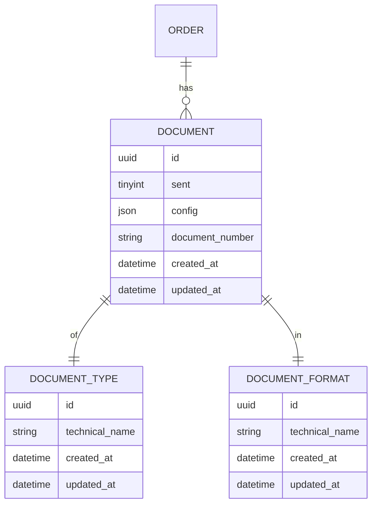
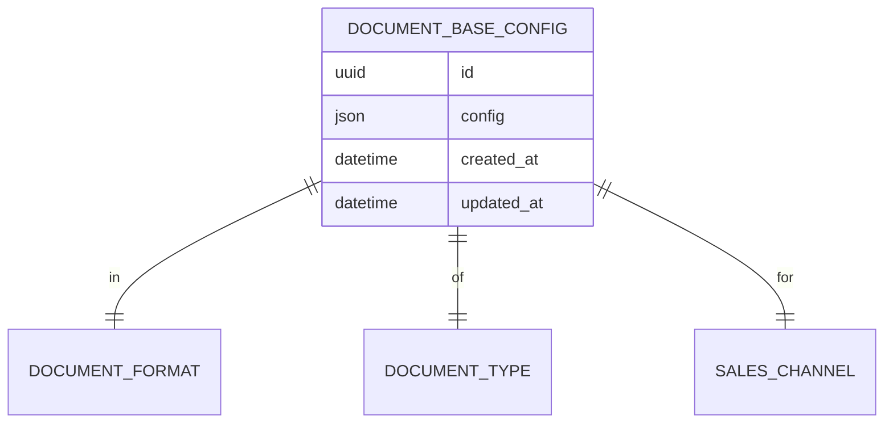
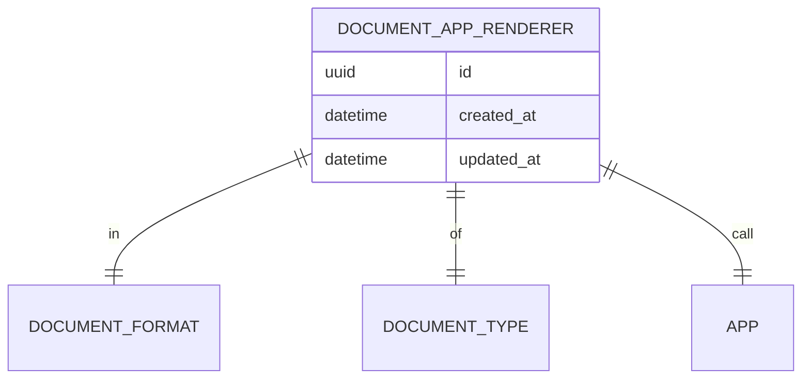

## Document generation concept

- Renderer = service responsible for one (documentType, format) pair (e.g. invoice:html).
- Each renderer declares which other formats of the same document type it depends on (e.g. pdf depends on html).
- Input request = { type: 'invoice', formats: ['pdf','zugferd_xml'] }. Registry / Generator must call renderers required for those formats plus their transitive dependencies, but call each renderer at most once.
  - transitive dependencies aren't persisted to file system
- Renderers return file content and have a method to persist it to a file system.

## Conceptional Todos:

- [x] Figure out `DocumentGenerationContext`, so that not each renderer has to fetch potentially the same data from DB.
- [x] Look for ways to reduce code duplication (e.g. are renderers really needed for each type + format combination?)
  - one renderer can support multiple types, but only one format.
  - That way we can reduce the number of renderers / classes a bit if they are mostly the same logic wise (e.g., twig HTML templates rendering)
- [x] How does configuration per type + format look like?
  - we have one opinionated configuration `DocumentConfig` with options that make sense for most cases.
  - But allow for customizations via `extensions` array, e.g. where you can put your own DTO or config array.
- [x] Database schema
- [ ] Figure out how the architecture looks from a third party / extensibility perspective (e.g. plugin / app)
  - plugin: straightforward, add a new renderer to the DI as tagged service.
  - app: TBD

### DB ER-Diagram

quite similar to the current DB schema, first rough draft:

// todo: app renderer

