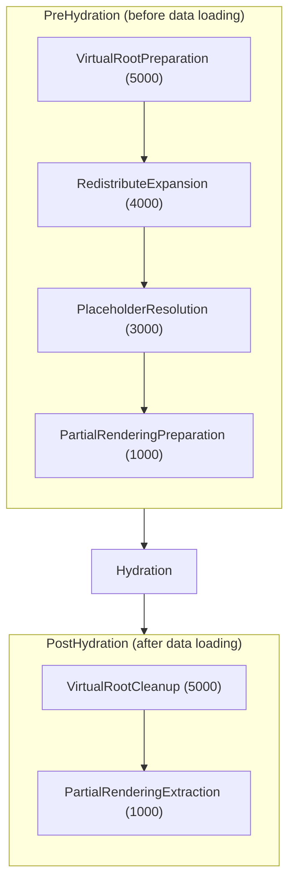

# Listener

Event-driven pipeline transformations for the content hydration lifecycle. Listeners modify the layout structure before and after data loading via `PreContentHydrationEvent` and `PostHydrationEvent`.

## Architecture

Listeners execute in two phases around the hydration process:

Higher priority numbers execute first. All listeners modify `$event->elements` (an array of ContentElement objects). This is the only mutable property on the events.

## Priority Ranges

Priorities are organized into reserved ranges for core and extension use.

**Extensions:**
- `>= 6000`: Run BEFORE core processing
- `< 1000` and `>= 0`: Run AFTER core processing
- `< 0`: Absolute last (use sparingly)

**Core (RESERVED - do not use in extensions):**
- `>= 5000`: Structure (scaffolding, wrapping)
- `>= 3000`: Transform (overrides, placeholders)
- `>= 1000`: Pruning (filtering, partial render)

## Built-in Listeners

**Virtual Root** - `VirtualRootPreparationSubscriber` wraps layout roots with a temporary container to enable layout-level context distribution. `VirtualRootCleanupSubscriber` removes the wrapper after hydration.

**Partial Rendering** - `PartialRenderingPreparationSubscriber` prunes the tree to the target element when `targetElementId` is specified. `PartialRenderingExtractionSubscriber` extracts only the target subtree for the response.

**Redistribute Expansion** - `RedistributeExpansionSubscriber` expands `redistribute: true` flags on context consumers into broadcast providers, enabling elements to automatically re-provide received context to descendants.

**Placeholder Resolution** - `PlaceholderResolutionSubscriber` resolves `{{variable}}` placeholders in element properties with values from the specification.

## Extension Points

Add custom listeners using `#[AsEventListener]` for `PreContentHydrationEvent` or `PostHydrationEvent` with a priority. Modify `$event->elements` in the handler.

**Example priorities by use case (suggestions only):**

- Modify raw layout before core: `PreContentHydrationEvent` at `>= 8000`
- Add custom data requirements: `PreContentHydrationEvent` at `500-800`
- Add computed properties: `PostHydrationEvent` at `500-800`
- Analytics/tracking injection: `PostHydrationEvent` at `100-200`
- Response transformation: `PostHydrationEvent` at `< 0`

## Subdirectories

- `PreHydration/`: Listeners that prepare layout structure before data loading
- `PostHydration/`: Listeners that finalize layout structure after data loading
