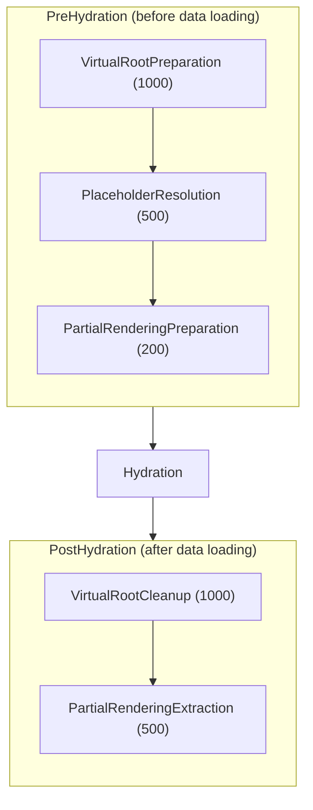

# EventSubscriber

Event-driven pipeline transformations for the content hydration lifecycle. Subscribers modify the layout structure before and after data loading via `PreContentHydrationEvent` and `AfterContentHydrationEvent`.

## Architecture

Subscribers execute in two phases around the hydration process:

Higher priority numbers execute first. All subscribers modify `$event->elements` (an array of ContentElement objects). This is the only mutable property on the events.

## Built-in Subscribers

**Virtual Root** - `VirtualRootPreparationSubscriber` wraps layout roots with a temporary container to enable layout-level context distribution. `VirtualRootCleanupSubscriber` removes the wrapper after hydration.

**Partial Rendering** - `PartialRenderingPreparationSubscriber` prunes the tree to the target element when `targetElementId` is specified. `PartialRenderingExtractionSubscriber` extracts only the target subtree for the response.

**Placeholder Resolution** - `PlaceholderResolutionSubscriber` resolves `{{variable}}` placeholders in element properties with values from the specification.

## Extension Points

Add custom subscribers by implementing `EventSubscriberInterface`. Subscribe to `PreContentHydrationEvent` or `AfterContentHydrationEvent` with a priority. Modify `$event->elements` in the handler.

## Subdirectories

- `PreHydration/`: Subscribers that prepare layout structure before data loading
- `PostHydration/`: Subscribers that finalize layout structure after data loading
