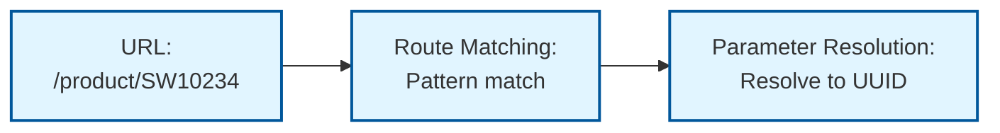
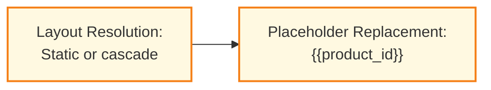
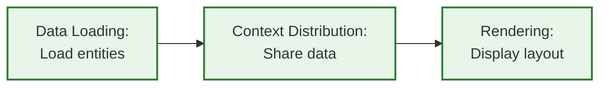

# Content System - User Guide

This document is a configuration guide for shop operators and layout designers. It explains how to use the Content System through declarative JSON configurations. The guide covers routes, layouts, content elements, data loading, and context sharing.

## Table of Contents

1. [Overview](#overview)
2. [Entity-Based Rendering](#entity-based-rendering)
3. [Content Elements](#content-elements)
4. [Routing](#routing)
5. [Data Loading](#data-loading)
6. [Context System](#context-system)
7. [Example: Product Detail Page](#example-product-detail-page)

## Overview

The Content System enables dynamic, data-driven layouts for your shop. Core capabilities include:

- Dynamic routing with URL patterns that resolve to entities
- Direct entity rendering for Products, Categories, and Landing Pages (no routing needed)
- Reusable layout templates with nested content elements
- Declarative data loading from the shop system
- Context sharing between parent and child elements
- Sales channel-specific layout assignments

### Core Concepts

**Content Elements** - Building blocks of layouts. Each element has a type (e.g., `Sw:Product:Card`), properties for configuration, slots for child elements, and optional data requirements.

**Placeholders** - Dynamic values in properties using `{{key}}` syntax. For example, `{{productId}}` gets replaced with the actual product UUID from the URL.

**Slots** - Named containers within elements. Each slot can hold multiple child elements.

**Data Requirements** - Declarations of what data an element needs. The system loads this data automatically before rendering.

**Context** - Mechanism for parent elements to share data with descendants. Providers expose data, consumers receive it without explicit passing through intermediate elements.

**Routes** - URL patterns stored in the database that map URLs to layouts. Merchants create these through the admin UI, not code.

### Data Flow





## Entity-Based Rendering

Products, Categories, and Landing Pages can render directly using ContentSystem layouts without URL routing. Recommended for standard product/category/landing pages.

**Endpoint:** `/store-api/content/{path}`

**Supported path patterns:**
- `product/{productId}` - Product detail pages
- `category/{categoryId}` - Category pages
- `landing-page/{landingPageId}` - Landing pages

**Example requests:**
- `/store-api/content/product/abc123def456` - Renders product with ID abc123def456
- `/store-api/content/category/xyz789abc012` - Renders category with ID xyz789abc012
- `/store-api/content/landing-page/ghi345jkl678` - Renders landing page with ID ghi345jkl678

**Database tables:**
- `product_content_layout` - Product → layout assignments
- `category_content_layout` - Category → layout assignments
- `landing_page_content_layout` - Landing page → layout assignments

### Assignment Structure

```json
{
  "id": "<uuid>",
  "productId": "<product-uuid>",         // or categoryId/landingPageId
  "productVersionId": "<version-uuid>",  // or categoryVersionId/landingPageVersionId
  "salesChannelId": "<sales-channel-uuid>|null",
  "contentLayoutId": "<layout-uuid>"
}
```

Fields:
- Entity ID (`productId`/`categoryId`/`landingPageId`) - Entity to render
- `salesChannelId` - Sales channel scope (`null` = global)
- `contentLayoutId` - Layout to use

### Sales Channel Resolution

Resolution priority: **sales channel specific** → **global** (null `salesChannelId`).

Example: Product with global layout and B2B-specific layout. B2B channel uses specific assignment, all other channels use global.

### When to Use

Use entity-based for standard product/category/landing pages with sales channel-specific layouts. Use route-based for custom URLs, SEO paths, or complex routing logic.

### Placeholders

Available placeholders:
- `{{productId}}` - Product UUID (product endpoint)
- `{{categoryId}}` - Category UUID (category endpoint)
- `{{landingPageId}}` - Landing page UUID (landing-page endpoint)

Use these in element properties and data requirements like route-based placeholders. See [Example: Product Detail Page](#example-product-detail-page) for usage.

## Content Elements

### Structure

Each content element follows this structure:

```json
{
  "id": "product-card",
  "type": "Sw:Product:Card",
  "properties": {
    "text": "Featured Product",
    "productId": "{{product_id}}"
  },
  "slots": {
    "content": [
      {
        "id": "product-title",
        "type": "Sw:Product:Title"
      }
    ]
  },
  "data_requirements": {},
  "provides_context": {},
  "accepts_context": {}
}
```

Placeholders from routes (like `{{product_id}}`) must be assigned to properties before data loaders can use them:

```json
"properties": {
  "product": "{{product_id}}"
},
"data_requirements": {
  "product": {
    "config": {
      "property": "product"
    }
  }
}
```

**Required fields:**
- `id` - Unique identifier for the element (required for processing)
- `type` - Element type identifier

**Optional fields:**
- `properties` - Configuration values (static or placeholders)
- `slots` - Named containers with arrays of child elements
- `data_requirements` - Data loading declarations
- `provides_context` - Data shared with descendant elements
- `accepts_context` - Data received from ancestor elements

### Slots

Slots hold arrays of elements.

```json
{
  "id": "main-container",
  "type": "Sw:Grid",
  "properties": {
    "columns": "1"
  },
  "slots": {
    "header": [
      {"id": "logo", "type": "Sw:Content:Image"},
      {"id": "navigation", "type": "Sw:Navigation"},
      {"id": "search", "type": "Sw:Search"}
    ],
    "main": [
      {"id": "product-listing", "type": "Sw:Product:Listing"}
    ],
    "sidebar": [
      {"id": "filter-panel", "type": "Sw:Filter:Panel"},
      {"id": "promo-banner", "type": "Sw:Content:Image"}
    ]
  }
}
```

In this example, the `header` slot contains 3 elements, while `main` has 1 and `sidebar` has 2.

### Nested Containers

Containers can be nested for complex layouts:

```json
{
  "id": "page-layout",
  "type": "Sw:Grid",
  "properties": {
    "cssClass": "page-wrapper",
    "columns": "1"
  },
  "slots": {
    "default": [
      {
        "id": "hero-section",
        "type": "Sw:Grid",
        "properties": {
          "cssClass": "hero",
          "columns": "1"
        },
        "slots": {
          "default": [
            {
              "id": "heading",
              "type": "Sw:Content:Text",
              "properties": {
                "text": "Summer Sale",
                "style": "heading"
              }
            },
            {
              "id": "cta-button",
              "type": "Sw:Content:Button",
              "properties": {
                "label": "Shop Now"
              }
            }
          ]
        }
      }
    ]
  }
}
```

## Routing

Routes map URLs to content layouts using database-stored patterns.

### URL Patterns

Routes use Symfony-style URL patterns with placeholders:

```json
[
  "/product/{productNumber}",
  "/category/{slug}",
  "/category/{slug}/page/{page}",
  "/product/{productNumber}/review/{reviewId}"
]
```

Placeholders extract values from URLs and either:
1. Resolve entities from the database
2. Pass values directly to the layout

### Parameter Binding

Parameter binding defines how URL parameters are processed.

#### Resolution Parameters

Resolution parameters query the database to find entity IDs.

```json
{
  "id": "0199b95201fe70ec851e971788686601",
  "name": "Product Detail Route",
  "urlPattern": "/product/{productNumber}",
  "parameterBindings": {
    "productNumber": {
      "placeholder": "product_id",
      "resolution": {
        "entity": "product",
        "match_field": "productNumber",
        "constraints": [
          {"type": "equals", "field": "active", "value": true}
        ]
      }
    }
  },
  "layoutId": null,
  "layoutCascade": [
    {"entity": "product"},
    {"entity": "category", "via": "categories"},
    {"entity": null}
  ],
  "priority": 100,
  "active": true,
  "salesChannels": [
    {"id": "{{salesChannelId}}"}
  ]
}
```

Fields:
- `urlPattern` - URL pattern with placeholders (camelCase)
- `parameterBindings` - Parameter configuration (camelCase)
- `placeholder` - Name used in layouts (e.g., `{{product_id}}`)
- `resolution` - Entity lookup configuration
- `match_field` - Entity field to query
- `constraints` - Array of criteria filter objects (same as Admin API)
- `layoutId` - Static layout UUID or null
- `layoutCascade` - Dynamic lookup array or null
- `priority` - Route matching priority (higher checked first)
- `active` - Whether route is enabled
- `salesChannels` - Array of sales channel objects

Process:
1. URL: `/product/SW10234`
2. Extract parameter: `productNumber` = "SW10234"
3. Query database: `SELECT id FROM product WHERE productNumber = 'SW10234' AND active = true`
4. Result: `product_id` = "019456789abc..."
5. Placeholder `{{product_id}}` available in layout

#### Constraints

Constraints filter entity resolution using Shopware's standard filter format (same as Admin API). Each constraint is a filter object with `type`, `field`, and `value` or `parameters`. Multiple constraints combine with AND logic.

**Equals Filter** - Exact match:
```json
"constraints": [
  {"type": "equals", "field": "active", "value": true}
]
```

**Range Filter** - Numeric/date ranges:
```json
"constraints": [
  {"type": "range", "field": "stock", "parameters": {"gte": 10, "lte": 100}}
]
```

**Multiple Constraints** - Combined with AND:
```json
"constraints": [
  {"type": "equals", "field": "active", "value": true},
  {"type": "range", "field": "stock", "parameters": {"gte": 10}},
  {"type": "contains", "field": "name", "value": "Premium"}
]
```

**Multi Filter** - Nested conditions:
```json
"constraints": [
  {
    "type": "multi",
    "operator": "OR",
    "queries": [
      {"type": "equals", "field": "stock", "value": 0},
      {"type": "equals", "field": "isCloseout", "value": true}
    ]
  }
]
```

Available filter types: `equals`, `equalsAny`, `contains`, `range`, `prefix`, `suffix`, `not`, `multi` (with `AND`/`OR` operators).

For complete filter reference, see [Shopware Filters Documentation](https://developer.shopware.com/docs/resources/references/core-reference/dal-reference/filters-reference.html).

#### Passthrough Parameters

Passthrough parameters use the URL value directly without database lookup. No `resolution` field means passthrough.

```json
{
  "id": "0199b95202fe70ec851e971788686602",
  "name": "Category Listing Route",
  "urlPattern": "/listing/{categoryId}",
  "parameterBindings": {
    "categoryId": {
      "placeholder": "category_id"
    }
  },
  "layoutId": "0199b95105fe70ec851e971788686505",
  "layoutCascade": null,
  "priority": 50,
  "active": true,
  "salesChannels": [
    {"id": "{{salesChannelId}}"}
  ]
}
```

Process:
1. URL: `/listing/electronics`
2. Extract parameter: `categoryId` = "electronics"
3. Placeholder `{{category_id}}` = "electronics" (no database query)

### Layout Assignment

Layout assignment determines which content layout a route uses. Both `layoutId` and `layoutCascade` must be present—set the unused one to `null`.

#### Static Assignment

Route uses a fixed layout. Set `layoutId` to UUID, `layoutCascade` to `null`:

```json
{
  "id": "0199b95202fe70ec851e971788686602",
  "name": "Category Listing Route",
  "urlPattern": "/listing/{categoryId}",
  "parameterBindings": {
    "categoryId": {"placeholder": "category_id"}
  },
  "layoutId": "0199b95105fe70ec851e971788686505",
  "layoutCascade": null,
  "priority": 50,
  "active": true,
  "salesChannels": [{"id": "{{salesChannelId}}"}]
}
```

Use when all URLs for this route use the same layout (e.g., contact page, terms page).

#### Dynamic Assignment (Cascade)

Route looks up layout based on entity and sales channel. Set `layoutId` to `null`, `layoutCascade` to array. Steps execute in order, first match wins.

```json
{
  "id": "0199b95201fe70ec851e971788686601",
  "name": "Product Detail Route",
  "urlPattern": "/product/{productNumber}",
  "parameterBindings": {
    "productNumber": {
      "placeholder": "product_id",
      "resolution": {
        "entity": "product",
        "match_field": "productNumber"
      }
    }
  },
  "layoutId": null,
  "layoutCascade": [
    {"entity": "product"},
    {"entity": "category", "via": "categories"},
    {"entity": null}
  ],
  "priority": 100,
  "active": true,
  "salesChannels": [{"id": "{{salesChannelId}}"}]
}
```

Cascade steps:
1. `{"entity": "product"}` - Direct entity match (layout assigned to resolved product ID)
2. `{"entity": "category", "via": "categories"}` - Association fallback (inherits from product's categories)
3. `{"entity": null}` - Default fallback (guaranteed fallback for sales channel)

Fields:
- `entity` - Entity type to match (or `null` for default)
- `via` - Association path for fallback lookups

Order rule: Most specific first, default last (specific → associations → default).

### Cascade Assignment Lookup

Cascade steps query the `content_layout_assignment` table. Assignments define which layout to use for which entity/sales channel combination.

Assignment structure:
```json
{
  "id": "<uuid>",
  "entityType": "product|category|null",
  "entityId": "<entity-uuid>|null",
  "salesChannelId": "<sales-channel-uuid>",
  "layoutId": "<layout-uuid>"
}
```

Example assignments (database records):
```json
[
  {
    "id": "0199b95301fe70ec851e971788686701",
    "entityType": null,
    "entityId": null,
    "salesChannelId": "{{salesChannelId}}",
    "layoutId": "0199b95101fe70ec851e971788686501"
  },
  {
    "id": "0199b95302fe70ec851e971788686702",
    "entityType": "category",
    "entityId": "0199b95509187207b86f6d01e3cc4f4c",
    "salesChannelId": "{{salesChannelId}}",
    "layoutId": "0199b95104fe70ec851e971788686504"
  },
  {
    "id": "0199b95303fe70ec851e971788686703",
    "entityType": "product",
    "entityId": "0199b95009fe70ec851e971788586445",
    "salesChannelId": "{{salesChannelId}}",
    "layoutId": "0199b95103fe70ec851e971788686503"
  }
]
```

Query logic:
- `{"entity": "product"}` → `WHERE entityType='product' AND entityId=<resolved_product_id> AND salesChannelId=<context>`
- `{"entity": "category", "via": "categories"}` → Load product.categories, `WHERE entityType='category' AND entityId IN <category_ids>`
- `{"entity": null}` → `WHERE entityType IS NULL AND entityId IS NULL AND salesChannelId=<context>`

First match wins, returns `layoutId` from matched assignment.

Example: Route resolves product `0199b95009fe70ec851e971788586445`
1. Step 1 queries product assignments → Finds assignment #3 → Returns layout `0199b95103fe70ec851e971788686503`
2. Steps 2-3 never execute (first match wins)

### Combined Example: Category with Pagination

Route combining resolution and passthrough parameters:

```json
{
  "id": "0199b95203fe70ec851e971788686603",
  "name": "Category with Pagination Route",
  "urlPattern": "/category/{slug}/page/{page}",
  "parameterBindings": {
    "slug": {
      "placeholder": "category_id",
      "resolution": {
        "entity": "category",
        "match_field": "slug"
      }
    },
    "page": {
      "placeholder": "page"
    }
  },
  "layoutId": null,
  "layoutCascade": [
    {"entity": "category"},
    {"entity": null}
  ],
  "priority": 75,
  "active": true,
  "salesChannels": [
    {"id": "{{salesChannelId}}"}
  ]
}
```

URL: `/category/electronics/page/2`
Result: `category_id` = UUID (from database), `page` = "2" (direct value)
Placeholders available: `{{category_id}}`, `{{page}}`

### Common Entity/Field Pairs

- Product: `"entity": "product"`, `"match_field": "seoPathInfo"` or `"productNumber"`
- Category: `"entity": "category"`, `"match_field": "slug"` or `"name"`

## Data Loading

### Data Requirements

Data requirements specify what data needs loading for an element:

- What to load (entity, product listing, etc.)
- Where to store it (property key)
- How to load it (filters, sorting, associations)

The system loads this data automatically before rendering.

### Usage Guidelines

Use data requirements when:
- Element needs data from the database
- Element displays dynamic content based on entities
- Element needs filtered or sorted lists

Don't use data requirements when:
- Element only displays static content
- Data comes via context from parent
- Element only uses configuration properties

> [!TIP]
> Place data requirements on the element that uses them. Only move them to a parent when multiple children need the same data. This keeps sub-tree extraction efficient and makes layouts more reusable.

### Available Loaders

#### Entity Loader (`source: "entity"`)

Loads a single entity by ID or property reference.

```json
{
  "id": "product-detail",
  "type": "Sw:Product:Detail",
  "data_requirements": {
    "product": {
      "key": "product",
      "source": "entity",
      "config": {
        "entity": "product",
        "property": "product",
        "associations": ["manufacturer", "cover", "categories"]
      }
    }
  }
}
```

Fields:
- `key` - Identifies this data requirement (must match object key)
- `source` - Loader identifier: "entity", "entity_collection", or "product_listing"
- `config` - Loader-specific configuration object
- `config.entity` - Entity name to load
- `config.property` - Property on this element containing the entity ID. The loader reads the ID from here. Defaults to entity name.
- `config.associations` - List of associations to load with the entity

After loading, access via element's `product` property → ProductEntity

A product card that loads its own data:

```json
{
  "id": "product-card",
  "type": "Sw:Product:Card",
  "properties": {
    "product": "{{product_id}}"
  },
  "data_requirements": {
    "product": {
      "key": "product",
      "source": "entity",
      "config": {
        "entity": "product",
        "property": "product"
      }
    }
  }
}
```

The `property` field points to the element's own property. The loader reads the ID from there, loads the product, and stores the result back in the same property.

If multiple elements need the same product, load it once at their parent and use the context system instead (see below).

#### Entity Collection Loader (`source: "entity_collection"`)

Loads multiple entities by their IDs.

```json
{
  "id": "product-slider",
  "type": "Sw:Product:Slider",
  "properties": {
    "productIds": ["019456789abc", "019456789def", "019456789ghi"]
  },
  "data_requirements": {
    "products": {
      "key": "products",
      "source": "entity_collection",
      "config": {
        "entity": "product",
        "property": "productIds",
        "associations": ["cover"]
      }
    }
  }
}
```

Fields:
- `key` - Identifies this data requirement (must match object key)
- `source` - Loader identifier: "entity_collection"
- `config` - Loader-specific configuration object
- `config.entity` - Entity name to load
- `config.property` - Property on this element containing an array of entity IDs. The loader reads the IDs from here. Defaults to `{entity}Ids` if not specified.
- `config.associations` - List of associations to load with the entities

After loading, access via element's `products` property → ProductCollection

The `property` field points to the element's own property. The loader reads the array of IDs from there, loads the entities, and stores the result collection in the property specified by `key`.

#### Product Listing Loader (`source: "product_listing"`)

Loads product listings with filters, sorting, and pagination.

```json
{
  "id": "category-listing",
  "type": "Sw:Product:Listing",
  "properties": {
    "categoryId": "{{category_id}}",
    "limit": 24
  },
  "data_requirements": {
    "listing": {
      "key": "listing",
      "source": "product_listing",
      "config": {
        "page": "{{page}}"
      }
    }
  }
}
```

After loading, access via element's `listing` property → ProductListingResult

### Multiple Data Requirements

Elements can declare multiple data requirements:

```json
{
  "id": "complex-page",
  "type": "Sw:Page:Complex",
  "properties": {
    "product": "{{product_id}}",
    "manufacturer": "{{manufacturer_id}}",
    "relatedProductIds": ["{{relatedId1}}", "{{relatedId2}}", "{{relatedId3}}"]
  },
  "data_requirements": {
    "mainProduct": {
      "key": "mainProduct",
      "source": "entity",
      "config": {
        "entity": "product",
        "property": "product"
      }
    },
    "relatedProducts": {
      "key": "relatedProducts",
      "source": "entity_collection",
      "config": {
        "entity": "product",
        "property": "relatedProductIds"
      }
    },
    "manufacturer": {
      "key": "manufacturer",
      "source": "entity",
      "config": {
        "entity": "manufacturer",
        "property": "manufacturer"
      }
    }
  }
}
```

## Context System

Use context when multiple elements need the same data. Load it once at the parent, share it with all children.

Example: A product page with title, price, and images all showing the same product. Load it once at the page level instead of three separate loads.

### Provider Configuration

Provider exposes data as context for direct children using `provides_context`.

```json
{
  "id": "product-detail-provider",
  "type": "Sw:Product:Detail",
  "data_requirements": {
    "product": {
      "key": "product",
      "source": "entity",
      "config": {
        "entity": "product",
        "property": "product"
      }
    }
  },
  "provides_context": {
    "product": {
      "type": "single",
      "distribution": "broadcast"
    }
  }
}
```

Fields:
- Context key (`"product"`) - Name consumers use to reference this context
- `type` - Context data type:
  - `"single"` - Single entity/value
  - `"collection"` - Array of entities/values
- `distribution` - How data is distributed to direct children:
  - `"broadcast"` - All children receive same data
  - `"indexed"` - Children receive data by position
  - `"keyed"` - Children receive data by their `data_key` property
  - `"sliced"` - Data split into chunks for each child
  - `"iterator"` - Round-robin distribution
- `consumer_alias` (optional) - Renames context key for child elements. Allows reusable components to work with different data sources without modification.

Note: The context key in `provides_context` typically matches a property name loaded by `data_requirements`.

**Consumer Alias Example:**

**Use case:** You have reusable product card components that expect data as `"product"`. Your homepage loads featured products as `"featuredProducts"`, but you want to use the same product cards without modifying them.

```json
"provides_context": {
  "featuredProducts": {
    "type": "collection",
    "distribution": "indexed",
    "consumer_alias": "product"
  }
}
```

The provider loads data as `featuredProducts`, but child components receive it as `product`. This lets you reuse the same product card in homepage (featuredProducts), categories (categoryProducts), and search (searchResults) - all expecting `product` internally.

### Consumer Configuration

Consumer receives context from ancestor provider using `accepts_context`.

```json
{
  "id": "product-title-consumer",
  "type": "Sw:Product:Title",
  "accepts_context": {
    "product": {
      "type": "single",
      "required": true
    }
  }
}
```

Fields:
- Context key (`"product"`) - Must match provider's context key exactly
- `type` - Expected context data type:
  - `"single"` - Expects single entity/value
  - `"collection"` - Expects array of entities/values
- `required` - Whether context is mandatory:
  - `true` - Element fails if context unavailable
  - `false` - Element works without context

Consumer receives context data directly as a property.

### Context Path Resolution

Consumers can request nested properties from context using dot notation. When a provider exposes an entity like `product`, consumers can access nested properties without loading the full entity themselves.

**Example**: Provider exposes product, consumer requests only the cover image:

```json
{
  "id": "product-provider",
  "type": "Sw:Product:Container",
  "data_requirements": {
    "product": {
      "key": "product",
      "source": "entity",
      "config": {
        "entity": "product",
        "property": "product",
        "associations": ["cover", "manufacturer"]
      }
    }
  },
  "provides_context": {
    "product": {
      "type": "single",
      "distribution": "broadcast"
    }
  },
  "slots": {
    "default": [
      {
        "id": "cover-image",
        "type": "Sw:Content:Image",
        "accepts_context": {
          "product.cover": {
            "type": "single",
            "required": true
          }
        }
      },
      {
        "id": "manufacturer-name",
        "type": "Sw:Content:Text",
        "accepts_context": {
          "product.manufacturer.name": {
            "type": "single",
            "required": false
          }
        }
      }
    ]
  }
}
```

**Key points**:
- Provider exposes full `product` entity
- `cover-image` receives only `product.cover` (MediaEntity)
- `manufacturer-name` receives only `product.manufacturer.name` (string)
- Supports arbitrary nesting depth: `product.manufacturer.country.code`
- Works only with Shopware Struct objects (all DAL entities)
- Path resolution happens automatically during context distribution

**Required vs Optional**:
- `required: true` - Throws exception if path cannot be resolved (property missing, intermediate null, non-Struct value)
- `required: false` - Returns null silently if path fails

**Benefits**:
- Reduces memory usage: elements receive only what they need
- Cleaner element APIs: no need to extract nested data in templates
- Type safety: path validated at runtime with clear error messages

### Distribution Strategies

Strategy determines how provider data is distributed to direct children.

**Broadcast** - All children receive identical data (e.g., product detail page with shared product)

**Indexed** - Children receive data by position: child[N] gets data[N] (e.g., top 3 products in specific slots)

**Keyed** - Children receive data by matching their `data_key` property to provider keys (e.g., different sections for featured/sale/new products). Consumers need `"properties": {"data_key": "featured"}`.

**Sliced** - Data split into chunks per child (e.g., 12 products across 3 columns = 4 per column)

**Iterator** - Round-robin distribution (e.g., 10 products distributed evenly across 3 slots)

### Context Flow Rules

Context flows from ancestors to descendants, never sideways or upward.

```
✓ Valid:
  Provider (product detail)
    └─ Consumer (title)          ← Can receive

✗ Invalid:
  Consumer (title)
    └─ Provider (product detail) ← Cannot receive from child

✗ Invalid:
  Provider (product 1)
  Consumer (title)               ← Siblings cannot share
```

Distribution strategy applies only to direct children. Deeper descendants do NOT receive context unless intermediate elements explicitly re-provide it.

Practical implication: Place consumers as direct children of provider for strategies to work as intended. For multi-level context, intermediate elements must both accept and re-provide context.

### Context Redistribution

**The Problem:** You build reusable layout components (product cards, content blocks, sliders) that need to work in different places - homepage grids, category listings, search results. When you nest these components inside container elements (grids, sections, columns), the container needs to pass data through to the nested components.

**Example scenario:** A product grid contains product cards. The grid receives product data and needs to pass it to each card. Without redistribution, you must configure both `accepts_context` (to receive data) AND `provides_context` (to pass it along) on the grid - verbose and repetitive.

**The Solution:** Use `redistribute: true` to automatically pass context through container elements.

**Comparison:**

```json
// Without redistribution - manual configuration (verbose)
"accepts_context": {"product": {"type": "single", "required": true}},
"provides_context": {"product": {"type": "single", "distribution": "broadcast"}}

// With redistribution - automatic pass-through (concise)
"accepts_context": {"product": {"type": "single", "required": true, "redistribute": true}}
```

Both produce identical results. The container automatically passes data to all children.

#### Consumer Alias with Redistribution

You can rename the context key when redistributing. Useful when your reusable component expects different naming than what it receives.

**Example:** Container receives `featuredProduct`, but child product cards expect `product`:

```json
"accepts_context": {
  "featuredProduct": {
    "type": "single",
    "required": true,
    "redistribute": true,
    "consumer_alias": "product"
  }
}
```

Container accepts `featuredProduct`, children receive `product`. Reuse the same product card components everywhere.

#### Choosing Your Approach

**Use `redistribute: true` for simple pass-through:**
- Container elements that just pass data to children unchanged
- All children need the same data (automatic broadcast)
- Quick setup with minimal configuration

**Use full `provides_context` configuration for advanced scenarios:**
- Different distribution strategies (indexed, keyed, sliced, iterator) - see [Distribution Strategies](#distribution-strategies)
- Need specific nested properties like `product.cover`
- Transforming or splitting data before passing to children

#### Reusable Components in Nested Layouts

**Real-world scenario:** You build a product card component that shows title, price, and image. This card should work whether placed directly on a page, inside a grid, within a section, or nested in a slider. Each container just needs to pass the product data through.

**Build once, use anywhere:** Redistribution cascades through multiple container levels automatically. Your reusable components work in any context without reconfiguration.

**Example:** Product page → content section → product card → title element

```json
{
  "id": "product-page",
  "provides_context": {"product": {"type": "single", "distribution": "broadcast"}},
  "slots": {
    "main": [{
      "id": "content-section",
      "accepts_context": {"product": {"type": "single", "required": true, "redistribute": true}},
      "slots": {
        "content": [{
          "id": "product-title",
          "accepts_context": {"product.name": {"type": "single", "required": true}}
        }]
      }
    }]
  }
}
```

The `content-section` container automatically passes product data to nested components. Move this section to different pages - it still works.

### Context Example

Provider distributing context to multiple consumer children:

```json
{
  "id": "product-detail-context",
  "type": "Sw:Product:Detail",
  "data_requirements": {
    "product": {
      "key": "product",
      "source": "entity",
      "config": {
        "entity": "product",
        "property": "product"
      }
    }
  },
  "provides_context": {
    "product": {
      "type": "single",
      "distribution": "broadcast"
    }
  },
  "slots": {
    "default": [
      {
        "id": "product-title",
        "type": "Sw:Product:Title",
        "accepts_context": {
          "product": {
            "type": "single",
            "required": true
          }
        }
      },
      {
        "id": "product-price",
        "type": "Sw:Product:Price",
        "accepts_context": {
          "product": {
            "type": "single",
            "required": true
          }
        }
      },
      {
        "id": "product-images",
        "type": "Sw:Product:Images",
        "accepts_context": {
          "product": {
            "type": "single",
            "required": true
          }
        }
      }
    ]
  }
}
```

Process:
1. Provider loads product via `data_requirements`
2. Provider exposes product as `"single"` context with `"broadcast"` distribution
3. All three children (`title`, `price`, `images`) receive the same product data
4. Each consumer declares context as `required: true`

## Example: Product Detail Page

Combined example showing routing, data loading, and context distribution.

**Route Configuration:**
```json
{
  "id": "0199b95201fe70ec851e971788686601",
  "name": "Product Detail Route",
  "urlPattern": "/product/{productNumber}",
  "parameterBindings": {
    "productNumber": {
      "placeholder": "product_id",
      "resolution": {
        "entity": "product",
        "match_field": "productNumber",
        "constraints": [
          {"type": "equals", "field": "active", "value": true}
        ]
      }
    }
  },
  "layoutId": null,
  "layoutCascade": [
    {"entity": "product"},
    {"entity": "category", "via": "categories"},
    {"entity": null}
  ],
  "priority": 100,
  "active": true,
  "salesChannels": [
    {"id": "{{salesChannelId}}"}
  ]
}
```

**Layout Configuration:**
```json
{
  "id": "product-detail-page",
  "type": "Sw:Grid",
  "properties": {
    "product": "{{product_id}}",
    "columns": "1",
    "gap": 32
  },
  "data_requirements": {
    "product": {
      "key": "product",
      "source": "entity",
      "config": {
        "entity": "product",
        "property": "product",
        "associations": ["cover", "manufacturer", "categories"]
      }
    }
  },
  "provides_context": {
    "product": {
      "type": "single",
      "distribution": "broadcast"
    }
  },
  "slots": {
    "default": [
      {
        "id": "breadcrumb",
        "type": "Sw:Navigation:Breadcrumb",
        "properties": {"showHome": true}
      },
      {
        "id": "product-images",
        "type": "Sw:Product:Images",
        "accepts_context": {
          "product": {"type": "single", "required": true}
        }
      },
      {
        "id": "product-info",
        "type": "Sw:Grid",
        "properties": {"columns": "1", "gap": 16},
        "accepts_context": {
          "product": {"type": "single", "required": false}
        },
        "slots": {
          "default": [
            {
              "id": "product-title",
              "type": "Sw:Product:Title",
              "accepts_context": {
                "product": {"type": "single", "required": true}
              }
            },
            {
              "id": "product-price",
              "type": "Sw:Product:Price",
              "accepts_context": {
                "product": {"type": "single", "required": true}
              }
            },
            {
              "id": "product-description",
              "type": "Sw:Product:Description",
              "accepts_context": {
                "product": {"type": "single", "required": true}
              }
            }
          ]
        }
      },
      {
        "id": "add-to-cart",
        "type": "Sw:Product:AddToCart",
        "accepts_context": {
          "product": {"type": "single", "required": true}
        }
      }
    ]
  }
}
```
