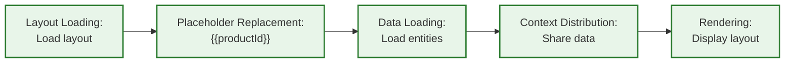

# Content System - User Guide

This document is a configuration guide for shop operators and layout designers. It explains how to use the Content System through declarative JSON configurations. The guide covers layouts, content elements, data loading, and context sharing.

## Table of Contents

1. [Overview](#overview)
2. [Content Sections](#content-sections)
3. [Entity-Based Rendering (Main Section)](#entity-based-rendering-main-section)
4. [Header and Footer Sections](#header-and-footer-sections)
5. [Content Elements](#content-elements)
6. [Data Loading](#data-loading)
7. [Context System](#context-system)
8. [Example: Product Detail Page](#example-product-detail-page)

## Overview

The Content System enables dynamic, data-driven layouts for your shop. Core capabilities include:

- Direct entity rendering for Products, Categories, and Landing Pages
- Header and footer layouts with domain-aware resolution
- Reusable layout templates with nested content elements
- Declarative data loading from the shop system
- Context sharing between parent and child elements
- Sales channel-specific layout assignments
- Partial rendering for refreshing individual elements

### Core Concepts

**Content Elements** - Building blocks of layouts. Each element has a component (e.g., `Sw:Product:Card`), properties for configuration, slots for child elements, and optional data requirements.

**Placeholders** - Dynamic values in properties using `{{key}}` syntax. For example, `{{productId}}` gets replaced with the actual product UUID from the URL.

**Slots** - Named containers within elements. Each slot can hold multiple child elements.

**Data Requirements** - Declarations of what data an element needs. The system loads this data automatically before rendering.

**Context** - Mechanism for parent elements to share data with descendants. Providers expose data, consumers receive it without explicit passing through intermediate elements.

### Data Flow



## Content Sections

The Content System serves three distinct sections, each with its own resolution strategy and four response formats.

### Response Formats

Each section supports four response formats via separate endpoints:

| Format | Suffix | Description |
|--------|--------|-------------|
| **Full** | *(none)* | Returns complete element trees with hydrated data (simpler integration) |
| **Decomposed** | `-decomposed` | Returns decomposed format with deduplicated data (optimized payloads) |
| **Skeleton** | `-skeleton` | Returns layout structure without hydrated data (client-side hydration) |
| **Data** | `-data` | Returns data and assignments without skeleton (data refresh) |

### Partial Rendering

Full and decomposed endpoints for the main section support partial rendering via the `elementId` query parameter. Pass `?elementId=<element-id>` to render only a specific element and its subtree instead of the full layout. The system preserves context-dependent ancestors during hydration and extracts the target subtree for the response.

Header and footer sections do not support partial rendering.

### Multi-Root Layouts

A layout can contain multiple root elements. Each root is an independent tree with separate context scope -- providers in one root cannot provide context to elements in another root. Element IDs must be unique across all roots.

## Entity-Based Rendering (Main Section)

Products, Categories, and Landing Pages can render directly using ContentSystem layouts. This is the primary method for rendering entity-based pages.

**Endpoints:**

| Endpoint | Description |
|----------|-------------|
| `GET /store-api/content/{path}` | Full response |
| `GET /store-api/content-decomposed/{path}` | Decomposed response |
| `GET /store-api/content-skeleton/{path}` | Skeleton only |
| `GET /store-api/content-data/{path}` | Data only |

**Supported path patterns:**
- `product/{productId}` - Product detail pages
- `category/{categoryId}` - Category pages
- `landing-page/{landingPageId}` - Landing pages

**Example requests:**
- `/store-api/content/product/abc123def456` - Renders product with ID abc123def456
- `/store-api/content/category/xyz789abc012` - Renders category with ID xyz789abc012
- `/store-api/content/landing-page/ghi345jkl678` - Renders landing page with ID ghi345jkl678
- `/store-api/content/product/abc123def456?elementId=product-images` - Renders only the `product-images` element subtree
- `/store-api/content-decomposed/product/abc123def456?elementId=product-images` - Same, decomposed format

**Database tables:**
- `product_content_layout` - Product layout assignments
- `category_content_layout` - Category layout assignments
- `landing_page_content_layout` - Landing page layout assignments

### Assignment Structure

```json
{
  "id": "<uuid>",
  "productId": "<product-uuid>",
  "salesChannelId": "<sales-channel-uuid>|null",
  "contentLayoutId": "<layout-uuid>",
  "parameterBindings": null
}
```

Fields:
- Entity ID (`productId`/`categoryId`/`landingPageId`) - Entity to render
- `salesChannelId` - Sales channel scope (`null` = global)
- `contentLayoutId` - Layout to use
- `parameterBindings` - Optional parameter name mappings (see [Parameter Bindings](#parameter-bindings))

### Sales Channel Resolution

Resolution priority: **sales channel specific** > **global** (null `salesChannelId`).

Example: Product with global layout and B2B-specific layout. B2B channel uses specific assignment, all other channels use global.

### Parameter Bindings

Entity-based endpoints map URL segments to placeholders by default: `product/{productId}` makes `{{productId}}` available, `category/{categoryId}` makes `{{categoryId}}` available, `landing-page/{landingPageId}` makes `{{landingPageId}}` available. Parameter bindings allow customizing these placeholder names to match your layout's expectations without modifying the layout itself.

**Example:** Remap `productId` to `product_id` to reuse a layout expecting `{{product_id}}` instead of `{{productId}}`. This enables layout reusability with different naming conventions.

Bindings are configured per assignment in the `parameterBindings` field of the assignment entity. They also affect additional query parameters (see below).

### Automatic Data Loading

Entity-based rendering automatically loads the main entity before rendering your layout -- no `data_requirements` declaration needed. The entity ID is available via placeholders, and the entity object is loaded with pre-configured associations and available via context to your layout's root elements.

**Auto-loaded entities and associations:**

| Endpoint | Entity | Context Key | Pre-loaded Associations |
|----------|--------|-------------|------------------------|
| `/store-api/content/product/{productId}` | ProductEntity | `product` | `manufacturer.media`, `options.group`, `properties.group`, `mainCategories.category`, `media.media` |
| `/store-api/content/category/{categoryId}` | CategoryEntity | `category` | `media`, `translations` |
| `/store-api/content/landing-page/{landingPageId}` | LandingPageEntity | `landing_page` | (none) |

**Usage example:**

```json
{
  "id": "product-page",
  "component": "Sw:Grid",
  "accepts_context": {
    "product": {
      "type": "single",
      "required": true,
      "redistribute": true
    }
  },
  "slots": {
    "default": [
      {
        "id": "product-title",
        "component": "Sw:Product:Title",
        "accepts_context": {
          "product": {"type": "single", "required": true}
        }
      }
    ]
  }
}
```

Root elements accept the auto-loaded entity via context and redistribute to children using `redistribute: true`. Deeper descendants require redistribution at each container level (see [Context Redistribution](#context-redistribution)). Declare `data_requirements` only for additional data beyond what's automatically loaded (e.g., cross-sell products, reviews).

### Placeholders

Default placeholders available in entity-based rendering:
- `{{productId}}` - Product UUID (product endpoint)
- `{{categoryId}}` - Category UUID (category endpoint)
- `{{landingPageId}}` - Landing page UUID (landing-page endpoint)

These placeholder names can be customized via parameter bindings (see [Parameter Bindings](#parameter-bindings) above) to match your layout's naming conventions.

Use these in element properties and data requirements. See [Example: Product Detail Page](#example-product-detail-page) for usage.

### Additional Parameters

Beyond URL path segments, you can pass additional parameters to your layouts via query string. These parameters become available as placeholders throughout your layout.

**Query string example:**
```
/store-api/content/product/abc123?page=2&limit=24
```

Makes `{{page}}` and `{{limit}}` available as placeholders:

```json
{
  "id": "product-listing",
  "component": "Sw:Product:Listing",
  "properties": {
    "page": "{{page}}",
    "limit": "{{limit}}"
  }
}
```

**Common use cases:**
- Pagination parameters (`page`, `limit`)
- Filter values (`category`, `brand`, `priceRange`)
- Display preferences (`view`, `sort`)
- Feature flags (`showReviews`, `hidePrice`)

**Parameter bindings:** Additional parameters are also affected by parameter bindings (see [Parameter Bindings](#parameter-bindings)). If configured, the system maps parameter names to different placeholder names.

## Header and Footer Sections

Header and footer layouts use domain-aware resolution instead of entity-based rendering. They are independent of the main content and do not require a URL path.

**Header endpoints:**

| Endpoint | Description |
|----------|-------------|
| `GET /store-api/content-header` | Full response |
| `GET /store-api/content-header-decomposed` | Decomposed response |
| `GET /store-api/content-header-skeleton` | Skeleton only |
| `GET /store-api/content-header-data` | Data only |

**Footer endpoints:**

| Endpoint | Description |
|----------|-------------|
| `GET /store-api/content-footer` | Full response |
| `GET /store-api/content-footer-decomposed` | Decomposed response |
| `GET /store-api/content-footer-skeleton` | Skeleton only |
| `GET /store-api/content-footer-data` | Data only |

**Database tables:**
- `header_content_layout` - Header layout assignments
- `footer_content_layout` - Footer layout assignments

### Header/Footer Assignment Structure

```json
{
  "id": "<uuid>",
  "domainId": "<domain-uuid>|null",
  "salesChannelId": "<sales-channel-uuid>|null",
  "contentLayoutId": "<layout-uuid>",
  "parameterBindings": null
}
```

Fields:
- `domainId` - Sales channel domain scope (`null` = not domain-specific)
- `salesChannelId` - Sales channel scope (`null` = global)
- `contentLayoutId` - Layout to use
- `parameterBindings` - Optional parameter name mappings

### Domain-Aware Resolution

Resolution priority (three-tier fallback): **domain + sales channel** > **sales channel only** > **global** (both null).

Example: A shop with domains `shop.com` and `shop.de` can have different headers per domain, with a fallback header for the entire sales channel, and a global fallback for all channels.

### Header/Footer Placeholders

Header and footer layouts do not have entity-based placeholders. Query parameters passed to the endpoint become available as placeholders.

```
/store-api/content-header?activeCategoryId=abc123
```

Makes `{{activeCategoryId}}` available in the header layout.

Header and footer sections do not support partial rendering (`elementId` parameter).

## Content Elements

### Structure

Each content element follows this structure:

```json
{
  "id": "product-card",
  "component": "Sw:Product:Card",
  "properties": {
    "text": "Featured Product",
    "productId": "{{productId}}"
  },
  "slots": {
    "content": [
      {
        "id": "product-title",
        "component": "Sw:Product:Title"
      }
    ]
  },
  "data_requirements": {},
  "provides_context": {},
  "accepts_context": {}
}
```

Placeholders (like `{{productId}}`) must be assigned to properties before data loaders can use them:

```json
"properties": {
  "product": "{{productId}}"
},
"data_requirements": {
  "product": {
    "source": "entity",
    "config": {
      "entity": "product",
      "property": "product"
    }
  }
}
```

**Required fields:**
- `id` - Unique identifier for the element (required for processing)
- `component` - Element component identifier

**Optional fields:**
- `properties` - Configuration values (static or placeholders)
- `slots` - Named containers with arrays of child elements
- `data_requirements` - Data loading declarations
- `provides_context` - Data shared with descendant elements
- `accepts_context` - Data received from ancestor elements

### Slots

Slots hold arrays of elements.

```json
{
  "id": "main-container",
  "component": "Sw:Grid",
  "properties": {
    "columns": "1"
  },
  "slots": {
    "header": [
      {"id": "logo", "component": "Sw:Content:Image"},
      {"id": "navigation", "component": "Sw:Navigation"},
      {"id": "search", "component": "Sw:Search"}
    ],
    "main": [
      {"id": "product-listing", "component": "Sw:Product:Listing"}
    ],
    "sidebar": [
      {"id": "filter-panel", "component": "Sw:Filter:Panel"},
      {"id": "promo-banner", "component": "Sw:Content:Image"}
    ]
  }
}
```

In this example, the `header` slot contains 3 elements, while `main` has 1 and `sidebar` has 2.

### Nested Containers

Containers can be nested for complex layouts:

```json
{
  "id": "page-layout",
  "component": "Sw:Grid",
  "properties": {
    "cssClass": "page-wrapper",
    "columns": "1"
  },
  "slots": {
    "default": [
      {
        "id": "hero-section",
        "component": "Sw:Grid",
        "properties": {
          "cssClass": "hero",
          "columns": "1"
        },
        "slots": {
          "default": [
            {
              "id": "heading",
              "component": "Sw:Content:Text",
              "properties": {
                "text": "Summer Sale",
                "style": "heading"
              }
            },
            {
              "id": "cta-button",
              "component": "Sw:Content:Button",
              "properties": {
                "label": "Shop Now"
              }
            }
          ]
        }
      }
    ]
  }
}
```

## Data Loading

### Data Requirements

Data requirements specify what data needs loading for an element:

- What to load (entity, product listing, etc.)
- Where to store it (property key)
- How to load it (filters, sorting, associations)

The system loads this data automatically before rendering.

### Usage Guidelines

Use data requirements when:
- Element needs data from the database
- Element displays dynamic content based on entities
- Element needs filtered or sorted lists

Don't use data requirements when:
- Element only displays static content
- Data comes via context from parent
- Element only uses configuration properties

> [!TIP]
> Place data requirements on the element that uses them. Only move them to a parent when multiple children need the same data. This keeps sub-tree extraction efficient and makes layouts more reusable.

### Data Requirement Fields

Each data requirement is an object with these fields:

- `key` (optional) - Identifies this data requirement. After loading, the data is stored on the element under this key. If omitted, the object's key name in the `data_requirements` map is used.
- `source` (required) - Loader identifier (e.g., `"entity"`, `"entity_collection"`, `"product_listing"`, `"navigation"`)
- `config` (optional) - Loader-specific configuration object

### Available Loaders

#### Entity Loader (`source: "entity"`)

Loads a single entity by ID or property reference.

```json
{
  "id": "product-detail",
  "component": "Sw:Product:Detail",
  "data_requirements": {
    "product": {
      "source": "entity",
      "config": {
        "entity": "product",
        "property": "product",
        "associations": ["manufacturer", "cover", "categories"]
      }
    }
  }
}
```

Config fields:
- `entity` (required) - Entity name to load (e.g., `"product"`, `"category"`)
- `property` (required) - Property on this element containing the entity ID. The loader reads the ID from here.
- `associations` (optional) - List of associations to load with the entity

After loading, access via element's `product` property (the requirement key).

A product card that loads its own data:

```json
{
  "id": "product-card",
  "component": "Sw:Product:Card",
  "properties": {
    "product": "{{productId}}"
  },
  "data_requirements": {
    "product": {
      "source": "entity",
      "config": {
        "entity": "product",
        "property": "product"
      }
    }
  }
}
```

The `property` field points to the element's own property. The loader reads the ID from there, loads the product, and stores the result back in the same property.

If multiple elements need the same product, load it once at their parent and use the context system instead (see below).

#### Entity Collection Loader (`source: "entity_collection"`)

Loads multiple entities by their IDs.

```json
{
  "id": "product-slider",
  "component": "Sw:Product:Slider",
  "properties": {
    "productIds": ["019456789abc", "019456789def", "019456789ghi"]
  },
  "data_requirements": {
    "products": {
      "source": "entity_collection",
      "config": {
        "entity": "product",
        "property": "productIds",
        "associations": ["cover"]
      }
    }
  }
}
```

Config fields:
- `entity` (required) - Entity name to load
- `property` (required) - Property on this element containing an array of entity IDs
- `associations` (optional) - List of associations to load with the entities

After loading, access via element's `products` property (the requirement key).

#### Product Listing Loader (`source: "product_listing"`)

Loads product listings for a navigation/category. Filters, sorting, and pagination are controlled via request parameters.

```json
{
  "id": "category-listing",
  "component": "Sw:Product:Listing",
  "properties": {
    "navigationId": "{{categoryId}}"
  },
  "data_requirements": {
    "listing": {
      "source": "product_listing",
      "config": {
        "property": "navigationId",
        "associations": ["cover", "manufacturer"]
      }
    }
  }
}
```

Config fields:
- `property` (optional) - Property on this element containing the navigation/category ID. Defaults to `"navigationId"` if not specified.
- `associations` (optional) - List of associations to load with the products

After loading, access via element's `listing` property (the requirement key).

Pagination, filters, and sorting are controlled via request parameters (query string), not config. See [Additional Parameters](#additional-parameters) for details.

#### Navigation Loader (`source: "navigation"`)

Loads navigation tree data for menus.

```json
{
  "id": "main-nav",
  "component": "Sw:Navigation:Menu",
  "properties": {
    "activeId": "{{categoryId}}"
  },
  "data_requirements": {
    "navigation": {
      "source": "navigation",
      "config": {
        "rootId": "main-navigation",
        "depth": 3,
        "activeProperty": "activeId"
      }
    }
  }
}
```

Config fields:
- `rootId` (optional) - Navigation root ID or alias. Defaults to `"main-navigation"`. Available aliases: `main-navigation`, `service-navigation`, `footer-navigation`.
- `depth` (optional) - Navigation tree depth. Defaults to `2`.
- `activeProperty` (optional) - Element property name to read the active category ID from. Defaults to `"activeId"`.

After loading, access via the requirement key (e.g., `navigation` property).

#### Language Loader (`source: "language"`)

Loads available languages for the current sales channel.

```json
{
  "id": "language-switcher",
  "component": "Sw:LanguageSwitcher",
  "data_requirements": {
    "languages": {
      "source": "language",
      "config": {
        "associations": ["locale"]
      }
    }
  }
}
```

Config fields:
- `associations` (optional) - Additional associations to load

#### Currency Loader (`source: "currency"`)

Loads available currencies for the current sales channel.

```json
{
  "id": "currency-switcher",
  "component": "Sw:CurrencySwitcher",
  "data_requirements": {
    "currencies": {
      "source": "currency",
      "config": {
        "associations": []
      }
    }
  }
}
```

Config fields:
- `associations` (optional) - Additional associations to load

#### Payment Method Loader (`source: "payment_method"`)

Loads available payment methods.

```json
{
  "id": "payment-methods",
  "component": "Sw:PaymentMethods",
  "data_requirements": {
    "paymentMethods": {
      "source": "payment_method",
      "config": {
        "onlyAvailable": true,
        "associations": ["media"]
      }
    }
  }
}
```

Config fields:
- `onlyAvailable` (optional) - Only return available payment methods. Defaults to `true`.
- `associations` (optional) - Additional associations to load

#### Shipping Method Loader (`source: "shipping_method"`)

Loads available shipping methods.

```json
{
  "id": "shipping-methods",
  "component": "Sw:ShippingMethods",
  "data_requirements": {
    "shippingMethods": {
      "source": "shipping_method",
      "config": {
        "onlyAvailable": true,
        "associations": ["media"]
      }
    }
  }
}
```

Config fields:
- `onlyAvailable` (optional) - Only return available shipping methods. Defaults to `true`.
- `associations` (optional) - Additional associations to load

### Multiple Data Requirements

Elements can declare multiple data requirements:

```json
{
  "id": "complex-page",
  "component": "Sw:Page:Complex",
  "properties": {
    "product": "{{productId}}",
    "relatedProductIds": ["{{relatedId1}}", "{{relatedId2}}", "{{relatedId3}}"]
  },
  "data_requirements": {
    "mainProduct": {
      "source": "entity",
      "config": {
        "entity": "product",
        "property": "product"
      }
    },
    "relatedProducts": {
      "source": "entity_collection",
      "config": {
        "entity": "product",
        "property": "relatedProductIds"
      }
    },
    "navigation": {
      "source": "navigation",
      "config": {
        "rootId": "main-navigation",
        "depth": 2
      }
    }
  }
}
```

## Context System

Use context when multiple elements need the same data. Load it once at the parent, share it with all children.

Example: A product page with title, price, and images all showing the same product. Load it once at the page level instead of three separate loads.

### Provider Configuration

Provider exposes data as context for direct children using `provides_context`.

```json
{
  "id": "product-detail-provider",
  "component": "Sw:Product:Detail",
  "data_requirements": {
    "product": {
      "source": "entity",
      "config": {
        "entity": "product",
        "property": "product"
      }
    }
  },
  "provides_context": {
    "product": {
      "type": "single",
      "distribution": "broadcast"
    }
  }
}
```

Fields:
- Context key (`"product"`) - Name consumers use to reference this context
- `type` - Context data type:
  - `"single"` - Single entity/value
  - `"collection"` - Array of entities/values
- `distribution` - How data is distributed to direct children:
  - `"broadcast"` - All children receive same data
  - `"indexed"` - Children receive data by position
  - `"keyed"` - Children receive data by matching their property to data keys (see `key_property`)
  - `"sliced"` - Data split into chunks for each child (see `slice_size`)
  - `"iterator"` - One item per child, distributed sequentially
- `consumer_alias` (optional) - Renames context key for child elements. Allows reusable components to work with different data sources without modification.

**Strategy-specific fields:**

- `key_property` (keyed only, optional) - Element property name used for key matching. Defaults to `"data_key"`. Each child's property at this name is matched against the data keys.
- `slice_size` (sliced only, optional) - Number of items per chunk. Defaults to `10`.

Note: The context key in `provides_context` typically matches a property name loaded by `data_requirements`.

**Consumer Alias Example:**

**Use case:** You have reusable product card components that expect data as `"product"`. Your homepage loads featured products as `"featuredProducts"`, but you want to use the same product cards without modifying them.

```json
"provides_context": {
  "featuredProducts": {
    "type": "collection",
    "distribution": "indexed",
    "consumer_alias": "product"
  }
}
```

The provider loads data as `featuredProducts`, but child components receive it as `product`. This lets you reuse the same product card in homepage (featuredProducts), categories (categoryProducts), and search (searchResults) - all expecting `product` internally.

### Consumer Configuration

Consumer receives context from ancestor provider using `accepts_context`.

```json
{
  "id": "product-title-consumer",
  "component": "Sw:Product:Title",
  "accepts_context": {
    "product": {
      "type": "single",
      "required": true
    }
  }
}
```

Fields:
- Context key (`"product"`) - Must match provider's context key exactly (or its `consumer_alias`)
- `type` - Expected context data type:
  - `"single"` - Expects single entity/value
  - `"collection"` - Expects array of entities/values
- `required` - Whether context is mandatory:
  - `true` - Element fails if context unavailable
  - `false` - Element works without context
- `property_alias` (optional) - Renames the property key where context data is stored in this element. The consumed data is stored with this alias instead of the original context key. Useful for component reusability when elements expect specific property names. Cannot contain dots. Must be unique within the element (no two consumers can resolve to the same property key).

Consumer receives context data directly as a property.

**Property Alias Example:**

**Use case:** Reusable image element expects `"image"` property, but product layout provides `"product.cover"`. Use `property_alias` to adapt without modifying the element.

```json
{
  "id": "product-cover",
  "component": "Sw:Content:Image",
  "accepts_context": {
    "product.cover": {
      "type": "single",
      "required": true,
      "property_alias": "image"
    }
  }
}
```

Element receives `product.cover` from parent context but stores it as `image` internally, matching what the renderer expects. Enables component reusability across different data sources.

### Context Path Resolution

Consumers can request nested properties from context using dot notation. When a provider exposes an entity like `product`, consumers can access nested properties without loading the full entity themselves.

**Example**: Provider exposes product, consumer requests only the cover image:

```json
{
  "id": "product-provider",
  "component": "Sw:Product:Container",
  "data_requirements": {
    "product": {
      "source": "entity",
      "config": {
        "entity": "product",
        "property": "product",
        "associations": ["cover", "manufacturer"]
      }
    }
  },
  "provides_context": {
    "product": {
      "type": "single",
      "distribution": "broadcast"
    }
  },
  "slots": {
    "default": [
      {
        "id": "cover-image",
        "component": "Sw:Content:Image",
        "accepts_context": {
          "product.cover": {
            "type": "single",
            "required": true
          }
        }
      },
      {
        "id": "manufacturer-name",
        "component": "Sw:Content:Text",
        "accepts_context": {
          "product.manufacturer.name": {
            "type": "single",
            "required": false
          }
        }
      }
    ]
  }
}
```

**Key points**:
- Provider exposes full `product` entity
- `cover-image` receives only `product.cover` (MediaEntity)
- `manufacturer-name` receives only `product.manufacturer.name` (string)
- Supports arbitrary nesting depth: `product.manufacturer.country.code`
- Works only with Shopware Struct objects (all DAL entities)
- Path resolution happens automatically during context distribution

**Required vs Optional**:
- `required: true` - Throws exception if path cannot be resolved (property missing, intermediate null, non-Struct value)
- `required: false` - Returns null silently if path fails

**Benefits**:
- Reduces memory usage: elements receive only what they need
- Cleaner element APIs: no need to extract nested data in templates
- Type safety: path validated at runtime with clear error messages

### Distribution Strategies

Strategy determines how provider data is distributed to direct children.

**Broadcast** - All children receive identical data (e.g., product detail page with shared product)

**Indexed** - Children receive data by position: child[N] gets data[N] (e.g., top 3 products in specific slots)

**Keyed** - Children receive data by matching their property value to data keys. The `key_property` field (default: `"data_key"`) specifies which element property is used for matching. Consumers need a property matching this name, e.g., `"properties": {"data_key": "featured"}` when using the default.

**Sliced** - Data split into chunks per child, with `slice_size` items per chunk (default: `10`). E.g., 12 products with `slice_size: 4` across 3 columns = 4 per column.

**Iterator** - Sequential distribution: each child receives one item in order. E.g., 10 products distributed to 10 card elements, one each.

### Context Flow Rules

Context flows from ancestors to descendants, never sideways or upward.

```
Valid:
  Provider (product detail)
    -- Consumer (title)          <-- Can receive

Invalid:
  Consumer (title)
    -- Provider (product detail) <-- Cannot receive from child

Invalid:
  Provider (product 1)
  Consumer (title)               <-- Siblings cannot share
```

Distribution strategy applies only to direct children. Deeper descendants do NOT receive context unless intermediate elements explicitly re-provide it.

Practical implication: Place consumers as direct children of provider for strategies to work as intended. For multi-level context, intermediate elements must both accept and re-provide context.

### Context Redistribution

**The Problem:** You build reusable layout components (product cards, content blocks, sliders) that need to work in different places - homepage grids, category listings, search results. When you nest these components inside container elements (grids, sections, columns), the container needs to pass data through to the nested components.

**Example scenario:** A product grid contains product cards. The grid receives product data and needs to pass it to each card. Without redistribution, you must configure both `accepts_context` (to receive data) AND `provides_context` (to pass it along) on the grid - verbose and repetitive.

**The Solution:** Use `redistribute: true` to automatically pass context through container elements.

**Comparison:**

```json
// Without redistribution - manual configuration (verbose)
"accepts_context": {"product": {"type": "single", "required": true}},
"provides_context": {"product": {"type": "single", "distribution": "broadcast"}}

// With redistribution - automatic pass-through (concise)
"accepts_context": {"product": {"type": "single", "required": true, "redistribute": true}}
```

Both produce identical results. The container automatically passes data to all children.

#### Consumer Alias with Redistribution

You can rename the context key when redistributing. Useful when your reusable component expects different naming than what it receives.

**Example:** Container receives `featuredProduct`, but child product cards expect `product`:

```json
"accepts_context": {
  "featuredProduct": {
    "type": "single",
    "required": true,
    "redistribute": true,
    "consumer_alias": "product"
  }
}
```

Container accepts `featuredProduct`, children receive `product`. Reuse the same product card components everywhere.

**Constraints:**

- `consumer_alias` on `accepts_context` requires `redistribute: true`. Without redistribution, a consumer alias has no effect and will cause a validation error.
- `redistribute: true` cannot be used with dotted context keys (e.g., `"product.cover": {"redistribute": true}` is invalid). Use full `provides_context` configuration for nested path redistribution.
- `redistribute: true` cannot coexist with an explicit `provides_context` entry for the same key on the same element.

**Property Alias vs Consumer Alias:**

- `consumer_alias` (in `provides_context`): Provider renames context for all children receiving it
- `consumer_alias` (in `accepts_context`): Redistributed context is exposed to children under this name (requires `redistribute: true`)
- `property_alias` (in `accepts_context`): Individual consumer renames context for its own use only (does NOT require `redistribute`)

Use `consumer_alias` when all children need the same rename. Use `property_alias` when individual consumers need different internal names.

#### Choosing Your Approach

**Use `redistribute: true` for simple pass-through:**
- Container elements that just pass data to children unchanged
- All children need the same data (automatic broadcast)
- Quick setup with minimal configuration

**Use full `provides_context` configuration for advanced scenarios:**
- Different distribution strategies (indexed, keyed, sliced, iterator) - see [Distribution Strategies](#distribution-strategies)
- Need specific nested properties like `product.cover`
- Transforming or splitting data before passing to children

#### Reusable Components in Nested Layouts

**Real-world scenario:** You build a product card component that shows title, price, and image. This card should work whether placed directly on a page, inside a grid, within a section, or nested in a slider. Each container just needs to pass the product data through.

**Build once, use anywhere:** Redistribution cascades through multiple container levels automatically. Your reusable components work in any context without reconfiguration.

**Example:** Product page > content section > product card > title element

```json
{
  "id": "product-page",
  "provides_context": {"product": {"type": "single", "distribution": "broadcast"}},
  "slots": {
    "main": [{
      "id": "content-section",
      "accepts_context": {"product": {"type": "single", "required": true, "redistribute": true}},
      "slots": {
        "content": [{
          "id": "product-title",
          "accepts_context": {"product.name": {"type": "single", "required": true}}
        }]
      }
    }]
  }
}
```

The `content-section` container automatically passes product data to nested components. Move this section to different pages - it still works.

### Context Example

Provider distributing context to multiple consumer children:

```json
{
  "id": "product-detail-context",
  "component": "Sw:Product:Detail",
  "data_requirements": {
    "product": {
      "source": "entity",
      "config": {
        "entity": "product",
        "property": "product"
      }
    }
  },
  "provides_context": {
    "product": {
      "type": "single",
      "distribution": "broadcast"
    }
  },
  "slots": {
    "default": [
      {
        "id": "product-title",
        "component": "Sw:Product:Title",
        "accepts_context": {
          "product": {
            "type": "single",
            "required": true
          }
        }
      },
      {
        "id": "product-price",
        "component": "Sw:Product:Price",
        "accepts_context": {
          "product": {
            "type": "single",
            "required": true
          }
        }
      },
      {
        "id": "product-images",
        "component": "Sw:Product:Images",
        "accepts_context": {
          "product": {
            "type": "single",
            "required": true
          }
        }
      }
    ]
  }
}
```

Process:
1. Provider loads product via `data_requirements`
2. Provider exposes product as `"single"` context with `"broadcast"` distribution
3. All three children (`title`, `price`, `images`) receive the same product data
4. Each consumer declares context as `required: true`

## Example: Product Detail Page

Combined example showing entity-based rendering, data loading, and context distribution.

**Layout Configuration:**
```json
{
  "id": "product-detail-page",
  "component": "Sw:Grid",
  "properties": {
    "product": "{{productId}}",
    "columns": "1",
    "gap": 32
  },
  "data_requirements": {
    "product": {
      "source": "entity",
      "config": {
        "entity": "product",
        "property": "product",
        "associations": ["cover", "manufacturer", "categories"]
      }
    }
  },
  "provides_context": {
    "product": {
      "type": "single",
      "distribution": "broadcast"
    }
  },
  "slots": {
    "default": [
      {
        "id": "breadcrumb",
        "component": "Sw:Navigation:Breadcrumb",
        "properties": {"showHome": true}
      },
      {
        "id": "product-images",
        "component": "Sw:Product:Images",
        "accepts_context": {
          "product": {"type": "single", "required": true}
        }
      },
      {
        "id": "product-info",
        "component": "Sw:Grid",
        "properties": {"columns": "1", "gap": 16},
        "accepts_context": {
          "product": {"type": "single", "required": true, "redistribute": true}
        },
        "slots": {
          "default": [
            {
              "id": "product-title",
              "component": "Sw:Product:Title",
              "accepts_context": {
                "product": {"type": "single", "required": true}
              }
            },
            {
              "id": "product-price",
              "component": "Sw:Product:Price",
              "accepts_context": {
                "product": {"type": "single", "required": true}
              }
            },
            {
              "id": "product-description",
              "component": "Sw:Product:Description",
              "accepts_context": {
                "product": {"type": "single", "required": true}
              }
            }
          ]
        }
      },
      {
        "id": "add-to-cart",
        "component": "Sw:Product:AddToCart",
        "accepts_context": {
          "product": {"type": "single", "required": true}
        }
      }
    ]
  }
}
```
