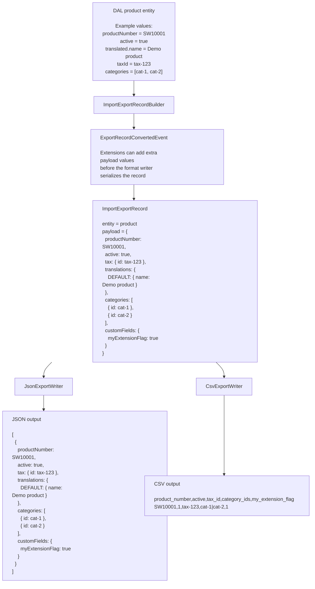
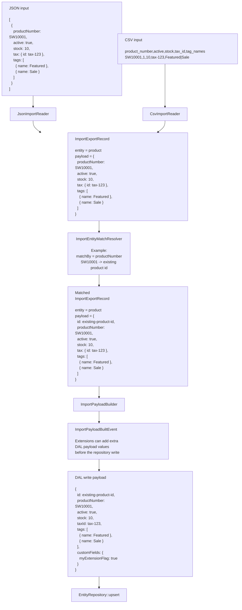

## Export flow

```mermaid

flowchart TD
    A["1. Start export run
    
RunService::startExport(profile)

Example:
profile.technicalName = product-export
profile.entity = product
profile.format = json
profile.filters = [{ type: equals, field: active, value: true }]"] --> B["2. Create file + run

FileService creates output file

Run stores:
- type = export
- profileName = product-export
- offset = 0
- limit = 100
- exportFilters = [...]"]

B --> C["3. Queue message
ProcessRunMessage(context, runId)"]

C --> D["4. Worker calls RunService::process(runId)"]

D --> E["5. Load run, file, profile

RunService loads:
- ImportExportV2RunEntity
- ImportExportV2FileEntity
- ImportExportV2ProfileEntity"]

E --> F["6. Build DAL Criteria

ExportRunProcessor creates Criteria with:
- offset from run
- limit from run
- sort by id"]

F --> G["7. Enrich Criteria with needed associations

ExportCriteriaEnricher reads profile.recordPaths

Example recordPaths:
- productNumber
- tax.id
- translations.DEFAULT.name
- categories.*.id

Adds associations:
- tax
- translations
- categories"]

G --> H["8. Apply export filters

CriteriaFilterBuilder applies run.exportFilters

Example:
active = true"]

H --> I["9. Finalize export criteria

Extensions can enrich the prepared DAL criteria here via:
- ExportCriteriaBuiltEvent

Examples:
- add extra associations
- add extension-specific filters
- refine sorting"]

I --> J["10. Search repository

repository.search(criteria, context)

Example result:
100 matching products loaded"]

J --> K["11. Build export records

ImportExportRecordBuilder maps each DAL entity
to ImportExportRecord(entity, payload)

What it does:
- reads only the paths from profile.recordPaths
- copies scalar values like productNumber
- turns foreign keys into nested objects like tax.id -> tax: { id: ... }
- reads translated values like translations.DEFAULT.name
- keeps list relations like categories.*.id as:
categories: [{ id: cat-1 }, { id: cat-2 }]

Extensions can enrich the converted record here via:
- ExportRecordConvertedEvent"]

K --> L["12. Write chunk to file

Format writer appends records:
- JsonExportWriter
- CsvExportWriter"]

L --> M["13. Advance run progress

run.processed += chunkCount
run.succeeded += chunkCount
run.offset += chunkCount
run.totalRecords = searchResult.total"]

M --> N{"14. More records left?"}

N -- "yes" --> O["Mark run queued
Dispatch next ProcessRunMessage"]

N -- "no" --> P["Mark run completed"]

```

## Example record transformation

```mermaid

flowchart TD
    A["DAL product entity

Example values:
productNumber = SW10001
active = true
translated.name = Demo product
taxId = tax-123
categories = [cat-1, cat-2]"] --> B["ImportExportRecordBuilder"]

    B --> C["ExportRecordConvertedEvent<br/><br/>Extensions can add extra payload values<br/>before the format writer serializes the record"]
    C --> D["ImportExportRecord<br/><br/>entity = product<br/>payload = {<br/>&nbsp;&nbsp;productNumber: SW10001,<br/>&nbsp;&nbsp;active: true,<br/>&nbsp;&nbsp;tax: { id: tax-123 },<br/>&nbsp;&nbsp;translations: {<br/>&nbsp;&nbsp;&nbsp;&nbsp;DEFAULT: { name: Demo product }<br/>&nbsp;&nbsp;},<br/>&nbsp;&nbsp;categories: [<br/>&nbsp;&nbsp;&nbsp;&nbsp;{ id: cat-1 },<br/>&nbsp;&nbsp;&nbsp;&nbsp;{ id: cat-2 }<br/>&nbsp;&nbsp;],<br/>&nbsp;&nbsp;customFields: {<br/>&nbsp;&nbsp;&nbsp;&nbsp;myExtensionFlag: true<br/>&nbsp;&nbsp;}<br/>}"]

    style C width:420px,text-align:left
    style D width:520px,text-align:left

    D --> E["JsonExportWriter"]
    D --> F["CsvExportWriter"]

    E --> G["JSON output<br/><br/>[<br/>&nbsp;&nbsp;{<br/>&nbsp;&nbsp;&nbsp;&nbsp;productNumber: SW10001,<br/>&nbsp;&nbsp;&nbsp;&nbsp;active: true,<br/>&nbsp;&nbsp;&nbsp;&nbsp;tax: { id: tax-123 },<br/>&nbsp;&nbsp;&nbsp;&nbsp;translations: {<br/>&nbsp;&nbsp;&nbsp;&nbsp;&nbsp;&nbsp;DEFAULT: { name: Demo product }<br/>&nbsp;&nbsp;&nbsp;&nbsp;},<br/>&nbsp;&nbsp;&nbsp;&nbsp;categories: [<br/>&nbsp;&nbsp;&nbsp;&nbsp;&nbsp;&nbsp;{ id: cat-1 },<br/>&nbsp;&nbsp;&nbsp;&nbsp;&nbsp;&nbsp;{ id: cat-2 }<br/>&nbsp;&nbsp;&nbsp;&nbsp;],<br/>&nbsp;&nbsp;&nbsp;&nbsp;customFields: {<br/>&nbsp;&nbsp;&nbsp;&nbsp;&nbsp;&nbsp;myExtensionFlag: true<br/>&nbsp;&nbsp;&nbsp;&nbsp;}<br/>&nbsp;&nbsp;}<br/>]"]
    F --> H["CSV output<br/><br/>product_number,active,tax_id,category_ids,my_extension_flag<br/>SW10001,1,tax-123,cat-1|cat-2,1"]

    style G width:520px,text-align:left
    style H width:520px,text-align:left

```

## Import flow

```mermaid

flowchart TD
    A["1. Start import run

ImportExportV2ActionController receives:
- profileName
- uploaded file

RunService::startImport(profile, uploadedFilePath, uploadedFileName)

Example:
profile.technicalName = product-import
profile.entity = product
profile.format = json
profile.matchBy = productNumber
uploadedFileName = products.json"] --> B["2. Copy source file + create run

FileService copies the uploaded file into managed storage

Run stores:
- type = import
- profileName = product-import
- offset = 0
- limit = 100
- nextByteOffset = null"]

B --> C["3. Queue message
ProcessRunMessage(context, runId)"]

C --> D["4. Worker calls RunService::process(runId)"]

D --> E["5. Load run, file, profile

RunService loads:
- ImportExportV2RunEntity
- ImportExportV2FileEntity
- ImportExportV2ProfileEntity"]

E --> F["6. Read next chunk

JsonImportReader or CsvImportReader reads:
- offset
- limit
- nextByteOffset

On the first chunk the reader creates one reusable
local working copy so later chunks can resume with
stable fseek/ftell semantics without recopying the
managed file on every chunk

Parsed file rows/objects are normalized into:
- ImportExportRecord(entity, payload)

Returns:
- records
- hasMore
- totalRecords
- nextByteOffset"]

F --> G["7. Validate imported records

ImportRecordValidator checks:
- record entity matches profile entity
- payload only contains allowed recordPaths

Records may still be only a subset of recordPaths"]

G --> H["8. Match existing root entities

ImportEntityMatchResolver uses profile.matchBy

Example:
matchBy = productNumber
SW10001 -> existing product id

Matched ids are injected into record.payload.id"]

H --> I["9. Build DAL write payloads

ImportPayloadBuilder converts records into DAL-friendly payloads

Examples:
tax.id -> taxId
tags.*.name stays nested
customFields.exportedPrice.unitPrice stays nested

Extensions can enrich the write payload here via:
- ImportPayloadBuiltEvent"]

I --> J["10. Write chunk through DAL

ImportRunProcessor tries:
- one batch upsert first
- one-by-one retry on batch failure"]

J --> K["11. Export invalid records

Failed records keep their payload
plus one additional _error field

They are written into a separate
JSON or CSV invalid-records file"]

K --> L["12. Advance run progress

run.processed += chunkCount
run.succeeded += successfulWrites
run.failed += failedWrites
run.offset += chunkCount
run.nextByteOffset = chunk.nextByteOffset"]

L --> M{"13. More records left?"}

M -- "yes" --> N["Mark run queued
Dispatch next ProcessRunMessage"]

M -- "no" --> O{"14. Import had failures?"}

O -- "yes" --> P["Mark run failed
invalidRecordsFileId points to the
generated invalid-records file"]

O -- "no" --> Q["Mark run completed"]

```

## Example import record transformation

```mermaid

flowchart TD
    A["JSON input<br/><br/>[<br/>&nbsp;&nbsp;{<br/>&nbsp;&nbsp;&nbsp;&nbsp;productNumber: SW10001,<br/>&nbsp;&nbsp;&nbsp;&nbsp;active: true,<br/>&nbsp;&nbsp;&nbsp;&nbsp;stock: 10,<br/>&nbsp;&nbsp;&nbsp;&nbsp;tax: { id: tax-123 },<br/>&nbsp;&nbsp;&nbsp;&nbsp;tags: [<br/>&nbsp;&nbsp;&nbsp;&nbsp;&nbsp;&nbsp;{ name: Featured },<br/>&nbsp;&nbsp;&nbsp;&nbsp;&nbsp;&nbsp;{ name: Sale }<br/>&nbsp;&nbsp;&nbsp;&nbsp;]<br/>&nbsp;&nbsp;}<br/>]"]
    B["CSV input<br/><br/>product_number,active,stock,tax_id,tag_names<br/>SW10001,1,10,tax-123,Featured|Sale"]
    C["JsonImportReader"]
    D["CsvImportReader"]
    E["ImportExportRecord<br/><br/>entity = product<br/>payload = {<br/>&nbsp;&nbsp;productNumber: SW10001,<br/>&nbsp;&nbsp;active: true,<br/>&nbsp;&nbsp;stock: 10,<br/>&nbsp;&nbsp;tax: { id: tax-123 },<br/>&nbsp;&nbsp;tags: [<br/>&nbsp;&nbsp;&nbsp;&nbsp;{ name: Featured },<br/>&nbsp;&nbsp;&nbsp;&nbsp;{ name: Sale }<br/>&nbsp;&nbsp;]<br/>}"]

    style A width:500px,text-align:left
    style B width:500px,text-align:left
    style E width:500px,text-align:left

    A --> C
    B --> D
    C --> E
    D --> E

    E --> F["ImportEntityMatchResolver

Example:
matchBy = productNumber
SW10001 -> existing product id"]

    F --> G["Matched ImportExportRecord<br/><br/>entity = product<br/>payload = {<br/>&nbsp;&nbsp;id: existing-product-id,<br/>&nbsp;&nbsp;productNumber: SW10001,<br/>&nbsp;&nbsp;active: true,<br/>&nbsp;&nbsp;stock: 10,<br/>&nbsp;&nbsp;tax: { id: tax-123 },<br/>&nbsp;&nbsp;tags: [<br/>&nbsp;&nbsp;&nbsp;&nbsp;{ name: Featured },<br/>&nbsp;&nbsp;&nbsp;&nbsp;{ name: Sale }<br/>&nbsp;&nbsp;]<br/>}"]

    style G width:500px,text-align:left

    G --> H["ImportPayloadBuilder"]

    H --> I["ImportPayloadBuiltEvent<br/><br/>Extensions can add extra DAL payload values<br/>before the repository write"]
    I --> J["DAL write payload<br/><br/>{<br/>&nbsp;&nbsp;id: existing-product-id,<br/>&nbsp;&nbsp;productNumber: SW10001,<br/>&nbsp;&nbsp;active: true,<br/>&nbsp;&nbsp;stock: 10,<br/>&nbsp;&nbsp;taxId: tax-123,<br/>&nbsp;&nbsp;tags: [<br/>&nbsp;&nbsp;&nbsp;&nbsp;{ name: Featured },<br/>&nbsp;&nbsp;&nbsp;&nbsp;{ name: Sale }<br/>&nbsp;&nbsp;],<br/>&nbsp;&nbsp;customFields: {<br/>&nbsp;&nbsp;&nbsp;&nbsp;myExtensionFlag: true<br/>&nbsp;&nbsp;}<br/>}"]

    style I width:420px,text-align:left
    style J width:520px,text-align:left

    J --> K["EntityRepository::upsert"]

```
