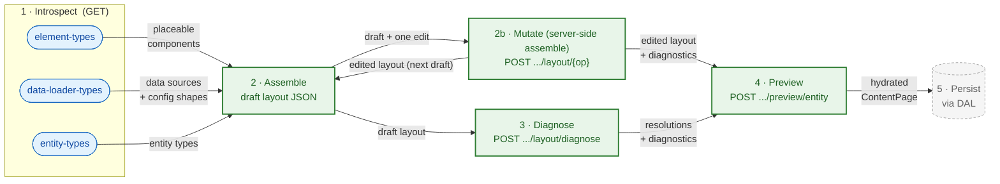

# Administration Integration

Admin API surface the Administration (and admin API clients such as AI-assisted layout generators) use to build content layouts. Five endpoint families: **introspection** (what building blocks exist), **mutation** (apply one structural edit to a draft server-side and get back the re-resolved layout with diagnostics), **persisted mutation** (apply one structural edit to a stored layout and commit it through the resolvability gates), **resolve-and-diagnose** (what is structurally broken or still unresolved in a draft, without rendering it), and **preview** (how a draft layout renders against real data before it is saved).

**Scope:** Admin API only (`/api/...`). Store API rendering routes (`/store-api/content*`) are covered in [USAGE.md](USAGE.md) and [SalesChannel/README.md](SalesChannel/README.md). Registering new building blocks (element types, data loaders, specification sources) is covered in [EXTENSION.md](EXTENSION.md).

## Workflow



Mutate (step 2b), diagnose (step 3), and preview (step 4) are all write-free and may run repeatedly while editing. Mutate is the assemble step done server-side: it applies one structural edit and returns the edited layout already carrying its diagnostics, so a caller that edits through it does not also call diagnose. Diagnose checks a draft tree without hydrating real entity data; preview is the only write-free step that renders against real data. Persistence (step 5) is handled through the DAL and is out of scope for this document.

## Introspection Endpoints

All three are `GET`, return JSON, require Admin API auth, and are served by `Framework/Api/Controller/InfoController`. They are introspection over what is registered at build time, so their content grows as plugins and apps register more types (see [EXTENSION.md](EXTENSION.md)).

The response envelope shown under each endpoint below is the human summary. The authoritative, field-level response schema is the OpenAPI path file linked at the end of each section.

### Element types

`GET /api/_info/content-system-element-types.json`

The registered element types (components) that may be placed in a layout, each with its property schema, slots, and context contract. Backed by the element-type registry (`Layout/Type/Registry`), serialized via `ContentSystemElementTypeSpecification::toSchema()`.

Response:

```json
{
  "types": [
    {
      "name": "Sw:Product:Card",
      "label": "Product Card",
      "description": "...",
      "source": "core",
      "icon": null,
      "category": null,
      "copilot": { "summary": "...", "hints": ["..."] },
      "properties": {
        "<propertyName>": {
          "type": "string",
          "translatable": false,
          "enum": null,
          "default": null,
          "required": true,
          "title": "...",
          "description": "...",
          "adminUI": null
        }
      },
      "slots": [
        { "name": "actions", "maxElements": 3, "allowList": ["Sw:Content:Button"], "description": "..." }
      ]
    }
  ]
}
```

`source` is `core`, `bundle:<name>`, `plugin:<name>`, or `app:<name>`; a property `type` is a primitive name (`string`, `boolean`, `integer`, `number`) or an FQCN for hydrated data.

Full field-level schema: [content-system-element-types.json](../Api/ApiDefinition/Generator/Schema/AdminApi/paths/content-system-element-types.json).

A custom element type registered by a plugin or app ([EXTENSION.md → Custom Element Types](EXTENSION.md#custom-element-types)) appears here once registered.

### Data loader types

`GET /api/_info/content-system-data-loader-types.json`

The data sources a `data_requirements` entry may use (`source` values such as `entity`, `entity_collection`, `product_listing`, `navigation`, …), each mapped to the capabilities it can produce. Backed by `Schema/ContentSystemDataLoaderTypeSchemaGenerator::getSchema()`, assembled at runtime by `ContentSystemDataLoaderTypeResolver` from each loader's `producibleTypes()`.

Response:

```json
{
  "sources": {
    "<source>": {
      "types": [
        {
          "producedType": "<FQCN>",
          "configTemplate": { "entity": "product" },
          "requiredConfigKeys": ["property"],
          "genericParameters": ["<FQCN>"]
        }
      ]
    }
  }
}
```

`<source>` is the `data_requirements` source value (`entity`, `product_listing`, …); each entry pairs the produced type (the sales-channel class where one exists) with the config seed needed to produce it — `configTemplate` carries the inferable keys, `requiredConfigKeys` lists the keys the caller must still supply.

Full field-level schema: [content-system-data-loader-types.json](../Api/ApiDefinition/Generator/Schema/AdminApi/paths/content-system-data-loader-types.json).

A custom data loader ([EXTENSION.md → Custom Data Loaders](EXTENSION.md#custom-data-loaders)) appears here. Wildcard loaders (`entity`, `entity_collection`) enumerate the live definition registry inside `producibleTypes()`.

### Entity types

`GET /api/_info/content-system-entity-types.json`

The entity types a layout can be assigned to and previewed against (`product`, `category`, `landing_page`, plus any custom assignable entity). Backed by `Adapter/RootSourceRegistry::entityRootSources()`, whose entity-type id list is baked in at build time by `ContentLayoutAssignableCompilerPass`.

Response:

```json
{
  "entityTypes": ["product", "category", "landing_page"]
}
```

A flat array of DAL entity names that support content layout assignment. The values returned here are exactly the `entityType` values the preview endpoint accepts.

Full field-level schema: [content-system-entity-types.json](../Api/ApiDefinition/Generator/Schema/AdminApi/paths/content-system-entity-types.json).

## Preview Endpoint

`POST /api/_action/content-system/preview/entity`

Renders an externally supplied, **unsaved** draft layout against **real** entity data and returns a fully hydrated `ContentPage` in full format. The layout is neither persisted nor required to have an assignment. The target entity only needs to exist. Served by `Api/ContentPreviewController`. Route name: `api.action.content_system.preview.entity`.

### Request

```json
{
  "layout": [
    {
      "id": "element-uuid",
      "component": "shopware/product-heading",
      "properties": { "tag": "h1" },
      "data_requirements": {
        "product": { "key": "product", "source": "entity", "config": { "entity": "product", "property": "product_id" } }
      },
      "slots": {},
      "provides_context": {},
      "accepts_context": {}
    }
  ],
  "entityType": "product",
  "entityId": "abc-123-def-456",
  "salesChannelId": "def-456-ghi-789",
  "languageId": null,
  "currencyId": null,
  "domainId": null,
  "customerId": null,
  "queryParameters": { "elementId": "optional-element-id" }
}
```

| Field                                                | Required | Notes                                                                                                                        |
|------------------------------------------------------|----------|------------------------------------------------------------------------------------------------------------------------------|
| `layout`                                             | yes      | Raw element-tree array; decoded through the same path as a stored layout (`ContentElementFieldSerializer::decodeElement()`). |
| `entityType`                                         | yes      | One of the `content-system-entity-types.json` values; selected by exact match, never as a URL segment.                       |
| `entityId`                                           | yes      | Id of the entity to hydrate against; the entity must exist.                                                                  |
| `salesChannelId`                                     | yes      | Sales channel whose context is synthesized for rendering.                                                                    |
| `languageId`, `currencyId`, `domainId`, `customerId` | no       | Override the synthesized sales channel context.                                                                              |
| `queryParameters`                                    | no       | Forwarded as request query; `elementId` selects a single element for partial preview.                                        |

### Response

The full-format `ContentPage`, serialized through the full-format response factory, using the same structure as the Store API full format. No caching. The preview always renders fresh.

### Errors

Envelope and intrinsic-layout failures are rejected with `400 Bad Request` (`ContentSystemException`). Unlike diagnose and mutate, preview renders against real entity data, so a fault raised during hydration keeps its own status instead of collapsing to 400 (see the HTTP column):

| Condition                                                                                                      | HTTP      | Factory / source                                                                                                      |
|----------------------------------------------------------------------------------------------------------------|-----------|-----------------------------------------------------------------------------------------------------------------------|
| Missing/invalid envelope field                                                                                 | 400       | `#[MapRequestPayload]` validation (forced to 400)                                                                     |
| `entityType` matches no specification source                                                                   | 400       | `unknownEntityType`                                                                                                   |
| Layout element missing a non-empty string `id`/`component`; a duplicate element `id`, nesting past the maximum depth, or a non-array nested child; or an element config that is a client defect | 400 | `invalidLayoutStructure` |
| Layout has an intrinsic error the structural decode does not catch: an unregistered `component`, or an element config a bound source rejects (`invalid_config`) | 400 | `elementTypesInvalid` (via `DraftLayoutChecker`, which surfaces every intrinsic-scope error from `LayoutDiagnostics`) |
| Target entity not found / unresolvable data requirement                                                        | 500       | data-loader / hydration exception (e.g. `ContentSystemException::dataLoaderNotRegistered`)                            |
| Invalid sales channel id                                                                                       | 404 / 412 | `SalesChannelException` (not a `ContentSystemException`)                                                              |

### Preview URL

`POST /api/_action/content-system/preview/entity/url`

Stores the **same envelope** as the entity preview action behind a short-lived token and returns a URL that renders it, so a draft can be opened or embedded (for example in an editor iframe) without re-posting the layout. Served by `Api/ContentPreviewController::previewUrl`. Route name: `api.action.content_system.preview.entity.url`. Requires the `content_layout:read` privilege.

The payload is held by `Api/ContentPreviewPayloadStore` under a 32-character token in the application cache for five minutes (`expiresAfter(300)`), never in the database. The returned URL points at the Storefront render route `GET /content-system/preview/{token}` (`frontend.content-system.preview`), which loads the payload back, builds the page through the same `ContentPreviewPageBuilder`, and serves the full-format `ContentPage` as an embeddable page (its `frame-ancestors` CSP is derived from the request `Referer`). An expired or unknown token renders a `404`.

#### Request

Identical to the entity preview action: the same `ContentPreviewRequest` envelope (see the table above).

#### Response

`200 OK` with a single field; the layout is stored, not rendered here:

```json
{ "url": "https://<host>/content-system/preview/<token>" }
```

#### Errors

| Condition                           | HTTP | Factory / source                                    |
|-------------------------------------|------|-----------------------------------------------------|
| Missing/invalid envelope field      | 400  | `#[MapRequestPayload]` validation (forced to 400)   |
| The cache rejects the payload write | 500  | `ContentSystemException::previewPayloadStoreFailed` |

Entity resolution and hydration do not run at mint time; they happen when the returned URL is opened, so `unknownEntityType` and hydration faults surface on the Storefront render route, not here.

## Resolve-and-Diagnose Endpoint

`POST /api/_action/content-system/layout/diagnose`

Resolves every element property of an **unsaved** draft layout and reports what is structurally broken or still unresolved — **without** persisting and **without** rendering against a real entity. It answers the editor's after-local-edit "what is broken / still unresolved" question and backs agent layout linting. Served by `Api/ContentDiagnoseController`. Route name: `api.action.content_system.layout.diagnose`.

The optional `rootSource` binds the draft to that root source's context so binding-scope resolvability can be checked. Without it, only intrinsic well-formedness is evaluated. The value is resolved through `Adapter/RootSourceRegistry::resolve()` (an entity type, a section id such as `header`/`footer`, or `none`).

### Request

```json
{
  "layout": [
    {
      "id": "element-uuid",
      "component": "shopware/product-heading",
      "properties": { "tag": "h1" },
      "data_requirements": {},
      "slots": {},
      "provides_context": {},
      "accepts_context": {}
    }
  ],
  "rootSource": "product"
}
```

| Field        | Required | Notes                                                                                                                                                                                                                         |
|--------------|----------|-------------------------------------------------------------------------------------------------------------------------------------------------------------------------------------------------------------------------------|
| `layout`     | no       | Raw element-tree array; decoded through the same path as a stored layout (`ContentElementFieldSerializer::decodeElement()`). Defaults to an empty tree when omitted.                                                          |
| `rootSource` | no       | The root source whose context the draft is checked against: an entity type (`content-system-entity-types.json` value), a section id (`header`, `footer`), or `none`. Resolved through `Adapter/RootSourceRegistry`. An unknown non-empty value is rejected with 400 (`unknownRootSource`). |

With `rootSource` empty or omitted, the response still reports intrinsic well-formedness; binding-scope violations are not evaluated because no root source is bound.

### Response

`200 OK` with `{ resolutions, diagnostics }` — never persisted, never cached.

```json
{
  "resolutions": {
    "<elementId>": [
      {
        "key": "title",
        "kind": "reference",
        "required": true,
        "type": "string",
        "default": null,
        "fqcn": null,
        "resolved": {
          "origin": "loader",
          "contextKey": null,
          "providerElementId": null,
          "path": null,
          "distribution": null,
          "contextType": null,
          "loaderSource": "entity",
          "configTemplate": { "entity": "product" },
          "configComplete": true
        },
        "candidates": []
      }
    ]
  },
  "diagnostics": {
    "wellFormed": true,
    "resolvable": false,
    "violations": [
      {
        "code": "unresolved_required",
        "scope": "binding",
        "severity": "error",
        "elementId": "element-uuid",
        "key": "title",
        "message": "...",
        "candidates": []
      }
    ]
  }
}
```

`resolutions` is keyed by element id; each entry is the list of that element's declared properties with how each is (or is not) filled, and encodes as `{}` when empty (never `[]`). `kind` is `primitive` or `reference`; a `reference` property carries a `resolved` candidate (or `null`) and the full `candidates` list. A candidate's `origin` is `parent` (an ancestor/root provider) or `loader` (a data loader).

`diagnostics.wellFormed` is true when there are no intrinsic-scope error violations (the persistence gate predicate); `diagnostics.resolvable` is true when there are no binding-scope error violations (the serving gate predicate, meaningful only when a source was bound). Each violation derives its `scope` and `severity` from its `code`:

| `code`                   | `scope`   | `severity` |
|--------------------------|-----------|------------|
| `unregistered_component` | intrinsic | error      |
| `duplicate_element_id`   | intrinsic | error      |
| `invalid_config`         | intrinsic | error      |
| `orphaned_provider`      | intrinsic | warning    |
| `unresolved_required`    | binding   | error      |
| `ambiguous_required`     | binding   | error      |
| `broken_required_chain`  | binding   | error      |
| `unresolved_optional`    | binding   | warning    |

### Errors

A malformed element **config** is reported as an `invalid_config` violation in the body (HTTP 200), not as an error — that is the point of the endpoint. Only the conditions below abort the request (`ContentSystemException`):

| Condition                                                  | HTTP | Factory                                           |
|------------------------------------------------------------|------|---------------------------------------------------|
| Missing/invalid envelope field                             | 400  | `#[MapRequestPayload]` validation (forced to 400) |
| `rootSource` is a non-empty value not registered in `RootSourceRegistry` | 400  | `unknownRootSource` (the route gates membership against `RootSourceRegistry::knownRootSources()` before resolving, the same as the write validator) |
| Layout element missing a non-empty string `id`/`component` | 400  | `invalidLayoutStructure`                          |

An internal fault during decoding (a non-client-defect `ContentSystemException`, e.g. an unexpected field type) propagates rather than being relabelled as an `invalid_config` violation — see `ContentSystemException::isClientDefect()`.

## Mutation Endpoints

```
POST /api/_action/content-system/layout/insert-element
POST /api/_action/content-system/layout/remove-element
POST /api/_action/content-system/layout/move-element
POST /api/_action/content-system/layout/replace-element
POST /api/_action/content-system/layout/duplicate-element
POST /api/_action/content-system/layout/wrap-elements
POST /api/_action/content-system/layout/unwrap-element
POST /api/_action/content-system/layout/attach-element
```

Apply exactly one structural edit to an **unsaved** draft layout and return the re-resolved layout plus a diagnostics report, **without** persisting. This is the assemble step done server-side: the caller sends the current draft tree and one edit, and gets back the edited, freshly diagnosed tree, ready to feed straight into the next edit or into preview. Served by `Api/LayoutMutationController`; route names follow `api.action.content_system.layout.<op>`, where `<op>` is `insert_element`, `remove_element`, `move_element`, `replace_element`, `duplicate_element`, `wrap_elements`, `unwrap_element`, or `attach_element`.

Because each response already carries the diagnostics, a caller editing through these endpoints does not also call the diagnose endpoint. The optional `rootSource` binds that root source's context for binding-scope resolvability, using the same `Adapter/RootSourceRegistry::resolve()` selection as the diagnose endpoint (empty or omitted → only intrinsic well-formedness is evaluated).

### Request

Every action shares one envelope and adds its own operation fields. Shared fields: `layout` (raw element-tree array, decoded through the same `ContentElementFieldSerializer::decodeElement()` path as a stored layout; defaults to an empty tree), `rootSource` (optional).

| Endpoint            | Operation fields                                                                                                                                                                                    |
|---------------------|-----------------------------------------------------------------------------------------------------------------------------------------------------------------------------------------------------|
| `insert-element`    | `type` (required); `parentElementId` (optional, root when omitted); `slot` (required when a parent is given); `index` (optional)                                                                    |
| `remove-element`    | `elementId` (required)                                                                                                                                                                              |
| `move-element`      | `elementId` (required); `newParentId` (optional, root when omitted); `newSlot` (required unless a same-parent move reuses the current slot); `index` (optional)                                     |
| `replace-element`   | `elementId` (required); `newType` (required)                                                                                                                                                        |
| `duplicate-element` | `elementId` (required); `index` (optional, next sibling when omitted)                                                                                                                               |
| `wrap-elements`     | `elementIds` (required, a non-empty list of ids that are siblings in one slot, or all roots); `containerType` (required); `slot` (required)                                                         |
| `unwrap-element`    | `containerElementId` (required)                                                                                                                                                                     |
| `attach-element`    | `element` (required, a raw element subtree to splice in; every id in it is reminted); `parentElementId` (optional, root when omitted); `slot` (required when a parent is given); `index` (optional) |

`index` is clamped, never rejected: a null, negative, or out-of-range `index` appends at the end of the target list.

`attach-element` is the inverse of the detachment a `replace` reports: hand its `orphaned` subtrees (or any copied subtree) back to `attach-element` to re-place them. Ids are server-minted, so the placed elements get fresh ids returned in `affectedElementIds`.

Example (`insert-element`):

```json
{
  "layout": [ { "id": "container-uuid", "component": "shopware/container", "slots": { "content": [] } } ],
  "type": "Sw:Content:Text",
  "parentElementId": "container-uuid",
  "slot": "content",
  "index": 0,
  "rootSource": "product"
}
```

### Response

`200 OK`, never persisted, never cached:

```json
{
  "layout": [ ... ],
  "resolutions": { "<elementId>": [ ... ] },
  "diagnostics": { "wellFormed": true, "resolvable": false, "violations": [ ... ] },
  "affectedElementIds": ["<elementId>"],
  "orphaned": [ ... ],
  "droppedWiring": ["<wiringKey>"],
  "droppedProperties": { "<propertyKey>": "<droppedValue>" }
}
```

| Field                | Notes                                                                                                                                                                                              |
|----------------------|----------------------------------------------------------------------------------------------------------------------------------------------------------------------------------------------------|
| `layout`             | The full edited tree, serialized the same way a stored layout is.                                                                                                                                  |
| `resolutions`        | Per-element resolutions, restricted to the affected elements. Same shape as the Resolve-and-Diagnose response (both routes share `LayoutDiagnosticsResultNormalizer`); encodes as `{}` when empty. |
| `diagnostics`        | The well-formedness / resolvability report, identical in shape to the Resolve-and-Diagnose response. The authoritative correctness output.                                                         |
| `affectedElementIds` | Elements whose resolution may have changed. A highlight hint for the editor; `diagnostics` is the authority.                                                                                       |
| `orphaned`           | Subtrees the edit detached (for example, a replace dropping the children of a slot the new type does not have), serialized as elements so the caller can re-place them.                            |
| `droppedWiring`      | Wiring keys the edit could not keep (for example, a replace to a type without that reference property), so the caller can re-wire.                                                                 |
| `droppedProperties`  | Static property values the edit could not carry to the new type (key absent, or a value the type rejects), keyed by property key, so the caller can re-apply them; encodes as `{}` when empty.     |

Nothing the edit detaches or drops is silently lost: it is always returned through `orphaned`, `droppedWiring`, or `droppedProperties`.

### Errors

A resolvability problem (an unresolved required property, a broken context chain) is reported in the `diagnostics` body at HTTP 200, not as an error. Only the conditions below abort the request (`ContentSystemException`); the structural impossibilities are `400 Bad Request`:

| Condition                                                                                                | HTTP | Factory                                           |
|----------------------------------------------------------------------------------------------------------|------|---------------------------------------------------|
| Missing/invalid envelope field                                                                           | 400  | `#[MapRequestPayload]` validation (forced to 400) |
| A referenced element id is not in the layout                                                             | 400  | `mutationTargetNotFound`                          |
| Moving an element into itself or a descendant                                                            | 400  | `mutationCycle`                                   |
| Inserting into a parent, moving under a different parent, or wrapping, without naming the target slot    | 400  | `mutationSlotRequired`                            |
| Wrap targets are empty, or not in one container (must be siblings in a single slot, or all root-level)   | 400  | `mutationInvalidWrapTargets`                      |
| `type` / `newType` / `containerType` is not a registered element type                                    | 400  | `mutationUnknownType`                             |
| Layout element missing a non-empty string `id`/`component`; a duplicate element `id`, nesting past the maximum depth, or a non-array nested child (rejected before the edit runs); or an element config that is a client defect | 400 | `invalidLayoutStructure`                          |
| `rootSource` is a non-empty value not registered in `RootSourceRegistry`                                 | 400  | `unknownRootSource` (the route gates membership against `RootSourceRegistry::knownRootSources()` before resolving, the same as the write validator) |

## Persisted Mutation Endpoints

```
POST /api/_action/content-system/layout/{layoutId}/insert-element
POST /api/_action/content-system/layout/{layoutId}/remove-element
POST /api/_action/content-system/layout/{layoutId}/move-element
POST /api/_action/content-system/layout/{layoutId}/replace-element
POST /api/_action/content-system/layout/{layoutId}/duplicate-element
POST /api/_action/content-system/layout/{layoutId}/wrap-elements
POST /api/_action/content-system/layout/{layoutId}/unwrap-element
POST /api/_action/content-system/layout/{layoutId}/attach-element
```

The persisted counterpart to the mutation endpoints above, for agents and automation operating on a **stored** layout. Each applies exactly one structural edit to the `content_layout` named in the path and **commits** the result, returning the same re-resolved layout plus diagnostics. The committing write runs the resolvability gates, so a persisted edit that breaks resolvability for a bound source is rejected and nothing is written. Served by `Api/ContentLayoutMutationController`; route names follow `api.action.content_system.layout.persisted_<op>`.

Unlike the stateless mutation endpoints, these load the tree from storage (so there is no `layout` field in the body) and derive binding-scope diagnostics from the layout's own immutable `root_source` (so there is no `rootSource` hint in the body).

> **Concurrency:** `expectedVersion` is a pragmatic interim token built on the row's `updatedAt`, compared at millisecond precision (the storage precision). On its own it is not a compare-and-swap, so the lost-update window it would otherwise leave open is closed by serializing concurrent writers: `PersistedLayoutMutator::mutate()` holds a named lock keyed by layout id across the load → version-check → commit span. A second writer that started from the same revision blocks on that lock, then re-reads the now-bumped `updatedAt`, fails the version check, and gets a `409` instead of clobbering the first edit. A real layout versioning system (draft/published revisions with explicit version identifiers) is still planned and will supersede this interim token with richer version identifiers.

### Request

The layout is named in the path. Every body carries the operation's fields (identical to the stateless endpoints, minus the shared envelope) plus `expectedVersion`.

| Field             | Required       | Notes                                                                                                                                                                                                                                                                                                                                                                                                                                                         |
|-------------------|----------------|---------------------------------------------------------------------------------------------------------------------------------------------------------------------------------------------------------------------------------------------------------------------------------------------------------------------------------------------------------------------------------------------------------------------------------------------------------------|
| `expectedVersion` | yes (nullable) | Optimistic-concurrency token: the layout's `updatedAt` as last read. `null` for a never-updated layout. A mismatch is a `409`, an unparseable token a `400`, and nothing is written in either case.                                                                                                                                                                                                                                                                                                         |
| operation fields  | per op         | `insert-element`: `type` (+ `parentElementId`, `slot`, `index`); `remove-element`: `elementId`; `move-element`: `elementId` (+ `newParentId`, `newSlot`, `index`); `replace-element`: `elementId`, `newType`; `duplicate-element`: `elementId` (+ `index`); `wrap-elements`: `elementIds`, `containerType`, `slot`; `unwrap-element`: `containerElementId`; `attach-element`: `element` (a raw subtree, ids reminted) (+ `parentElementId`, `slot`, `index`). |

Example (`replace-element`):

```json
{
  "elementId": "block-uuid",
  "newType": "Sw:Content:Text",
  "expectedVersion": "2026-06-22T10:00:00.000+00:00"
}
```

### Response

`200 OK` with the same `{ layout, resolutions, diagnostics, affectedElementIds, orphaned, droppedWiring, droppedProperties }` shape as the stateless endpoints — but the layout is now committed. A `replace` that detaches the children of a slot the new type does not have commits the tree **without** them and returns them in `orphaned` (and any static property values the new type cannot hold in `droppedProperties`); nothing is silently lost, and the caller re-places them with an `attach-element` call. `diagnostics` reflects the layout's own immutable `root_source`, resolved once: the binding-scope violations are those for that single root source.

### Errors

In addition to the structural `400`s of the stateless endpoints (`mutationTargetNotFound`, `mutationCycle`, `mutationSlotRequired`, `mutationInvalidWrapTargets`, `mutationUnknownType`, `#[MapRequestPayload]` validation):

| Condition                                                                         | HTTP | Factory / source                                                                                                                            |
|-----------------------------------------------------------------------------------|------|---------------------------------------------------------------------------------------------------------------------------------------------|
| `{layoutId}` names no stored layout                                               | 404  | `contentLayoutNotFound`                                                                                                                     |
| `expectedVersion` does not match the layout's current `updatedAt`                 | 409  | `layoutVersionConflict` (no write)                                                                                                          |
| `expectedVersion` is not a parseable date-time                                    | 400  | `invalidVersionToken` (no write)                                                                                                            |
| The committed edit breaks resolvability for a bound source, or is not well-formed | 400  | `ContentLayoutWriteValidator` rejects the `content_layout` write (`WriteException`); the binding-scope violations ride in the error payload |

Detached content (`orphaned`), dropped wiring (`droppedWiring`), and dropped property values (`droppedProperties`) are **committed-out and reported**, never rejected: the stored tree omits them and the response hands them back, so the caller re-places subtrees with `attach-element`, re-wires the keys, or re-applies the values. The new type structurally has no home for dropped wiring, and no operation edits a surviving element's wiring.

## Related

- [USAGE.md](USAGE.md): authoring layouts, data requirements, response formats, Store API sections
- [EXTENSION.md](EXTENSION.md): registering the element types, data loaders, and entity types these endpoints expose
- [Api/](Api/README.md): the preview, diagnose, and mutation controller implementations
- [Mutation/](Mutation/README.md): the structural edit operations behind the mutation endpoints
- [SalesChannel/](SalesChannel/README.md): the Store API rendering routes
