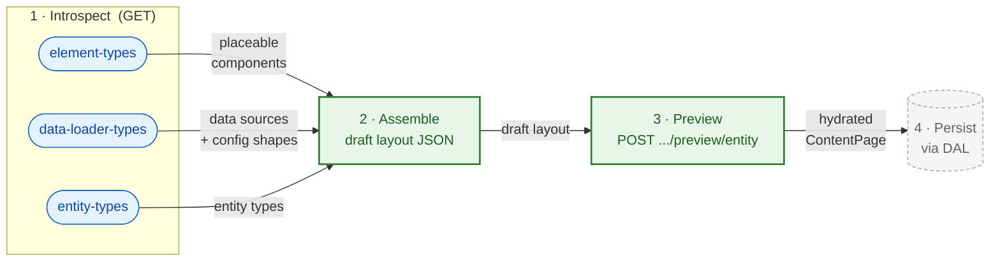

# Administration Integration

Admin API surface the Administration (and admin API clients such as AI-assisted layout generators) use to build content layouts. Two endpoint families: **introspection** (what building blocks exist) and **preview** (how a draft layout renders against real data before it is saved).

**Scope:** Admin API only (`/api/...`). Store API rendering routes (`/store-api/content*`) are covered in [USAGE.md](USAGE.md) and [SalesChannel/README.md](SalesChannel/README.md). Registering new building blocks (element types, data loaders, specification sources) is covered in [EXTENSION.md](EXTENSION.md).

## Workflow



The preview endpoint is the only write-free step that touches real data; persistence (step 4) is handled through the DAL and is out of scope for this document.

## Introspection Endpoints

All three are `GET`, return JSON, require Admin API auth, and are served by `Framework/Api/Controller/InfoController`. They are introspection over what is registered at build time, so their content grows as plugins and apps register more types (see [EXTENSION.md](EXTENSION.md)).

The response envelope shown under each endpoint below is the human summary. The authoritative, field-level response schema is the OpenAPI path file linked at the end of each section.

### Element types

`GET /api/_info/content-system-element-types.json`

The registered element types (components) that may be placed in a layout, each with its property schema, slots, and context contract. Backed by the element-type registry (`Layout/Type/Registry`), serialized via `ContentSystemElementTypeSpecification::toSchema()`.

Response:

```json
{
  "types": [
    {
      "name": "Sw:Product:Card",
      "label": "Product Card",
      "description": "...",
      "source": "core",
      "icon": null,
      "category": null,
      "copilot": { "summary": "...", "hints": ["..."] },
      "properties": {
        "<propertyName>": {
          "type": "string",
          "translatable": false,
          "enum": null,
          "default": null,
          "required": true,
          "title": "...",
          "description": "...",
          "adminUI": null
        }
      },
      "slots": [
        { "name": "actions", "maxElements": 3, "allowList": ["Sw:Content:Button"], "description": "..." }
      ]
    }
  ]
}
```

`source` is `core`, `plugin:<name>`, or `app:<name>`; a property `type` is a primitive name (`string`, `boolean`, `integer`, `number`) or an FQCN for hydrated data.

Full field-level schema: [content-system-element-types.json](../Api/ApiDefinition/Generator/Schema/AdminApi/paths/content-system-element-types.json).

A custom element type registered by a plugin or app ([EXTENSION.md → Custom Element Types](EXTENSION.md#custom-element-types)) appears here once registered.

### Data loader types

`GET /api/_info/content-system-data-loader-types.json`

The data sources a `data_requirements` entry may use (`source` values such as `entity`, `entity_collection`, `product_listing`, `navigation`, …), each mapped to the type(s) it produces. Backed by `Schema/ContentSystemDataLoaderTypeSchemaGenerator::getSchema()`, populated at build time by `ContentSystemDataLoaderTypeCompilerPass`.

Response:

```json
{
  "sources": {
    "<source>": {
      "types": [
        { "className": "<FQCN>", "genericParameters": ["<FQCN>"] }
      ]
    }
  }
}
```

`<source>` is the `data_requirements` source value (`entity`, `product_listing`, …); each entry lists the produced data type's class name and its generic parameters.

Full field-level schema: [content-system-data-loader-types.json](../Api/ApiDefinition/Generator/Schema/AdminApi/paths/content-system-data-loader-types.json).

A custom data loader ([EXTENSION.md → Custom Data Loaders](EXTENSION.md#custom-data-loaders)) appears here. Wildcard loaders expand at runtime via `ContentSystemDataLoaderTypesResolvedEvent`.

### Entity types

`GET /api/_info/content-system-entity-types.json`

The entity types a layout can be assigned to and previewed against (`product`, `category`, `landing_page`, plus any custom assignable entity). Backed by `Schema/ContentLayoutAssignableEntitySchemaGenerator::getSchema()`, populated at build time by `ContentLayoutAssignableCompilerPass`.

Response:

```json
{
  "entityTypes": ["product", "category", "landing_page"]
}
```

A flat array of DAL entity names that support content layout assignment. The values returned here are exactly the `entityType` values the preview endpoint accepts.

Full field-level schema: [content-system-entity-types.json](../Api/ApiDefinition/Generator/Schema/AdminApi/paths/content-system-entity-types.json).

## Preview Endpoint

`POST /api/_action/content-system/preview/entity`

Renders an externally supplied, **unsaved** draft layout against **real** entity data and returns a fully hydrated `ContentPage` in full format. The layout is neither persisted nor required to have an assignment. The target entity only needs to exist. Served by `Api/ContentPreviewController`. Route name: `api.action.content_system.preview.entity`.

### Request

```json
{
  "layout": [
    {
      "id": "element-uuid",
      "component": "shopware/product-heading",
      "properties": { "tag": "h1" },
      "data_requirements": {
        "product": { "key": "product", "source": "entity", "config": { "entity": "product", "property": "product_id" } }
      },
      "slots": {},
      "provides_context": {},
      "accepts_context": {}
    }
  ],
  "entityType": "product",
  "entityId": "abc-123-def-456",
  "salesChannelId": "def-456-ghi-789",
  "languageId": null,
  "currencyId": null,
  "domainId": null,
  "customerId": null,
  "queryParameters": { "elementId": "optional-element-id" }
}
```

| Field                                                | Required | Notes                                                                                                                        |
|------------------------------------------------------|----------|------------------------------------------------------------------------------------------------------------------------------|
| `layout`                                             | yes      | Raw element-tree array; decoded through the same path as a stored layout (`ContentElementFieldSerializer::decodeElement()`). |
| `entityType`                                         | yes      | One of the `content-system-entity-types.json` values; selected by exact match, never as a URL segment.                       |
| `entityId`                                           | yes      | Id of the entity to hydrate against; the entity must exist.                                                                  |
| `salesChannelId`                                     | yes      | Sales channel whose context is synthesized for rendering.                                                                    |
| `languageId`, `currencyId`, `domainId`, `customerId` | no       | Override the synthesized sales channel context.                                                                              |
| `queryParameters`                                    | no       | Forwarded as request query; `elementId` selects a single element for partial preview.                                        |

### Response

The full-format `ContentPage`, serialized through the full-format response factory, using the same structure as the Store API full format. No caching. The preview always renders fresh.

### Errors

All failures are `400 Bad Request` (`ContentSystemException`):

| Condition                                                  | Factory                                              |
|------------------------------------------------------------|------------------------------------------------------|
| Missing/invalid envelope field                             | `#[MapRequestPayload]` validation (forced to 400)    |
| `entityType` matches no specification source               | `unknownEntityType`                                  |
| Layout element missing a non-empty string `id`/`component` | `invalidLayoutStructure`                             |
| Element `component` is not a registered type               | `elementTypesInvalid` (via `ContentLayoutValidator`) |
| Target entity not found / unresolvable data requirement    | data-loader exception during hydration               |
| Invalid sales channel id                                   | sales-channel context exception                      |

## Related

- [USAGE.md](USAGE.md): authoring layouts, data requirements, response formats, Store API sections
- [EXTENSION.md](EXTENSION.md): registering the element types, data loaders, and entity types these endpoints expose
- [Api/](Api/README.md): the preview controller implementation
- [SalesChannel/](SalesChannel/README.md): the Store API rendering routes
