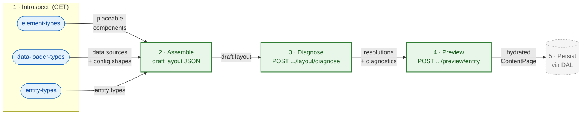

# Administration Integration

Admin API surface the Administration (and admin API clients such as AI-assisted layout generators) use to build content layouts. Three endpoint families: **introspection** (what building blocks exist), **preview** (how a draft layout renders against real data before it is saved), and **resolve-and-diagnose** (what is structurally broken or still unresolved in a draft, without rendering it).

**Scope:** Admin API only (`/api/...`). Store API rendering routes (`/store-api/content*`) are covered in [USAGE.md](USAGE.md) and [SalesChannel/README.md](SalesChannel/README.md). Registering new building blocks (element types, data loaders, specification sources) is covered in [EXTENSION.md](EXTENSION.md).

## Workflow



Diagnose (step 3) and preview (step 4) are both write-free and may run repeatedly while editing; diagnose checks the draft tree without hydrating real entity data, preview is the only write-free step that renders against real data. Persistence (step 5) is handled through the DAL and is out of scope for this document.

## Introspection Endpoints

All three are `GET`, return JSON, require Admin API auth, and are served by `Framework/Api/Controller/InfoController`. They are introspection over what is registered at build time, so their content grows as plugins and apps register more types (see [EXTENSION.md](EXTENSION.md)).

The response envelope shown under each endpoint below is the human summary. The authoritative, field-level response schema is the OpenAPI path file linked at the end of each section.

### Element types

`GET /api/_info/content-system-element-types.json`

The registered element types (components) that may be placed in a layout, each with its property schema, slots, and context contract. Backed by the element-type registry (`Layout/Type/Registry`), serialized via `ContentSystemElementTypeSpecification::toSchema()`.

Response:

```json
{
  "types": [
    {
      "name": "Sw:Product:Card",
      "label": "Product Card",
      "description": "...",
      "source": "core",
      "icon": null,
      "category": null,
      "copilot": { "summary": "...", "hints": ["..."] },
      "properties": {
        "<propertyName>": {
          "type": "string",
          "translatable": false,
          "enum": null,
          "default": null,
          "required": true,
          "title": "...",
          "description": "...",
          "adminUI": null
        }
      },
      "slots": [
        { "name": "actions", "maxElements": 3, "allowList": ["Sw:Content:Button"], "description": "..." }
      ]
    }
  ]
}
```

`source` is `core`, `bundle:<name>`, `plugin:<name>`, or `app:<name>`; a property `type` is a primitive name (`string`, `boolean`, `integer`, `number`) or an FQCN for hydrated data.

Full field-level schema: [content-system-element-types.json](../Api/ApiDefinition/Generator/Schema/AdminApi/paths/content-system-element-types.json).

A custom element type registered by a plugin or app ([EXTENSION.md → Custom Element Types](EXTENSION.md#custom-element-types)) appears here once registered.

### Data loader types

`GET /api/_info/content-system-data-loader-types.json`

The data sources a `data_requirements` entry may use (`source` values such as `entity`, `entity_collection`, `product_listing`, `navigation`, …), each mapped to the capabilities it can produce. Backed by `Schema/ContentSystemDataLoaderTypeSchemaGenerator::getSchema()`, assembled at runtime by `ContentSystemDataLoaderTypeResolver` from each loader's `producibleTypes()`.

Response:

```json
{
  "sources": {
    "<source>": {
      "types": [
        {
          "producedType": "<FQCN>",
          "configTemplate": { "entity": "product" },
          "requiredConfigKeys": ["property"],
          "genericParameters": ["<FQCN>"]
        }
      ]
    }
  }
}
```

`<source>` is the `data_requirements` source value (`entity`, `product_listing`, …); each entry pairs the produced type (the sales-channel class where one exists) with the config seed needed to produce it — `configTemplate` carries the inferable keys, `requiredConfigKeys` lists the keys the caller must still supply.

Full field-level schema: [content-system-data-loader-types.json](../Api/ApiDefinition/Generator/Schema/AdminApi/paths/content-system-data-loader-types.json).

A custom data loader ([EXTENSION.md → Custom Data Loaders](EXTENSION.md#custom-data-loaders)) appears here. Wildcard loaders (`entity`, `entity_collection`) enumerate the live definition registry inside `producibleTypes()`.

### Entity types

`GET /api/_info/content-system-entity-types.json`

The entity types a layout can be assigned to and previewed against (`product`, `category`, `landing_page`, plus any custom assignable entity). Backed by `Schema/ContentLayoutAssignableEntitySchemaGenerator::getSchema()`, populated at build time by `ContentLayoutAssignableCompilerPass`.

Response:

```json
{
  "entityTypes": ["product", "category", "landing_page"]
}
```

A flat array of DAL entity names that support content layout assignment. The values returned here are exactly the `entityType` values the preview endpoint accepts.

Full field-level schema: [content-system-entity-types.json](../Api/ApiDefinition/Generator/Schema/AdminApi/paths/content-system-entity-types.json).

## Preview Endpoint

`POST /api/_action/content-system/preview/entity`

Renders an externally supplied, **unsaved** draft layout against **real** entity data and returns a fully hydrated `ContentPage` in full format. The layout is neither persisted nor required to have an assignment. The target entity only needs to exist. Served by `Api/ContentPreviewController`. Route name: `api.action.content_system.preview.entity`.

### Request

```json
{
  "layout": [
    {
      "id": "element-uuid",
      "component": "shopware/product-heading",
      "properties": { "tag": "h1" },
      "data_requirements": {
        "product": { "key": "product", "source": "entity", "config": { "entity": "product", "property": "product_id" } }
      },
      "slots": {},
      "provides_context": {},
      "accepts_context": {}
    }
  ],
  "entityType": "product",
  "entityId": "abc-123-def-456",
  "salesChannelId": "def-456-ghi-789",
  "languageId": null,
  "currencyId": null,
  "domainId": null,
  "customerId": null,
  "queryParameters": { "elementId": "optional-element-id" }
}
```

| Field                                                | Required | Notes                                                                                                                        |
|------------------------------------------------------|----------|------------------------------------------------------------------------------------------------------------------------------|
| `layout`                                             | yes      | Raw element-tree array; decoded through the same path as a stored layout (`ContentElementFieldSerializer::decodeElement()`). |
| `entityType`                                         | yes      | One of the `content-system-entity-types.json` values; selected by exact match, never as a URL segment.                       |
| `entityId`                                           | yes      | Id of the entity to hydrate against; the entity must exist.                                                                  |
| `salesChannelId`                                     | yes      | Sales channel whose context is synthesized for rendering.                                                                    |
| `languageId`, `currencyId`, `domainId`, `customerId` | no       | Override the synthesized sales channel context.                                                                              |
| `queryParameters`                                    | no       | Forwarded as request query; `elementId` selects a single element for partial preview.                                        |

### Response

The full-format `ContentPage`, serialized through the full-format response factory, using the same structure as the Store API full format. No caching. The preview always renders fresh.

### Errors

All failures are `400 Bad Request` (`ContentSystemException`):

| Condition                                                  | Factory                                              |
|------------------------------------------------------------|------------------------------------------------------|
| Missing/invalid envelope field                             | `#[MapRequestPayload]` validation (forced to 400)    |
| `entityType` matches no specification source               | `unknownEntityType`                                  |
| Layout element missing a non-empty string `id`/`component` | `invalidLayoutStructure`                             |
| Layout has an intrinsic error: unregistered `component`, duplicate element `id`, or undecodable element config | `elementTypesInvalid` (via `ContentLayoutValidator`, which surfaces every intrinsic-scope error from `LayoutDiagnostics`) |
| Target entity not found / unresolvable data requirement    | data-loader exception during hydration               |
| Invalid sales channel id                                   | sales-channel context exception                      |

## Resolve-and-Diagnose Endpoint

`POST /api/_action/content-system/layout/diagnose`

Resolves every element property of an **unsaved** draft layout and reports what is structurally broken or still unresolved — **without** persisting and **without** rendering against a real entity. It answers the editor's after-local-edit "what is broken / still unresolved" question and backs agent layout linting. Served by `Api/ContentLayoutDiagnosticsController`. Route name: `api.action.content_system.layout.diagnose`.

The optional `entityType` or `section` binds the draft to a source's root context so binding-scope resolvability can be checked. With neither, only intrinsic well-formedness is evaluated. Source selection runs through `Api/SpecificationSourceResolver` (`entityType` via `supportsEntityType()`, `section` via a `ContentSection`-keyed locator).

### Request

```json
{
  "layout": [
    {
      "id": "element-uuid",
      "component": "shopware/product-heading",
      "properties": { "tag": "h1" },
      "data_requirements": {},
      "slots": {},
      "provides_context": {},
      "accepts_context": {}
    }
  ],
  "entityType": "product",
  "section": null
}
```

| Field        | Required | Notes                                                                                                                                  |
|--------------|----------|----------------------------------------------------------------------------------------------------------------------------------------|
| `layout`     | no       | Raw element-tree array; decoded through the same path as a stored layout (`ContentElementFieldSerializer::decodeElement()`). Defaults to an empty tree when omitted.            |
| `entityType` | no       | One of the `content-system-entity-types.json` values; binds an entity source's root context. Mutually exclusive with `section`.        |
| `section`    | no       | Exact `ContentSection` value; binds a registered section source's root context (Storefront registers `header` and `footer`). An invalid value, or one with no registered source, → 400. Mutually exclusive with `entityType`. |

`entityType` takes precedence when both are supplied. With neither set, the response still reports intrinsic well-formedness; binding-scope violations are not evaluated because there is no bound root context.

### Response

`200 OK` with `{ resolutions, diagnostics }` — never persisted, never cached.

```json
{
  "resolutions": {
    "<elementId>": [
      {
        "key": "title",
        "kind": "reference",
        "required": true,
        "type": "string",
        "default": null,
        "fqcn": null,
        "resolved": {
          "via": "loader",
          "contextKey": null,
          "providerElementId": null,
          "path": null,
          "distribution": null,
          "contextType": null,
          "loaderSource": "entity",
          "configTemplate": { "entity": "product" },
          "configComplete": true
        },
        "candidates": []
      }
    ]
  },
  "diagnostics": {
    "wellFormed": true,
    "resolvable": false,
    "violations": [
      {
        "code": "unresolved_required",
        "scope": "binding",
        "severity": "error",
        "elementId": "element-uuid",
        "key": "title",
        "message": "...",
        "candidates": []
      }
    ]
  }
}
```

`resolutions` is keyed by element id; each entry is the list of that element's declared properties with how each is (or is not) filled. `kind` is `primitive` or `reference`; a `reference` property carries a `resolved` candidate (or `null`) and the full `candidates` list. A candidate's `via` is `parent` (an ancestor/root provider) or `loader` (a data loader).

`diagnostics.wellFormed` is true when there are no intrinsic-scope error violations (the persistence gate predicate); `diagnostics.resolvable` is true when there are no binding-scope error violations (the serving gate predicate, meaningful only when a source was bound). Each violation derives its `scope` and `severity` from its `code`:

| `code`                  | `scope`   | `severity` |
|-------------------------|-----------|------------|
| `unregistered_component`| intrinsic | error      |
| `duplicate_element_id`  | intrinsic | error      |
| `invalid_config`        | intrinsic | error      |
| `orphaned_provider`     | intrinsic | warning    |
| `unresolved_required`   | binding   | error      |
| `ambiguous_required`    | binding   | error      |
| `broken_required_chain` | binding   | error      |
| `unresolved_optional`   | binding   | warning    |

### Errors

A malformed element **config** is reported as an `invalid_config` violation in the body (HTTP 200), not as an error — that is the point of the endpoint. Only the conditions below abort with `400 Bad Request` (`ContentSystemException`):

| Condition                                                  | Factory                                           |
|------------------------------------------------------------|---------------------------------------------------|
| Missing/invalid envelope field                             | `#[MapRequestPayload]` validation (forced to 400) |
| `entityType` matches no specification source               | `unknownEntityType`                               |
| `section` is not a valid `ContentSection` / has no source  | `noSourceForSection`                              |
| Layout element missing a non-empty string `id`/`component` | `invalidLayoutStructure`                          |

An internal fault during decoding (a non-client-defect `ContentSystemException`, e.g. an unexpected field type) propagates rather than being relabelled as an `invalid_config` violation — see `ContentSystemException::isClientDefect()`.

## Related

- [USAGE.md](USAGE.md): authoring layouts, data requirements, response formats, Store API sections
- [EXTENSION.md](EXTENSION.md): registering the element types, data loaders, and entity types these endpoints expose
- [Api/](Api/README.md): the preview controller implementation
- [SalesChannel/](SalesChannel/README.md): the Store API rendering routes
