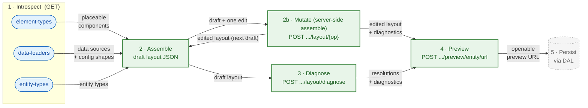

# Workflow

How the introspection, mutation, diagnose, and preview endpoints chain together when an admin API client builds a content layout.

Mutate (step 2b), diagnose (step 3), and preview (step 4) are all write-free and may run repeatedly while editing. Mutate is the assemble step done server-side: it applies one structural edit and returns the edited layout already carrying its diagnostics, so a caller that edits through it does not also call diagnose. Diagnose checks a draft tree without hydrating real entity data; preview is the only write-free step that renders against real data — it renders the draft to admit it, discards that page, and returns a short-lived URL that renders it again when opened. Persistence (step 5) is handled through the DAL and is not part of the Admin API endpoint contract.
