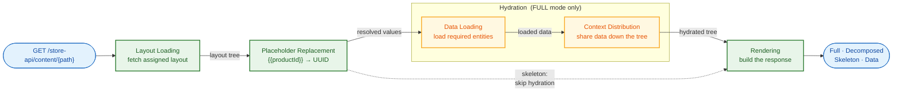

# Content System - User Guide

This document is a configuration guide for shop operators and layout designers. It explains how to use the Content System through declarative JSON configurations. The guide covers the content sections and the header and footer layouts; entity-based rendering is covered in [Adapter/README.md](Adapter/README.md), content elements in [Layout/Element/README.md](Layout/Element/README.md), context sharing in [Layout/Element/Context/README.md](Layout/Element/Context/README.md), and data loading in [Hydration/DataLoader/README.md](Hydration/DataLoader/README.md).

## Table of Contents

1. [Overview](#overview)
2. [Content Sections](#content-sections)
3. [Header and Footer Sections](#header-and-footer-sections)
4. [Data Loading](#data-loading)
5. [Example: Product Detail Page](#example-product-detail-page)

## Overview

The Content System enables dynamic, data-driven layouts for your shop. Core capabilities include:

- Direct entity rendering for Products, Categories, and Landing Pages
- Header and footer layouts with domain-aware resolution
- Reusable layout templates with nested content elements
- Declarative data loading from the shop system
- Context sharing between parent and child elements
- Sales channel-specific layout assignments
- Partial rendering for refreshing individual elements

### Core Concepts

**Content Elements** - Building blocks of layouts. Each element has a component (e.g., `Sw:Product:Card`), properties for configuration, slots for child elements, and optional data requirements.

**Placeholders** - Dynamic values in properties using `{{key}}` syntax. For example, `{{productId}}` gets replaced with the actual product UUID from the URL.

**Slots** - Named containers within elements. Each slot can hold multiple child elements.

**Data Requirements** - Declarations of what data an element needs. The system loads this data automatically before rendering.

**Context** - Mechanism for parent elements to share data with descendants. Providers expose data, consumers receive it without explicit passing through intermediate elements.

### Data Flow



## Content Sections

The Content System serves three distinct sections, each with its own resolution strategy and four response formats.

## Header and Footer Sections

Header and footer layouts use domain-aware resolution instead of entity-based rendering. They are independent of the main content and do not require a URL path.

**Header endpoints:**

| Endpoint                                   | Description         |
|--------------------------------------------|---------------------|
| `GET /store-api/content-header`            | Full response       |
| `GET /store-api/content-header-decomposed` | Decomposed response |
| `GET /store-api/content-header-skeleton`   | Skeleton only       |
| `GET /store-api/content-header-data`       | Data only           |

**Footer endpoints:**

| Endpoint                                   | Description         |
|--------------------------------------------|---------------------|
| `GET /store-api/content-footer`            | Full response       |
| `GET /store-api/content-footer-decomposed` | Decomposed response |
| `GET /store-api/content-footer-skeleton`   | Skeleton only       |
| `GET /store-api/content-footer-data`       | Data only           |

**Database tables:**
- `header_content_layout` - Header layout assignments
- `footer_content_layout` - Footer layout assignments

### Header/Footer Assignment Structure

```json
{
  "id": "<uuid>",
  "domainId": "<domain-uuid>|null",
  "salesChannelId": "<sales-channel-uuid>|null",
  "contentLayoutId": "<layout-uuid>"
}
```

Fields:
- `domainId` - Sales channel domain scope (`null` = not domain-specific)
- `salesChannelId` - Sales channel scope (`null` = global)
- `contentLayoutId` - Layout to use

### Domain-Aware Resolution

Resolution priority (three-tier fallback): **domain + sales channel** > **sales channel only** > **global** (both null).

Example: A shop with domains `shop.com` and `shop.de` can have different headers per domain, with a fallback header for the entire sales channel, and a global fallback for all channels.

### Header/Footer Placeholders

Header and footer layouts do not have entity-based placeholders. Query parameters passed to the endpoint become available as placeholders.

```
/store-api/content-header?activeCategoryId=abc123
```

Makes `{{activeCategoryId}}` available in the header layout.

Header and footer sections do not support partial rendering (`elementId` parameter).

## Data Loading

Declaring `dataRequirements` on an element, the fields each declaration carries, and the configuration reference available for eight of the fourteen built-in loaders are covered in [Hydration/DataLoader/README.md](Hydration/DataLoader/README.md).

## Example: Product Detail Page

Combined example showing entity-based rendering, data loading, and context distribution.

**Layout Configuration:**
```json
{
  "id": "product-detail-page",
  "component": "Sw:Grid",
  "properties": {
    "product": "{{productId}}",
    "columns": "1",
    "gap": 32
  },
  "dataRequirements": {
    "product": {
      "source": "entity",
      "config": {
        "entity": "product",
        "property": "product",
        "associations": ["cover", "manufacturer", "categories"]
      }
    }
  },
  "providesContext": {
    "product": {
      "type": "single",
      "distribution": "broadcast"
    }
  },
  "slots": {
    "default": [
      {
        "id": "breadcrumb",
        "component": "Sw:Navigation:Breadcrumb",
        "properties": {"showHome": true}
      },
      {
        "id": "product-images",
        "component": "Sw:Product:Images",
        "acceptsContext": {
          "product": {"type": "single", "required": true}
        }
      },
      {
        "id": "product-info",
        "component": "Sw:Grid",
        "properties": {"columns": "1", "gap": 16},
        "acceptsContext": {
          "product": {"type": "single", "required": true, "redistribute": true}
        },
        "slots": {
          "default": [
            {
              "id": "product-title",
              "component": "Sw:Product:Title",
              "acceptsContext": {
                "product": {"type": "single", "required": true}
              }
            },
            {
              "id": "product-price",
              "component": "Sw:Product:Price",
              "acceptsContext": {
                "product": {"type": "single", "required": true}
              }
            },
            {
              "id": "product-description",
              "component": "Sw:Product:Description",
              "acceptsContext": {
                "product": {"type": "single", "required": true}
              }
            }
          ]
        }
      },
      {
        "id": "add-to-cart",
        "component": "Sw:Product:AddToCart",
        "acceptsContext": {
          "product": {"type": "single", "required": true}
        }
      }
    ]
  }
}
```
