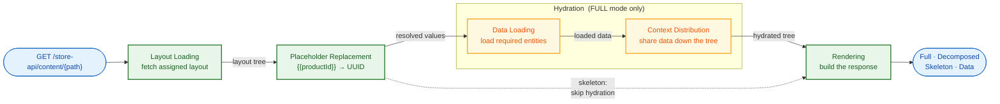

# Content System - User Guide

This document is a configuration guide for shop operators and layout designers. It explains how to use the Content System through declarative JSON configurations. The guide covers layouts and content elements; context sharing is covered in [Layout/Element/Context/README.md](Layout/Element/Context/README.md) and data loading in [Hydration/DataLoader/README.md](Hydration/DataLoader/README.md).

## Table of Contents

1. [Overview](#overview)
2. [Content Sections](#content-sections)
3. [Entity-Based Rendering (Main Section)](#entity-based-rendering-main-section)
4. [Header and Footer Sections](#header-and-footer-sections)
5. [Content Elements](#content-elements)
6. [Data Loading](#data-loading)
7. [Example: Product Detail Page](#example-product-detail-page)

## Overview

The Content System enables dynamic, data-driven layouts for your shop. Core capabilities include:

- Direct entity rendering for Products, Categories, and Landing Pages
- Header and footer layouts with domain-aware resolution
- Reusable layout templates with nested content elements
- Declarative data loading from the shop system
- Context sharing between parent and child elements
- Sales channel-specific layout assignments
- Partial rendering for refreshing individual elements

### Core Concepts

**Content Elements** - Building blocks of layouts. Each element has a component (e.g., `Sw:Product:Card`), properties for configuration, slots for child elements, and optional data requirements.

**Placeholders** - Dynamic values in properties using `{{key}}` syntax. For example, `{{productId}}` gets replaced with the actual product UUID from the URL.

**Slots** - Named containers within elements. Each slot can hold multiple child elements.

**Data Requirements** - Declarations of what data an element needs. The system loads this data automatically before rendering.

**Context** - Mechanism for parent elements to share data with descendants. Providers expose data, consumers receive it without explicit passing through intermediate elements.

### Data Flow



## Content Sections

The Content System serves three distinct sections, each with its own resolution strategy and four response formats.

### Response Formats

Each section supports four response formats via separate endpoints:

| Format         | Suffix        | Description                                                             |
|----------------|---------------|-------------------------------------------------------------------------|
| **Full**       | *(none)*      | Returns complete element trees with hydrated data (simpler integration) |
| **Decomposed** | `-decomposed` | Returns decomposed format with deduplicated data (optimized payloads)   |
| **Skeleton**   | `-skeleton`   | Returns layout structure without hydrated data (client-side hydration)  |
| **Data**       | `-data`       | Returns data and assignments without skeleton (data refresh)            |

### Partial Rendering

Full and decomposed endpoints for the main section support partial rendering via the `elementId` query parameter. Pass `?elementId=<element-id>` to render only a specific element and its subtree instead of the full layout. The system preserves context-dependent ancestors during hydration and extracts the target subtree for the response.

Header and footer sections do not support partial rendering.

### Multi-Root Layouts

A layout can contain multiple root elements. Each root is an independent tree with separate context scope -- providers in one root cannot provide context to elements in another root. Element IDs must be unique across all roots.

### Previewing a Draft

The sections above describe the Store API that serves **saved** layouts. To render an unsaved draft against real entity data -- for example from the Administration before saving -- use the Admin API preview endpoint (`POST /api/_action/content-system/preview/entity`). The available element types and entity types are discoverable through the introspection endpoints documented in `ADMINISTRATION.md`; the available data sources through the one documented in [Hydration/DataLoader/docs/introspection.md](Hydration/DataLoader/docs/introspection.md).

## Entity-Based Rendering (Main Section)

Products, Categories, and Landing Pages can render directly using ContentSystem layouts. This is the primary method for rendering entity-based pages.

**Endpoints:**

| Endpoint                                   | Description         |
|--------------------------------------------|---------------------|
| `GET /store-api/content/{path}`            | Full response       |
| `GET /store-api/content-decomposed/{path}` | Decomposed response |
| `GET /store-api/content-skeleton/{path}`   | Skeleton only       |
| `GET /store-api/content-data/{path}`       | Data only           |

**Supported path patterns:**
- `product/{productId}` - Product detail pages
- `category/{categoryId}` - Category pages
- `landing-page/{landingPageId}` - Landing pages

**Example requests:**
- `/store-api/content/product/abc123def456` - Renders product with ID abc123def456
- `/store-api/content/category/xyz789abc012` - Renders category with ID xyz789abc012
- `/store-api/content/landing-page/ghi345jkl678` - Renders landing page with ID ghi345jkl678
- `/store-api/content/product/abc123def456?elementId=product-images` - Renders only the `product-images` element subtree
- `/store-api/content-decomposed/product/abc123def456?elementId=product-images` - Same, decomposed format

**Database tables:**
- `product_content_layout` - Product layout assignments
- `category_content_layout` - Category layout assignments
- `landing_page_content_layout` - Landing page layout assignments

### Assignment Structure

```json
{
  "id": "<uuid>",
  "productId": "<product-uuid>",
  "salesChannelId": "<sales-channel-uuid>|null",
  "contentLayoutId": "<layout-uuid>"
}
```

Fields:
- Entity ID (`productId`/`categoryId`/`landingPageId`) - Entity to render
- `salesChannelId` - Sales channel scope (`null` = global)
- `contentLayoutId` - Layout to use

### Sales Channel Resolution

Resolution priority: **sales channel specific** > **global** (null `salesChannelId`).

Example: Product with global layout and B2B-specific layout. B2B channel uses specific assignment, all other channels use global.

### Automatic Data Loading

Entity-based rendering automatically loads the main entity before rendering your layout -- no `dataRequirements` declaration needed. The entity ID is available via placeholders, and the entity object is loaded with pre-configured associations and available via context to your layout's root elements.

**Auto-loaded entities and associations:**

| Endpoint                                          | Entity            | Context Key    | Pre-loaded Associations                                                                             |
|---------------------------------------------------|-------------------|----------------|-----------------------------------------------------------------------------------------------------|
| `/store-api/content/product/{productId}`          | ProductEntity     | `product`      | `manufacturer.media`, `options.group`, `properties.group`, `mainCategories.category`, `media.media` |
| `/store-api/content/category/{categoryId}`        | CategoryEntity    | `category`     | `media`, `translations`                                                                             |
| `/store-api/content/landing-page/{landingPageId}` | LandingPageEntity | `landing_page` | (none)                                                                                              |

**Usage example:**

```json
{
  "id": "product-page",
  "component": "Sw:Grid",
  "acceptsContext": {
    "product": {
      "type": "single",
      "required": true,
      "redistribute": true
    }
  },
  "slots": {
    "default": [
      {
        "id": "product-title",
        "component": "Sw:Product:Title",
        "acceptsContext": {
          "product": {"type": "single", "required": true}
        }
      }
    ]
  }
}
```

Root elements accept the auto-loaded entity via context and redistribute to children using `redistribute: true`. Deeper descendants require redistribution at each container level (see [Context Redistribution](Layout/Element/Context/docs/redistribution.md)). Declare `dataRequirements` only for additional data beyond what's automatically loaded (e.g., cross-sell products, reviews).

### Placeholders

Default placeholders available in entity-based rendering:
- `{{productId}}` - Product UUID (product endpoint)
- `{{categoryId}}` - Category UUID (category endpoint)
- `{{landingPageId}}` - Landing page UUID (landing-page endpoint)

Use these in element properties and data requirements. See [Example: Product Detail Page](#example-product-detail-page) for usage.

### Additional Parameters

Beyond URL path segments, you can pass additional parameters to your layouts via query string. These parameters become available as placeholders throughout your layout.

**Query string example:**
```
/store-api/content/product/abc123?page=2&limit=24
```

Makes `{{page}}` and `{{limit}}` available as placeholders:

```json
{
  "id": "product-listing",
  "component": "Sw:Product:Listing",
  "properties": {
    "page": "{{page}}",
    "limit": "{{limit}}"
  }
}
```

**Common use cases:**
- Pagination parameters (`page`, `limit`)
- Filter values (`category`, `brand`, `priceRange`)
- Display preferences (`view`, `sort`)
- Feature flags (`showReviews`, `hidePrice`)

## Header and Footer Sections

Header and footer layouts use domain-aware resolution instead of entity-based rendering. They are independent of the main content and do not require a URL path.

**Header endpoints:**

| Endpoint                                   | Description         |
|--------------------------------------------|---------------------|
| `GET /store-api/content-header`            | Full response       |
| `GET /store-api/content-header-decomposed` | Decomposed response |
| `GET /store-api/content-header-skeleton`   | Skeleton only       |
| `GET /store-api/content-header-data`       | Data only           |

**Footer endpoints:**

| Endpoint                                   | Description         |
|--------------------------------------------|---------------------|
| `GET /store-api/content-footer`            | Full response       |
| `GET /store-api/content-footer-decomposed` | Decomposed response |
| `GET /store-api/content-footer-skeleton`   | Skeleton only       |
| `GET /store-api/content-footer-data`       | Data only           |

**Database tables:**
- `header_content_layout` - Header layout assignments
- `footer_content_layout` - Footer layout assignments

### Header/Footer Assignment Structure

```json
{
  "id": "<uuid>",
  "domainId": "<domain-uuid>|null",
  "salesChannelId": "<sales-channel-uuid>|null",
  "contentLayoutId": "<layout-uuid>"
}
```

Fields:
- `domainId` - Sales channel domain scope (`null` = not domain-specific)
- `salesChannelId` - Sales channel scope (`null` = global)
- `contentLayoutId` - Layout to use

### Domain-Aware Resolution

Resolution priority (three-tier fallback): **domain + sales channel** > **sales channel only** > **global** (both null).

Example: A shop with domains `shop.com` and `shop.de` can have different headers per domain, with a fallback header for the entire sales channel, and a global fallback for all channels.

### Header/Footer Placeholders

Header and footer layouts do not have entity-based placeholders. Query parameters passed to the endpoint become available as placeholders.

```
/store-api/content-header?activeCategoryId=abc123
```

Makes `{{activeCategoryId}}` available in the header layout.

Header and footer sections do not support partial rendering (`elementId` parameter).

## Content Elements

### Structure

Each content element follows this structure:

```json
{
  "id": "product-card",
  "component": "Sw:Product:Card",
  "properties": {
    "text": "Featured Product",
    "productId": "{{productId}}"
  },
  "slots": {
    "content": [
      {
        "id": "product-title",
        "component": "Sw:Product:Title"
      }
    ]
  }
}
```

Placeholders (like `{{productId}}`) must be assigned to properties before data loaders can use them:

```json
"properties": {
  "product": "{{productId}}"
},
"dataRequirements": {
  "product": {
    "source": "entity",
    "config": {
      "entity": "product",
      "property": "product"
    }
  }
}
```

**Required fields:**
- `id` - Unique identifier for the element (required for processing)
- `component` - Element component identifier

**Optional fields:**
- `properties` - Configuration values (static or placeholders)
- `slots` - Named containers with arrays of child elements
- `dataRequirements` - Data loading declarations
- `providesContext` - Data shared with descendant elements
- `acceptsContext` - Data received from ancestor elements
- `attributedSpecifications` - System bookkeeping mapping a wired key to the binding specification that wired it (see [Binding/README.md](Binding/README.md)). Re-derived on every save, so hand-editing it has no effect; never part of the Store API response.

### Slots

Slots hold arrays of elements.

```json
{
  "id": "main-container",
  "component": "Sw:Grid",
  "properties": {
    "columns": "1"
  },
  "slots": {
    "header": [
      {"id": "logo", "component": "Sw:Content:Image"},
      {"id": "navigation", "component": "Sw:Navigation"},
      {"id": "search", "component": "Sw:Search"}
    ],
    "main": [
      {"id": "product-listing", "component": "Sw:Product:Listing"}
    ],
    "sidebar": [
      {"id": "filter-panel", "component": "Sw:Filter:Panel"},
      {"id": "promo-banner", "component": "Sw:Content:Image"}
    ]
  }
}
```

In this example, the `header` slot contains 3 elements, while `main` has 1 and `sidebar` has 2.

### Nested Containers

Containers can be nested for complex layouts:

```json
{
  "id": "page-layout",
  "component": "Sw:Grid",
  "properties": {
    "cssClass": "page-wrapper",
    "columns": "1"
  },
  "slots": {
    "default": [
      {
        "id": "hero-section",
        "component": "Sw:Grid",
        "properties": {
          "cssClass": "hero",
          "columns": "1"
        },
        "slots": {
          "default": [
            {
              "id": "heading",
              "component": "Sw:Content:Text",
              "properties": {
                "text": "Summer Sale",
                "style": "heading"
              }
            },
            {
              "id": "cta-button",
              "component": "Sw:Content:Button",
              "properties": {
                "label": "Shop Now"
              }
            }
          ]
        }
      }
    ]
  }
}
```

## Data Loading

Declaring `dataRequirements` on an element, the fields each declaration carries, and the configuration reference available for eight of the fourteen built-in loaders are covered in [Hydration/DataLoader/README.md](Hydration/DataLoader/README.md).

## Example: Product Detail Page

Combined example showing entity-based rendering, data loading, and context distribution.

**Layout Configuration:**
```json
{
  "id": "product-detail-page",
  "component": "Sw:Grid",
  "properties": {
    "product": "{{productId}}",
    "columns": "1",
    "gap": 32
  },
  "dataRequirements": {
    "product": {
      "source": "entity",
      "config": {
        "entity": "product",
        "property": "product",
        "associations": ["cover", "manufacturer", "categories"]
      }
    }
  },
  "providesContext": {
    "product": {
      "type": "single",
      "distribution": "broadcast"
    }
  },
  "slots": {
    "default": [
      {
        "id": "breadcrumb",
        "component": "Sw:Navigation:Breadcrumb",
        "properties": {"showHome": true}
      },
      {
        "id": "product-images",
        "component": "Sw:Product:Images",
        "acceptsContext": {
          "product": {"type": "single", "required": true}
        }
      },
      {
        "id": "product-info",
        "component": "Sw:Grid",
        "properties": {"columns": "1", "gap": 16},
        "acceptsContext": {
          "product": {"type": "single", "required": true, "redistribute": true}
        },
        "slots": {
          "default": [
            {
              "id": "product-title",
              "component": "Sw:Product:Title",
              "acceptsContext": {
                "product": {"type": "single", "required": true}
              }
            },
            {
              "id": "product-price",
              "component": "Sw:Product:Price",
              "acceptsContext": {
                "product": {"type": "single", "required": true}
              }
            },
            {
              "id": "product-description",
              "component": "Sw:Product:Description",
              "acceptsContext": {
                "product": {"type": "single", "required": true}
              }
            }
          ]
        }
      },
      {
        "id": "add-to-cart",
        "component": "Sw:Product:AddToCart",
        "acceptsContext": {
          "product": {"type": "single", "required": true}
        }
      }
    ]
  }
}
```
