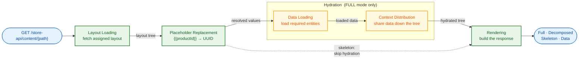

# Rendering Data Flow

This diagram traces the same rendering pipeline the README's Rendering Pipeline section describes step by step, as a single data-flow picture.

```mermaid
graph LR
    REQ(["GET /store-api/content/{path}"]) --> A

    A["Layout Loading<br/>fetch assigned layout"]
    B["Placeholder Replacement<br/>{{productId}} → UUID"]

    subgraph HYDR["Hydration &nbsp;(FULL mode only)"]
        direction TB
        C["Data Loading<br/>load required entities"]
        D["Context Distribution<br/>share data down the tree"]
        C -- "loaded data" --> D
    end

    E["Rendering<br/>build the response"]
    RES(["Full · Decomposed<br/>Skeleton · Data"])

    A -- "layout tree" --> B
    B -- "resolved values" --> C
    D -- "hydrated tree" --> E
    E --> RES
    B -. "skeleton:<br/>skip hydration" .-> E

    classDef io fill:#e3f2fd,stroke:#1565c0,stroke-width:1px,color:#0d47a1
    classDef step fill:#e8f5e9,stroke:#2e7d32,stroke-width:2px,color:#1b5e20
    classDef hydr fill:#fff8e1,stroke:#f9a825,stroke-width:2px,color:#e65100
    class REQ,RES io
    class A,B,E step
    class C,D hydr
```
