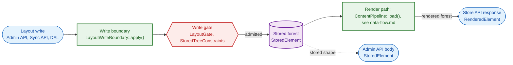

# Principles

## Terms that are easy to confuse

| Pair | What they share | The one axis on which they differ | Governed by |
|---|---|---|---|
| stored element / rendered element | Both describe one element of a layout tree. | `StoredElement` is what a layout persists, with wiring and wrapped values. `RenderedElement` is what a page serves, with raw values and no wiring. | [stored-model.md](stored-model.md) |
| present null / absent key | Neither gives the property a non-null value. | `LayoutDefaultSeeder` fills an absent key and never a present null. | [values.md](values.md) |
| FULL / SKELETON | Both run the one render path and produce the same structure. | FULL resolves data. SKELETON switches off placeholder substitution and data resolution. | [rendering.md](rendering.md) |
| write gate / write boundary | Both sit on the DAL write path of a layout tree. | The write boundary (`LayoutWriteBoundary::apply()`) returns a new tree from its passes, while the write gate (`LayoutGate`, `StoredTreeConstraints`) only checks the tree. | [write-admission.md](write-admission.md), [drafts-and-gates.md](drafts-and-gates.md) |
| client defect / internal fault | Both are defects that `ContentSystemException` throws. | A client can cause a client defect (`CLIENT_DEFECT_CODES`), while only data that bypassed the write gate causes an internal fault. | [failure-and-loss.md](failure-and-loss.md) |

## Glossary

- consumer: an element's declared need for a context value under a key, scoped to its parent or to root context (`ContextConsumer`).
- provider: an element's declaration that it serves a context value to its direct children (`ContextProvider`).
- root source: what a layout is bound to, a DAL entity type, a section or `none` (`RootSourceRegistry::knownRootSources()`).
- root context: the context that a layout's root source supplies and that any element reaches through a root-scoped consumer (`RootSourceRegistry::resolve()`).
- prove resolvable: `ContentLayoutWriteValidator` shows through `LayoutGate::resolvability()` that a stored layout resolves against its root context.
- forest: the list of root elements of one layout tree, stored (`StoredTree::$roots`) or rendered.
- draft pipeline: `MutationPipeline::run()`, which applies a mutation operation to a decoded draft and writes its derived consumer wiring.
- the module: the Content System under `src/Core/Framework/ContentSystem/`.
- present null, authored null, absent: a key whose value is null (authored when the author wrote it) and a key missing from the map: [values.md](values.md#a-present-null-and-an-absent-key-are-different-states).
- client defect: a defect that a client can cause, with a code in `CLIENT_DEFECT_CODES`: [failure-and-loss.md](failure-and-loss.md#the-cause-of-a-defect-sets-its-classification-and-http-status-is-a-separate-axis).
- write boundary: `LayoutWriteBoundary::apply()`, the one path every DAL write of a layout takes: [write-admission.md](write-admission.md#every-layout-write-passes-through-the-write-boundary-a-single-choke-point).
- write gate: the checks that reject a `content_layout` write, `LayoutGate` through `ContentLayoutWriteValidator` and the `StoredTreeConstraints` descriptor: [drafts-and-gates.md](drafts-and-gates.md#the-module-holds-a-draft-to-well-formedness).
- conformance validator: `PropertyTypeConformanceValidator`, the descriptor's check of a property value against its declared primitive type.
- constraint descriptor: `StoredTreeConstraints`, the DAL write constraints over the stored forest that keep their own copy of the codec's rules: [write-admission.md](write-admission.md#no-dal-write-can-bypass-the-constraint-descriptor).
- loss, dropped, orphaned: what a mutation response reports, a discarded property or wiring key (dropped) or a detached child it returns (orphaned): [failure-and-loss.md](failure-and-loss.md#the-module-drops-nothing-silently-and-reports-every-loss).

In this module, "context" is the per-element delivery map. In the platform, `Context` is the Shopware context object.

## Module map

The render path's steps are in [data-flow.md](../data-flow.md).

## Index

### By task

- A layout write is rejected: [write-admission.md](write-admission.md), [drafts-and-gates.md](drafts-and-gates.md), [values.md](values.md)
- A rendered value is wrong: [rendering.md](rendering.md), [data-loading.md](data-loading.md), [context-wiring.md](context-wiring.md)
- A client shows the wrong error: [failure-and-loss.md](failure-and-loss.md)
- A listener changed the tree: [rendering.md](rendering.md), [extension-surface.md](extension-surface.md)
- A preview differs from the storefront or rejects a draft: [preview.md](preview.md)

### By area

- [failure-and-loss.md](failure-and-loss.md): "fail fast" and report every loss
- [values.md](values.md): the server owns every value rule
- [stored-model.md](stored-model.md): the stored element and its one conversion
- [type-declarations.md](type-declarations.md): what a type declaration may state
- [write-admission.md](write-admission.md): the write boundary and the order of its passes
- [drafts-and-gates.md](drafts-and-gates.md): well-formedness for a draft and resolvability for a write
- [mutation.md](mutation.md): a mutation operation as a pure tree transform
- [data-loading.md](data-loading.md): loaders as consumers of typed inputs
- [context-wiring.md](context-wiring.md): context between adjacent elements
- [rendering.md](rendering.md): the render's final check and the two tree-replacement events
- [preview.md](preview.md): preview as a second entry into the render path
- [wire-contract.md](wire-contract.md): one paired codec and one rendered forest per format
- [extension-surface.md](extension-surface.md): the bounded extension surface
- [clients.md](clients.md): the administration type and the storefront's shared partial
