# Principles

Every file in this directory holds the design rules of one area of the module.

A block states one rule. Its heading names the rule. The sentences under the heading state the rule in normative voice. Where the reader matches a condition to an outcome, a table follows the rule sentences. A "Why" line gives the reason. A "Not chosen" line names the alternative the design did not choose. An "Exceptions" line appears only where the code holds a designed exception. An "In code" list names the enforcing symbols and the pinning tests. The last item of that list links to the mechanism.

## Terms that are easy to confuse

| Pair | What they share | The one axis on which they differ | Governed by |
|---|---|---|---|
| stored element / rendered element | Both describe one element of a layout tree. | `StoredElement` is what a layout persists, with wiring and wrapped values. `RenderedElement` is what a page serves, with raw values and no wiring. | [stored-model.md](stored-model.md) |
| present null / absent key | Neither gives the property a non-null value. | A present null is a key in the map. An absent key is not in the map. PHP tells them apart with `array_key_exists`. | [values.md](values.md) |
| FULL / SKELETON | Both run the one render path and produce the same structure. | FULL resolves data. SKELETON switches off placeholder substitution and data resolution. | [rendering.md](rendering.md) |
| write gate / write boundary | Both sit on the DAL write path of a layout tree. | The write boundary, `LayoutWriteBoundary::apply()`, runs passes that seed defaults and normalize style. The write gate, `LayoutGate` and `StoredTreeConstraints`, checks the tree and rewrites nothing. | [write-admission.md](write-admission.md), [drafts-and-gates.md](drafts-and-gates.md) |
| client defect / internal fault | Both are defects that `ContentSystemException` throws. | The cause. A client can cause a client defect, and `CLIENT_DEFECT_CODES` lists it. Only data that bypassed the write gate causes an internal fault. The HTTP status is not this axis. | [failure-and-loss.md](failure-and-loss.md) |

## Glossary

- reject: a gate, validator, decoder or constructor does not accept an input and returns an error or throws.
- throw: an exception leaves a method.
- fail: a process such as install, update or a build ends with an error.
- check: a component or a reader examines something for a condition.
- prove resolvable: the write validator's proof that a stored layout resolves against its root context.
- pin, pinned by: the test that asserts a rule.
- skip and log: the degradation on a malformed persisted row.
- exception: a designed exception to a rule that exists in code, stated on an "Exceptions" line.
- the module: the Content System under `src/Core/Framework/ContentSystem/`.
- present null, authored null, absent: the three states that [values.md](values.md#a-present-null-and-an-absent-key-are-different-states) distinguishes.
- client defect: an error the client caused, reported with a code.
- write boundary: `LayoutWriteBoundary::apply()`, the path every layout write takes.
- write gate: the check on a layout write, `LayoutGate` and `StoredTreeConstraints`.
- conformance validator: `PropertyTypeConformanceValidator`.
- constraint descriptor: `StoredTreeConstraints`, which keeps its own copy of the wiring rules of the codec.
- loss, dropped, orphaned: a loss is the category that the mutation response reports. A dropped property or wiring key is one that the mutation discards. An orphaned child is a detached child that the mutation keeps and reports.

In this module, "context" is the per-element delivery map. In the platform, `Context` is the Shopware context object.

## Module map

```mermaid
graph LR
    W(["Layout write<br/>Admin API, Sync API, DAL"])
    WB["Write boundary<br/>LayoutWriteBoundary::apply()"]
    WG{{"Write gate<br/>LayoutGate, StoredTreeConstraints"}}
    SF[("Stored forest<br/>StoredElement")]
    W --> WB --> WG -- "admitted" --> SF

    subgraph RP["Render path: ContentPipeline::load()"]
        direction LR
        PE>"ContentTreePreparationEvent"]
        P["prepare<br/>StoredTreePreparer::prepare()"]
        PL["plan<br/>WiringPlanner::plan()"]
        L["lower<br/>ElementLowering::lower()"]
        FS["finishing steps<br/>unwrap, extract target"]
        FE>"RenderedTreeFinalizationEvent"]
        PE --> P --> PL --> L --> FS --> FE
    end

    SF --> PE
    FE -- "rendered forest" --> SR(["Store API response<br/>RenderedElement"])
    SF -. "stored shape" .-> AR(["Admin API body<br/>StoredElement"])

    classDef wire fill:#e3f2fd,stroke:#1565c0,stroke-width:1px,color:#0d47a1
    classDef step fill:#e8f5e9,stroke:#2e7d32,stroke-width:2px,color:#1b5e20
    classDef gate fill:#fdecea,stroke:#c62828,stroke-width:2px,color:#b71c1c
    classDef data fill:#f3e5f5,stroke:#6a1b9a,stroke-width:2px,color:#4a148c
    classDef event fill:#fff8e1,stroke:#f9a825,stroke-width:2px,color:#e65100
    class W,SR,AR wire
    class WB,P,PL,L,FS step
    class WG gate
    class SF data
    class PE,FE event
```

Orientation aid. The rule text is normative.

## Index

### By task

- A layout write is rejected: [write-admission.md](write-admission.md), [drafts-and-gates.md](drafts-and-gates.md), [values.md](values.md)
- A rendered value is wrong: [rendering.md](rendering.md), [data-loading.md](data-loading.md), [context-wiring.md](context-wiring.md)
- A client shows the wrong error: [failure-and-loss.md](failure-and-loss.md)
- A listener changed the tree: [rendering.md](rendering.md), [extension-surface.md](extension-surface.md)
- A preview differs from the storefront or rejects a draft: [preview.md](preview.md)

### By area

- [failure-and-loss.md](failure-and-loss.md): fail fast at runtime and at build time, report every loss, classify a defect apart from its HTTP status, and keep one closed code set
- [values.md](values.md): The server owns each value rule. Each rule has a single source of truth. A present null differs from an absent key. An empty map is no stored state.
- [stored-model.md](stored-model.md): `StoredElement` and `RenderedElement` joined by one conversion, string map keys, write-time default seeding, the immutable root source and the opaque element id
- [type-declarations.md](type-declarations.md): wiring on the element rather than the type, what the required flag means for the write, and presentation hints the server never reads
- [write-admission.md](write-admission.md): the write boundary as a single choke point, the order of its passes, and the constraint descriptor that no DAL write bypasses
- [drafts-and-gates.md](drafts-and-gates.md): well-formedness for a draft and resolvability for a layout write, shared decoding, diagnostics reporting without rewriting, and the codec and constraint descriptor that one change tightens together
- [mutation.md](mutation.md): derived wiring written only where proved, and a mutation operation as a pure tree transform
- [data-loading.md](data-loading.md): graceful degradation behind a narrow catch, typed loader inputs, loader configuration final at write time, and introspection instead of parsing
- [context-wiring.md](context-wiring.md): context between adjacent elements, the fixed preparation order, and a write gate that computes each delivery rule as serving does
- [rendering.md](rendering.md): the render's final check, structure independent of mode, direct stage calls, the two fixed tree-replacement events, the template surface, and a null that means found nothing
- [preview.md](preview.md): preview as a second entry into the one rendering path, showing what the storefront renders and rejecting what it cannot render
- [wire-contract.md](wire-contract.md): one paired codec, which element class each API exchanges, module-owned encoding, one rendered forest per format, wire-inert names, and read policy
- [extension-surface.md](extension-surface.md): the bounded extension surface, validated app declarations, guards that never throw on a permitted listener action, declared data, and platform base classes left alone
- [clients.md](clients.md): the administration's one element type and the editor controls that metadata chooses, and the storefront's shared element partial

## Before changing code

Read the area file for the code you change. The area file carries the reason and the alternative the design did not choose. The AGENTS.md of that directory carries the imperative and its check. The pinning test on a rule's "In code" list changes in the same commit as the rule.
