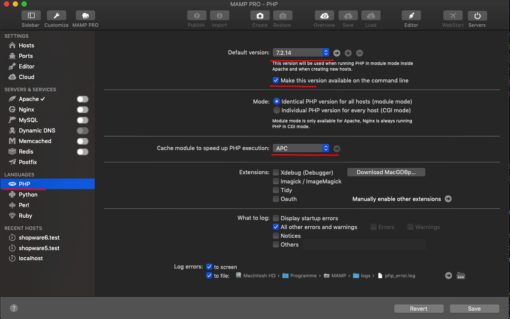
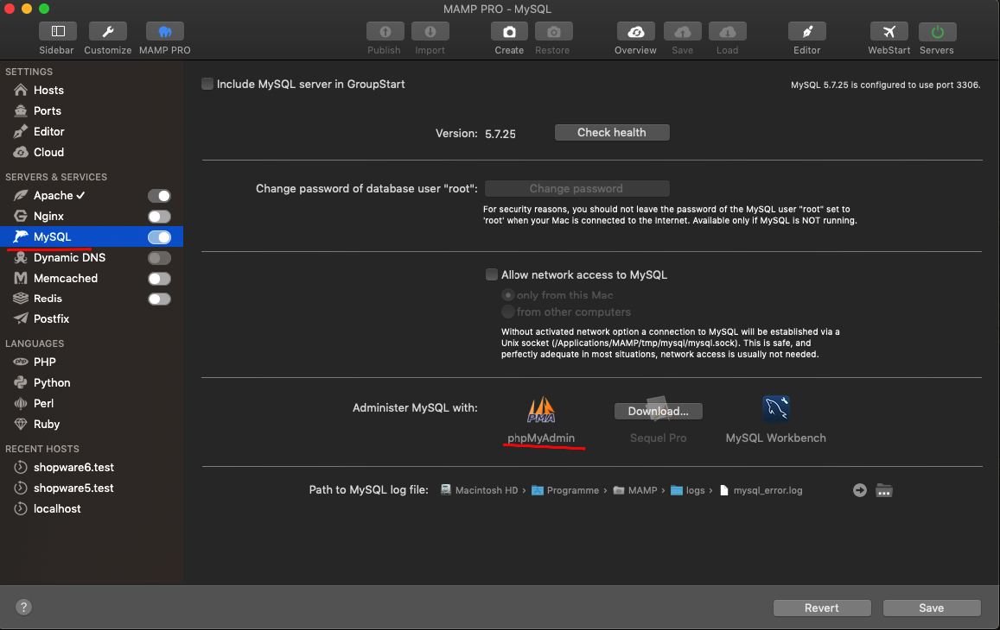
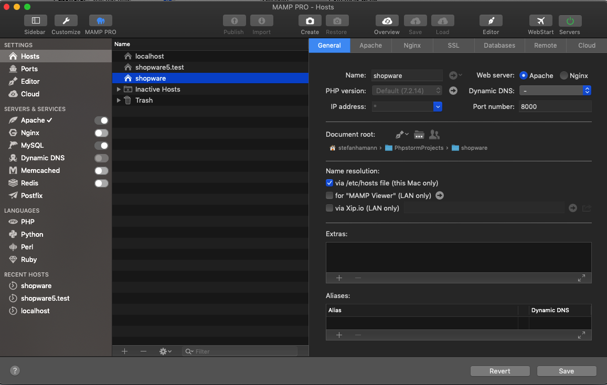

[titleEn]: <>(MacOS X using MAMP)
[hash]: <>(article:mac_installation)


## Local installation on mac (MAMP)

For quick and easy installation you can also use **MAMP** on mac. As an additional option, there is a [Valet+](./25-valet-plus.md) guide.

### Preparation

* Download & install MAMP from [https://www.mamp.info/de/downloads/](https://www.mamp.info/en/downloads/)


First of all you have to modify the PHP settings inside MAMP as seen on the following screenshot:





After that start the mysql &amp; webserver-service with the toggle buttons on the left side in the MAMP management console.

### Prepare MySQL user &amp; database

Open the **MySQL Tab** on the left side and click on the *PhpMyAdmin* icon - if the icon is grayed out, check if the mysql and webserver services are running.




Inside PhpMyAdmin switch to the user account management on the top menu and click *add new user*.

Choose a username (e.g. shopware) and a password and set the option *Create database with same name and grant all privileges*.
Also, set the option *Check all* in the **Global privileges** card. Afterwards, all checkboxes in this card should be checked.

Finish this step by clicking *GO*.

### Make sure MAMP php binary is used globally on your CLI

*Open the terminal application*
 
````bash
which php
# /Applications/MAMP/bin/php/php7.2.14/bin/php &lt; should be displayed
# IF NOT
vim ~/.bash_profile
export PATH=/Applications/MAMP/bin/php/php7.2.14/bin:$PATH
# :wq to save the file
source ~/.bash_profile

````

### Make sure MAMP mysql binary is used globally on your CLI

*Open the terminal application*


```bash
which mysql
# /Applications/MAMP/Library/bin/mysql &lt; should be displayed
# IF NOT
vim ~/.bash_profile
export PATH=/Applications/MAMP/Library/bin:$PATH
# :wq to save the file
source ~/.bash_profile
```

### Install `brew`

*Open the terminal application*

```bash
/usr/bin/ruby -e "$(curl -fsSL https://raw.githubusercontent.com/Homebrew/install/master/install)"
```

### Install npm / node

*Open the terminal application*

```bash

brew install node

```

### Install composer

*Open the terminal application*

```bash
php -r "copy('https://getcomposer.org/installer', 'composer-setup.php');"

php -r "if (hash_file('sha384', 'composer-setup.php') === '48e3236262b34d30969dca3c37281b3b4bbe3221bda826ac6a9a62d6444cdb0dcd0615698a5cbe587c3f0fe57a54d8f5') { echo 'Installer verified'; } else { echo 'Installer corrupt'; unlink('composer-setup.php'); } echo PHP_EOL;"

php composer-setup.php

php -r "unlink('composer-setup.php');"
```

### Make composer globally

```bash
mv composer.phar /usr/local/bin/composer
```

### Checkout shopware

```bash
# Choose your own directory
cd ~/PhpstormProjects/
mkdir shopware
cd shopware
git clone https://github.com/shopware/development.git
cd development
git clone https://github.com/shopware/platform.git
```


### Shopware 6 setup

#### **First of all add new host in MAMP:**​​​​</p>

* Hostname = shopware
* Port = 8000
* Document Root = Browse for the public directory inside the new directory that you used before (e.g. /PhpstormProjects/shopware/development/public)


 
#### **Change the installation settings**
 
```bash
# Inside the shopware installation directory (e.g.  /PhpstormProjects/shopware/development)
bin/setup
```

You will be prompted to enter several information.
In short:
- Application environment: Just hit enter to apply the default `dev`
- URL to your /public folder: `http://shopware:8000`
- Database host: Just hit enter to apply the default `localhost`
- Database port: Just hit enter to apply the default `3306`
- Database name: Enter the name of your database that you created earlier, `shopware` was suggested
- Database user: Enter the name of your MySQL user, that you created previously
- Database password: Enter the password of the new MySQL user

Afterwards a file called `.psh.yaml.override` is created, which contains all those information you just entered.

#### **Start Shopware 6 setup**

```bash
# Inside the shopware installation directory (e.g. /PhpstormProjects/shopware/development) 
./psh.phar install
```

After that the setup is done.
You can now access your Shopware 6 installation using the following urls:

* Storefront: http://shopware:8000
* Admin: http://shopware:8000/admin (User: admin, password: shopware)

### Trouble shooting

There are cases when the administration is not build correctly and having error messages similar to these:

> ERROR in foobar/vendor/shopware/storefront/Resources/app/administration/src/main.js
> Module Error (from ./node_modules/eslint-loader/index.js):
>
>   ✘  https://google.com/#q=import%2Fno-unresolved  Casing of ./modules/sw-theme-manager does not match the underlying filesystem                                       
>   foobar/vendor/shopware/storefront/Resources/app/administration/src/main.js:1:8
>
>   ✘  https://google.com/#q=import%2Fno-unresolved  Casing of ./extension/sw-sales-channel/page/sw-sales-channel-detail does not match the underlying filesystem        
>   foobar/vendor/shopware/storefront/Resources/app/administration/src/main.js:3:8
>
>   ✘  https://google.com/#q=import%2Fno-unresolved  Casing of ./extension/sw-sales-channel/view/sw-sales-channel-detail-theme does not match the underlying filesystem  
>   foobar/vendor/shopware/storefront/Resources/app/administration/src/main.js:4:8
>
>   ✘  https://google.com/#q=import%2Fno-unresolved  Casing of ./init/api-service.init does not match the underlying filesystem                                          
>   foobar/vendor/shopware/storefront/Resources/app/administration/src/main.js:6:8

The underlying problem is that Mac supports case insensitive paths but not the tools that build the administration. Therefore make sure to execute the commands in an context where the `pwd` is written in the correct case.

Ok: `/Users/shopware/Code/shopware-platform`
Not ok: `/users/shopware/code/Shopware-Platform`

