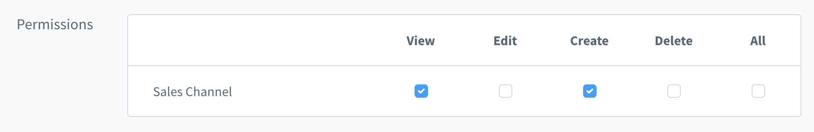
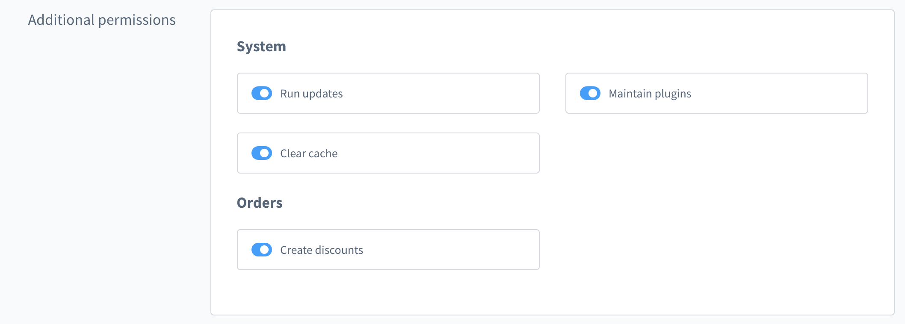

[titleEn]: <>(ACL in the administration)
[hash]: <>(article:developer_administration_acl)

## ACL

The Access Control List or ACL in Shopware ensures that you can create individual roles. 
These roles have finely granular rights, which every shop operator can set up himself. 
These roles can be assigned to users.

As an example, let's take a look at a role called 'Editor'. We would assign this role 
rights to edit products, categories and manufacturers. Now, every user which is a 'Editor' would 
be able to see and edit the specific areas which are defined in the role.

This documentation chapter explains
- what is an admin privilege
- how to register new admin privileges for your plugin
- how to protect your plugin routes
- how to protect your menu entries
- how to add admin snippets for your privileges
- how you can check in your module at any place if the user has the required rights

### Admin privileges

Admin privileges are higher-level permissions that the user can set. These are always determined 
by an explicit identifier. This is made up of a 'key' and the 'role'. 
These are connected with a dot: `.`.

A distinction is made here between normal `permissions` and `additional_permissions`. Let's start 
with the normal permissions.



`permissions`:
- Key: `product`
- Role: `viewer`
- Identifier (Key + Role): `product.viewer`

The key describes the higher-level admin privilege. For normal `permissions` this is 
usually the module name. Other examples would be `manufacturer`, `shopping_experiences` or `customers`. 
The key is used to group the admin privileges.

The role indicates which authorization is given for the key. So four predefined roles 
are available for the normal `permissions`:
- `viewer`: The viewer is allowed to view things
- `editor`: The editor is allowed to edit things
- `creator`: The Creator is allowed to create new things
- `deleter`: The Deleter is allowed to delete things

It is important to note that these combinations are not API permissions. They are only intended to 
enable, disable, deactivate or hide certain elements in the administration.

For each admin privilege, the needed entity privileges need to be assigned. Depending on the
admin privileges, these can be much more complex.

In addition to the normal `permissions`, which represent CRUD functionality, there are also 
`additional_permissions`. These are intended for all functions that cannot be represented by CRUD.



The additional_permissions have their own card below the normal permissions grid. An example for additional_permissions 
would be: "clearing the cache". This is an individual action without CRUD functionalities. The key is still used for grouping.
Therefore the role can be individual and does not have to follow the scheme.

`additional_permissions`:
- Key: `system`
- Role: `clear_cache`
- Identifier (Key + Role): `system.clear_cache`


## Register admin privilege

The privilege service can be used to create new privileges in the administration. These will then appear in the 
Users & Permissions module under the roles.

### Register normal permissions

You can use the service at any point in your code. But it is important that it will be called before 
the user goes to the roles detail page. For convenience we recommend this pattern:

```
- your-module-folder
    - acl
        - index.js -> contains permission
    - ...
    - index.js -> import './acl'
```

Now you can use the method `addPrivilegeMappingEntry` to add a new entry:

To add a new mapping for your custom key:
```js
// your-module-folder/acl/index.js

Shopware.Service('privileges').addPrivilegeMappingEntry({
    category: 'permissions',
    parent: null,
    key: 'your_key',
    roles: {
        viewer: {
            privileges: [],
            dependencies: []
        },
        editor: {
            privileges: [],
            dependencies: []
        },
        creator: {
            privileges: [],
            dependencies: []
        },
        deleter: {
            privileges: [],
            dependencies: []
        }
    }
});
```

To add privileges to an existing key:
```js
// your-module-folder/acl/index.js

Shopware.Service('privileges').addPrivilegeMappingEntry({
    category: 'permissions',
    parent: null,
    key: 'product',
    roles: {
        viewer: {
            privileges: ['plugin:read']
        },
        editor: {
            privileges: ['plugin:update']
        },
        newrole: {
            privileges: ['plugin:write']
        }
    }
});
```

Method `addPrivilegeMappingEntry`:

| Property  | Description                                                                                                                  |
|-----------|------------------------------------------------------------------------------------------------------------------------------|
| category  | Should the privilege be visible in the `permissions` grid or in the `additional_permissions`                                 |
| parent    | (Coming soon) For nesting and better overview you can add a parent key. If the privilege do not have a parent then use null. |
| key       | All privileges with the same key will be grouped together. For normal `permissions` each role will be in the same row.       |
| roles     | When category is `permissions`: Use `viewer`, `editor`, `creator` and `deleter`.                                             |
|           | When category is `additional_permissions`: Use a custom key because the additional permissions don´t enforce a structure.    |


Each role in roles:  

| Property     | Description                                                                                                                                                |
|--------------|------------------------------------------------------------------------------------------------------------------------------------------------------------|
| privileges   | You need to add all API permissions here which are required for an working admin privilege. The structure is `entity_name:operation`, e.g. 'product:read'. |
| dependencies | In some cases it it necessary to automatically check another role. To do this you need to add the identifier, e.g. `product.viewer`.                       |

Here is a example how this can look for the sales channel functionality in the administration:

```js
Shopware.Service('privileges').addPrivilegeMappingEntry({
    category: 'permissions',
    parent: null,
    key: 'sales_channel',
    roles: {
        viewer: {
            privileges: [
                'sales_channel:read',
                'sales_channel_type:read',
                'payment_method:read',
                'shipping_method:read',
                'country:read',
                'currency:read',
                'sales_channel_domain:read',
                'snippet_set:read',
                'sales_channel_analytics:read',
                'product_export:read',
                'theme:read',
                'custom_field_set:read',
                'custom_field:read',
                'custom_field_set_relation:read',
                'category:read',
                'customer_group:read'
            ],
            dependencies: []
        },
        editor: {
            privileges: [
                'sales_channel:read',
                'sales_channel:write',
                'sales_channel_type:read',
                'sales_channel_type:write',
                'payment_method:read',
                'payment_method:write',
                'shipping_method:read',
                'shipping_method:write',
                'country:read',
                'country:write',
                'currency:read',
                'currency:write',
                'sales_channel_domain:read',
                'sales_channel_domain:write',
                'snippet_set:read',
                'snippet_set:write',
                'sales_channel_analytics:read',
                'sales_channel_analytics:write',
                'product_export:read',
                'product_export:write',
                'theme:read',
                'theme:write',
                'custom_field_set:read',
                'custom_field_set:write',
                'custom_field:read',
                'custom_field:write',
                'custom_field_set_relation:read',
                'custom_field_set_relation:write',
                'category:read',
                'category:write',
                'customer_group:read',
                'customer_group:write'
            ],
            dependencies: ['sales_channel.viewer']
        },
        creator: {
            privileges: [...more],
            dependencies: [...more]
        },
        deleter: {
            privileges: [...more],
            dependencies: [...more]
        }
    }
});
```

### Register additional permissions

To add privileges to the card `additional_permissions` you need set `additional_permissions`
in the property category. The main difference to normal permissions is that you can
choose every role key you want.

Here an example for `additional_permissions`:

```js
Shopware.Service('privileges').addPrivilegeMappingEntry({
    category: 'additional_permissions',
    parent: null,
    key: 'system',
    roles: {
        clear_cache: {
            privileges: ['system:clear:cache'],
            dependencies: []
        }
    }
});
```

The key is here `system` to group the permission together with other system specific
permissions. But here you can feel free to add your own names.

## Get permissions from other privilege mappings

In the case that you have many dependencies which are the same as in other 
modules then you can import these. This can be useful if you have components
in your module which have complex privileges. Some examples are the rule builder
or the media module. You can get these privileges with the method `getPrivileges` 
from the service.

Here is an example:
```js
Shopware.Service('privileges').addPrivilegeMappingEntry({
    category: 'permissions',
    parent: null,
    key: 'product',
    roles: {
        viewer: {
            privileges: [
                'product.read',
                Shopware.Service('privileges').getPrivileges('rule.viewer')
            ],
            dependencies: []
        }
    }
})
```

Now all user with the privilege `product.viewer` automatically have access
to all privileges from the `rule.viewer`.

Important: This only adds the API privileges. The user has no access to the
module itself in the administration.

## Protect your plugin routes

It is easy to protect your routes for users without the right privileges. Just add
`privilege` to the `meta` property in your route:

```js
Module.register('your-plugin-module', {
    routes: {
        detail: {
            component: 'your-plugin-detail',
            path: 'your-plugin',
            meta: {
                privilege: 'your_key.your_role' // e.g. 'product.viewer'
            }
        }    
    }
});
```

## Protect your plugin menu entries

Like the routes you need to add the property `privilege` to your navigation settings:

```js
Module.register('your-plugin-module', {
    navigation: [{
        id: 'your-plugin',
        ...,
        privilege: 'your_key.your_role' // e.g. product.viewer
    }]
});
```

or in the settings item:

```js
Module.register('your-plugin-module', {
    settingsItem: [{
        group: 'system',
        to: 'sw.your.plugin.detail',
        privilege: 'your_key.your_role' // e.g. product.viewer
    }]
});
```

## Add snippets for your privileges

To create translations for the labels of the permissions you need to add
snippet translations. The path is created automatically for you:

For group titles:

```
sw.privileges.${category}.${key}.label
// e.g. sw.privileges.permissions.product.label
// e.g. sw.privileges.additional_permissions.system.label
```

For specific roles (only needed in `additional_permissions`):

```
sw.privileges.${category}.${key}.${role_key} 
// e.g. sw.privileges.additional_permissions.system.clear_cache
```

Just add the snippets to your snippets file:
```json
{
  "sw-privileges": {
    "permissions": {
      "sales_channel": {
        "label": "Sales Channels"
      }
    },
    "additional_permissions": {
      "system": {
        "label": "System",
        "clear_cache": "Clear cache"
      }
    }
  }
}
```

## Use the privileges in any place in your plugin

To check in any place of your app if the user has the correct rights to view or edit things you can use
the `acl` service. The main method you need is `acl.can(identifier)`. It checks automatically if the user
has admin rights or the privilege for the identifier.

You can use the global Shopware object (`Shopware.Service('acl')`) or inject the service in your component:

```js
Shopware.Component.register('your-plugin-component', {
    template,

    inject: ['acl'],

    ...
});
```

With the injection you can use the service functionality in any place in your component.

Example in a method:
```js
Shopware.Component.register('your-plugin-component', {
    template,

    inject: ['acl'],

    methods: {
        allowSaving() {
            return this.acl.can('sales_channel.creator');
        }    
    }
});
```

Example to hide the element if the user has not the right privilege:
```html
<button @click="openCreateSalesChannelModal"
        v-if="acl.can('sales_channel.creator')">
</button>
```

Example to disable the element if user has not the right privilege. Here we use also a tooltip to
give the user the information that the needed privilege is missing. For this you can use the global
snippet path:
```html
<button @click="saveProduct"
        :disabled="!acl.can('product.editor')"
        v-tooltip="{
            message: $tc('sw-privileges.tooltip.warning'),
            disabled: acl.can('product.editor'),
            showOnDisabledElements: true
        }"
></button>
```

## Protect your shortcuts

It is easy to protect your shortcuts. You can replace the String value with an object which
contains the method and an active property.

The active property can be a boolean or a function which returns a boolean value.
In our case we need a function to check on each shortcut execution if the privilege exists.

```js
Module.register('your-plugin-module', {
    shortcuts: {
        'SYSTEMKEY+S': {
            active() {
                return this.acl.can('product.editor');
            },
            method: 'onSave'
        },
        ESCAPE: 'onCancel'
    },
});
```
## Add your custom privileges

To make sure your custom privileges are additionally added to existing roles, override the `enrichPrivileges` method and return a list of your custom privileges.
This method should return an array with the technichal role name as key, while the privileges should be the array value.
An event subscriber will add the plugins custom privileges at runtime.

```php
<?php declare(strict_types=1);

namespace SwagTestPluginAcl;

use Shopware\Core\Framework\Plugin;

class SwagTestPluginAcl extends Plugin
{
    public function enrichPrivileges(): array
    {
        return [
            'product.viewer' => [
                'my_custom_privilege:read',
                'my_custom_privilege:write',
                'my_other_custom_privilege:read',
                // ...
            ],
            'product.editor' => [
                // ...
            ],
        ];
    }
}
```

