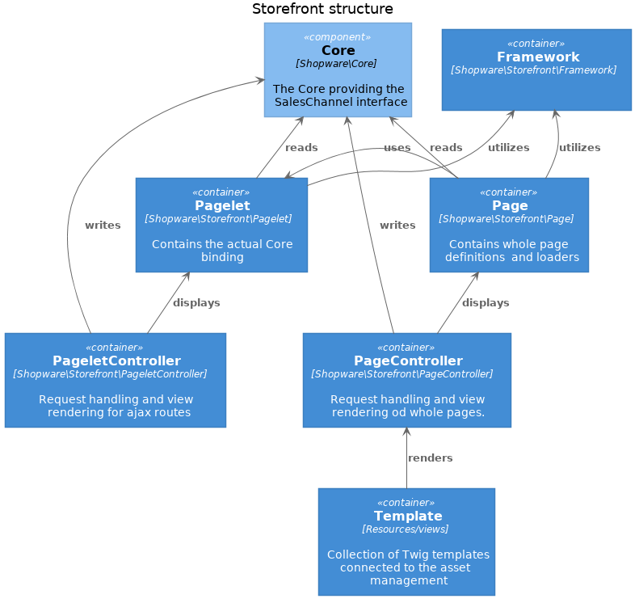

[titleEn]: <>(Storefront)
[hash]: <>(category:developer_storefront)

* [Repository Link](https://github.com/shopware/platform/tree/master/src/Storefront)

The Storefront component, conceptually like the [Administration](./../../60-references-internals/20-administration/__categoryInfo.md) 
sits on top of the [Core](./../../60-references-internals/10-core/__categoryInfo.md). Contrary to the Administration the Storefront is a 
**SalesChannel** and executes in the **same process** as the Core. It is architecturally in part a 
[Backend for Frontends](https://samnewman.io/patterns/architectural/bff/) and a classical PHP application with HTML 
rendering, JavaScript enhancements (along the lines of 
[graceful degradation](https://www.w3.org/wiki/Graceful_degradation_versus_progressive_enhancement)) and 
[SASS](https://sass-lang.com/) styling as an extension of the [Bootstrap Framework](https://www.getbootstrap.com/).

## Building Blocks 

The Storefront's main concerns are:

**[Page and pagelets](./20-page-pagelet.md)** 
    ([Page](https://github.com/shopware/platform/tree/master/src/Storefront/Page), 
    [Pagelet](https://github.com/shopware/platform/tree/master/src/Storefront/Pagelet))
   : Contrary to API calls that result in single resource data, a whole page in Storefront displays multiple different 
   data sets on a single page.
   
**[Mapping Requests to the Core](./../../60-references-internals/30-storefront/200-storefront-writing-data.md)** 
([PageController](https://github.com/shopware/platform/tree/master/src/Storefront/PageController), 
[PageletController](https://github.com/shopware/platform/tree/master/src/Storefront/PageletController))
   : The Storefront uses the SalesChannel API internally and forwards possibly slightly changed requests to the core.
   
**[Rendering templates](./10-templates.md)** 
([page templates](https://github.com/shopware/platform/tree/master/src/Storefront/Resources/views/storefront/page))
   : Contrary to the core that can almost completely omit templating in favor JSON responses, 
   the Storefront contains a rich set of `Twig` templates to display a fully functional shop.

**Theming** ([styles](https://github.com/shopware/platform/tree/master/src/Storefront/Resources/app/storefront/src/scss))
   : The Storefront not only contains static templates but also inhibits a 
   theming engine to modify the rendered templates or change the default layout programmatically.
   
These concerns are mapped to a *Web-MVC* structure:



The `Core` in this case acts as if it was the *domain model* wrapping all the sales channel logic. 
The `Page` and `Pagelet` represent the *read model*, the `PageController` and `PageletController` work 
directly on core services and are the *write model*.

## The Template

Contrary to the core that just contains PHP logic the Storefront template represents a vast part of the 
functionality of the component. It is worth looking a little deeper into the `/Resources` directory to 
gain a better understanding how the Storefront works. When opening the directory you find these subfolders.

```
<platform/src/Storefront/Resources>
└── app
    └── administration
    └── storefront
        └── build
        └── dist
        └── src
        └── test
└── build
└── config
└── src
    └── script
    └── style
└── snippets
└── views
└── .browserlistrc
└── .gitignore
└── theme.json
```

The Storefront template is based on the [**Bootstrap toolkit**](https://www.getbootstrap.com/) 
and therefore fully skinable.
