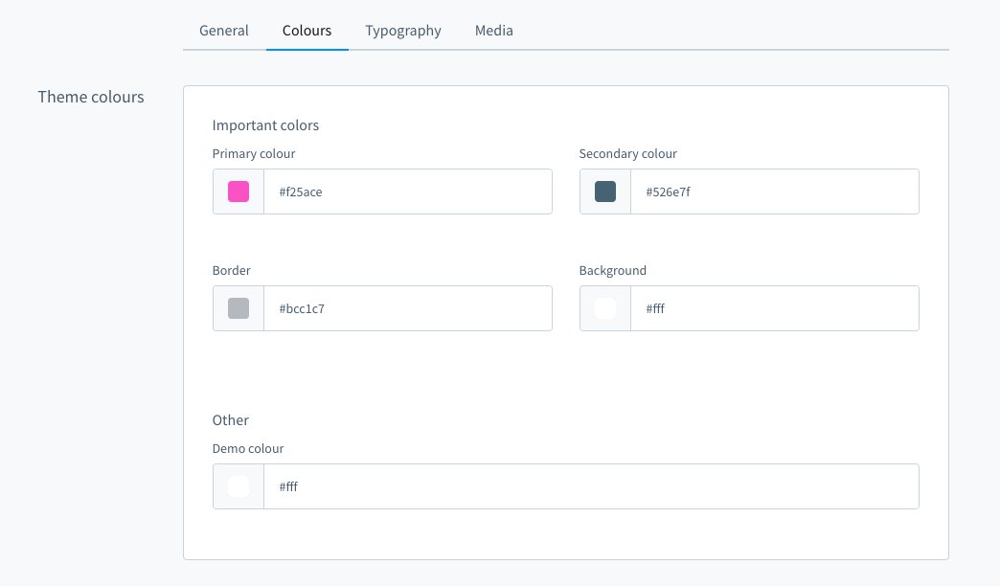

[titleEn]: <>(Theme configuration)
[hash]: <>(article:theme_configuration)

## Structure of the theme.json

Open up the `src/Rescoure/theme.json` file with your favorite code-editor. The configuration looks like this.

```json
# src/Resources/theme.json
{
  "name": "MyTheme",
  "author": "Shopware AG",
  "views": [
     "@Storefront",
     "@Plugins",
     "@MyTheme"
  ],
  "style": [
    "app/storefront/src/scss/overrides.scss",
    "@Storefront",
    "app/storefront/src/scss/base.scss"
  ],
  "script": [
    "@Storefront",
    "app/storefront/dist/storefront/js/my-theme.js"
  ],
  "asset": [
    "@Storefront",
    "app/storefront/src/assets"
  ]
}
```

Let's have a closer look at each section.

```json
# src/Resources/theme.json
{
  "name": "MyTheme",
  "author": "Shopware AG",
  "description": {
    "en-GB": "Just another description",
    "de-DE": "Nur eine weitere Beschreibung"
  },
  ...
}
```

Here change the `name` of your theme and the `author`.
The `description` section is optional and as you notice it is also translatable.

## Theme template inheritance

The inheritance of the templates can be controlled via the `views` option. Here you define the order in which the templates are to be loaded.
To illustrate this, here is an example for the `views` configuration:

```json
# src/Resources/theme.json
{
  ...
  "views": [
     "@Storefront",
     "@Plugins",
     "@PayPal",
     "@MyTheme"
  ],
  ...
}
```

Defining the above configuration results in the following behavior:
* Templates are first searched in `@MyTheme`.
* The specification of `@PayPal` allows to control the order for a specific plugin more precisely
* `@Plugins` serves as a placeholder and defines that the `@MyTheme` and `@PayPal` should be searched for in all other plugins for the templates
* `@Storefront` then defines that the Shopware 6 storefront theme should be used as the last inheritance level.

## Styles

```json
# src/Resources/theme.json
{
  ...
  "style": [
    "app/storefront/src/scss/overrides.scss",
    "@Storefront",
    "app/storefront/src/scss/base.scss"
  ],
  ...
}
```

The `style` section determines the order of the CSS compilation. In the `app/storefront/src/scss/base.scss` file you can apply your changes your want to make to the `@Storefront` standard styles or add other styles you need.
The `app/storefront/src/scss/overrides.scss` file is used for a special case. Maybe you need to override some defined `variables` or `functions` defined by Shopware or Boostrap, you can implement your changes here.

## Assets

```json
# src/Resources/theme.json
{
  ...
  "asset": [
     "app/storefront/src/assets"
   ]
  ...
}
```

The `asset` option you can configure you paths to your assets like images, fonts, etc.
The standard location to put your assets to is the `app/storefront/src/assets` folder.

If you need the assets from the storefront theme for your theme, just add `@Storefront` as asset path

```json
# src/Resources/theme.json
{
  ...
  "asset": [
     "@Storefront",
     "app/storefront/src/assets"
   ]
  ...
}
```

## Config fields

One of the benefits of creating a theme is that you can overwrite the theme configuration of 
the default theme or add your own configurations.

```json
# src/Resources/theme.json
{
  ... 
  "assest":[
    ...
  ],
  "config": {
      "fields": {
        "sw-color-brand-primary": {
          "value": "#00ff00"
        }
      }
   }
  ...
}
```


In the example above, we change the primary color to green. You always inherit from the storefront
config and both configurations are merged. This also means that you only have to provide the values you
actually want to change. You can find a more detailed explanation of the configuration inheritance
in the next section.

The `theme.json` contains a `config` property which consists a list of tabs, blocks, sections and fields.

The key of each config fields item is also the technical name which you use to access the config option
in your theme or scss files. `config` entries will show up in the administration and 
can be customized by the end user (if `editable` is set to `true`, see table below).

The following parameters can be defined for a config field item:

| Name         | Meaning                                                                                          |
|------------- |--------------------------------------------------------------------------------------------------|
| label        | Array of translations with locale code as key                                                    |
| type         | Type of the config. Possible values: color, text, number, fontFamily, media, checkbox and switch |
| editable     | If set to false, the config option will not be displayed (e.g. in the administration)            |
| tab          | Name of a tab to organize the config options                                                     |
| block        | Name of a block to organize the config options                                                   |
| section      | Name of a section to organize the config options                                                 |
| custom       | The defined data will not be processed but is available via API                                  |
| scss         | If set to false, the config option will not be injected as a SCSS variable                       |
| fullWidth    | If set to true, the administration component width will be displayed in full width               |

### Field types
You can use different field types in your theme manager:

* A text field example:

```json
"modal-padding": {
    "label": {
      "en-GB": "Modal padding",
      "de-DE": "Modal Innenabstand"
    },
    "type": "text",
    "value": "(0, 0, 0, 0)",
    "editable": true
}
```

* A number field example: 

```json
"visible-slides": {
    "label": {
      "en-GB": "Number of visible slides",
      "de-DE": "Anzahl an sichtbaren Slider Bildern"
    },
    "type": "number",
    "custom": {
      "numberType": "int",
      "min": 1,
      "max": 6
    },
    "value": 3,
    "editable": true
}
```

* Two boolean field examples:

```json
"navigation-fixed": {
    "label": {
      "en-GB": "Fix navigation",
      "de-DE": "Navigation fixieren"
    },
    "type": "switch",
    "value": true,
    "editable": true
}
```

or

```json
"navigation-fixed": {
    "label": {
      "en-GB": "Fix navigation",
      "de-DE": "Navigation fixieren"
    },
    "type": "checkbox",
    "value": true,
    "editable": true
}
```

### Examples for custom config fields

* A custom single-select field example

```json
{
  "name": "Just another theme",
  "author": "Just another author",
  "description": {
    "en-GB": "Just another description",
    "de-DE": "Nur eine weitere Beschreibung"
  },
  "views": [
    "@Storefront",
    "@Plugins",
    "@SelectExample"
  ],
  "style": [
    "app/storefront/src/scss/overrides.scss",
    "@Storefront",
    "app/storefront/src/scss/base.scss"
  ],
  "script": [
    "@Storefront",
    "app/storefront/dist/storefront/js/select-example.js"
  ],
  "asset": [
    "@Storefront",
    "app/storefront/src/assets"
  ],
  "config": {
    "blocks": {
      "exampleBlock": {
        "label": {
          "en-GB": "Example block",
          "de-DE": "Beispiel Block"
        }
      }
    },
    "sections": {
      "exampleSection": {
        "label": {
          "en-GB": "Example section",
          "de-DE": "Beispiel Sektion"
        }
      }
    },
    "fields": {
      "my-single-select-field": {
        "label": {
          "en-GB": "Select a font size",
          "de-DE": "Wähle ein Schriftgröße"
        },
        "type": "text",
        "value": "24",
        "custom": {
          "componentName": "sw-single-select",
          "options": [
            {
              "value": "16",
              "label": {
                "en-GB": "16px",
                "de-DE": "16px"
              }
            },
            {
              "value": "20",
              "label": {
                "en-GB": "20px",
                "de-DE": "20px"
              }
            },
            {
              "value": "24",
              "label": {
                "en-GB": "24px",
                "de-DE": "24px"
              }
            }
          ]
        },
        "editable": true,
        "block": "exampleBlock",
        "section": "exampleSection"
      }
    }
  }
}
```


* A custom multi-select field example

````json
{
  "name": "Just another theme",
  "author": "Just another author",
  "description": {
    "en-GB": "Just another description",
    "de-DE": "Nur eine weitere Beschreibung"
  },
  "views": [
    "@Storefront",
    "@Plugins",
    "@SelectExample"
  ],
  "style": [
    "app/storefront/src/scss/overrides.scss",
    "@Storefront",
    "app/storefront/src/scss/base.scss"
  ],
  "script": [
    "@Storefront",
    "app/storefront/dist/storefront/js/select-example.js"
  ],
  "asset": [
    "@Storefront",
    "app/storefront/src/assets"
  ],
  "config": {
    "blocks": {
      "exampleBlock": {
        "label": {
          "en-GB": "Example block",
          "de-DE": "Beispiel Block"
        }
      }
    },
    "sections": {
      "exampleSection": {
        "label": {
          "en-GB": "Example section",
          "de-DE": "Beispiel Sektion"
        }
      }
    },
    "fields": {
      "my-multi-select-field": {
        "label": {
          "en-GB": "Select some colours",
          "de-DE": "Wähle Farben aus"
        },
        "type": "text",
        "editable": true,
        "value": [
          "green",
          "blue"
        ],
        "custom": {
          "componentName": "sw-multi-select",
          "options": [
            {
              "value": "green",
              "label": {
                "en-GB": "green",
                "de-DE": "grün"
              }
            },
            {
              "value": "red",
              "label": {
                "en-GB": "red",
                "de-DE": "rot"
              }
            },
            {
              "value": "blue",
              "label": {
                "en-GB": "blue",
                "de-DE": "blau"
              }
            },
            {
              "value": "yellow",
              "label": {
                "en-GB": "yellow",
                "de-DE": "gelb"
              }
            }
          ]
        },
        "block": "exampleBlock",
        "section": "exampleSection"
      }
    }
  }
}
````


## Tabs, blocks and sections
You can use tabs, blocks and sections to structure and group the config options.



In the picture above are four tabs. In the "Colours" tab there is one block "Theme colours" which contains two sections 
named "Important colors" and "Other". You can define the block and section individually for each item. Example:
```json
{
  "name": "Just another theme",
  "author": "Just another author",
  
  "config": {
    "fields": {
      "sw-color-brand-primary": {
        "label": {
          "en-GB": "Primary colour",
          "de-DE": "Primär"
        },
        "type": "color",
        "value": "#399",
        "editable": true,
        "tab": "colors",
        "block": "themeColors",
        "section": "importantColors"
      }
    }
  }
}
```

The tab and section property is not required.

You can extend the config to add translated labels for the tabs, blocks and sections:
```json
{
  "name": "Just another theme",
  "author": "Just another author",
  
  "config": {
    "blocks": {
      "colors": {
        "themeColors": {
          "en-GB": "Theme colours",
          "de-DE": "Theme Farben"
        }
      }
    },
    "sections": {
      "importantColors": {
        "label": {
          "en-GB": "Important colors",
          "de-DE": "Wichtige Farben"
        }
      }
    },
    "tabs": {
      "colors": {
          "label": {
              "en-GB": "Colours",
              "de-DE": "Farben"
          }
      } 
    },
    "fields": {
      "sw-color-brand-primary": {
          "label": {
            "en-GB": "Primary colour",
            "de-DE": "Primär"
          },
          "type": "color",
          "value": "#399",
          "editable": true,
          "tab": "colors",
          "block": "themeColors",
          "section": "importantColors"
        }
    }
  }
}
```
