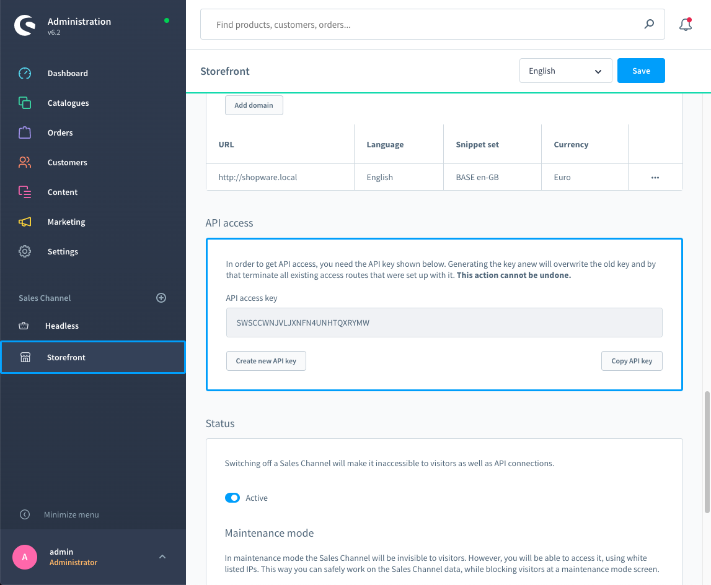

[titleEn]: <>(SalesChannel-API authentication)
[hash]: <>(article:api_sales_channel)

The SalesChannel-API is part of our API family. It allows access to all sales channel operations, such as creating new customers, customer login
and logout, various cart operations and a lot more. 

It's ideal if you want to build your own storefront. You could create a mobile app based on the Sales Channel API or just embed it into your
existing application to have a solid base for payment and transaction handling. You find more information about the concept behind the Sales Channel [here](/en/shopware-6-en/swsaleschannel).

## Authentication

The Storefront API has no authentication since it is designed to be a public API.
Some user related endpoints require a logged in user.

The access key for the SalesChannel-API can be found in the administration (`http://your-shopware-instance.local/admin`). 

1. Navigate to one of your Sales Channels in the "Sales Channel" section in the main menu.
2. Scroll to the "API access" card in your desired Sales Channel.
3. Copy the "API access key".

The access key must always be included in your API request. The custom header `sw-access-key` is used for this purpose.

## Return formats

The Storefront API supports a simple JSON formatted response similar to the Shopware 5 API.
