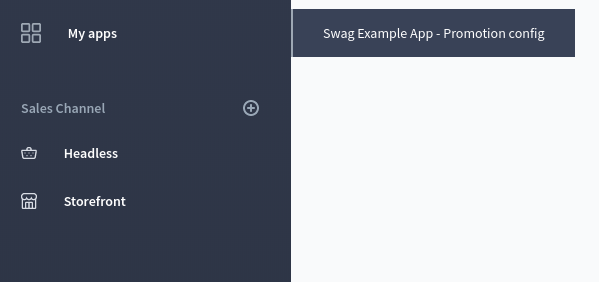
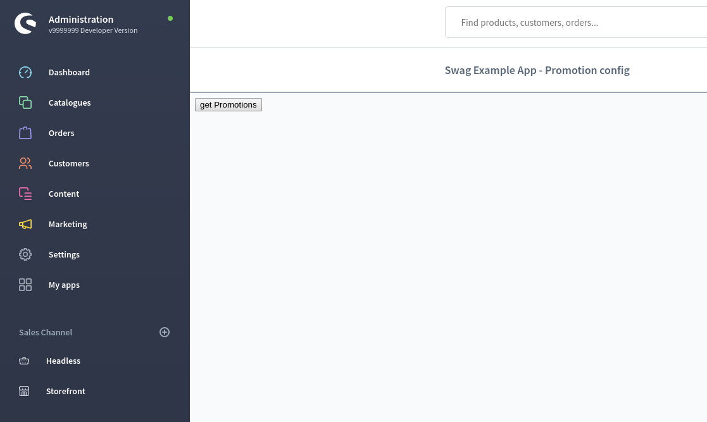
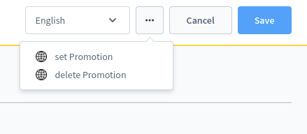
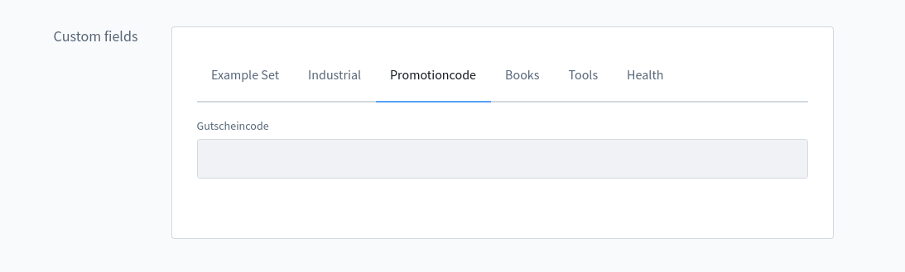

[titleEn]: <>(App base)
[metaDescriptionEn]: <>(This is a guide about the basic information about apps - the base you need to know when developing them.)
[hash]: <>(article:app_base)

### File structure

To get started with your app, create an `apps` folder in `custom` of your development template installation. In there, 
create another folder for your application and provide a manifest file in it.
```
...
└── custom
    ├── apps
    │   └── MyExampleApp
    │       └── manifest.xml
    └── plugins
...
```

### Start writing apps

After creating this file structure and the manifest file, you should be able to install your app via 
`bin/console app:refresh`.

## Manifest file

The manifest file is the central point of your app. It is the only file which is required, providing all 
information concerning your app, as seen in the minimal version below:

```xml
<?xml version="1.0" encoding="UTF-8"?>
<manifest xmlns:xsi="http://www.w3.org/2001/XMLSchema-instance" xsi:noNamespaceSchemaLocation="../../plugins/connect/src/Core/Content/App/Manifest/Schema/manifest-1.0.xsd">
    <meta>
        <name>YourTechnicalAppName</name>
        <label>Label</label>
        <label lang="de-DE">Name</label>
        <description>A description</description>
        <description lang="de-DE">Eine Beschreibung</description>
        <author>Your Company Ltd.</author>
        <copyright>(c) by Your Company Ltd.</copyright>
        <version>1.0.0</version>
    </meta>
    <setup>
        <registrationUrl>https://my.example.com/registration</registrationUrl>
    </setup>
    <permissions/>
</manifest>
```

### Meta data

At first, all general information will be stored in the manifest file. Via `<meta>` element you are able to define all
meta data of your app. Most are self-explanatory:

* `name`: This is the element for the technical name of your app
* `label`: In this element, you can set al label for your app. You can even use it to include translations using the `lang`
attribute
* `description`
* `author`
* `copyright`
* `version`

### Registration URL

During installation a handshake must take place to give the app a token with which it can communicate with the shop.
This is configured in the setup element

```xml
<setup>
    <registrationUrl>https://my.example.com/registration</registrationUrl>
</setup>
```

A request is sent there, with the data to register the shop. The data comes as a query parameter with the following: 
https://my.app.com/registration?shop=shopurl.com&timestamp=12345&hmac=13abcdef
A json object is expected in response:

```json
{
  "proof": "proof123",
  "secret": "random secret string",
  "confirmation_url": "https://my.example.com/registration/confirm"
}
```

Where the proof is composed of the one hmac: $proof = hmac($shopurl . $appName, $secret); The secret can be used 
to validate the requests of the shop. Please keep in mind it must be a sha256 hash: 
`hmac('sha256', $shopurl . $appName, $secret)`

### Permissions

Your app should be able to work with the data store in your shop. To define the permissions, your app can get in
the `<permissions>` element. For each permission, please add an own element as seen in the example below:

```xml
    <permissions>
        <create>product</create>

        <read>product</read>

        <update>product</update>
    </permissions>
```

You set permission to all entities available in Shopware. The permission types to choose from are defined in the 
scheme, e.g. `read`, `create` or `update`.

## Expansion possibilities

The manifest file takes over even more tasks: There are lots of possibilities to extend Shopware by using apps. In general, all of them can be achieved by adding some
nodes to the manifest files. The following paragraphs will show you all possibilities we can provide. 

### Webhooks

With webhooks you are able to subscribe to events occurring in Shopware. Whenever such an event occurs 
- a notification will be send to your stored URL. Behind this URL there is a program you have defined in your own 
infrastructure, which for example sends an e-mail with a voucher to the customer who has just placed an order.
It's important to note that you have to operate the endpoints for your apps by yourself, i.e. the logic you want 
to execute when an event occurs.

To use webhooks in your app, please implement a `<webhooks>` element in your manifest file, e.g. like this: 

```xml
    <webhooks>
        <webhook name="giveExample" url="http://example/event/example-with-paid-order" event="checkout.order.placed"/>
    </webhooks>
```

This example illustrates you how to define a webhook with the name `giveExample` and the 
url `http://example/event/example-with-paid-order` which will be triggered if the event `checkout.order.placed` 
is fired. So if an order is placed, your custom logic will get executed.

You can use a variety of events to react to changes in Shopware that way. See the table below for an overview of most
important ones.

| Event        | Description           | 
| -------------- |-------------------- |
| `contact_form.send` | Triggers if a contact form is send | 
| `mail.sent` | Triggers if a mail is send from Shopware | 
| `mail.after.create.message` | Triggers if a mail after creating a message is send (?) | 
| `mail.before.send` | Triggers before a mail is send | 
| `checkout.order.placed` | Triggers if an order is placed checkout-wose | 
| `checkout.customer.register` | Triggers if a new customer was registered yo| 
| `checkout.customer.login` | Triggers as soon as a customer logs in | 
| `checkout.customer.double_opt_in_guest_order` | Triggers as soon as double opt-in is accepted in a guest order | 
| `checkout.customer.before.login` |  Triggers as soon as a customer logs in within the checkout process |
| `checkout.customer.changed-payment-method` |  Triggers if a customer changes his payment method in checkout process |
| `checkout.customer.logout` | Triggers if a customer logs out |
| `checkout.customer.double_opt_in_registration` | Triggers if a customer commits to his registration via double opt in |
| `customer.recovery.request` | Triggers if a customer recovers his password |
| `user.recovery.request` | Triggers if a user recovers his password |
| `product.written` | Triggers if a product is written |
| `product_price.written` | Triggers if product price is written |
| `category.written` | Triggers if a category is written |

### Create own module

In your app, you are able to add your own module to the administration. In this case, your app will add an own module
to the administration, including an own menu item. 



When clicking on this new menu item, an iframe will be displayed. Within this iframe, your website will be loaded and 
shown. In the iframe, your app can do  all the things an external app can do - outside the administration via API. 
In such a module, the search bar stays accessible. However, the search won't be applied on the iframe. 



In order to create a custom module, you need to define an admin element to define `<admin>` extensions. In there, please
add your module by defining a `<module>` element. 
* Here you're able to define the technical name of your module and the source: Please insert the link to your website 
there.
* To define the module's title and its translation, you can add a label as child element.

```xml
<admin>
    <module name="exampleConfig" source="http://localhost:7777/example/view/example-config">
        <label>Example config</label>
        <label lang="de-DE">Beispiel Einstellungen</label>
    </module>
</admin>
```

### Buttons

Another extension possibility in the administration is the ability to add own buttons to the smartbar. For now, you can 
them in the smartbar of detail and index views:



To get those buttons, you start in the `admin` section of your manifest file. There you can define `<action-button>` 
elements in order to add your button, as seen as below:

```xml
<admin>
    <action-button action="setPromotion" entity="promotion" view="detail" url="http://example/promotion/set-promotion">
        <label>set Promotion</label>
    </action-button>
    <action-button action="deletePromotion" entity="promotion" view="detail" url="http://example/promotion/delete-promotion">
        <label>delete Promotion</label>
    </action-button>
</admin>
```

An action button can have the following attributes:
* action: Unique identifier for the action, can be set freely.
* entity: Here you define which entity you're working on.
* view: To set the view the button should be added to. Currently, you can choose between index and listing view.

### Custom fields



By using `<custom-fields>` element, you can add custom fields to Shopware. The additional fields replace 
the free text fields known from Shopware 5 and offer you the possibility to add your own fields 
for the different program areas. In other words, existing data records can be extended with additional fields. 

```xml
<custom-fields>
    <custom-field-set>
        <name>example_set</name>
        <label>Example Set</label>
        <label lang="de-DE">Beispiel-Set</label>
        <related-entities>
            <order/>
        </related-entities>
        <fields>
        </fields>
    </custom-field-set>
</custom-fields>
```

For the data needed, please refer to the custom fields in general: At first,you need a custom field set, 
as custom fields in Shopware are organised in sets. Here you need to consider some important fields:
* `name`: A technical name for your set
* `label`: This element provides the label of the text and can be used for defining translations of the label as well. 
* `related-entities`: With this element set the entities the custom field set is used in
* `fields`: Finally, the fields are configured in this section.

```xml
<fields>
    <text name="code">
        <position>1</position>
        <label>Example field</label>
    </text>
</fields>
```

When defining custom fields in the `<fields>` element, you can configure a lot of things concerning the fields. 
Please refer to 
[Custom field documentation](https://docs.shopware.com/en/shopware-6-en/settings/custom-fields#create-custom-field)
for further details.

Please pay attention to the fact that the names of the custom fields must be unique! Therefore, it should always be 
prefixed with the vendor prefix of the manufacturer.

## Examples

### Tutorials

If you want to see a step-by-step tutorial on how to write an app, we got you covered. Please see 
[How to write an app](./50-app-examples-and-tutorials/10-create-own-app.md) for a detailed tutorial.

### One full example of a manifest file

Below you can take a look on an extended example on how a full manifest file can look like.

```xml
<?xml version="1.0" encoding="UTF-8"?>
<manifest xmlns:xsi="http://www.w3.org/2001/XMLSchema-instance" xsi:noNamespaceSchemaLocation="../../plugins/connect/src/Core/Content/App/Manifest/Schema/manifest-1.0.xsd">
    <meta>
        <name>ExampleApp</name>
        <label>Swag Example App</label>
        <label lang="de-DE">Swag Example App</label>
        <description>Example App</description>
        <description lang="de-DE">Beispiel App</description>
        <author>shopware AG</author>
        <copyright>(c) by shopware AG</copyright>
        <version>1.0.1</version>
        <icon>icon.png</icon>
    </meta>
    <setup>
        <registrationUrl/>
    </setup>
    <admin>
        <action-button action="setPromotion" entity="promotion" view="detail" url="http://example/promotion/set-promotion">
            <label>set Promotion</label>
        </action-button>
        <action-button action="deletePromotion" entity="promotion" view="detail" url="http://example/promotion/delete-promotion">
            <label>delete Promotion</label>
        </action-button>

        <module name="promotionConfig" source="http://localhost:7777/promotion/view/promotion-config">
            <label>Promotion config</label>
            <label lang="de-DE">Gutscheincode Einstellungen</label>
        </module>
    </admin>

    <permissions>
        <create>product</create>
        <create>product_visibility</create>
        <create>promotion</create>
        <create>promotion_individual_code</create>
        <create>customer</create>
        <create>customer_address</create>
        <create>state_machine_history</create>

        <read>tax</read>
        <read>currency</read>
        <read>promotion_individual_code</read>
        <read>salutation</read>
        <read>country</read>
        <read>customer_group</read>
        <read>payment_method</read>
        <read>order</read>

        <update>product</update>
        <update>order</update>
    </permissions>

    <custom-fields>
        <custom-field-set>
            <name>promotion_code</name>
            <label>Promotioncode</label>
            <label lang="de-DE">Gutscheincodes</label>
            <related-entities>
                <order/>
            </related-entities>
            <fields>
                <text name="code">
                    <position>1</position>
                    <label>Gutscheincode</label>
                </text>
            </fields>
        </custom-field-set>
    </custom-fields>

    <webhooks>
        <webhook name="orderPromotion" url="http://example/promotion/event/state-enter-order-transaction-state-paid" event="state_enter.order_transaction.state.paid"/>
    </webhooks>
</manifest>
```
