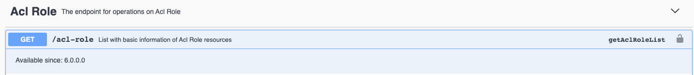
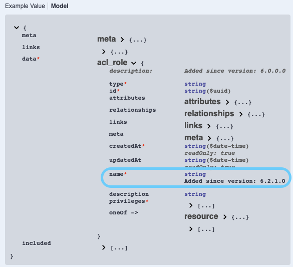

[titleEn]: <>(New API versioning explained)
[metaDescriptionEn]: <>(This HowTo will show you how the new API versioning works.)
[hash]: <>(article:api_versioning)

# Overview

Starting with Shopware version 6.4.0.0, we decided to change our API versioning strategy.
This article will cover what has been done and changed, how it used to be and how the version strategy looks like now.

## Versioning prior to 6.3.5.0

Prior to Shopware 6.3.5.0, the API version was mainly found in the routes themselves.

`/api/v3/example-route`

By using the version, one could ensure that his application keeps on working, because we're not going to introduce breaking changes within a version.
Yet, versions had to be removed every now and then, which would then still break the application.

More on this can be found on our [ADR regarding the API version removal](https://github.com/shopware/platform/blob/trunk/adr/2020-12-02-removing-api-version.md).

## Versioning starting with 6.3.5.0

With Shopware 6.3.5.0, we removed the API version from the routes.
 
 
**Old**:  
`/api/v3/example-route`
 
 
**New**:  
`/api/example-route`

The version inside the route will keep on working with Shopware 6.3.*, but it will be removed with the next major Shopware version 6.4.0.

### Deprecations

Deprecations are now added with patch and minor releases, but only removed with a major release. This has always been the case for the core itself and is now adapted
to the API.  
 
Also, deprecated fields and routes are now shown in the Swagger documentation. Have a look at the FAQ beneath to learn how to open Swagger.
Have a look for the `@deprecated` annotation on routes or the `Deprecated` flag on entity fields to see which fields or routes are deprecated in the code.

### Route and field availability

The Swagger API reference now includes the necessary information about the route and field availability.
For routes, this can look like this:

Note the availability information.

Same for fields, here is an example how it would look like:

# FAQ

### I was able to ensure that my application will keep on working by using the version in the route. What now?

Yes, this was necessary in the previous versioning strategy, since breaks were also introduced with Shopware minor releases.  
The new versioning strategy comes with the benefit, that breaks are only introduced with major releases, which were always breaking anyway.  
Thus: One route will keep working for you until the next major release.

### How do I get the currently used version via the API?

You can read the currently used version in the API as well.
Starting with Shopware 6.3.5.0, you can use this route to fetch the current version:  
`GET /api/_info/version`

Prior to that, the version was readable using the following route:  
`GET /api/v2/_info/config`

### How do I actually open up the Swagger page?

Simply navigate to the following URL in your shop:  
`//yourShop.com/api/_info/swagger.html`
