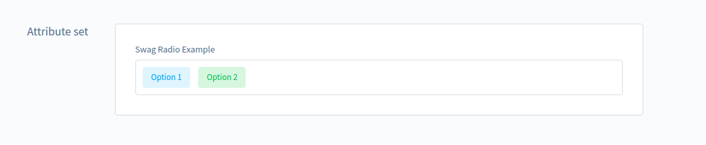

[titleEn]: <>(Custom Attributes)
[wikiUrl]: <>(../plugin-system/custom-attributes?category=shopware-platform-en/plugin-system)

Before starting you should read [Attribute System](../80-framework/20-attribute.md) first, then
[Creating a component](../10-administration/20-create-a-component.md) 
and you should know how to 
[create a plugin](../10-administration/01-administration-start-development.md#create-your-first-plugin).
## Intro
In the administration it is possible to define attribute sets that will be shown in the configuration of defined entities. Every attribute set can have several attributes assigned to it. There are some built-in attribute types, for example string fields, number fields, select fields and other commonly used types. For third party developers there is also the possibility to add attribute types. This documentation will show how types are added to the administration with a small example.

## Add new attribute types to the administration
At first we need to let the administration know about our new type. For this we have an attribute service which holds all possible types. Types can be added or overridden with the `upsertType`-function. Here is an example decorator for a new attribute type:

`attribute-data-provider.js`
```js
import { Application } from 'src/core/shopware';
import '../app/component/swag-attribute-type-radio';

Application.addServiceProviderDecorator('attributeDataProviderService', (attributeService) => {
    attributeService.upsertType('swagRadio', {
        configRenderComponent: 'swag-attribute-type-radio',
        type: 'string',
        config: {
            componentName: 'swag-radio',
            variant: 'pill'
        }
    });

    return attributeService;
});
```
Available configuration options:

| property | required | description |
|---|---|---|
| configRenderComponent | true | Component for creating the configuration. This component will be rendered when the user selects the new "swagRadio" type. For this example it adds the possibility to add radio options and a label for the type |
| type | true | This is the data type of the attribute written to the database. Some available types are `string`, `int`, `datetime`, `float`, `bool`. It is also possible to add own data types. Have a look at the %%% ADD CHAPTER HERE %%% to add new types |
| config | false | The config holds all of the configuration which will be passed to the component that renders the type in the administration. If a `componentName` is not specified, the renderer tries to guess a suitable component based on the type. The `variant` property will be passed to the `swag-radio`-component as property as an example. Note the corresponding property in the `swag-radio`-component shown below. |

## Implement the config render component
The render component for the configuration options, in this case `swag-attribute-type-radio` could look like this: 

`swag-attribute-type-radio/index.js`
```js
import { Component } from 'src/core/shopware';
import template from './swag-attribute-type-radio.html.twig';
import './swag-attribute-type-radio.scss';

Component.register('swag-attribute-type-radio', {
    template,

    props: {
        // Automatically passed as prop when the component is created
        currentAttribute: {
            type: Object,
            required: true
        },
        // Automatically passed as prop when the component is created
        set: {
            type: Object,
            required: true
        }
    },

    data() {
        return {
            // Text properties that should be translatable, if the set is translated
            propertyNames: {
                label: this.$tc('sw-settings-attribute.attribute.detail.labelLabel')
            }
        };
    },

    computed: {
        // Check if the set is translatable, else only provide an input for the fallback locale
        locales() {
            if (this.set.config.hasOwnProperty('translated') && this.set.config.translated === true) {
                return Object.keys(this.$root.$i18n.messages);
            }

            return [this.$root.$i18n.fallbackLocale];
        }
    },

    created() {
        this.createdComponent();
    },

    methods: {
        createdComponent() {
            // If options is not set, initialise the component with two options
            if (!this.currentAttribute.config.hasOwnProperty('options')) {
                // We need the $set function for nested objects to enable vue reactivity for the property
                this.$set(this.currentAttribute.config, 'options', []);
                this.addOption();
                this.addOption();
            }
        },
        addOption() {
            this.currentAttribute.config.options.push({ id: '', name: {} });
        },
        onClickAddOption() {
            this.addOption();
        },
        getLabel(locale) {
            const snippet = this.$tc('swag-attribute-type-radio.labelLabel');
            const language = this.$tc(`locale.${locale}`);

            return `${snippet} (${language})`;
        },
        onDeleteOption(index) {
            this.currentAttribute.config.options.splice(index, 1);
        }
    }
});
```
Note that the `set` and `currentAttribute` props are automatically passed from the parent component. All the configuration for this type should be saved to the `currentAttribute.config`.

This is the corresponding template:

`swag-attribute-type-radio/swag-attribute-type-radio.html.twig`
```twig
<div class="sw-attribute-type-radio">
    <sw-attribute-translated-labels
            v-model="currentAttribute.config"
            :propertyNames="propertyNames"
            :locales="locales">
    </sw-attribute-translated-labels>

    {# the list of options #}
    <div v-for="(option, index) in currentAttribute.config.options">
        <span>
            {{ $tc('swag-attribute-type-radio.labelOption', 0, { count: (index+1) }) }}
        </span>

        <sw-button
                class="sw-attribute-type-radio__delete-option-button"
                size="small"
                @click="onDeleteOption(index)">
            {{ $tc('swag-attribute-type-radio.labelDeleteOption') }}
        </sw-button>

        <sw-container
                class="sw-attribute-type-radio__option-container"
                columns="1fr 1fr"
                gap="20px">
            <sw-field
                    :label="$tc('swag-attribute-type-radio.labelValue')"
                    v-model="option.id">
            </sw-field>

            <div>
                {# Add input fields for every locale #}
                <sw-field
                        v-for="locale in locales"
                        type="text"
                        :key="locale"
                        :label="getLabel(locale)"
                        v-model="option.name[locale]">
                </sw-field>
            </div>
        </sw-container>
    </div>

    <sw-button @click="onClickAddOption">
        {{ $tc('swag-attribute-type-radio.buttonAddOption') }}
    </sw-button>
</div>
```
This will render the following config form:


## Implement the component for rendering the new type in the administration
The next step is to create the component which will be rendered on the entity detail pages. The radio button is a very basic example component.

`swag-radio/index.js`
```js
import { Component } from 'src/core/shopware';
import utils from 'src/core/service/util.service';
import template from './swag-radio.html.twig';
import './swag-radio.scss';

Component.register('swag-radio', {
    template,

    // Helps to get the correct value for the actual administration language - provides the getInlineSnippet()-function
    mixins: ['sw-inline-snippet'],
    
    // Getting access to the entity, attribute set and attribute set variant
    inject: ['getEntity', 'getAttributeSetVariant', 'getAttributeSet'],

    props: {
        // Passed from the attribute config
        label: {
            required: false
        },
        // Passed from the attribute config
        options: {
            required: true,
            type: Array
        },
        // Passed from the attribute config
        variant: {
            type: String,
            required: false,
            default: 'circle'
        },
        // Passed from the entity attributes
        value: {
            required: false
        }
    },

    data() {
        return {
            utilsId: utils.createId()
        };
    },

    computed: {
        id() {
            return `swag-radio--${this.utilsId}`;
        }
    },

    methods: {
        onOptionClicked(option) {
            this.$emit('input', option.id);
        }
    }
});
```
And the corresponding template:

`swag-radio/swag-radio.html.twig`
```twig
<div class="swag-radio">
    <label v-if="getInlineSnippet(label)" :for="id">
        <slot name="label">{{ getInlineSnippet(label) }}</slot>
    </label>
    <div :id="id"
         class="swag-radio__options">
        <template v-for="option in options">
            <sw-label class="swag-radio__option"
                      @selected="onOptionClicked(option)"
                      :variant="(value === option.id) ? 'success' : 'info'">
                {{ getInlineSnippet(option.name) }}
            </sw-label>
        </template>
    </div>
</div>
```
And now the new attribute type can be rendered on the entity pages:


## Download
Here you can *Download Link Here* the Plugin.
