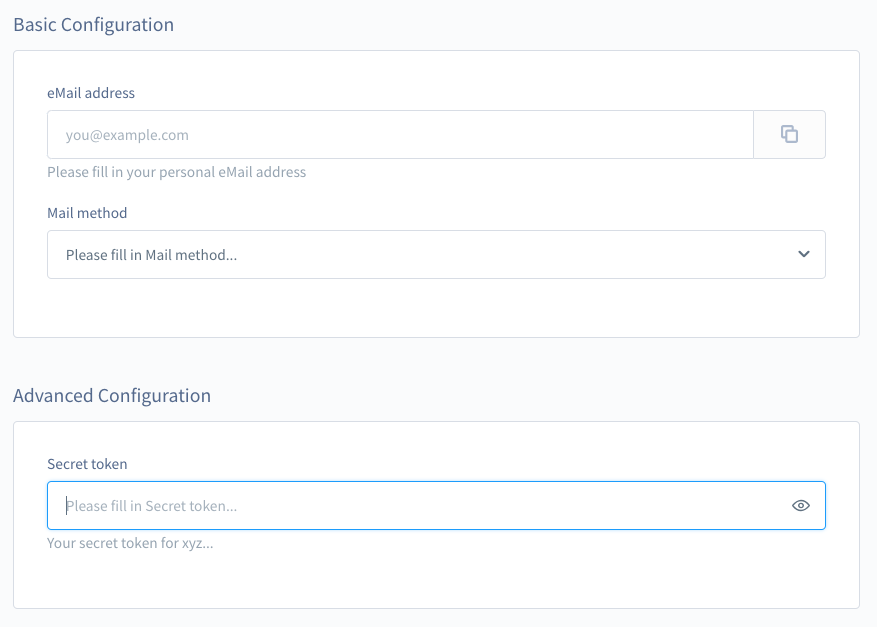

[titleEn]: <>(Plugin configuration)
[hash]: <>(article:plugin_config)

The `Shopware plugin system` provides you with the option to create a configuration page for your plugin without any knowledge of templating or the `Shopware Administration`.
All you need to do is creating a `config.xml` file inside of a `Resources/config` directory in your plugin root.
The content of the `config.xml` will be dynamically rendered in the administration.
Below you'll find an example structure.

```
└── plugins
    └── PluginConfig
        ├── src
        │   ├── Resources
        │   │   └── config
        │   │       └── config.xml 
        │   └── PluginConfig.php
        └── composer.json
```

The `config.xml` follows a simple syntax. The content is organized in `<card>` elements.
Every `config.xml` must exist of minimum one `<card>` element and each `<card>` must contain one `<title>` and at least one `<input-field>`.
Below you'll find the minimum `config.xml`.

```xml
<?xml version="1.0" encoding="UTF-8"?>
<config xmlns:xsi="http://www.w3.org/2001/XMLSchema-instance"
        xsi:noNamespaceSchemaLocation="https://raw.githubusercontent.com/shopware/platform/trunk/src/Core/System/SystemConfig/Schema/config.xsd">
    
    <card>
        <title>Minimal configuration</title>
        <input-field>
            <name>example</name>
        </input-field>
    </card>
</config>
```
*Resources/config/config.xml*

Please make sure to specify the `xsi:noNamespaceSchemaLocation` as shown above and fetch the external resource into your IDE if possible.
This enables auto-completion and suggestions for this XML file and will therefore help you to prevent issues and bugs.

## Card Titles

A `<card>` `<title>` is translatable, this is managed via the `lang` attribute.
By default the `lang` attribute is set to `en-GB`, to change the locale of a `<title>` just add the attribute as follows:

```xml
    ...
    <card>
        <title>English Title</title>
        <title lang="de-DE">German Titel</title>
    </card>
    ...
```

## Configuring input fields

As you can see above, every `<input-field>` has to contain at least a `<name>` element.
The `<name>` element is not translatable and has to be unique, since it will be used as the technical identifier for the config element.
The field `<name>` must at least be 4 characters long and consist of only lower and upper case letters.

## The different types of input field

Your `<input-field>` can be of different types, this is managed via the `type` attribute.
Unless defined otherwise, your `<input-field>` will be a text field per default.
Below you'll find a list of all available `<input-field type="?">`.

| Type          | Configuration options                                                  | Renders           |
|---------------|------------------------------------------------------------------------|-------------------|
| text          | [copyable](#copyable), [placeholder](#label-placeholder-and-help-text) | Text field        |
| textarea      | [copyable](#copyable), [placeholder](#label-placeholder-and-help-text) | Text area          |
| url           | [copyable](#copyable), [placeholder](#label-placeholder-and-help-text) | URL field         |
| password      | [placeholder](#label-placeholder-and-help-text)                        | Password field    |
| int           |                                                                        | Integer field     |
| float         |                                                                        | Float field       |
| bool          |                                                                        | Switch            |
| checkbox      |                                                                        | Checkbox          |
| datetime      |                                                                        | Date-time picker  |
| date          |                                                                        | Date picker       |
| time          |                                                                        | Time picker       |
| colorpicker   |                                                                        | Color picker      |
| single-select | [options](#options), [placeholder](#label-placeholder-and-help-text)   | Single-Select box |
| multi-select  | [options](#options), [placeholder](#label-placeholder-and-help-text)   | Multi-Select box  |

## Configuration options

Options are used to configure your `<input-field>`.
**Every `<input-field>` has to start with the `<name>` element.**
After the `<name>` element you can configure any of the other options mentioned above.
Beside these options, they have the followings in common: [label](#label-placeholder-and-help-text), [helpText](#label-placeholder-and-help-text), [defaultValue](#defaultvalue) and [disabled](#disabled).

### Label, placeholder and help text

The options `<label>`, `<placeholder>` and `<helpText>` are used to label and explain your `<input-field>` and are translatable.
You define your `<label>`, `<placeholder>` and `<helpText>` the same way as the `<card><title>`, with the `lang` attribute.
Please remember, that the `lang` attribute is set to `en-GB` per default.

### defaultValue

Add the `defaultValue` option to your `<input-field>` to define a default value for it.
This value will be imported into the database on installing and updating the plugin.
We use [Symfony\Component\Config\Util\XmlUtils](https://github.com/symfony/config/blob/master/Util/XmlUtils.php#L215) for casting the values into the correct PHP types.

Below you'll find an example how to use this option.

```xml
<input-field type="text">
    <name>textField</name>
    <label>Test field with default value</label>
    <defaultValue>test</defaultValue>
</input-field>
```

### disabled

You can add the `<disabled>` option to any of your `<input-field>` elements to disable it.

Below you'll find an example how to use this option.

```xml
<input-field>
    <name>email</name>
    <disabled>true</disabled>
</input-field>
```
*Please note, `<disabled>` only takes boolean values.*

### copyable

You can add the `<copyable>` option to your `<input-field>` with are of type `text` or extensions of it.
This will add a button at the right, which on click copies the content of your `<input-field>` into the clipboard.

Below you'll find an example how to use this option.

```xml
<input-field>
    <name>email</name>
    <copyable>true</copyable>
</input-field>
```
*Please note, that `<copyable>` only takes boolean values*

### options

You can use `<options>` to add options to a `<input-field>` of the types `single-select` and `multi-select`.
Each `<option>` represents one option you can select.

Below you'll find an example.

```xml
<input-field type="single-select">
    <name>mailMethod</name>
    <options>
        <option>
            <id>smtp</id>
            <name>English label</name>
            <name lang="de-DE">German label</name>
        </option>
        <option>
            <id>pop3</id>
            <name>English label</name>
            <name lang="de-DE">German label</name>
        </option>
    </options>
</input-field>
```

Each `<options>` element must contain at least one `<option>` element.
Each `<option>` element must contain at least one `<id>` and one `<name>` element.
As you can see above, `<name>` elements are translatable via the `lang` attribute.

Below you'll find an example.
```xml
<input-field>
    <name>test</name>
    <label>English label</label>
    <label lang="de-DE">German Label</label>          
    <placeholder>English placeholder</placeholder>
    <placeholder lang="de-DE">German placeholder</placeholder>
    <helpText>English help text</helpText>
    <helpText lang="de-DE">German help text</helpText>
</input-field>
```

## Example

Now all that's left to do is to present you a working example `config.xml` and show you the result.

```xml
<?xml version="1.0" encoding="UTF-8"?>
<config xmlns:xsi="http://www.w3.org/2001/XMLSchema-instance"
        xsi:noNamespaceSchemaLocation="https://raw.githubusercontent.com/shopware/platform/trunk/src/Core/System/SystemConfig/Schema/config.xsd">

    <card>
        <title>Basic Configuration</title>
        <title lang="de-DE">Grundeinstellungen</title>

        <input-field>
            <name>email</name>
            <copyable>true</copyable>
            <label>eMail address</label>
            <label lang="de-DE">E-Mailadresse</label>
            <placeholder>you@example.com</placeholder>
            <placeholder lang="de-DE">du@beispiel.de</placeholder>
            <helpText>Please fill in your personal eMail address</helpText>
            <helpText lang="de-DE">Bitte trage deine persönliche E-Mailadresse ein</helpText>
        </input-field>

        <input-field type="single-select">
            <name>mailMethod</name>
            <options>
                <option>
                    <id>smtp</id>
                    <name>English smtp</name>
                    <name lang="de-DE">German smtp</name>
                </option>
                <option>
                    <id>pop3</id>
                    <name>English pop3</name>
                    <name lang="de-DE">German pop3</name>
                </option>
            </options>
            <defaultValue>smtp</defaultValue>
            <label>Mail method</label>
            <label lang="de-DE">Versand-Protokoll</label>
        </input-field>
    </card>

    <card>
        <title>Advanced Configuration</title>
        <title lang="de-DE">Erweiterte Einstellungen</title>

        <input-field type="password">
            <name>secret</name>
            <label>Secret token</label>
            <label lang="de-DE">Geheimschlüssel</label>
            <helpText>Your secret token for xyz...</helpText>
            <helpText lang="de-DE">Dein geheimer Schlüssel für xyz...</helpText>
        </input-field>
    </card>
</config>
```



## Advanced custom input fields
For more complex and advanced configurations it is possible to declare a `<component name="componentName">` element. 
This element can render many admin components.
It is also possible to render your own admin component which you could deliver with your plugin.
The name of the component has to match the components name in the administration, for example `sw-entity-single-select`.
The component also needs a `<name>` element first.
All other elements within the component element will be passed to the rendered admin component as properties.
For some components you could also use [`label` and `placeholder`](#label-placeholder-and-help-text).

Here are some examples:

### Entity single select for products
```xml
<component name="sw-entity-single-select">
    <name>exampleProduct</name>
    <entity>product</entity>
    <title>Choose a product for the plugin configuration</title>
</component>
```
Stores the ID of the selected product into the system config.

### Entity multi ID select for products
```xml
<component name="sw-entity-multi-id-select">
    <name>exampleMultiProductIds</name>
    <entity>product</entity>
    <label>Choose multiple products IDs for the plugin configuration</label>
</component>
```
Stores an array with IDs of the selected products into the system config.

### Media selection
```xml
<component name="sw-media-field">
    <name>pluginMedia</name>
    <label>Upload media or choose one from the media manager</label>
</component>
```

### Text editor
```xml
<component name="sw-text-editor">
    <name>textEditor</name>
    <label>Write some nice text with WYSIWYG editor</label>
</component>
```

### Snippet field
```xml
        <component name="sw-snippet-field">
            <name>snippetField</name>
            <label>Description</label>
            <snippet>myPlugin.test.snippet</snippet>
        </component>
```
Allows you to edit snippet values within the configuration page.
This component does not store values in the system config, but changes the translations for the snippet key.
**Note: This field is only available from 6.3.4.0 onward.**

There's a GitHub repository available, containing this example source.
Check it out [here](https://github.com/shopware/swag-docs-plugin-config).
