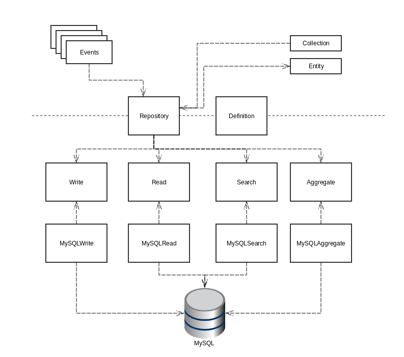

[titleEn]: <>(Data Abstraction Layer)
[hash]: <>(category:dal)

The DataAbstractionLayer (DAL) centrally handles data **retrieval**, **modification** and **search** through an object oriented interface. The following diagram illustrates the general architecture of the component.

The dashed line in the middle represents the differentiation between userland and internal space. The different containers mean:

Entity
 : Represents the data of a single row in table in the storage. The entity may contain related data if you wished to fetch it this way.
 
Collection
 : A collection is the result set of a DAL search. It contains convenience methods and metadata related to the search. 

Definition
 : Configuration file defining the fields, relations and entity- and collection-classes.

Repository
 : The repository is the main access point for every DAL request. It houses the basic methods to work with data.

Events
 : All DAL requests dispatch events to trigger handling inside of Shopware 6. Be it adding static data, triggering re indexing or handling a file upload.

## Table of contents

This category contains in depth descriptions of the different concerns of the Data Abstraction Layer.

### Working with the Data Abstraction Layer

* [Read](./010-read.md) - Learn the basics on reading data
* [Search](./020-search.md) - Learn how to search for data
* [Write](./030-write.md)  - Learn how to write entities
* [Translations](./040-translation-handling.md) - Working with translations
* [Custom fields](./045-custom-field.md) - Add custom data to core entities
* [UUID](./046-uuid.md) - UUID handling explained
 
### Extending existing Entities
 
* [Events](./050-events.md) - Default events guaranteed to exist
* [Extensions](./060-extensions.md) - Adding data
 
## Creating your own entities
  
* [Definitions](./070-definition.md) - Defining your own entities
* [Types](./080-types.md) - List of available field types
* [Flags](./090-flags.md) - List of Flags to modify field behaviour
* [Write protection](./100-write-protection.md) - Defining protected data
* [Parent/Child](./110-data-inheritance.md) - Entity inheritance
* [Translations](./120-translations.md) - Add translatable fields to your entities
* [M:N mapping](./125-mapping.md) - Add many to many relationships
* [Indexing](./130-indexing.md) - Custom search abilities
* [Black and whitelisting](./140-black-white-listing.md) - Black an Whitelist results based on rules
 
## Extending the Data Abstraction Layer

* [Field](./150-field.md)
* [Field resolver](./160-field-resolver.md)
* [Field accessor](./170-field-accessor.md)
* [Write Validation](./180-write-command-validation.md)
