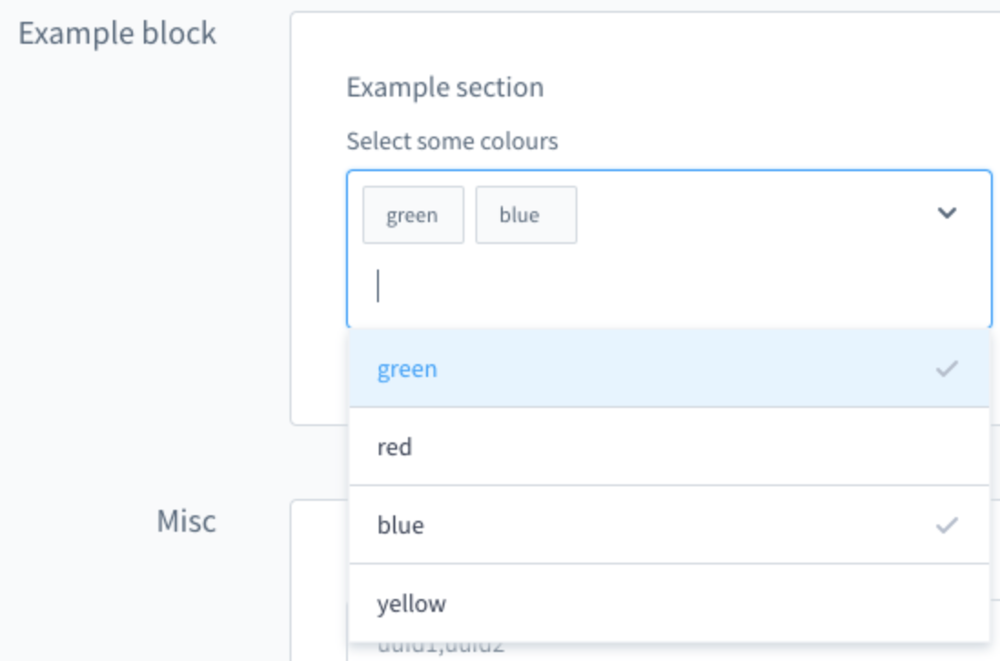
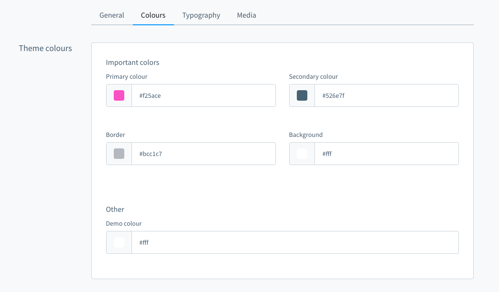

[titleEn]: <>(Storefront Themes)
[hash]: <>(article:plugin_themes)

This guide is about theme plugins which change the appearance or the behavior of the storefront.

Theme plugins can be created like any other plugin 
(see the [Plugin Quickstart Guide](./010-plugin-quick-start.md), but will appear in the 
theme manger of the administration and can be selected and configured by the shop owner.

## Difference between "themes" and "regular" plugins
There are basically two ways to change the appearance of the storefront. You can have a "regular" plugins
which main purpose is to add new functions and change the behavior of the shop. 
These Plugins might also contain scss/css and javascript to be able to embed their new content into
the storefront correctly.
                                                                         
A shop manager can install your plugin over the plugin manager and your scripts and styles will 
automatically be embedded. The theme which is currently selected by the shop manager will be
recompiled with your custom styles.

The second way to change the appearance of the storefront is to create a theme. The main purpose of themes
is to change the appearance of the storefront and they behave a bit different compared to "regular" plugins.

Technically a theme is also a plugin but it will not only appear in the plugin manager of the administration,
it will also be visible in the theme manger once activated in the plugin manager.
To distinguish a theme plugin from a "regular" plugin you need to implement the Interface _Shopware\Storefront\Framework\ThemePlugin_ 
A theme can inherit from other themes, overwrite the default configuration (colors, fonts, media) and
add new configuration options.

This guide will focus on theme plugins. You can find a guide on how to create
"regular" storefront plugins [here](./090-plugin-storefront.md)


## Overview

You can create a fully functional theme skeleton by calling the command:

```bash
bin/console theme:create
```

Alternatively here is a step-by-step guide.

If you want to create a custom theme to change the storefront, you have to create a `theme.json`
file in the `<plugin root>/src/Resources` folder of your plugin.

Basic example for `theme.json`:

```json
{
  "name": "Just another theme",
  "author": "Just another author",
  "description": {
    "en-GB": "Just another description",
    "de-DE": "Nur eine weitere Beschreibung"
  },
  "style": [
    "@Storefront",
    "app/storefront/src/scss/base.scss"
  ],
  "views": [
    "@Storefront",
    "@Plugins",
    "@JustAnotherTheme"
  ],
  "script": [
    "@Storefront",
    "app/storefront/dist/storefront/js/just-another-theme.js"
  ],
  "asset": [
    "@Storefront",
    "app/storefront/src/assets"
  ]
}
```

Common options:

| Name     | Meaning                                                   |
|----------|-----------------------------------------------------------|
| style    | Array of paths to style files (e.g. *.css/*.scss          |
| script   | Array of paths to compiled script files (e.g. javascript) |
| asset    | Array of paths to asset folders                           |
| views    | Array of theme or plugin names                            |

Using `@Storefront` in the `style`, `views` and `script` array specifies that your theme extends
the basic storefront theme which ships with shopware. This is useful if a theme just makes some
adjustments to this theme or to use it as a starting point.
Without these entries the storefront would be completely unstyled.

Please be aware that all paths have to be relative to the theme.json 
without leading and trailing slashes.

Once you have created a custom theme you need to install and activate it:
```bash
bin/console plugin:install --activate ThemeQuickStart
```

Next you need to run the `theme:refresh` command:

```bash
bin/console theme:refresh
```

This command checks all plugins and if a new theme is found, it will be registered.
Please be aware that this command currently doesn't recognize changes in the config, name or
author of the theme.

## Theme template inheritance
The inheritance of the templates can be controlled via the `views` option. Here you define the order in which the templates are to be loaded.
To illustrate this, here is an example for the `views` configuration:

```json
{
  "views": [
    "@Storefront",
    "@Plugins",
    "@PayPal",
    "@MyTheme"
  ]
}
```

Defining the above configuration results in the following behavior:
* Templates are first searched in `@MyTheme`.
* The specification of `@PayPal` allows to control the order for a specific plugin more precisely
* `@Plugins` serves as a placeholder and defines that the `@MyTheme` and `@PayPal` should be searched for in all other plugins for the templates
* `@Storefront` then defines that the shopware storefront theme should be used as the last inheritance level.

## Theme assets

If your theme is installed and active, Shopware will automatically collect all your 
script and style files. All SASS files (*.scss) in the style folder are compiled to css.

You can add custom styles or javascript by using the `style` and `script` property in the `theme.json`.
Example `theme.json`
```json
{
  "name": "Just another theme",
  "author": "Just another author",
  "description": {
    "en-GB": "Just another description",
    "de-DE": "Nur eine weitere Beschreibung"
  },
  "style": [
    "@Storefront",
    "app/storefront/src/scss/base.scss"
  ],
  "script": [
    "@Storefront",
    "app/storefront/dist/storefront/js/just-another-theme.js"
  ]
}
```

In the example above, first of all we used the style `@Storefront`. Using `@{Bundle name}` will tell the
theme system to include all style of this bundle. Please be aware that the assets will be imported
in the same order as defined in the `theme.json`. So for the the example above, all styles of the
storefront will be included before your own.

For your own assets all files must be included by adding their path relative to the theme.json without
leading and trailing slashes. Style files can be `.css` and `.scss`. Script files can be `.js` files.

Style files will be compiled by PHP but not the .js files. So in most cases you do not enter the path of
your `.js` source but rather to the compiled file. The shopware webpack configuration will output the
compiled file under `<plugin root>/src/Resources/dist/storefront/js/plugin-name.js`. so you can add this 
path to your theme.json.

To trigger the build process of javascript, you can call 
```bash
./psh.phar storefront:build
``` 

This will compile the javascript and trigger a rebuild of the theme, so all your script and style changes
are be visible.

Please have a look at the [storefront assets](./../../4-how-to/330-storefront-assets.md) documentation
for more information about the build process and how to add your own assets.

### Override default SCSS variables

To override default variables like for example `$border-radius` from Bootstrap you should use a slightly different approach then explained in the [storefront assets](./../../4-how-to/330-storefront-assets.md) how-to.

Bootstrap 4 is using the `!default` flag for it's own default variables. Variable overrides have to be declared beforehand.

More information: https://getbootstrap.com/docs/4.0/getting-started/theming/#variable-defaults

To be able to override Bootstrap variables you can define an additional SCSS entry point in your `theme.json` which is declared before `@Storefront`.
This entry point is called `overrides.scss`:

```json
{
  "name": "Just another theme",
  "author": "Just another author",
  "views": [
     "@Storefront",
     "@Plugins",
     "@JustAnotherTheme"
  ],
  "style": [
    "app/storefront/src/scss/overrides.scss", <-- Variable overrides
    "@Storefront",
    "app/storefront/src/scss/base.scss"
  ],
  "script": [
    "@Storefront",
    "app/storefront/dist/storefront/js/just-another-theme.js"
  ],
  "asset": [
    "@Storefront",
    "app/storefront/src/assets"
  ]
}
```

In the `overrides.scss` you can now override default variables like `$border-radius` globally:

```scss
/*
Override variable defaults
==================================================
This file is used to override default SCSS variables from the Shopware Storefront or Bootstrap.

Because of the !default flags, theme variable overrides have to be declared beforehand.
https://getbootstrap.com/docs/4.0/getting-started/theming/#variable-defaults
*/

$disabled-btn-bg: #f00;
$disabled-btn-border-color: #fc8;
$font-weight-semibold: 300;
$border-radius: 0;
$icon-base-color: #f00;
$modal-backdrop-bg: rgba(255, 0, 0, 0.5);
```

Please only add variable overrides in this file. You should not write CSS code like `.container { background: #f00 }` in this file. When running `storefront:hot` or `storefront:hot-proxy` SCSS variables will be injected dynamically by webpack. When writing selectors and properties in the `overrides.scss` the code can appear multiple times in your built CSS.

### Using Bootstrap SCSS only

The Shopware default theme is using [Bootstrap](https://getbootstrap.com/) with additional custom styling.

If you want to build your theme only upon the Bootstrap SCSS you can use the `@StorefrontBootstrap` placeholder instead of the `@Storefront` bundle in the `style` section of your `theme.json`.
This gives you the ability to use the Bootstrap SCSS without the Shopware Storefront "skin". Therefore all the SCSS from `src/Storefront/Resources/app/storefront/src/scss/skin` will not be available in your theme.

```json
{
  "style": [
    "@StorefrontBootstrap",
    "app/storefront/src/scss/base.scss"
  ]
}
```
* This option can only be used in the `style` section of the `theme.json`. You must not use it in `views` or `script`.
* All theme variables like `$sw-color-brand-primary` are also available when using the Bootstrap option.
* You can only use either `@StorefrontBootstrap` or `@Storefront`. They should not be used at the same time. The `@Storefront` bundle **includes** the Bootstrap SCSS already.

## Theme Configuration

One of the benefits of creating a theme is that you can overwrite the theme configuration of 
the default theme or add your own configurations.

Example `theme.json`
```json
{
  "name": "Just another theme",
  "author": "Just another author",
  "description": {
    "en-GB": "Just another description",
    "de-DE": "Nur eine weitere Beschreibung"
  },
  "style": [
    "@Storefront"
  ],
  "script": [
    "@Storefront"
  ],
  "config": {
    "fields": {
      "sw-color-brand-primary": {
        "value": "#00ff00"
      }
    }
  }
}
```

In the example above, we change the primary color to green. You always inherit from the storefront
config and both configurations are merged. This also means that you only have to provide the values you
actually want to change. You can find a more detailed explanation of the configuration inheritance
in the next section.

The `theme.json` contains a `config` property which consists a list of tabs, blocks, sections and fields.

The key of each config fields item is also the technical name which you use to access the config option
in your theme or scss files. `config` entries will show up in the administration and 
can be customized by the enduser (if `editable` is set to `true`, see table below).

The following parameters can be defined for a config field item:

| Name         | Meaning                                                                                          |
|------------- |--------------------------------------------------------------------------------------------------|
| label        | Array of translations with locale code as key                                                    |
| type         | Type of the config. Possible values: color, text, number, fontFamily, media, checkbox and switch |
| editable     | If set to false, the config option will not be displayed (e.g. in the administration)            |
| tab          | Name of a tab to organize the config options                                                     |
| block        | Name of a block to organize the config options                                                   |
| section      | Name of a section to organize the config options                                                 |
| custom       | The defined data will not be processed but is available via API                                  |
| scss         | If set to false, the config option will not be injected as a SCSS variable                       |

### Field types
You can use different field types in your theme manager:

* A text field example:
```json
"modal-padding": {
    "label": {
      "en-GB": "Modal padding",
      "de-DE": "Modal Innenabstand"
    },
    "type": "text",
    "value": "(0, 0, 0, 0)",
    "editable": true
}
```

* A number field example: 
```json
"visible-slides": {
    "label": {
      "en-GB": "Number of visible slides",
      "de-DE": "Anzahl an sichtbaren Slider Bildern"
    },
    "type": "number",
    "custom": {
      "numberType": "int",
      "min": 1,
      "max": 6
    },
    "value": 3,
    "editable": true
}
```

* Two boolean field examples:
```json
"navigation-fixed": {
    "label": {
      "en-GB": "Fix navigation",
      "de-DE": "Navigation fixieren"
    },
    "type": "switch",
    "value": true,
    "editable": true
}
```

or

```json
"navigation-fixed": {
    "label": {
      "en-GB": "Fix navigation",
      "de-DE": "Navigation fixieren"
    },
    "type": "checkbox",
    "value": true,
    "editable": true
}
```

### Examples for custom config fields

* A custom single-select field example

```json
{
  "name": "Just another theme",
  "author": "Just another author",
  "description": {
    "en-GB": "Just another description",
    "de-DE": "Nur eine weitere Beschreibung"
  },
  "views": [
    "@Storefront",
    "@Plugins",
    "@SelectExample"
  ],
  "style": [
    "app/storefront/src/scss/overrides.scss",
    "@Storefront",
    "app/storefront/src/scss/base.scss"
  ],
  "script": [
    "@Storefront",
    "app/storefront/dist/storefront/js/select-example.js"
  ],
  "asset": [
    "@Storefront",
    "app/storefront/src/assets"
  ],
  "config": {
    "blocks": {
      "exampleBlock": {
        "label": {
          "en-GB": "Example block",
          "de-DE": "Beispiel Block"
        }
      }
    },
    "sections": {
      "exampleSection": {
        "label": {
          "en-GB": "Example section",
          "de-DE": "Beispiel Sektion"
        }
      }
    },
    "fields": {
      "my-single-select-field": {
        "label": {
          "en-GB": "Select a font size",
          "de-DE": "Wähle ein Schriftgröße"
        },
        "type": "text",
        "value": "24",
        "custom": {
          "componentName": "sw-single-select",
          "options": [
            {
              "value": "16",
              "label": {
                "en-GB": "16px",
                "de-DE": "16px"
              }
            },
            {
              "value": "20",
              "label": {
                "en-GB": "20px",
                "de-DE": "20px"
              }
            },
            {
              "value": "24",
              "label": {
                "en-GB": "24px",
                "de-DE": "24px"
              }
            }
          ]
        },
        "editable": true,
        "block": "exampleBlock",
        "section": "exampleSection"
      }
    }
  }
}
```


* A custom multi-select field example

````json
{
  "name": "Just another theme",
  "author": "Just another author",
  "description": {
    "en-GB": "Just another description",
    "de-DE": "Nur eine weitere Beschreibung"
  },
  "views": [
    "@Storefront",
    "@Plugins",
    "@SelectExample"
  ],
  "style": [
    "app/storefront/src/scss/overrides.scss",
    "@Storefront",
    "app/storefront/src/scss/base.scss"
  ],
  "script": [
    "@Storefront",
    "app/storefront/dist/storefront/js/select-example.js"
  ],
  "asset": [
    "@Storefront",
    "app/storefront/src/assets"
  ],
  "config": {
    "blocks": {
      "exampleBlock": {
        "label": {
          "en-GB": "Example block",
          "de-DE": "Beispiel Block"
        }
      }
    },
    "sections": {
      "exampleSection": {
        "label": {
          "en-GB": "Example section",
          "de-DE": "Beispiel Sektion"
        }
      }
    },
    "fields": {
      "my-multi-select-field": {
        "label": {
          "en-GB": "Select some colours",
          "de-DE": "Wähle Farben aus"
        },
        "type": "text",
        "editable": true,
        "value": [
          "green",
          "blue"
        ],
        "custom": {
          "componentName": "sw-multi-select",
          "options": [
            {
              "value": "green",
              "label": {
                "en-GB": "green",
                "de-DE": "grün"
              }
            },
            {
              "value": "red",
              "label": {
                "en-GB": "red",
                "de-DE": "rot"
              }
            },
            {
              "value": "blue",
              "label": {
                "en-GB": "blue",
                "de-DE": "blau"
              }
            },
            {
              "value": "yellow",
              "label": {
                "en-GB": "yellow",
                "de-DE": "gelb"
              }
            }
          ]
        },
        "block": "exampleBlock",
        "section": "exampleSection"
      }
    }
  }
}
````



### Inheritance of theme config
All custom themes inherit the config of the Shopware default theme. The main reason is that in case 
of a new theme config due to a new shopware version, this option will also be available in your theme and
the storefront can rely on this configuration option.

So if you create a custom theme, the inheritance chain looks like this:

`Shopware default theme -> Your custom theme`

If you change any properties in your theme, they will override the shopware default theme.

When there are config fields with the `editable` property set to true, the user can change 
the values of these properties. So the chain would look like this:

`Shopware default theme -> Your custom theme -> Changes of the user`

If the user duplicates a theme in administration, the configuration is copied. This also
means that even if original theme changes, these change will not affect the duplicate.

## Tabs, blocks and sections
You can use tabs, blocks and sections to structure and group the config options.



In the picture above are four tabs. In the "Colours" tab there is one block "Theme colours" which contains two sections 
named "Important colors" and "Other". You can define the block and section individually for each item. Example:
```json
{
  "name": "Just another theme",
  "author": "Just another author",
  
  "config": {
    "fields": {
      "sw-color-brand-primary": {
        "label": {
          "en-GB": "Primary colour",
          "de-DE": "Primär"
        },
        "type": "color",
        "value": "#399",
        "editable": true,
        "tab": "colors",
        "block": "themeColors",
        "section": "importantColors"
      }
    }
  }
}
```

The tab and section property is not required.

You can extend the config to add translated labels for the tabs, blocks and sections:
```json
{
  "name": "Just another theme",
  "author": "Just another author",
  
  "config": {
    "blocks": {
      "colors": {
        "themeColors": {
          "en-GB": "Theme colours",
          "de-DE": "Theme Farben"
        }
      }
    },
    "sections": {
      "importantColors": {
        "label": {
          "en-GB": "Important colors",
          "de-DE": "Wichtige Farben"
        }
      }
    },
    "tabs": {
      "colors": {
          "label": {
              "en-GB": "Colours",
              "de-DE": "Farben"
          }
      } 
    },
    "fields": {
      "sw-color-brand-primary": {
          "label": {
            "en-GB": "Primary colour",
            "de-DE": "Primär"
          },
          "type": "color",
          "value": "#399",
          "editable": true,
          "tab": "colors",
          "block": "themeColors",
          "section": "importantColors"
        }
    }
  }
}
```

## Commands

The theme system can be controlled via CLI with the following commands.

### Theme refresh
Normally new themes are detected automatically but if you want to trigger this process
run the command

```bash
bin/console theme:refresh
```

### Change a theme
After scanning for themes these can be activated using 
```bash
bin/console theme:change
```

Calling the `theme:change` command without any arguments will enable the interactive mode.

A list of all sales channels will be displayed:

```
Please select a sales channel:
  [0] Storefront | 138b4f705b174bf895366487df70cc22
  [1] Headless | 98432def39fc4624b33213a56b8c944f
```

Select one by entering the corresponding number (0, 1...). 
Afterwards you can choose a theme for the selected sales channel:

```
Please select a sales channel:
  [0] Storefront | 138b4f705b174bf895366487df70cc22
  [1] Headless | 98432def39fc4624b33213a56b8c944f
 > 0
Please select a theme:
  [0] Storefront
```

The selected theme will be assigned to the sales channel and compiled:
```
Please select a sales channel:
  [0] Storefront | 138b4f705b174bf895366487df70cc22
  [1] Headless | 98432def39fc4624b33213a56b8c944f
 > 0
Please select a theme:
  [0] Storefront
 > 0
Set "Storefront" as new theme for sales channel "Storefront"
Compile theme
```

The command can also be used non interactively:

```bash
# bin/console theme:change {themeName} {salesChannelId}
bin/console theme:change MyCustomTheme 138b4f705b174bf895366487df70cc22
```

If you want to assign your theme to all sales channels, use the --all option:
```bash
bin/console theme:change MyCustomTheme --all
```

`theme:change` will also compile the theme for all new assignments. 


### Compile a theme

Calling the `theme:compile` command will recompile all themes which 
are assigned to a sales channel.
