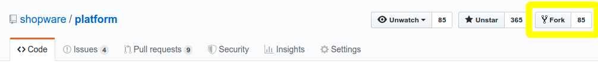

[titleEn]: <>(Contributing Code)
[metaDescriptionEn]: <>(How to contribute code to Shopware Platform)
[hash]: <>(article:contributing_code)

## Introduction

This is a short HowTo, which will show you, how you could contribute code to Shopware.
Please also have a look at our [contribution guideline](./10-contribution-guideline.md).

## Configure Git

Set up your user information with your real name and a working email address:

```git config --global user.name "Your Name"```

```git config --global user.email you@example.com```

## Create a Fork
Navigate to the [Shopware Platform Github Repository](https://github.com/shopware/platform) and click the **"Fork"**-Button in the upper right hand corner.



This will create a "copy" of the entire Shopware Platform repository into your personal user namespace.

## Clone your fork to your local machine

Please follow the [Git installation instructions](https://github.com/shopware/platform#quickstart--installation).

You need an additional step after you cloned `platform`.

Add your fork repository as `fork` remote:

`cd platform`

`git remote add fork https://github.com/USERNAME/platform.git`


Verify the new remote named `fork`:

```bash
git remote -v
origin    https://github.com/shopware/platform.git (fetch)
origin    https://github.com/shopware/platform.git (push)
fork    git@github.com:USERNAME/platform.git (fetch)
fork    git@github.com:USERNAME/platform.git (push)
```

`cd` back into the development template and continue with the installation.

## Create a new Feature branch

Each time you want to work on a patch, create a feature branch:

`git fetch origin`

`git checkout -b my-new-feature origin/master`

The first command will fetch the latest updates from the original project (shopware/platform).
The second will create a new branch named `my-new-feature`, that is based off the `master`-branch of the `origin` remote.

## Running tests
The tests are located in different directories according to the domains they are testing.
You can run the entire test suite with the following command from the development template:

`./psh.phar unit`

Please also use the commands `./psh.phar fix-cs`, to fix the code style according to our rules
and `./psh.phar static-analyze` to run a static code analysis, which will check your code quality with help of [PHPStan](https://github.com/phpstan/phpstan) and [Psalm](https://github.com/vimeo/psalm).

## Submit your pull request

Push your branch to your github fork:

`git push fork my-new-feature`

## Create a Pull Request on Github
Navigate back to the [Shopware Platform Github repository](https://github.com/shopware/platform) and click the **"Compare & pull request"-Button**.


Before creating your pull request make sure that it fits our [contribution guideline](./10-contribution-guideline.md).

### How to create a Pull Request

- [https://git-scm.com/book](https://git-scm.com/book)
- [https://try.github.io](https://try.github.io)
