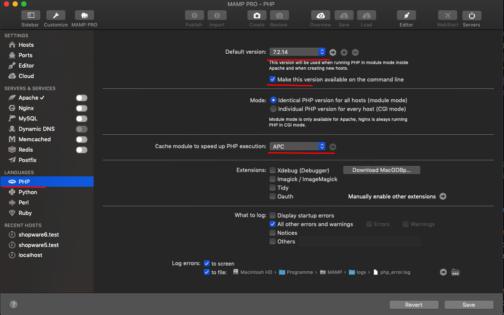
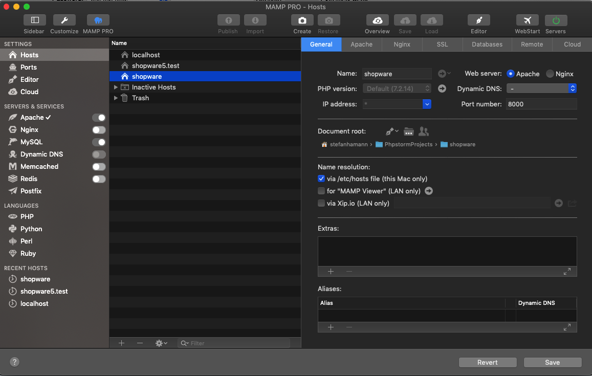

[titleEn]: <>(MacOS X using MAMP)


## Local installation on mac (MAMP)

For quick and easy installation you can also use **MAMP** on mac.

### Preparation

* 	Download & install MAMP from [https://www.mamp.info/de/downloads/](https://www.mamp.info/de/downloads/)


First of all you have to modify the PHP settings inside MAMP as seen on the following screenshot:





After that start the mysql &amp; webserver-service with the toggle buttons on the left side in the MAMP management console.

### Prepare MySQL user &amp; database

Open the **MySQL Tab** on the left side and click on the *PhpMyAdmin* icon - if the icon is grayed out check if the mysql and webserver services are running.


Inside PhpMyAdmin switch to the user account management on the top menu and click *add new user*.

Choose a username (e.g. shopware) and a password and set the option *Create database with same name and grant all privileges*.

Finish this step by clicking *GO*.

### Make sure MAMP php binary is used globally on your CLI

*Open the terminal application*
 
````bash
which php
# /Applications/MAMP/bin/php/php7.2.14/bin/php &lt; should be displayed
# IF NOT
vim ~/.bash_profile
export PATH=/Applications/MAMP/bin/php/php7.2.14/bin:$PATH
# :wq to save the file
source ~/.bash_profile

````

### Make sure MAMP mysql binary is used globally on your CLI

*Open the terminal application*


```bash
which mysql
# /Applications/MAMP/Library/bin/mysql &lt; should be displayed
# IF NOT
vim ~/.bash_profile
export PATH=/Applications/MAMP/Library/bin:$PATH
# :wq to save the file
source ~/.bash_profile
```

### Install `brew`

*Open the terminal application*

```bash
/usr/bin/ruby -e "$(curl -fsSL https://raw.githubusercontent.com/Homebrew/install/master/install)"
```

### Install npm / node

*Open the terminal application*

```bash

brew install node

```

### Install composer

*Open the terminal application*

```bash
php -r "copy('https://getcomposer.org/installer', 'composer-setup.php');"

php -r "if (hash_file('sha384', 'composer-setup.php') === '48e3236262b34d30969dca3c37281b3b4bbe3221bda826ac6a9a62d6444cdb0dcd0615698a5cbe587c3f0fe57a54d8f5') { echo 'Installer verified'; } else { echo 'Installer corrupt'; unlink('composer-setup.php'); } echo PHP_EOL;"

php composer-setup.php

php -r "unlink('composer-setup.php');"
```

### Make composer globally

```bash
mv composer.phar /usr/local/bin/composer
```

### Checkout shopware

```bash
# Choose your own directory
cd ~/PhpstormProjects/
mkdir shopware
cd shopware
git clone https://github.com/shopware/development.git
cd development
git clone https://github.com/shopware/platform.git
```


### Shopware platform setup

#### **First of all add new host in MAMP:**​​​​</p>

* Hostname = shopware
* Port = 8000
* Document Root = Browse for the public directory inside the new directory that you used before (e.g. /PhpstormProjects/shopware/development/public)


 
#### **Change the installation settings**
 
```bash
# Inside the shopware installation directory (e.g.  /PhpstormProjects/shopware/development)
vim .psh.yaml.dist
# Change DB_HOST to *localhost*
# Change DB_USER to your new mysql-user
# Change DB_PASSWORD to your choosen password
# Change APP_URL to http://shopware:8000
```

​​​​​​

#### **Start shopware platform setup**

```bash
# Inside the shopware installation directory (e.g. /PhpstormProjects/shopware/development) 
./psh.phar install
```

After that the setup is done 
You can now access your shopware platform installation with the following urls:


* Storefront: http://shopware:8000
* Admin: http://shopware:8000/admin (User: admin, password: shopware)

