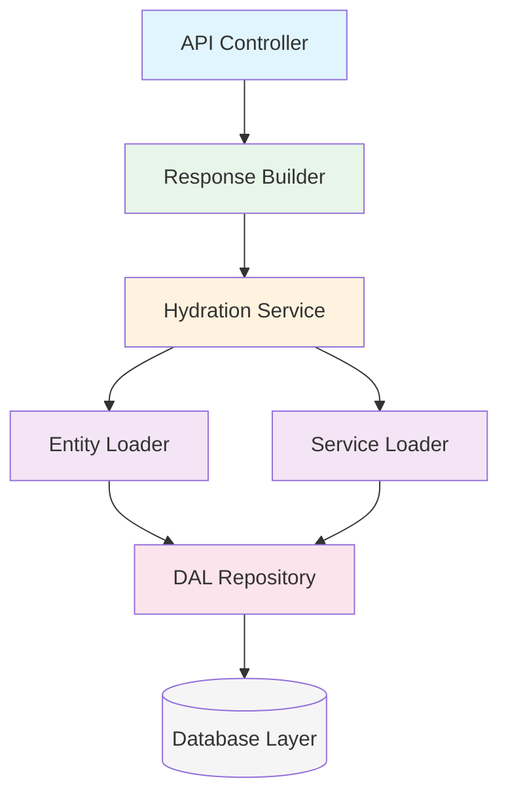
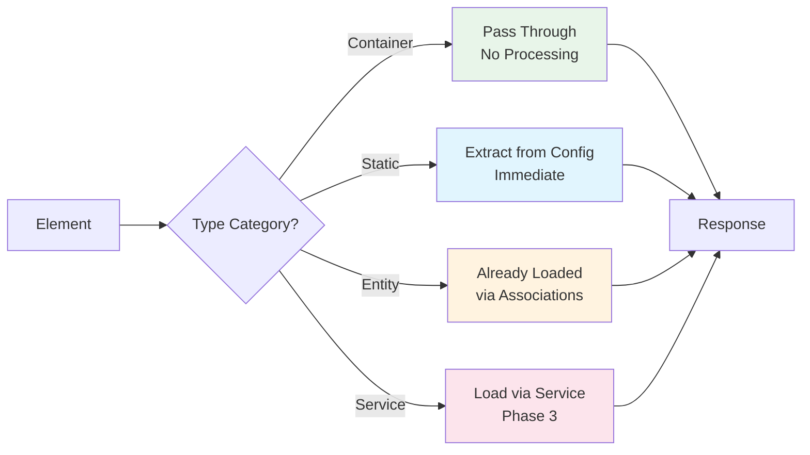

# Shopware Content System V2 - Implementation Plan

## Executive Summary

Content System V2 empowers merchants to fully design their shop layouts by clicking together content building blocks, providing complete control over their store's appearance without requiring technical knowledge. The system introduces a hierarchical, component-based architecture that enables unlimited nesting and composition of elements through a visual interface.

The technical foundation uses a Base + Extension pattern for type-safe element management with native DAL integration, a three-phase hydration process for data loading, and an event-driven architecture for extensibility.

## Table of Contents

1. [Architecture Overview](#architecture-overview)
2. [Technical Specification](#technical-specification)
3. [Architecture Decisions](#architecture-decisions)

## Architecture Overview

### Core Concepts

The system follows a **Base + Extension** pattern:
- **Base Layer**: Handles hierarchy, configuration, and common properties
- **Extension Layer**: Provides type-specific associations to domain entities
- **Hydration Layer**: Transforms database entities to API responses
- **Cache Layer**: Optimizes performance based on element characteristics

### Component Architecture



## Technical Specification

### Database Schema

#### Core Tables

**content_template**
```sql
CREATE TABLE content_template (
    id          BINARY(16)      PRIMARY KEY,
    type        VARCHAR(255)    NOT NULL, -- 'store-template' or page type
    version     VARCHAR(20)     NOT NULL, -- Semantic versioning
    name        VARCHAR(255),
    data        JSON,           -- Template configuration
    created_at  DATETIME        NOT NULL,
    updated_at  DATETIME,
    
    INDEX idx_type (type)
);
```

**content_element**
```sql
CREATE TABLE content_element (
    id          BINARY(16)      PRIMARY KEY,
    type        VARCHAR(255)    NOT NULL,  -- Element type identifier
    template_id BINARY(16)      REFERENCES content_template(id),
    parent_id   BINARY(16)      REFERENCES content_element(id),
    slot_name   VARCHAR(255)    NOT NULL DEFAULT '_default',  -- Slot in parent
    position    INT             NOT NULL,  -- Order within slot
    config      JSON,                      -- All properties/configuration
    lazy_load   BOOLEAN         DEFAULT FALSE,
    created_at  DATETIME        NOT NULL,
    updated_at  DATETIME,
    
    INDEX idx_parent_slot (parent_id, slot_name, position),
    INDEX idx_template (template_id),
    INDEX idx_type (type),
    
    FOREIGN KEY (type) REFERENCES content_element_type(type_key)
);
```

#### Extension Pattern

For each element type requiring domain entity association:

```sql
CREATE TABLE content_element_{entity} (
    element_id  BINARY(16)      PRIMARY KEY REFERENCES content_element(id),
    {entity}_id BINARY(16)      NOT NULL REFERENCES {entity}(id),
    
    INDEX idx_{entity} ({entity}_id)
);
```

Applied to: product, category, media, manufacturer, order, customer

#### Decision: Base + Extension Pattern

**Context**: Need flexibility for element types while maintaining referential integrity  
**Decision**: Use base table with type-specific extension tables  
**Consequences**:
- ✅ Native DAL associations
- ✅ Foreign key constraints
- ✅ Type safety
- ⚠️ Additional joins required
- ⚠️ More complex schema

**Alternatives Considered**:
1. Single table with JSON (rejected: no FK constraints)
2. Separate tables per type (rejected: too complex)
3. EAV pattern (rejected: poor performance)

### Element Type System

#### Element Type Categories

The system classifies elements into four distinct categories, each with specific loading and processing characteristics:

##### Container Elements
Structural components that organize child elements without holding data themselves. They pass through hydration unchanged and are fully cacheable. Examples: grid, section, column, tabs, accordion.

##### Static Elements
Store all content directly in the `config` JSON field, requiring no additional queries during hydration. The system extracts data from configuration and formats it for the response, with full caching support. Examples: heading, text, button, HTML, icon.

##### Entity Elements
Maintain associations to domain entities through extension tables (e.g., `content_element_product`). All associated entities are loaded together with the template in a single query through DAL associations, eliminating the need for separate queries or additional caching layers. Supports lazy loading for deferred data fetching. Examples: product-box, category-navigation, media-image, manufacturer-logo.

##### Service Elements
Load data from services in Phase 3 for user-specific or session-dependent content, with limited or user-specific caching. Supports lazy loading to defer expensive service calls. Examples: cart displays, wishlist, user-menu, currency-switcher.

#### Processing Flow by Category



#### Lazy Loading Strategy

Elements marked with `lazy_load = true` defer data fetching until explicitly requested, improving initial page load performance. Only Entity and Service elements support lazy loading since Container and Static elements have intrinsic data. Common use cases include below-fold content, hidden tabs, and heavy service calls.

**Implementation**: When `lazy_load = true`, hydration skips data loading and returns `{data: null, lazyLoad: true}`. The frontend requests element data on demand via `/api/content-element/{id}`, which loads only that element using the same hydration logic.

#### Type Registry

**content_element_type**
```sql
CREATE TABLE content_element_type (
    id             BINARY(16)      PRIMARY KEY,
    type_key       VARCHAR(255)    NOT NULL,     -- 'product-box', 'heading', etc.
    category       ENUM('container', 'static', 'entity', 'service') NOT NULL,
    version        VARCHAR(20)     NOT NULL,     -- Semantic version (e.g., '2.0.0')
    is_live        BOOLEAN         DEFAULT FALSE,
    created_at     DATETIME        NOT NULL,
    updated_at     DATETIME,
    
    UNIQUE INDEX idx_type_version (type_key, version),
    INDEX idx_type_live (type_key, is_live),
    
    -- Ensure only one live version per type
    UNIQUE INDEX idx_one_live_per_type (type_key, is_live) 
        WHERE is_live = TRUE
);
```

#### Decision: Type Registry System

**Context**: Need versioning and discovery for element types  
**Decision**: Implement type registry with version management  
**Consequences**:
- ✅ Type validation
- ✅ Version control
- ✅ Plugin extensibility
- ⚠️ Additional complexity

### Hydration Algorithm

```
FUNCTION hydrate(templateId, context):
    // Phase 1: Load template with all entity associations
    // Skip associations for lazy-loaded entity elements
    elements = loadTemplateWithAssociations(templateId, context, 
                                           excludeLazy: true)
    
    // Phase 2: Process loaded data by component category
    FOR EACH element IN elements:
        IF element.lazy_load == true:
            element.data = null
            element.lazyLoad = true
            CONTINUE
        
        // Get category from type registry
        category = getTypeCategory(element.type)
        
        SWITCH category:
            CASE 'Static':
                element.data = extractFromProperties(element.properties)
            CASE 'Entity':
                element.data = already loaded via association
            CASE 'Service':
                deferredElements.add(element)
            CASE 'Container':
                // Pass through, no data needed
    
    // Phase 3: Load service data only (skip lazy-loaded)
    IF deferredElements.notEmpty:
        serviceData = loadServiceData(deferredElements, context)
        applyServiceData(deferredElements, serviceData)
    
    RETURN elements
```

#### Decision: Three-Phase Hydration

**Context**: Different element types have different loading requirements  
**Decision**: Implement phased hydration (entity → static → service)  
**Consequences**:
- ✅ Optimized queries per type
- ✅ Clear separation of concerns
- ✅ Extensible via events
- ⚠️ More complex implementation

### API Response Structure

```typescript
interface ContentResponse {
    storeTemplate?: Template;  // Optional store frame
    pageTemplate: Template;     // Required page content
    context: {
        salesChannelId: string;
        languageId: string;
        currencyId: string;
        customerId?: string;
    };
    seo: SeoMetadata;
    apiVersion: string;
    timestamp: string;
}

interface Template {
    id: string;
    type: string;
    version: string;
    name: string;
    data: object;
    elements: Element[];
}

interface Element {
    id: string;
    type: string;           // Element type identifier
    properties?: object;    // All configuration (merged data + style)
    data?: object | null;   // Runtime/hydrated data (null if lazy loaded)
    lazyLoad?: boolean;     // True if element data needs separate loading
    slots?: {               // All content areas
        [key: string]: Element[];  // Including '_default' for natural flow
    };
}
```

## System Extensibility

The Content System is designed for progressive enhancement, allowing extensions at different complexity levels without modifying core code. The type registry (`content_element_type`) serves as the foundation—once a type is registered, the system recognizes and processes it according to its category.

### No-Code Extensions

Container and Static elements can be added purely through database entries, requiring no PHP code or plugins. Simply register the element type and create elements with appropriate configuration.

**Example: Custom Hero Banner (Static Element)**
```sql
-- Register the element type
INSERT INTO content_element_type (id, type_key, category, version, is_live) 
VALUES (UUID(), 'hero-banner', 'static', '1.0.0', true);

-- Create an element instance
INSERT INTO content_element (id, type, template_id, slot_name, config) 
VALUES (UUID(), 'hero-banner', @templateId, '_default', JSON_OBJECT(
    'title', 'Summer Sale',
    'subtitle', 'Up to 50% off',
    'backgroundImage', '/media/banner.jpg',
    'ctaText', 'Shop Now',
    'ctaUrl', '/sale'
));
```

### Entity Element Extensions

For elements using existing Shopware entities, use the event system to add associations without modifying core files. This approach works when you need to display existing entities in new ways or add the loading of a entity extension.

**Example: Brand Showcase using Manufacturer Entity**
```php
class BrandShowcaseSubscriber implements EventSubscriberInterface
{
    public static function getSubscribedEvents(): array {
        return [ContentElementAssociationEvent::class => 'onAssociation'];
    }
    
    public function onAssociation(ContentElementAssociationEvent $event): void {
        if ($event->hasType('brand-showcase')) {
            $event->addAssociation('manufacturerElement.manufacturer.media');
            $event->addAssociation('manufacturerElement.manufacturer.products');
        }
    }
}
```

### Custom Entity Types

For completely new entity types, create an extension table following the established pattern, then register associations through the DAL system.

**Example: FAQ Element with Custom Entity**
```sql
-- Extension table for FAQ elements
CREATE TABLE content_element_faq (
    element_id  BINARY(16)  PRIMARY KEY REFERENCES content_element(id),
    faq_id      BINARY(16)  NOT NULL REFERENCES custom_faq(id),
    INDEX idx_faq (faq_id)
);
```

```php
class ContentElementFaqDefinition extends EntityDefinition
{
    public const ENTITY_NAME = 'content_element_faq';
    
    protected function defineFields(): FieldCollection {
        return new FieldCollection([
            (new FkField('element_id', 'elementId', ContentElementDefinition::class))
                ->addFlags(new PrimaryKey(), new Required()),
            (new FkField('faq_id', 'faqId', FaqDefinition::class))
                ->addFlags(new Required()),
            new OneToOneAssociationField('element', 'element_id', 'id', ContentElementDefinition::class),
            new ManyToOneAssociationField('faq', 'faq_id', FaqDefinition::class),
        ]);
    }
}
```

### Service Element Extensions

Service elements require custom hydration logic for runtime data loading. Use the hydration event to inject your service data during Phase 3.

**Example: Recommendation Engine Element**
```php
class RecommendationSubscriber implements EventSubscriberInterface
{
    public function __construct(private RecommendationService $recommendationService) {}
    
    public static function getSubscribedEvents(): array {
        return [ContentElementHydrationEvent::class => 'onHydration'];
    }
    
    public function onHydration(ContentElementHydrationEvent $event): void {
        $elements = $event->getElements()
            ->filterByType('recommendations')
            ->filter(fn($e) => !$e->isLazyLoad());
        
        if ($elements->count() > 0) {
            $data = $this->recommendationService->load(
                $elements, 
                $event->getContext()
            );
            
            foreach ($data as $id => $recommendations) {
                $elements->get($id)->setData($recommendations);
            }
        }
    }
}
```

## Code Examples

### Hydration Service Interface

```php
interface HydrationServiceInterface {
    /**
     * Hydrate template elements with all data
     * 
     * @return ContentElementCollection Fully hydrated elements
     */
    public function hydrate(
        string $templateId, 
        SalesChannelContext $context
    ): ContentElementCollection;
    
    /**
     * Register custom hydrator for element type
     */
    public function registerHydrator(
        string $type, 
        HydratorInterface $hydrator
    ): void;
}
```

### Extension Event Subscriber

```php
class CustomElementSubscriber implements EventSubscriberInterface {
    public static function getSubscribedEvents(): array {
        return [
            ContentElementAssociationEvent::class => 'onAssociation',
            ContentElementHydrationEvent::class => 'onHydration',
        ];
    }
    
    public function onAssociation(ContentElementAssociationEvent $event): void {
        if ($event->hasType('custom-widget')) {
            $event->addAssociation('customElement.customEntity');
        }
    }
    
    public function onHydration(ContentElementHydrationEvent $event): void {
        foreach ($event->getElements()->filterByType('custom-widget') as $element) {
            $element->setData($this->loadCustomData($element));
        }
    }
}
```
