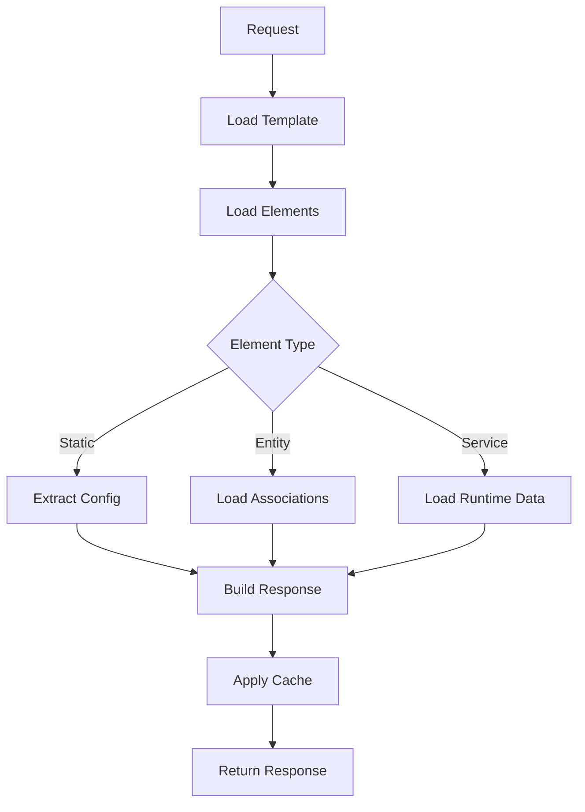

# Shopware Content System V2 - Implementation Plan

## Executive Summary

Content System V2 empowers merchants to fully design their shop layouts by clicking together content building blocks, providing complete control over their store's appearance without requiring technical knowledge. The system introduces a hierarchical, component-based architecture that enables unlimited nesting and composition of elements through a visual interface.

The technical foundation uses a Base + Extension pattern for type-safe element management with native DAL integration, a three-phase hydration process for data loading, and an event-driven architecture for extensibility.

## Table of Contents

1. [Architecture Overview](#architecture-overview)
2. [Technical Specification](#technical-specification)
3. [Architecture Decisions](#architecture-decisions)

## Architecture Overview

### Core Concepts

The system follows a **Base + Extension** pattern:
- **Base Layer**: Handles hierarchy, configuration, and common properties
- **Extension Layer**: Provides type-specific associations to domain entities
- **Hydration Layer**: Transforms database entities to API responses
- **Cache Layer**: Optimizes performance based on element characteristics

### Component Architecture

```
┌─────────────────────────────────────────┐
│           API Controller                │
├─────────────────────────────────────────┤
│         Response Builder                │
├─────────────────────────────────────────┤
│        Hydration Service                │
├──────────────┬──────────────────────────┤
│   Entity     │    Service               │
│   Loader     │    Loader                │
├──────────────┴──────────────────────────┤
│            DAL Repository               │
├─────────────────────────────────────────┤
│           Database Layer                │
└─────────────────────────────────────────┘
```

### Data Flow



## Technical Specification

### Database Schema

#### Core Tables

**content_template**
```sql
CREATE TABLE content_template (
    id          BINARY(16)      PRIMARY KEY,
    type        VARCHAR(255)    NOT NULL, -- 'store-template' or page type
    version     VARCHAR(20)     NOT NULL, -- Semantic versioning
    name        VARCHAR(255),
    data        JSON,           -- Template configuration
    created_at  DATETIME        NOT NULL,
    updated_at  DATETIME,
    
    INDEX idx_type (type)
);
```

**content_element**
```sql
CREATE TABLE content_element (
    id          BINARY(16)      PRIMARY KEY,
    type        VARCHAR(255)    NOT NULL,
    version     VARCHAR(20)     NOT NULL,
    template_id BINARY(16)      REFERENCES content_template(id),
    parent_id   BINARY(16)      REFERENCES content_element(id),
    slot_name   VARCHAR(255)    NULL,     -- Named slot in parent
    position    INT             NOT NULL,  -- Order in parent/slot
    config      JSON,                      -- All configuration
    lazy_load   BOOLEAN         DEFAULT FALSE,
    created_at  DATETIME        NOT NULL,
    updated_at  DATETIME,
    
    INDEX idx_parent (parent_id, position),
    INDEX idx_template (template_id),
    INDEX idx_type (type)
);
```

#### Extension Pattern

For each element type requiring domain entity association:

```sql
CREATE TABLE content_element_{entity} (
    element_id  BINARY(16)      PRIMARY KEY REFERENCES content_element(id),
    {entity}_id BINARY(16)      NOT NULL REFERENCES {entity}(id),
    
    INDEX idx_{entity} ({entity}_id)
);
```

Applied to: product, category, media, manufacturer, order, customer

### Element Type System

#### Categories

| Category | Description | Data Source | Caching |
|----------|-------------|-------------|---------|
| **Container** | Layout structure only | None | Full |
| **Static** | Content in config field | Config JSON | Full |
| **Entity** | Associated domain entities | Extension table | Context-aware |
| **Service** | Runtime-loaded data | Service layer | None/User |

#### Type Registry

```yaml
ContentElementType:
  type_key: string       # Unique identifier
  category: enum         # Category from above
  version: string        # Semantic version
  is_live: boolean       # Production flag
  
  Constraints:
    - Unique(type_key, version)
    - OnlyOneLive(type_key)
```

### Hydration Algorithm

```
FUNCTION hydrate(templateId, context):
    // Phase 1: Load with associations
    elements = loadElements(templateId, context)
    
    // Phase 2: Process by type
    FOR EACH element IN elements:
        SWITCH element.type.category:
            CASE 'static':
                element.data = extractFromConfig(element.config)
            CASE 'entity':
                element.data = already loaded via association
            CASE 'service':
                deferredElements.add(element)
    
    // Phase 3: Batch load service data
    IF deferredElements.notEmpty:
        serviceData = batchLoadServices(deferredElements, context)
        applyServiceData(deferredElements, serviceData)
    
    RETURN elements
```

### API Response Structure

```typescript
interface ContentResponse {
    storeTemplate?: Template;  // Optional store frame
    pageTemplate: Template;     // Required page content
    context: {
        salesChannelId: string;
        languageId: string;
        currencyId: string;
        customerId?: string;
    };
    seo: SeoMetadata;
    apiVersion: string;
    timestamp: string;
}

interface Template {
    id: string;
    type: string;
    version: string;
    name: string;
    data: object;
    elements: Element[];
}

interface Element {
    id: string;
    type: string;
    version: string;
    data: object;           // Element-specific data
    style?: object;         // Styling configuration
    attributes?: object;    // HTML attributes
    slots?: {               // Named slots
        [key: string]: Element[];
    };
    elements?: Element[];   // Direct children
}
```

## Architecture Decisions

### ADR-001: Base + Extension Pattern

**Status**: Accepted  
**Context**: Need flexibility for element types while maintaining referential integrity  
**Decision**: Use base table with type-specific extension tables  
**Consequences**:
- ✅ Native DAL associations
- ✅ Foreign key constraints
- ✅ Type safety
- ⚠️ Additional joins required
- ⚠️ More complex schema

**Alternatives Considered**:
1. Single table with JSON (rejected: no FK constraints)
2. Separate tables per type (rejected: too complex)
3. EAV pattern (rejected: poor performance)

### ADR-002: Three-Phase Hydration

**Status**: Accepted  
**Context**: Different element types have different loading requirements  
**Decision**: Implement phased hydration (entity → static → service)  
**Consequences**:
- ✅ Optimized queries per type
- ✅ Clear separation of concerns
- ✅ Extensible via events
- ⚠️ More complex implementation

### ADR-003: Type Registry System

**Status**: Accepted  
**Context**: Need versioning and discovery for element types  
**Decision**: Implement type registry with version management  
**Consequences**:
- ✅ Type validation
- ✅ Version control
- ✅ Plugin extensibility
- ⚠️ Additional complexity

## Code Examples

### Entity Definition Pattern

```php
// Pseudocode for entity definition pattern
class ContentElementDefinition extends EntityDefinition {
    protected function defineFields(): FieldCollection {
        return new FieldCollection([
            id_field(),
            string_field('type'),
            string_field('version'),
            fk_field('template_id'),
            parent_fk_field(),
            json_field('config'),
            
            // Associations
            parent_association(),
            children_association(),
            
            // Extension associations (added dynamically)
            foreach (registered_extensions as extension) {
                one_to_one_association(extension)
            }
        ]);
    }
}
```

### Hydration Service Interface

```php
interface HydrationServiceInterface {
    /**
     * Hydrate template elements with all data
     * 
     * @return ContentElementCollection Fully hydrated elements
     */
    public function hydrate(
        string $templateId, 
        SalesChannelContext $context
    ): ContentElementCollection;
    
    /**
     * Register custom hydrator for element type
     */
    public function registerHydrator(
        string $type, 
        HydratorInterface $hydrator
    ): void;
}
```

### Extension Example

```php
// Example: Adding a custom element type
class CustomElementSubscriber implements EventSubscriberInterface {
    public static function getSubscribedEvents(): array {
        return [
            ContentElementAssociationEvent::class => 'onAssociation',
            ContentElementHydrationEvent::class => 'onHydration',
        ];
    }
    
    public function onAssociation(ContentElementAssociationEvent $event): void {
        // Add custom associations
        if ($event->hasType('custom-widget')) {
            $event->addAssociation('customElement.customEntity');
        }
    }
    
    public function onHydration(ContentElementHydrationEvent $event): void {
        // Custom hydration logic
        foreach ($event->getElements()->filterByType('custom-widget') as $element) {
            $element->setData($this->loadCustomData($element));
        }
    }
}
```
