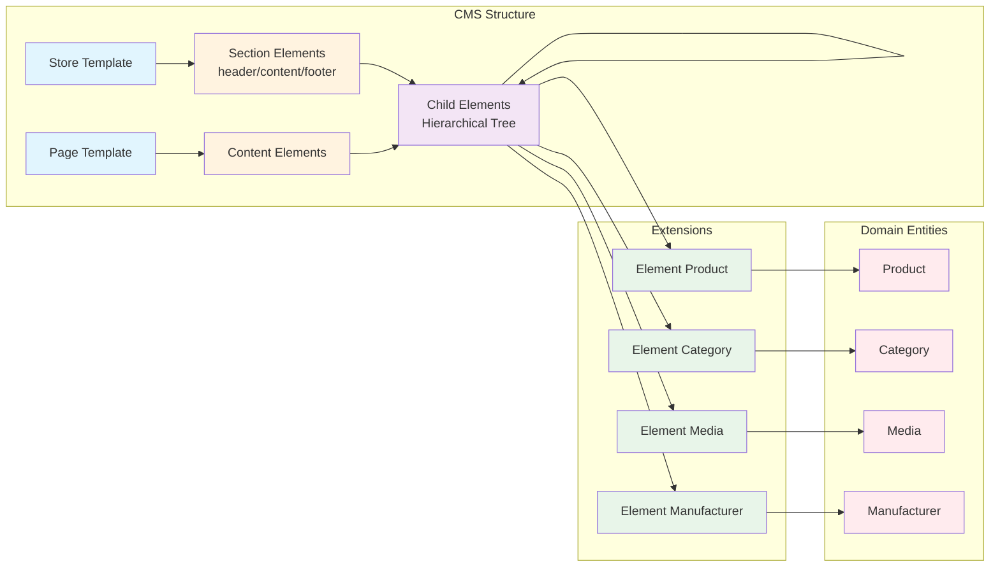
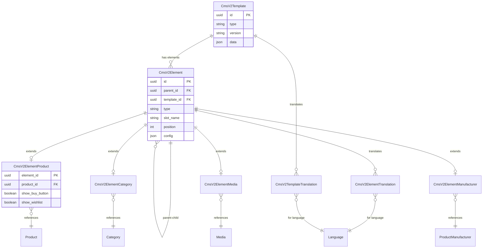
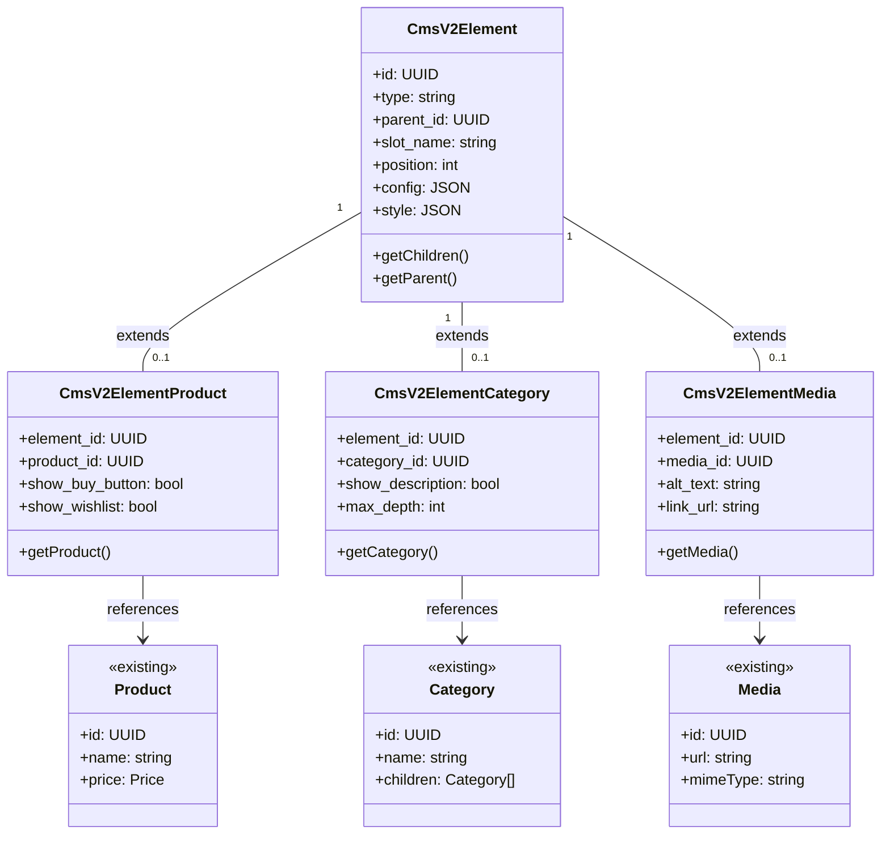

# Shopware CMS v2 Entity Architecture

## Entity Architecture Overview

The CMS v2 entity architecture implements a hybrid approach that balances type safety, performance, and maintainability. The design leverages Shopware's Data Abstraction Layer (DAL) while introducing new patterns optimized for hierarchical content structures.

### Design Principles

1. **Separation of Concerns**: Structure (hierarchy) is separated from data (content) to enable flexible composition
2. **Type Safety**: Leverages Shopware's DAL associations for proper foreign key relationships
3. **Performance**: Optimized for batch loading to minimize database queries
4. **Extensibility**: New element types can be added without breaking existing implementations
5. **Compatibility**: Integrates seamlessly with existing Shopware entities (Product, Category, Media, etc.)

The entity structure follows a **Base + Extension** pattern where:
- A base `cms_v2_element` table handles hierarchy and common properties
- Type-specific extension tables provide proper associations to domain entities
- This approach enables native DAL associations while maintaining flexibility

## Core Entities

### CmsV2Template

The template entity represents both store-wide templates and page-specific templates.

**Table: `cms_v2_template`**
```sql
id                  BINARY(16)      PRIMARY KEY
type                VARCHAR(255)    NOT NULL -- 'store-template', 'category-listing', 'product-detail', etc.
version             VARCHAR(20)     NOT NULL -- Semantic version (e.g., '1.0.0')
name                VARCHAR(255)    
data                JSON            -- Page-specific configuration
created_at          DATETIME        NOT NULL
updated_at          DATETIME
```

**Purpose**: Defines the overall structure for store frames and page layouts. When `type` = 'store-template', it represents a store-wide frame with persistent elements (header/footer). All other type values represent page-specific templates.

**Template Type Derivation**: The template type is derived from the `type` field:
```php
// Helper method in entity or service
public function isStoreTemplate(): bool {
    return $this->type === 'store-template';
}

public function getTemplateType(): string {
    return $this->type === 'store-template' ? 'store' : 'page';
}
```

### CmsV2Element

The core element entity handles the hierarchical structure of all CMS elements, including section containers.

**Table: `cms_v2_element`**
```sql
id                  BINARY(16)      PRIMARY KEY
type                VARCHAR(255)    NOT NULL -- 'product-box', 'heading', 'button', 'grid', etc.
version             VARCHAR(20)     NOT NULL -- Element type version
template_id         BINARY(16)      FOREIGN KEY -> cms_v2_template
parent_id           BINARY(16)      FOREIGN KEY -> cms_v2_element (self-referential)
slot_name           VARCHAR(255)    NULL -- Named slot if element fills a parent slot
position            INT             NOT NULL -- Order within parent/slot
config              JSON            -- All static configuration, styling, and attributes
lazy_load           BOOLEAN         DEFAULT FALSE
created_at          DATETIME        NOT NULL
updated_at          DATETIME

INDEX idx_parent (parent_id, position)
INDEX idx_template (template_id)
INDEX idx_type (type)
```

**Config Structure**: The `config` field contains all static data including configuration, styling, and attributes:
```json
{
  "text": "Add to Cart",
  "showBuyButton": true,
  "displayType": "basic-box",
  "style": {
    "spacing": "medium",
    "alignment": "center",
    "corners": "rounded"
  },
  "attributes": {
    "data-testid": "product-box",
    "class": "custom-class"
  }
}
```

**Purpose**: Provides the hierarchical structure for all elements. Root elements (those with `parent_id` null) are directly attached to templates. The self-referential `parent_id` creates the tree structure, allowing unlimited nesting of elements. All static configuration, styling, and platform-specific attributes are stored in the single `config` JSON field.

**Slot Behavior**:
- Elements WITH `slot_name`: Fill a specific named slot in their parent element (e.g., `slot_name = "image"` goes into parent's `slots.image`)
- Elements WITHOUT `slot_name` (but with `parent_id`): Become sequential content in the parent's `elements` array
- Both use the `position` field for ordering within their respective containers

### CmsV2ElementProduct

Extension table for product-related elements.

**Table: `cms_v2_element_product`**
```sql
element_id          BINARY(16)      PRIMARY KEY, FOREIGN KEY -> cms_v2_element
product_id          BINARY(16)      NOT NULL, FOREIGN KEY -> product

INDEX idx_product (product_id)
```

**Purpose**: Provides foreign key relationship to enable DAL associations for product hydration. Display options (show_buy_button, show_wishlist, etc.) are stored in the base element's `config` JSON field.

### CmsV2ElementCategory

Extension table for category-related elements.

**Table: `cms_v2_element_category`**
```sql
element_id          BINARY(16)      PRIMARY KEY, FOREIGN KEY -> cms_v2_element
category_id         BINARY(16)      NOT NULL, FOREIGN KEY -> category

INDEX idx_category (category_id)
```

**Purpose**: Provides foreign key relationship to enable DAL associations for category hydration. Display options (show_description, max_depth, etc.) are stored in the base element's `config` JSON field.

### CmsV2ElementMedia

Extension table for media-related elements.

**Table: `cms_v2_element_media`**
```sql
element_id          BINARY(16)      PRIMARY KEY, FOREIGN KEY -> cms_v2_element
media_id            BINARY(16)      NOT NULL, FOREIGN KEY -> media

INDEX idx_media (media_id)
```

**Purpose**: Provides foreign key relationship to enable DAL associations for media hydration. Display options (alt_text, link_url, etc.) are stored in the base element's `config` JSON field.

### CmsV2ElementManufacturer

Extension table for manufacturer/brand elements.

**Table: `cms_v2_element_manufacturer`**
```sql
element_id          BINARY(16)      PRIMARY KEY, FOREIGN KEY -> cms_v2_element
manufacturer_id     BINARY(16)      NOT NULL, FOREIGN KEY -> product_manufacturer

INDEX idx_manufacturer (manufacturer_id)
```

**Purpose**: Provides foreign key relationship to enable DAL associations for manufacturer hydration. Display options (show_logo, show_description, etc.) are stored in the base element's `config` JSON field.

### CmsV2ElementOrder

Extension table for order-related elements.

**Table: `cms_v2_element_order`**
```sql
element_id          BINARY(16)      PRIMARY KEY, FOREIGN KEY -> cms_v2_element
order_id            BINARY(16)      NOT NULL, FOREIGN KEY -> order

INDEX idx_order (order_id)
```

**Purpose**: Provides foreign key relationship to enable DAL associations for order hydration. Display options (showItems, showShipping, showStatus, etc.) are stored in the base element's `config` JSON field. Used for order confirmation pages, order history, and order tracking widgets.

### CmsV2ElementCustomer

Extension table for customer-related elements.

**Table: `cms_v2_element_customer`**
```sql
element_id          BINARY(16)      PRIMARY KEY, FOREIGN KEY -> cms_v2_element
customer_id         BINARY(16)      NOT NULL, FOREIGN KEY -> customer

INDEX idx_customer (customer_id)
```

**Purpose**: Provides foreign key relationship to enable DAL associations for customer hydration. Display options (showAvatar, showOrderCount, etc.) are stored in the base element's `config` JSON field. Used for customer profiles, account dashboards, and personalized content.

### Translation Entities

**Table: `cms_v2_element_translation`**
```sql
element_id          BINARY(16)      NOT NULL, FOREIGN KEY -> cms_v2_element
language_id         BINARY(16)      NOT NULL, FOREIGN KEY -> language
config              JSON            -- Translated configuration
created_at          DATETIME        NOT NULL
updated_at          DATETIME

PRIMARY KEY (element_id, language_id)
```

**Table: `cms_v2_template_translation`**
```sql
template_id         BINARY(16)      NOT NULL, FOREIGN KEY -> cms_v2_template
language_id         BINARY(16)      NOT NULL, FOREIGN KEY -> language
name                VARCHAR(255)    
data                JSON            -- Translated data
created_at          DATETIME        NOT NULL
updated_at          DATETIME

PRIMARY KEY (template_id, language_id)
```

**Purpose**: Provides multi-language support for templates and elements.

## Extension Table Design Principle

**Critical Design Rule**: Extension tables contain ONLY foreign key relationships. All configuration and display options belong in the base element's `config` JSON field.

This separation serves distinct purposes:
- **Extension Tables**: Enable DAL associations and maintain referential integrity through foreign keys
- **Config JSON Field**: Stores all display options, settings, and configuration that gets passed to the response

Example of proper separation:
```json
// In cms_v2_element.config (JSON field)
{
  "showBuyButton": true,
  "showWishlist": true,
  "displayType": "basic-box",
  "altText": "Product image",
  "linkUrl": "/products/green-tea",
  "maxDepth": 3
}
```

```sql
-- In cms_v2_element_product (extension table)
-- ONLY contains foreign key relationship
element_id -> cms_v2_element.id
product_id -> product.id
```

This design:
- Simplifies schema maintenance
- Makes adding new configuration options trivial (no migrations needed)
- Keeps extension tables focused on their single responsibility
- Maintains flexibility while ensuring type safety

## Dynamic Data Reference System

The dynamic data reference system enables efficient loading of domain entities (products, categories, media) while maintaining type safety and referential integrity.

### How It Works

1. **Configuration Storage**: Element configuration including entity references is stored in the `config` JSON field
2. **Type-Specific Extensions**: Each element type that references domain entities has a corresponding extension table
3. **Native DAL Associations**: Extension tables provide proper foreign keys enabling Shopware's DAL to handle associations

### Reference Flow

```
CmsV2Element (base)
    ├── config: {showBuyButton: true, displayType: 'basic-box'}
    └── type: 'product-box'
         ↓
CmsV2ElementProduct (extension)
    ├── element_id → CmsV2Element.id
    └── product_id → Product.id (with full DAL association)
```

### Element Type Mapping

| Element Type | Extension Table | Referenced Entity | Use Case |
|-------------|-----------------|-------------------|----------|
| `product-box` | `cms_v2_element_product` | Product | Product display |
| `product-listing` | `cms_v2_element_product` | Product (multiple) | Product grids |
| `category-navigation` | `cms_v2_element_category` | Category | Navigation menus |
| `category-header` | `cms_v2_element_category` | Category | Category pages |
| `image` | `cms_v2_element_media` | Media | Images, videos |
| `manufacturer-logo` | `cms_v2_element_manufacturer` | ProductManufacturer | Brand displays |
| `order-details` | `cms_v2_element_order` | Order | Order confirmation page |
| `order-history` | `cms_v2_element_order` | Order (multiple) | Customer account order list |
| `order-status` | `cms_v2_element_order` | Order | Order tracking widget |
| `customer-profile` | `cms_v2_element_customer` | Customer | Customer profile display |
| `customer-addresses` | `cms_v2_element_customer` | Customer | Address book management |
| `customer-dashboard` | `cms_v2_element_customer` | Customer | Account dashboard widgets |
| `customer-wishlist` | `cms_v2_element_customer` | Customer | Wishlist display |

### Benefits

1. **Type Safety**: Foreign keys ensure only valid entity references
2. **Query Optimization**: DAL can optimize JOINs and eager loading
3. **Referential Integrity**: Database enforces data consistency
4. **Extensibility**: New element types can add their own extension tables
5. **Performance**: Batch loading through proper associations

### Adding New Element Types

To add a new element type with dynamic data:

1. Create the extension table:
```sql
CREATE TABLE cms_v2_element_custom (
    element_id BINARY(16) PRIMARY KEY,
    custom_entity_id BINARY(16) NOT NULL,
    -- type-specific fields
    FOREIGN KEY (element_id) REFERENCES cms_v2_element(id),
    FOREIGN KEY (custom_entity_id) REFERENCES custom_entity(id)
);
```

2. Define the Shopware entity and definition
3. Add DAL associations
4. Implement element resolver for hydration

## Entity Relationships

### High-Level Conceptual Flow

This diagram shows the logical flow from templates to domain entities:



### Entity Relationship Diagram

This diagram shows the detailed database relationships with cardinality:



### Extension Pattern

This diagram illustrates how the base element entity is extended for different types:



### Key Relationships

#### Template Hierarchy
- **CmsV2Template** → **CmsV2Element** (direct relationship to elements)
- Root elements (with `parent_id` = null) are directly attached to templates
- Templates define their sections (header/content/footer) in the `data` JSON field
- Templates are composed at runtime with context from `SalesChannelContext`
- SEO metadata is generated at runtime from entity data and template patterns

#### Element Tree
- **CmsV2Element** → **CmsV2Element** (parent-child via `parent_id`)
- Elements form a tree structure with `slot_name` for named slots
- `position` field maintains order within parent/slot

#### Domain Entity Associations
- **CmsV2ElementProduct** ↔ **Product** (ManyToOne)
- **CmsV2ElementCategory** ↔ **Category** (ManyToOne)
- **CmsV2ElementMedia** ↔ **Media** (ManyToOne)
- **CmsV2ElementManufacturer** ↔ **ProductManufacturer** (ManyToOne)

#### Translation Relationships
- **CmsV2Element** → **CmsV2ElementTranslation** (OneToMany)
- **CmsV2Template** → **CmsV2TemplateTranslation** (OneToMany)

### Cardinality Rules

| Relationship | Cardinality | Notes |
|-------------|------------|-------|
| Template → Elements | 1:N | Each template has multiple root elements |
| Element → Element (sections) | 1:N | Section elements contain child elements |
| Element → Children | 1:N | Elements can have multiple children |
| Element → Extension | 1:0..1 | Element may have type-specific extension |
| Extension → Domain Entity | N:1 | Many elements can reference same entity |
| Element → Translations | 1:N | One translation per language |

## See Also

- [CMS v2 Element Hydration](./shopware-cms-v2-element-hydration.md) - Runtime data loading, transformation, and response building
- [CMS v2 API Response Structure](./shopware-cms-v2.md) - API response format and structure

## Implementation Examples

### Entity Definition Example

```php
<?php declare(strict_types=1);

namespace Shopware\Core\Content\CmsV2;

use Shopware\Core\Framework\DataAbstractionLayer\EntityDefinition;
use Shopware\Core\Framework\DataAbstractionLayer\Field\BoolField;
use Shopware\Core\Framework\DataAbstractionLayer\Field\ChildrenAssociationField;
use Shopware\Core\Framework\DataAbstractionLayer\Field\FkField;
use Shopware\Core\Framework\DataAbstractionLayer\Field\Flag\ApiAware;
use Shopware\Core\Framework\DataAbstractionLayer\Field\Flag\CascadeDelete;
use Shopware\Core\Framework\DataAbstractionLayer\Field\Flag\PrimaryKey;
use Shopware\Core\Framework\DataAbstractionLayer\Field\Flag\Required;
use Shopware\Core\Framework\DataAbstractionLayer\Field\IdField;
use Shopware\Core\Framework\DataAbstractionLayer\Field\IntField;
use Shopware\Core\Framework\DataAbstractionLayer\Field\JsonField;
use Shopware\Core\Framework\DataAbstractionLayer\Field\ManyToOneAssociationField;
use Shopware\Core\Framework\DataAbstractionLayer\Field\OneToOneAssociationField;
use Shopware\Core\Framework\DataAbstractionLayer\Field\ParentAssociationField;
use Shopware\Core\Framework\DataAbstractionLayer\Field\ParentFkField;
use Shopware\Core\Framework\DataAbstractionLayer\Field\StringField;
use Shopware\Core\Framework\DataAbstractionLayer\FieldCollection;

class CmsV2ElementDefinition extends EntityDefinition
{
    public const ENTITY_NAME = 'cms_v2_element';

    public function getEntityName(): string
    {
        return self::ENTITY_NAME;
    }

    public function getEntityClass(): string
    {
        return CmsV2ElementEntity::class;
    }

    protected function defineFields(): FieldCollection
    {
        return new FieldCollection([
            (new IdField('id', 'id'))->addFlags(new ApiAware(), new PrimaryKey(), new Required()),
            (new StringField('type', 'type'))->addFlags(new ApiAware(), new Required()),
            (new StringField('version', 'version'))->addFlags(new ApiAware(), new Required()),
            (new FkField('template_id', 'templateId', CmsV2TemplateDefinition::class))->addFlags(new ApiAware()),
            (new ParentFkField(self::class))->addFlags(new ApiAware()),
            (new StringField('slot_name', 'slotName'))->addFlags(new ApiAware()),
            (new IntField('position', 'position'))->addFlags(new ApiAware(), new Required()),
            (new JsonField('config', 'config'))->addFlags(new ApiAware()),
            (new BoolField('lazy_load', 'lazyLoad'))->addFlags(new ApiAware()),
            
            // Associations
            (new ManyToOneAssociationField('template', 'template_id', CmsV2TemplateDefinition::class))
                ->addFlags(new ApiAware()),
            (new ParentAssociationField(self::class))->addFlags(new ApiAware()),
            (new ChildrenAssociationField(self::class))->addFlags(new ApiAware()),
            
            // Type-specific extension associations
            (new OneToOneAssociationField('productElement', 'id', 'element_id', CmsV2ElementProductDefinition::class))
                ->addFlags(new ApiAware()),
            (new OneToOneAssociationField('categoryElement', 'id', 'element_id', CmsV2ElementCategoryDefinition::class))
                ->addFlags(new ApiAware()),
            (new OneToOneAssociationField('mediaElement', 'id', 'element_id', CmsV2ElementMediaDefinition::class))
                ->addFlags(new ApiAware()),
        ]);
    }
}
```

### Product Element Extension Definition

```php
<?php declare(strict_types=1);

namespace Shopware\Core\Content\CmsV2\Aggregate\CmsV2ElementProduct;

use Shopware\Core\Content\Product\ProductDefinition;
use Shopware\Core\Framework\DataAbstractionLayer\EntityDefinition;
use Shopware\Core\Framework\DataAbstractionLayer\Field\FkField;
use Shopware\Core\Framework\DataAbstractionLayer\Field\Flag\ApiAware;
use Shopware\Core\Framework\DataAbstractionLayer\Field\Flag\PrimaryKey;
use Shopware\Core\Framework\DataAbstractionLayer\Field\Flag\Required;
use Shopware\Core\Framework\DataAbstractionLayer\Field\ManyToOneAssociationField;
use Shopware\Core\Framework\DataAbstractionLayer\Field\OneToOneAssociationField;
use Shopware\Core\Framework\DataAbstractionLayer\FieldCollection;

class CmsV2ElementProductDefinition extends EntityDefinition
{
    public const ENTITY_NAME = 'cms_v2_element_product';

    public function getEntityName(): string
    {
        return self::ENTITY_NAME;
    }

    protected function defineFields(): FieldCollection
    {
        return new FieldCollection([
            (new FkField('element_id', 'elementId', CmsV2ElementDefinition::class))
                ->addFlags(new ApiAware(), new PrimaryKey(), new Required()),
            (new FkField('product_id', 'productId', ProductDefinition::class))
                ->addFlags(new ApiAware(), new Required()),
            
            // Associations
            (new OneToOneAssociationField('element', 'element_id', 'id', CmsV2ElementDefinition::class))
                ->addFlags(new ApiAware()),
            (new ManyToOneAssociationField('product', 'product_id', ProductDefinition::class))
                ->addFlags(new ApiAware()),
        ]);
    }
}
```

### Order Element Extension Definition

```php
<?php declare(strict_types=1);

namespace Shopware\Core\Content\CmsV2\Aggregate\CmsV2ElementOrder;

use Shopware\Core\Checkout\Order\OrderDefinition;
use Shopware\Core\Framework\DataAbstractionLayer\EntityDefinition;
use Shopware\Core\Framework\DataAbstractionLayer\Field\FkField;
use Shopware\Core\Framework\DataAbstractionLayer\Field\Flag\ApiAware;
use Shopware\Core\Framework\DataAbstractionLayer\Field\Flag\PrimaryKey;
use Shopware\Core\Framework\DataAbstractionLayer\Field\Flag\Required;
use Shopware\Core\Framework\DataAbstractionLayer\Field\ManyToOneAssociationField;
use Shopware\Core\Framework\DataAbstractionLayer\Field\OneToOneAssociationField;
use Shopware\Core\Framework\DataAbstractionLayer\FieldCollection;

class CmsV2ElementOrderDefinition extends EntityDefinition
{
    public const ENTITY_NAME = 'cms_v2_element_order';

    public function getEntityName(): string
    {
        return self::ENTITY_NAME;
    }

    protected function defineFields(): FieldCollection
    {
        return new FieldCollection([
            (new FkField('element_id', 'elementId', CmsV2ElementDefinition::class))
                ->addFlags(new ApiAware(), new PrimaryKey(), new Required()),
            (new FkField('order_id', 'orderId', OrderDefinition::class))
                ->addFlags(new ApiAware(), new Required()),
            
            // Associations
            (new OneToOneAssociationField('element', 'element_id', 'id', CmsV2ElementDefinition::class))
                ->addFlags(new ApiAware()),
            (new ManyToOneAssociationField('order', 'order_id', OrderDefinition::class))
                ->addFlags(new ApiAware()),
        ]);
    }
}
```

### Customer Element Extension Definition

```php
<?php declare(strict_types=1);

namespace Shopware\Core\Content\CmsV2\Aggregate\CmsV2ElementCustomer;

use Shopware\Core\Checkout\Customer\CustomerDefinition;
use Shopware\Core\Framework\DataAbstractionLayer\EntityDefinition;
use Shopware\Core\Framework\DataAbstractionLayer\Field\FkField;
use Shopware\Core\Framework\DataAbstractionLayer\Field\Flag\ApiAware;
use Shopware\Core\Framework\DataAbstractionLayer\Field\Flag\PrimaryKey;
use Shopware\Core\Framework\DataAbstractionLayer\Field\Flag\Required;
use Shopware\Core\Framework\DataAbstractionLayer\Field\ManyToOneAssociationField;
use Shopware\Core\Framework\DataAbstractionLayer\Field\OneToOneAssociationField;
use Shopware\Core\Framework\DataAbstractionLayer\FieldCollection;

class CmsV2ElementCustomerDefinition extends EntityDefinition
{
    public const ENTITY_NAME = 'cms_v2_element_customer';

    public function getEntityName(): string
    {
        return self::ENTITY_NAME;
    }

    protected function defineFields(): FieldCollection
    {
        return new FieldCollection([
            (new FkField('element_id', 'elementId', CmsV2ElementDefinition::class))
                ->addFlags(new ApiAware(), new PrimaryKey(), new Required()),
            (new FkField('customer_id', 'customerId', CustomerDefinition::class))
                ->addFlags(new ApiAware(), new Required()),
            
            // Associations
            (new OneToOneAssociationField('element', 'element_id', 'id', CmsV2ElementDefinition::class))
                ->addFlags(new ApiAware()),
            (new ManyToOneAssociationField('customer', 'customer_id', CustomerDefinition::class))
                ->addFlags(new ApiAware()),
        ]);
    }
}
```

## Implementation Best Practices

### Entity Loading Best Practices

1. **Use DAL Associations**: Leverage the power of Shopware's DAL to load related entities efficiently
2. **Batch Loading**: Always batch load entities of the same type to minimize queries
3. **Lazy Loading**: Mark elements that don't need immediate loading with the `lazy_load` flag
4. **Proper Indexing**: Ensure database indexes on `parent_id`, `template_id`, and `type` fields

### Extension Table Pattern

When adding new element types that reference existing Shopware entities:

1. Create an extension table with only the foreign key relationship
2. Store all configuration in the base element's `config` field
3. Use DAL associations to load the referenced entity
4. Keep the extension table minimal - it's only for type safety and associations

### Performance Considerations

- The self-referential hierarchy allows unlimited nesting with a single table
- Extension tables provide type safety without data duplication
- The `config` JSON field provides flexibility without schema migrations
- Position-based ordering ensures consistent element sequence

## Summary

The CMS v2 entity architecture provides:

- **Flexible Hierarchy**: Self-referential elements support unlimited nesting
- **Type Safety**: Extension tables provide proper DAL associations
- **Performance**: Optimized for batch loading and minimal queries
- **Extensibility**: New element types can be added without breaking existing code
- **Compatibility**: Seamless integration with existing Shopware entities

This architecture balances the need for flexibility in content management with the performance and type safety requirements of a modern e-commerce platform.
