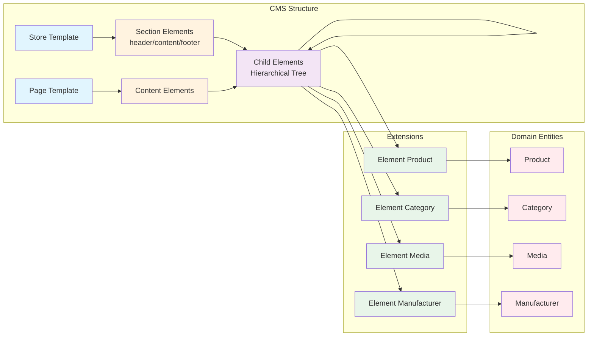
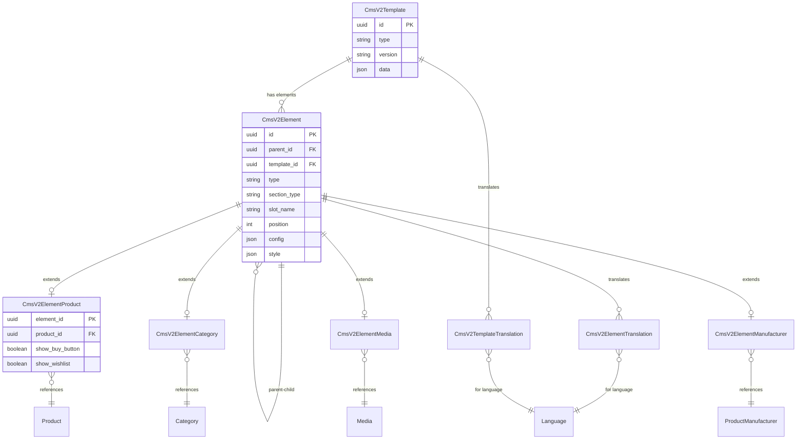
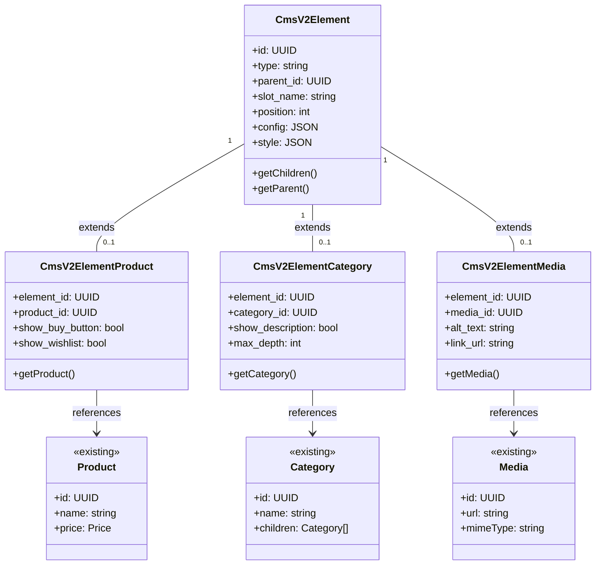

# Shopware CMS API Response Structure Documentation

## Overview

The CMS v2 architecture uses a hierarchical component-based structure with two rendering strategies: granular (element-by-element) and template-based (optimized for known patterns).

## Core Principles

### 1. Hierarchical Component Structure

The response structure mirrors how developers naturally think about page composition. Consider the familiar pattern of any web application:

```
Store Template (Outer Frame)
├── Header Section
├── Page Content (Placeholder)
└── Footer Section

Page Template (Inner Content)
├── Elements
│   └── Slots
│       └── Elements (recursive)
│           └── Slots (can contain more elements)
```

Certain elements persist across navigation (header and footer) while others change with each page load. The Store Template acts as the persistent shell, while Page Templates slot into the content area.

### 2. Dual Rendering Approach

1. **Granular Rendering**: Platforms parse every element individually. Mobile apps translate each component into native UI elements. These renderers walk the tree element by element, building the interface piece by piece.

2. **Template-Based Rendering**: Renderers recognize high-level patterns. When encountering a product listing, they apply a pre-built template using the provided data rather than parsing every button and text field individually.

### 3. Version Control

Each element declares its version using semantic versioning (e.g., `2.1.0`). This version refers to the element type, not the data within it.

This enables:
- Backward compatibility without breaking existing implementations
- Progressive enhancement as new features roll out
- A/B testing different implementations of the same component
- Graceful degradation when renderers encounter newer element versions

## Response Structure

### Top Level Structure

Every API response starts with this foundation:

```json5
{
  "storeTemplate": { /* Global store frame */ },
  "pageTemplate": { /* Page-specific content */ },
  "context": { /* Request context */ },
  "apiVersion": "6.6.0.0",
  "timestamp": "2024-01-22T10:30:00.000+00:00"
}
```

The separation between `storeTemplate` and `pageTemplate` at the root level immediately signals the dual nature of the content. Renderers know from the first parse what remains static and what changes.

### Store Template

The Store Template defines your application's persistent frame:

```json5
{
  "id": "uuid",
  "type": "store-template",
  "version": "1.0.0",
  "name": "Template Name",
  "sections": {
    "header": { /* Header elements */ },
    "content": { "placeholder": "page-content" },
    "footer": { /* Footer elements */ }
  }
}
```

The `content` section contains only a placeholder. The Store Template declares where page content belongs without specifying what that content might be.

### Page Template

Page Templates contain the page-specific content:

```json5
{
  "id": "uuid",
  "type": "category-listing",
  "version": "2.1.0",
  "name": "Page Name",
  "data": { /* High-level page data */ },
  "style": { /* Page-level styling */ },
  "elements": [ /* Page elements */ ],
  "seo": { /* SEO metadata */ }
}
```

The `type` field here (`category-listing`) immediately tells smart renderers what kind of page they're dealing with. They can choose to use specialized rendering logic or fall back to element-by-element parsing.

## Element Structure

Every element adheres to a consistent pattern that balances flexibility with predictability:

```json5
{
  "id": "uuid",
  "type": "element-type",
  "version": "1.0.0",
  "data": { /* Element configuration and data */ },
  "style": { /* Visual styling properties */ },
  "slots": { /* Named slots for nested elements */ },
  "elements": [ /* Direct child elements */ ],
  "attributes": { /* HTML attributes (optional) */ }
}
```

### Key Properties

#### `id` (required)
Every element receives a UUID (`0188e8c5-5fc4-7b41-ac14-ccc21fd2aa13` format). This enables efficient caching strategies and provides a stable reference for debugging.

#### `type` (required)
The element's type (`product-box`, `heading`, `button`, `grid`) serves as the primary key for renderer selection. Simple types like `heading` might have straightforward renderers, while complex types like `product-box` could trigger specialized logic.

#### `version` (required)
Following semantic versioning (`MAJOR.MINOR.PATCH`), this field enables graceful evolution. A renderer built for `product-box` version `2.0.0` can still handle version `2.1.0` (new features) but might need fallback logic for version `3.0.0` (breaking changes).

#### `data` (optional)
This property adapts to each element's needs. A heading might only need `{ "text": "Hello", "level": 2 }`, while a product box could contain entire product entities with prices, descriptions, and inventory data.

#### `style` (optional)
Rather than embedding CSS or platform-specific styling, the API uses semantic style properties. Instead of `margin: 16px`, you'll see `spacing: "medium"`. This abstraction allows each platform to interpret styling according to its own design system.

#### `slots` (optional)
Named slots enable sophisticated composition patterns. A product box might define `image`, `content`, and `actions` slots, each filled with appropriate elements. This approach mirrors modern component frameworks while remaining platform-agnostic.

#### `elements` (optional)
For simpler sequential content, the `elements` array provides ordered children. The distinction between `slots` (named, semantic) and `elements` (ordered, sequential) gives developers precise control over content structure.

#### `attributes` (optional)
This escape hatch allows platform-specific metadata. Web renderers might use these for CSS classes or data attributes, while other platforms can safely ignore them.

## Style Properties

### Common Style Properties

```json5
{
  "style": {
    // Layout
    // layout: "horizontal" | "vertical" | "grid" | "sidebar-content"
    "layout": "horizontal",
    // alignment: "left" | "center" | "right" | "space-between"
    "alignment": "left",
    // verticalAlignment: "top" | "center" | "bottom"
    "verticalAlignment": "top",
    
    // Sizing
    // size: "small" | "medium" | "large" | "extra-large"
    "size": "small",
    // width: "small" | "medium" | "large" | "extra-large"
    "width": "150",
    // height: "40" | "full" | "auto"
    "height": "40",
    // maxWidth: "1200" | "full"
    "maxWidth": "1200",
    
    // Spacing
    // padding: "small" | "medium" | "large"
    "padding": "small",
    "spacing": {
      "top": "small",
      "bottom": "medium",
      "horizontal": "large"
    },
    // gap: "small" | "medium" | "large"  
    "gap": "small",
    
    // Visual
    // background: "white" | "light-gray" | "dark-blue" | "#hexcode"  
    "background": "white",
    // textColor: "dark" | "gray" | "white"  
    "textColor": "dark",
    // corners: "none" | "slightly-rounded" | "rounded" | "fully-rounded"  
    "corners": "none",
    // shadow: "none" | "subtle" | "small" | "medium" | "large
    "shadow": "none",
    
    // Typography
    // weight: "normal" | "medium" | "semibold" | "bold"
    "weight": "normal",
    // lineHeight: "tight" | "normal" | "relaxed"
    "lineHeight": "tight",
    "truncate": {
      "lines": 2,
      "showEllipsis": true
    },
    
    // Effects
    // hoverEffect: "none" | "lift" | "glow"
    "hoverEffect": "none",
    // clickable: true | false
    "clickable": true,
    // sticky: true | false
    "sticky": true,
    // stickyOffset: 100
    "stickyOffset": "100"
  }
}
```

These semantic values solve a fundamental problem: how do you express visual intent without dictating implementation? A mobile app interprets `"padding": "medium"` differently than a web renderer, but both understand the intent.

## Data Loading Patterns

The API supports two distinct data loading strategies, each optimized for different scenarios:

### 1. Synchronous (Embedded Data)

When performance allows and data size is reasonable, embedding complete data provides the best user experience:

```json5
{
  "type": "product-box",
  "data": {
    "product": {
      "id": "uuid",
      "name": "Product Name",
      "price": { /* price data */ }
      // ... complete product data
    }
  }
}
```

### 2. Asynchronous (Lazy Loading)

For larger datasets or below-the-fold content, lazy loading preserves initial load performance:

```json5
{
  "slots": {
    "content": {
      "referenceId": "product-content-002",
      "lazyLoad": true,
      "endpoint": "/api/cms/elements/product-content-002"
    }
  }
}
```

The choice between these patterns isn't just about performance—it's about user experience. Critical above-the-fold content typically uses synchronous loading, while supplementary content can load as needed.

## Element Type Examples

### Container Elements

**Grid**
```json5
{
  "type": "grid",
  "version": "2.0.0",
  "data": {
    "columns": {
      "desktop": 12,
      "tablet": 8,
      "mobile": 4
    },
    "responsive": true
  }
}
```

Grid elements demonstrate how responsive design translates across platforms. The column counts provide hints rather than rigid rules—a native mobile app might interpret these differently than a web renderer.

### Content Elements

**Heading**
```json5
{
  "type": "heading",
  "version": "1.0.0",
  "data": {
    "text": "Green Tea",
    "level": 1  // h1-h6
  }
}
```

Even simple elements benefit from explicit versioning. Future versions might add text alignment or styling options without breaking existing renderers.

**Button**
```json5
{
  "type": "button",
  "version": "1.0.0",
  "data": {
    "text": "Add to Cart",
    "action": "add-to-cart",
    "productId": "uuid"
  },
  "style": {
    "variant": "primary",
    "size": "medium",
    "fullWidth": true
  }
}
```

Buttons showcase the separation between data (what happens when clicked) and presentation (how it looks). The `action` field enables platform-specific handling—web renderers might trigger JavaScript, while mobile apps could invoke native functions.

### Complex Components

**Product Box**
```json5
{
  "type": "product-box",
  "version": "2.3.0",
  "data": {
    "type": "basic-box",
    "showBuyButton": true,
    "showWishlist": true,
    "product": { /* complete product entity */ }
  },
  "slots": {
    "image": { /* image element */ },
    "content": { /* product info */ },
    "actions": { /* buttons */ }
  }
}
```

Complex components leverage both high-level data and granular slots. Smart renderers can use the complete product data with optimized templates, while simple renderers can still construct the UI from individual slot elements.

## Context Object

Context provides the environmental information necessary for proper rendering:

```json5
{
  "context": {
    "salesChannelId": "uuid",
    "languageId": "uuid",
    "currencyId": "uuid",
    "customerId": "uuid",
    "customerGroupId": "uuid"
  }
}
```

Prices display in the correct currency, content appears in the right language, and customer-specific elements (like special pricing) render appropriately.

## Runtime SEO Generation

SEO metadata is generated dynamically at runtime based on the current context, loaded entities, and configured patterns. This ensures SEO always reflects the current state of content without redundant storage.

### SEO Pattern Configuration

Templates can define SEO generation patterns in their `data` field:

```json5
// In cms_v2_template.data or translation
{
  "seoPatterns": {
    "metaTitle": "{product.name} - {product.manufacturer.name} | {shop.name}",
    "metaDescription": "{product.metaDescription|default:product.description|truncate:160}",
    "canonicalUrl": "/{product.seoUrl}",
    "robots": "{product.robots|default:'index,follow'}",
    "ogTitle": "{product.name}",
    "ogDescription": "{product.teaser|truncate:200}",
    "ogImage": "{product.cover.media.url}"
  }
}
```

### Generation Process

1. **Entity Data**: Use SEO fields from the primary entity (product, category, etc.)
2. **Pattern Resolution**: Apply template patterns with entity data
3. **Context Enhancement**: Add shop name, language-specific content
4. **Fallback Chain**: Entity SEO → Template patterns → System defaults

### Response Structure

The generated SEO metadata appears in the API response:

```json5
{
  "seo": {
    "metaTitle": "Green Tea - Premium Teas | My Shop",
    "metaDescription": "Discover our premium green tea selection...",
    "canonicalUrl": "/products/green-tea",
    "robots": "index,follow",
    "ogTitle": "Green Tea",
    "ogDescription": "Premium green tea from the finest gardens...",
    "ogImage": "https://shop.com/media/products/green-tea.jpg"
  }
}
```

### Benefits

- **Always Current**: SEO updates automatically when entity data changes
- **No Redundancy**: Single source of truth in entity data
- **Context-Aware**: Adapts to language, sales channel, and user context
- **Flexible Patterns**: Easy to adjust SEO strategies without data migration
- **Fallback Support**: Graceful degradation when data is missing

Non-web platforms can ignore this data, while web renderers get optimized, context-aware SEO metadata without additional API calls.

## Best Practices

### 1. Element Granularity

Finding the right level of granularity requires judgment. Too granular, and you're sending unnecessary data. Too coarse, and you lose flexibility. The guideline: each element should represent a single logical unit of content with one clear purpose.

Composition happens through slots, not by cramming multiple responsibilities into one element. Sequential content uses the elements array. This separation keeps individual components simple while enabling complex layouts.

### 2. Data Organization

Data organization follows a principle of minimal repetition. High-level data lives in parent components, flowing down as needed. When multiple elements need the same data, place it at the lowest common ancestor rather than duplicating it.

Reference IDs enable data sharing without duplication. If ten elements need product data, they can reference a single source rather than each carrying their own copy.

### 3. Styling

The semantic style system requires discipline. Resist the temptation to add pixel-specific values or platform-specific properties. Each style property should express intent, not implementation.

Responsive behavior emerges from the combination of semantic styles and intelligent renderers. The API provides hints; renderers make platform-appropriate decisions.

### 4. Versioning

Semantic versioning isn't just a convention—it's a contract. MAJOR versions signal breaking changes requiring renderer updates. MINOR versions add capabilities while maintaining compatibility. PATCH versions fix bugs without changing behavior.

The key: version the element type, not the data structure. This enables element evolution without constantly breaking renderers.

### 5. Performance

Performance optimization happens at multiple levels. Lazy loading keeps initial payloads manageable. Component-level caching reduces redundant rendering. Shallow nesting minimizes parsing overhead.

The architecture encourages performance-conscious design without mandating specific optimizations. Each platform can implement caching and loading strategies that make sense for its constraints.

## Rendering Implementation Guide

### For Granular Renderers

Building a granular renderer follows a predictable pattern:

1. Start with recursive parsing—each element potentially contains more elements
2. Version checking happens first—can this renderer handle this element version?
3. Type-based renderer selection routes each element to appropriate logic
4. Style properties translate into platform-specific presentation
5. Child elements render in order, slots fill with their designated content

No element is special; the same logic handles everything from buttons to complex product listings.

### For Template-Based Renderers

Smart renderers take a different approach:

1. Type identification happens at a high level—is this a product listing? A content page?
2. Data extraction pulls complete entities from the data property
3. Pre-built templates consume this data efficiently
4. Style properties might select template variants rather than individual styles
5. Granular child elements become optional—the template handles internal structure

This approach trades flexibility for performance and consistency. When you know you're rendering a product grid, why parse individual elements when a optimized template exists?

## Extension Points

### Custom Elements

The system anticipates extension from day one. Custom elements need only follow the established patterns:

- Choose a unique type identifier (consider namespacing)
- Implement consistent versioning from the start
- Define a clear data structure
- Use compatible style properties

The same rendering logic that handles built-in elements automatically supports custom ones. No special registration or configuration required.

### Platform-Specific Rendering

Each platform brings unique capabilities and constraints. The architecture acknowledges this reality:

- Web renderers might add CSS classes from the attributes property
- Mobile apps could implement gesture handling for interactive elements
- Native applications might use platform-specific optimizations

The key: platform-specific enhancements should improve the experience without becoming requirements. A button should still be recognizable as a button, regardless of platform-specific features.

## Entity Architecture Overview

The CMS v2 entity architecture implements a hybrid approach that balances type safety, performance, and maintainability. The design leverages Shopware's Data Abstraction Layer (DAL) while introducing new patterns optimized for hierarchical content structures.

### Design Principles

1. **Separation of Concerns**: Structure (hierarchy) is separated from data (content) to enable flexible composition
2. **Type Safety**: Leverages Shopware's DAL associations for proper foreign key relationships
3. **Performance**: Optimized for batch loading to minimize database queries
4. **Extensibility**: New element types can be added without breaking existing implementations
5. **Compatibility**: Integrates seamlessly with existing Shopware entities (Product, Category, Media, etc.)

The entity structure follows a **Base + Extension** pattern where:
- A base `cms_v2_element` table handles hierarchy and common properties
- Type-specific extension tables provide proper associations to domain entities
- This approach enables native DAL associations while maintaining flexibility

## Core Entities

### CmsV2Template

The template entity represents both store-wide templates and page-specific templates.

**Table: `cms_v2_template`**
```sql
id                  BINARY(16)      PRIMARY KEY
type                VARCHAR(255)    NOT NULL -- 'store-template', 'category-listing', 'product-detail', etc.
version             VARCHAR(20)     NOT NULL -- Semantic version (e.g., '1.0.0')
name                VARCHAR(255)    
data                JSON            -- Page-specific configuration
created_at          DATETIME        NOT NULL
updated_at          DATETIME
```

**Purpose**: Defines the overall structure for store frames and page layouts. When `type` = 'store-template', it represents a store-wide frame with persistent elements (header/footer). All other type values represent page-specific templates.

**Template Type Derivation**: The template type is derived from the `type` field:
```php
// Helper method in entity or service
public function isStoreTemplate(): bool {
    return $this->type === 'store-template';
}

public function getTemplateType(): string {
    return $this->type === 'store-template' ? 'store' : 'page';
}
```

### CmsV2Element

The core element entity handles the hierarchical structure of all CMS elements, including section containers.

**Table: `cms_v2_element`**
```sql
id                  BINARY(16)      PRIMARY KEY
type                VARCHAR(255)    NOT NULL -- 'section', 'product-box', 'heading', 'button', etc.
version             VARCHAR(20)     NOT NULL -- Element type version
template_id         BINARY(16)      FOREIGN KEY -> cms_v2_template
parent_id           BINARY(16)      FOREIGN KEY -> cms_v2_element (self-referential)
section_type        VARCHAR(50)     NULL -- 'header', 'content', 'footer' for root sections
slot_name           VARCHAR(255)    NULL -- Named slot if element fills a parent slot
position            INT             NOT NULL -- Order within parent/slot
config              JSON            -- Static configuration (includes placeholders)
style               JSON            -- Semantic style properties
attributes          JSON            -- Platform-specific attributes
lazy_load           BOOLEAN         DEFAULT FALSE
created_at          DATETIME        NOT NULL
updated_at          DATETIME

INDEX idx_parent (parent_id, position)
INDEX idx_template (template_id)
INDEX idx_type (type)
INDEX idx_section (template_id, section_type) -- For quick section lookup
```

**Purpose**: Provides the hierarchical structure for all elements. Elements with `section_type` set and `parent_id` null serve as root section containers (header/content/footer). The self-referential `parent_id` creates the tree structure.

**Slot Behavior**:
- Elements WITH `slot_name`: Fill a specific named slot in their parent element (e.g., `slot_name = "image"` goes into parent's `slots.image`)
- Elements WITHOUT `slot_name` (but with `parent_id`): Become sequential content in the parent's `elements` array
- Both use the `position` field for ordering within their respective containers

### CmsV2ElementProduct

Extension table for product-related elements.

**Table: `cms_v2_element_product`**
```sql
element_id          BINARY(16)      PRIMARY KEY, FOREIGN KEY -> cms_v2_element
product_id          BINARY(16)      NOT NULL, FOREIGN KEY -> product

INDEX idx_product (product_id)
```

**Purpose**: Provides foreign key relationship to enable DAL associations for product hydration. Display options (show_buy_button, show_wishlist, etc.) are stored in the base element's `config` JSON field.

### CmsV2ElementCategory

Extension table for category-related elements.

**Table: `cms_v2_element_category`**
```sql
element_id          BINARY(16)      PRIMARY KEY, FOREIGN KEY -> cms_v2_element
category_id         BINARY(16)      NOT NULL, FOREIGN KEY -> category

INDEX idx_category (category_id)
```

**Purpose**: Provides foreign key relationship to enable DAL associations for category hydration. Display options (show_description, max_depth, etc.) are stored in the base element's `config` JSON field.

### CmsV2ElementMedia

Extension table for media-related elements.

**Table: `cms_v2_element_media`**
```sql
element_id          BINARY(16)      PRIMARY KEY, FOREIGN KEY -> cms_v2_element
media_id            BINARY(16)      NOT NULL, FOREIGN KEY -> media

INDEX idx_media (media_id)
```

**Purpose**: Provides foreign key relationship to enable DAL associations for media hydration. Display options (alt_text, link_url, etc.) are stored in the base element's `config` JSON field.

### CmsV2ElementManufacturer

Extension table for manufacturer/brand elements.

**Table: `cms_v2_element_manufacturer`**
```sql
element_id          BINARY(16)      PRIMARY KEY, FOREIGN KEY -> cms_v2_element
manufacturer_id     BINARY(16)      NOT NULL, FOREIGN KEY -> product_manufacturer

INDEX idx_manufacturer (manufacturer_id)
```

**Purpose**: Provides foreign key relationship to enable DAL associations for manufacturer hydration. Display options (show_logo, show_description, etc.) are stored in the base element's `config` JSON field.

### Translation Entities

**Table: `cms_v2_element_translation`**
```sql
element_id          BINARY(16)      NOT NULL, FOREIGN KEY -> cms_v2_element
language_id         BINARY(16)      NOT NULL, FOREIGN KEY -> language
config              JSON            -- Translated configuration
created_at          DATETIME        NOT NULL
updated_at          DATETIME

PRIMARY KEY (element_id, language_id)
```

**Table: `cms_v2_template_translation`**
```sql
template_id         BINARY(16)      NOT NULL, FOREIGN KEY -> cms_v2_template
language_id         BINARY(16)      NOT NULL, FOREIGN KEY -> language
name                VARCHAR(255)    
data                JSON            -- Translated data
created_at          DATETIME        NOT NULL
updated_at          DATETIME

PRIMARY KEY (template_id, language_id)
```

**Purpose**: Provides multi-language support for templates and elements.

## Extension Table Design Principle

**Critical Design Rule**: Extension tables contain ONLY foreign key relationships. All configuration and display options belong in the base element's `config` JSON field.

This separation serves distinct purposes:
- **Extension Tables**: Enable DAL associations and maintain referential integrity through foreign keys
- **Config JSON Field**: Stores all display options, settings, and configuration that gets passed to the response

Example of proper separation:
```json
// In cms_v2_element.config (JSON field)
{
  "showBuyButton": true,
  "showWishlist": true,
  "displayType": "basic-box",
  "altText": "Product image",
  "linkUrl": "/products/green-tea",
  "maxDepth": 3
}
```

```sql
-- In cms_v2_element_product (extension table)
-- ONLY contains foreign key relationship
element_id -> cms_v2_element.id
product_id -> product.id
```

This design:
- Simplifies schema maintenance
- Makes adding new configuration options trivial (no migrations needed)
- Keeps extension tables focused on their single responsibility
- Maintains flexibility while ensuring type safety

## Dynamic Data Reference System

The dynamic data reference system enables efficient loading of domain entities (products, categories, media) while maintaining type safety and referential integrity.

### How It Works

1. **Configuration Storage**: Element configuration including entity references is stored in the `config` JSON field
2. **Type-Specific Extensions**: Each element type that references domain entities has a corresponding extension table
3. **Native DAL Associations**: Extension tables provide proper foreign keys enabling Shopware's DAL to handle associations

### Reference Flow

```
CmsV2Element (base)
    ├── config: {showBuyButton: true, displayType: 'basic-box'}
    └── type: 'product-box'
         ↓
CmsV2ElementProduct (extension)
    ├── element_id → CmsV2Element.id
    └── product_id → Product.id (with full DAL association)
```

### Element Type Mapping

| Element Type | Extension Table | Referenced Entity | Use Case |
|-------------|-----------------|-------------------|----------|
| `product-box` | `cms_v2_element_product` | Product | Product display |
| `product-listing` | `cms_v2_element_product` | Product (multiple) | Product grids |
| `category-navigation` | `cms_v2_element_category` | Category | Navigation menus |
| `category-header` | `cms_v2_element_category` | Category | Category pages |
| `image` | `cms_v2_element_media` | Media | Images, videos |
| `manufacturer-logo` | `cms_v2_element_manufacturer` | ProductManufacturer | Brand displays |

### Benefits

1. **Type Safety**: Foreign keys ensure only valid entity references
2. **Query Optimization**: DAL can optimize JOINs and eager loading
3. **Referential Integrity**: Database enforces data consistency
4. **Extensibility**: New element types can add their own extension tables
5. **Performance**: Batch loading through proper associations

### Adding New Element Types

To add a new element type with dynamic data:

1. Create the extension table:
```sql
CREATE TABLE cms_v2_element_custom (
    element_id BINARY(16) PRIMARY KEY,
    custom_entity_id BINARY(16) NOT NULL,
    -- type-specific fields
    FOREIGN KEY (element_id) REFERENCES cms_v2_element(id),
    FOREIGN KEY (custom_entity_id) REFERENCES custom_entity(id)
);
```

2. Define the Shopware entity and definition
3. Add DAL associations
4. Implement element resolver for hydration

## Entity Relationships

### High-Level Conceptual Flow

This diagram shows the logical flow from templates to domain entities:



### Entity Relationship Diagram

This diagram shows the detailed database relationships with cardinality:



### Extension Pattern

This diagram illustrates how the base element entity is extended for different types:



### Key Relationships

#### Template Hierarchy
- **CmsV2Template** → **CmsV2Element** (direct relationship to elements)
- Elements with `section_type` set serve as root section containers (header/content/footer)
- Elements with `section_type` = 'content' and `config.placeholder` = 'page-content' mark content insertion points
- Templates are composed at runtime with context from `SalesChannelContext`
- SEO metadata is generated at runtime from entity data and template patterns

#### Element Tree
- **CmsV2Element** → **CmsV2Element** (parent-child via `parent_id`)
- Elements form a tree structure with `slot_name` for named slots
- `position` field maintains order within parent/slot

#### Domain Entity Associations
- **CmsV2ElementProduct** ↔ **Product** (ManyToOne)
- **CmsV2ElementCategory** ↔ **Category** (ManyToOne)
- **CmsV2ElementMedia** ↔ **Media** (ManyToOne)
- **CmsV2ElementManufacturer** ↔ **ProductManufacturer** (ManyToOne)

#### Translation Relationships
- **CmsV2Element** → **CmsV2ElementTranslation** (OneToMany)
- **CmsV2Template** → **CmsV2TemplateTranslation** (OneToMany)

### Cardinality Rules

| Relationship | Cardinality | Notes |
|-------------|------------|-------|
| Template → Elements | 1:N | Each template has multiple root elements |
| Element → Element (sections) | 1:N | Section elements contain child elements |
| Element → Children | 1:N | Elements can have multiple children |
| Element → Extension | 1:0..1 | Element may have type-specific extension |
| Extension → Domain Entity | N:1 | Many elements can reference same entity |
| Element → Translations | 1:N | One translation per language |

## Hydration Strategy

The hydration strategy optimizes data loading by minimizing database queries while leveraging Shopware's DAL capabilities.

### Hydration Process

#### Step 1: Load Element Tree
```php
// Single query loads entire element hierarchy
$criteria = new Criteria();
$criteria->addFilter(new EqualsFilter('templateId', $templateId));
$criteria->addAssociation('children'); // Recursive loading
$criteria->addSorting(new FieldSorting('position'));
```

#### Step 2: Identify Required Associations
```php
// Analyze element types to determine needed associations
$associations = [
    'productElement.product.prices.currency',
    'productElement.product.manufacturer',
    'productElement.product.media',
    'categoryElement.category.children',
    'mediaElement.media',
    'manufacturerElement.manufacturer'
];
```

#### Step 3: Load with Type-Specific Extensions
```php
// Add associations based on element types present
foreach ($elements as $element) {
    switch ($element->getType()) {
        case 'product-box':
        case 'product-listing':
            $criteria->addAssociation('productElement.product');
            break;
        case 'category-navigation':
            $criteria->addAssociation('categoryElement.category');
            break;
        // ... other types
    }
}
```

#### Step 4: Single Query Execution
```php
// Execute optimized query with all associations
$elements = $this->elementRepository->search($criteria, $context);
// All data is now loaded - no N+1 queries!
```

### Optimization Techniques

#### 1. Batch Loading
Instead of loading entities one by one, collect all IDs and load in batches:
```php
// Collect all product IDs from elements
$productIds = $this->collectProductIds($elements);

// Single query for all products
$products = $this->productRepository->search(
    new Criteria($productIds),
    $context
);
```

#### 2. Selective Association Loading
Only load associations that are actually needed:
```php
class ProductBoxResolver implements ElementResolverInterface
{
    public function getRequiredAssociations(): array
    {
        return [
            'product.prices',
            'product.media',
            'product.manufacturer'
            // Don't load categories if not displayed
        ];
    }
}
```

#### 3. Lazy Loading Support
Elements marked for lazy loading are skipped during initial hydration:
```php
if ($element->isLazyLoad()) {
    // Skip hydration, just mark for lazy loading
    $element->setData(['lazyLoad' => true]);
    continue;
}
```

#### 4. Caching Strategy
Implement caching at multiple levels:
```php
// Element-level caching
$cacheKey = sprintf('element_%s_%s', $element->getId(), $context->getLanguageId());
if ($cached = $this->cache->get($cacheKey)) {
    return $cached;
}

// Query result caching
$criteria->addExtension('cache', new CacheExtension(3600));
```

### Query Example

For a typical product listing page:

```sql
-- Query 1: Load element tree with associations
SELECT e.*, ep.*, p.*, pm.*, pp.*
FROM cms_v2_element e
LEFT JOIN cms_v2_element_product ep ON e.id = ep.element_id
LEFT JOIN product p ON ep.product_id = p.id
LEFT JOIN product_manufacturer pm ON p.manufacturer_id = pm.id
LEFT JOIN product_price pp ON p.id = pp.product_id
WHERE e.template_id = :templateId
ORDER BY e.parent_id, e.position;

-- Query 2: Load translations
SELECT * FROM cms_v2_element_translation
WHERE element_id IN (:elementIds) AND language_id = :languageId;

-- Query 3: Load media
SELECT * FROM media
WHERE id IN (:mediaIds);

-- Total: 3 queries regardless of element count
```

## Implementation Examples

### Entity Definition Example

```php
<?php declare(strict_types=1);

namespace Shopware\Core\Content\CmsV2;

use Shopware\Core\Framework\DataAbstractionLayer\EntityDefinition;
use Shopware\Core\Framework\DataAbstractionLayer\Field\BoolField;
use Shopware\Core\Framework\DataAbstractionLayer\Field\ChildrenAssociationField;
use Shopware\Core\Framework\DataAbstractionLayer\Field\FkField;
use Shopware\Core\Framework\DataAbstractionLayer\Field\Flag\ApiAware;
use Shopware\Core\Framework\DataAbstractionLayer\Field\Flag\CascadeDelete;
use Shopware\Core\Framework\DataAbstractionLayer\Field\Flag\PrimaryKey;
use Shopware\Core\Framework\DataAbstractionLayer\Field\Flag\Required;
use Shopware\Core\Framework\DataAbstractionLayer\Field\IdField;
use Shopware\Core\Framework\DataAbstractionLayer\Field\IntField;
use Shopware\Core\Framework\DataAbstractionLayer\Field\JsonField;
use Shopware\Core\Framework\DataAbstractionLayer\Field\ManyToOneAssociationField;
use Shopware\Core\Framework\DataAbstractionLayer\Field\OneToOneAssociationField;
use Shopware\Core\Framework\DataAbstractionLayer\Field\ParentAssociationField;
use Shopware\Core\Framework\DataAbstractionLayer\Field\ParentFkField;
use Shopware\Core\Framework\DataAbstractionLayer\Field\StringField;
use Shopware\Core\Framework\DataAbstractionLayer\FieldCollection;

class CmsV2ElementDefinition extends EntityDefinition
{
    public const ENTITY_NAME = 'cms_v2_element';

    public function getEntityName(): string
    {
        return self::ENTITY_NAME;
    }

    public function getEntityClass(): string
    {
        return CmsV2ElementEntity::class;
    }

    protected function defineFields(): FieldCollection
    {
        return new FieldCollection([
            (new IdField('id', 'id'))->addFlags(new ApiAware(), new PrimaryKey(), new Required()),
            (new StringField('type', 'type'))->addFlags(new ApiAware(), new Required()),
            (new StringField('version', 'version'))->addFlags(new ApiAware(), new Required()),
            (new FkField('template_id', 'templateId', CmsV2TemplateDefinition::class))->addFlags(new ApiAware()),
            (new ParentFkField(self::class))->addFlags(new ApiAware()),
            (new StringField('section_type', 'sectionType'))->addFlags(new ApiAware()),
            (new StringField('slot_name', 'slotName'))->addFlags(new ApiAware()),
            (new IntField('position', 'position'))->addFlags(new ApiAware(), new Required()),
            (new JsonField('config', 'config'))->addFlags(new ApiAware()),
            (new JsonField('style', 'style'))->addFlags(new ApiAware()),
            (new JsonField('attributes', 'attributes'))->addFlags(new ApiAware()),
            (new BoolField('lazy_load', 'lazyLoad'))->addFlags(new ApiAware()),
            
            // Associations
            (new ManyToOneAssociationField('template', 'template_id', CmsV2TemplateDefinition::class))
                ->addFlags(new ApiAware()),
            (new ParentAssociationField(self::class))->addFlags(new ApiAware()),
            (new ChildrenAssociationField(self::class))->addFlags(new ApiAware(), new CascadeDelete()),
            
            // Type-specific extensions
            (new OneToOneAssociationField('productElement', 'id', 'element_id', CmsV2ElementProductDefinition::class, false))
                ->addFlags(new ApiAware(), new CascadeDelete()),
            (new OneToOneAssociationField('categoryElement', 'id', 'element_id', CmsV2ElementCategoryDefinition::class, false))
                ->addFlags(new ApiAware(), new CascadeDelete()),
            (new OneToOneAssociationField('mediaElement', 'id', 'element_id', CmsV2ElementMediaDefinition::class, false))
                ->addFlags(new ApiAware(), new CascadeDelete()),
        ]);
    }
}
```

### Product Element Extension Definition

```php
<?php declare(strict_types=1);

namespace Shopware\Core\Content\CmsV2\Aggregate\CmsV2ElementProduct;

use Shopware\Core\Content\Product\ProductDefinition;
use Shopware\Core\Framework\DataAbstractionLayer\EntityDefinition;
use Shopware\Core\Framework\DataAbstractionLayer\Field\FkField;
use Shopware\Core\Framework\DataAbstractionLayer\Field\Flag\ApiAware;
use Shopware\Core\Framework\DataAbstractionLayer\Field\Flag\PrimaryKey;
use Shopware\Core\Framework\DataAbstractionLayer\Field\Flag\Required;
use Shopware\Core\Framework\DataAbstractionLayer\Field\ManyToOneAssociationField;
use Shopware\Core\Framework\DataAbstractionLayer\Field\OneToOneAssociationField;
use Shopware\Core\Framework\DataAbstractionLayer\FieldCollection;

class CmsV2ElementProductDefinition extends EntityDefinition
{
    public const ENTITY_NAME = 'cms_v2_element_product';

    public function getEntityName(): string
    {
        return self::ENTITY_NAME;
    }

    protected function defineFields(): FieldCollection
    {
        return new FieldCollection([
            (new FkField('element_id', 'elementId', CmsV2ElementDefinition::class))
                ->addFlags(new ApiAware(), new PrimaryKey(), new Required()),
            (new FkField('product_id', 'productId', ProductDefinition::class))
                ->addFlags(new ApiAware(), new Required()),
            
            // Associations
            (new OneToOneAssociationField('element', 'element_id', 'id', CmsV2ElementDefinition::class, false))
                ->addFlags(new ApiAware()),
            (new ManyToOneAssociationField('product', 'product_id', ProductDefinition::class, 'id', false))
                ->addFlags(new ApiAware()),
        ]);
    }
}
```

### Hydration Service Example

```php
<?php declare(strict_types=1);

namespace Shopware\Core\Content\CmsV2\Service;

use Shopware\Core\Framework\Context;
use Shopware\Core\Framework\DataAbstractionLayer\EntityRepository;
use Shopware\Core\Framework\DataAbstractionLayer\Search\Criteria;
use Shopware\Core\Framework\DataAbstractionLayer\Search\Filter\EqualsFilter;

class CmsV2HydrationService
{
    public function __construct(
        private readonly EntityRepository $elementRepository,
        private readonly ElementResolverRegistry $resolverRegistry
    ) {}

    public function hydrate(string $templateId, Context $context): CmsV2ElementCollection
    {
        // Build criteria with all necessary associations
        $criteria = $this->buildCriteria($templateId);
        
        // Load all elements in a single query
        $elements = $this->elementRepository->search($criteria, $context);
        
        // Post-process if needed (e.g., lazy loading markers)
        $this->postProcess($elements, $context);
        
        return $elements->getEntities();
    }
    
    private function buildCriteria(string $templateId): Criteria
    {
        $criteria = new Criteria();
        $criteria->addFilter(new EqualsFilter('templateId', $templateId));
        // Get root section elements (null parent, has section_type)
        $criteria->addFilter(new EqualsFilter('parentId', null));
        $criteria->addAssociation('children'); // Recursive
        
        // Add type-specific associations
        $criteria->addAssociation('productElement.product.prices.currency');
        $criteria->addAssociation('productElement.product.manufacturer');
        $criteria->addAssociation('productElement.product.cover.media');
        $criteria->addAssociation('categoryElement.category.children');
        $criteria->addAssociation('mediaElement.media');
        $criteria->addAssociation('manufacturerElement.manufacturer.media');
        
        // Add translations
        $criteria->addAssociation('translations');
        
        return $criteria;
    }
    
    private function postProcess(EntitySearchResult $elements, Context $context): void
    {
        foreach ($elements as $element) {
            // Handle lazy loading
            if ($element->isLazyLoad()) {
                $element->setConfig(array_merge(
                    $element->getConfig() ?? [],
                    [
                        'lazyLoad' => true,
                        'endpoint' => sprintf('/api/cms/v2/element/%s', $element->getId())
                    ]
                ));
                continue;
            }
            
            // Apply type-specific resolvers
            $resolver = $this->resolverRegistry->getResolver($element->getType());
            if ($resolver) {
                $resolver->resolve($element, $context);
            }
        }
    }
}
```

### Response Builder Example (Runtime Service)

```php
<?php declare(strict_types=1);

namespace Shopware\Core\Content\CmsV2\Service;

use Shopware\Core\System\SalesChannel\SalesChannelContext;

/**
 * Runtime service that builds the CMS v2 API response.
 * This is NOT a database entity - it composes the response at runtime
 * using loaded templates and the current request context.
 */
class CmsV2ResponseBuilder
{
    public function __construct(
        private readonly SeoGenerator $seoGenerator
    ) {}
    /**
     * Builds the complete API response structure at runtime.
     * No data is persisted - this is pure response composition.
     */
    public function build(
        CmsV2TemplateEntity $storeTemplate,
        CmsV2TemplateEntity $pageTemplate,
        SalesChannelContext $context
    ): array {
        return [
            'storeTemplate' => $this->buildTemplate($storeTemplate),
            'pageTemplate' => $this->buildTemplate($pageTemplate),
            'context' => [
                'salesChannelId' => $context->getSalesChannelId(),
                'languageId' => $context->getLanguageId(),
                'currencyId' => $context->getCurrencyId(),
                'customerId' => $context->getCustomer()?->getId(),
                'customerGroupId' => $context->getCurrentCustomerGroup()->getId(),
            ],
            'apiVersion' => '6.6.0.0',
            'timestamp' => (new \DateTime())->format(\DateTime::ATOM),
        ];
    }
    
    private function buildTemplate(CmsV2TemplateEntity $template): array
    {
        return [
            'id' => $template->getId(),
            'type' => $template->getType(),
            'version' => $template->getVersion(),
            'name' => $template->getName(),
            'data' => $template->getData(),
            'elements' => $this->buildElements($template->getElements()),
            'seo' => $this->generateSeo($template, $context),
        ];
    }
    
    private function buildElements(?CmsV2ElementCollection $elements): array
    {
        if (!$elements) {
            return [];
        }
        
        $result = [];
        foreach ($elements as $element) {
            $elementData = [
                'id' => $element->getId(),
                'type' => $element->getType(),
                'version' => $element->getVersion(),
            ];
            
            // Add section type for section elements
            if ($element->getSectionType()) {
                $elementData['sectionType'] = $element->getSectionType();
            }
            
            $elementData['data'] = $this->buildElementData($element);
            $elementData['style'] = $element->getStyle();
            
            // Add slots if present
            if ($element->getChildren()) {
                $slots = $this->groupElementsBySlot($element->getChildren());
                if (!empty($slots)) {
                    $elementData['slots'] = $slots;
                }
                
                // Add direct children (no slot name)
                $directChildren = $element->getChildren()->filter(
                    fn($child) => !$child->getSlotName()
                );
                if ($directChildren->count() > 0) {
                    $elementData['elements'] = $this->buildElements($directChildren);
                }
            }
            
            $result[] = $elementData;
        }
        
        return $result;
    }
    
    private function buildElementData(CmsV2ElementEntity $element): array
    {
        // All configuration comes from the base element's config field
        $data = $element->getConfig() ?? [];
        
        // Add hydrated entity data from extension tables
        if ($productElement = $element->getProductElement()) {
            // Extension table only provides the product association
            $data['product'] = $this->serializeProduct($productElement->getProduct());
            // Config like showBuyButton, showWishlist already in $data from getConfig()
        }
        
        if ($categoryElement = $element->getCategoryElement()) {
            // Extension table only provides the category association
            $data['category'] = $this->serializeCategory($categoryElement->getCategory());
            // Config like maxDepth, showDescription already in $data from getConfig()
        }
        
        if ($mediaElement = $element->getMediaElement()) {
            // Extension table only provides the media association
            $data['media'] = $this->serializeMedia($mediaElement->getMedia());
            // Config like altText, linkUrl already in $data from getConfig()
        }
        
        return $data;
    }
    
    /**
     * Generates SEO metadata at runtime based on template patterns and entity data.
     */
    private function generateSeo(CmsV2TemplateEntity $template, SalesChannelContext $context): array
    {
        $seoPatterns = $template->getData()['seoPatterns'] ?? [];
        $primaryEntity = $this->getPrimaryEntity($template, $context);
        
        return $this->seoGenerator->generate($seoPatterns, $primaryEntity, $context);
    }
}

/**
 * SEO Generator Service - generates metadata from patterns and entities.
 */
class SeoGenerator
{
    public function generate(array $patterns, ?Entity $entity, SalesChannelContext $context): array
    {
        $seo = [];
        
        // Use entity's own SEO fields as primary source
        if ($entity && method_exists($entity, 'getMetaTitle')) {
            $seo['metaTitle'] = $entity->getMetaTitle();
            $seo['metaDescription'] = $entity->getMetaDescription();
        }
        
        // Apply patterns as fallback or enhancement
        foreach ($patterns as $key => $pattern) {
            if (empty($seo[$key])) {
                $seo[$key] = $this->resolvePattern($pattern, $entity, $context);
            }
        }
        
        // Add context data
        $seo['languageId'] = $context->getLanguageId();
        $seo['canonicalUrl'] = $this->generateCanonicalUrl($entity, $context);
        
        return $seo;
    }
    
    private function resolvePattern(string $pattern, ?Entity $entity, SalesChannelContext $context): string
    {
        // Replace placeholders like {product.name}, {shop.name}, etc.
        $replacements = [
            '{shop.name}' => $context->getSalesChannel()->getName(),
            '{shop.domain}' => $context->getSalesChannel()->getDomains()->first()?->getUrl(),
        ];
        
        if ($entity) {
            $replacements['{entity.name}'] = method_exists($entity, 'getName') ? $entity->getName() : '';
            $replacements['{entity.description}'] = method_exists($entity, 'getDescription') ? $entity->getDescription() : '';
        }
        
        return strtr($pattern, $replacements);
    }
    
    private function generateCanonicalUrl(?Entity $entity, SalesChannelContext $context): string
    {
        // Generate based on entity type and sales channel router
        if ($entity && method_exists($entity, 'getSeoUrls')) {
            $seoUrl = $entity->getSeoUrls()->filter(
                fn ($url) => $url->getSalesChannelId() === $context->getSalesChannelId()
            )->first();
            
            if ($seoUrl) {
                return '/' . $seoUrl->getSeoPathInfo();
            }
        }
        
        return '';
    }
}
